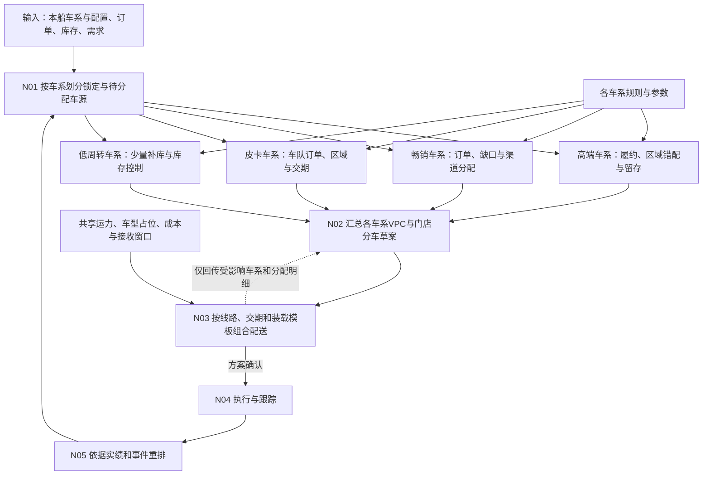
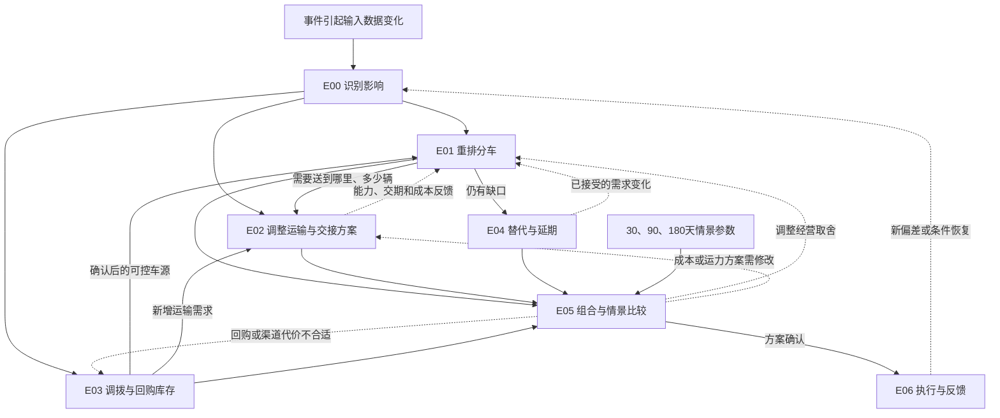

# 整车销售供应链：常规业务过程与霍尔木兹海峡封锁下的决策网络

> 版本：v1.2｜修订日期：2026-09-29
> 本版重点：以一船5,000辆、多车系为例，先按车系及具体配置分别分车，再按线路、交期和装载约束组合配送；保留5项核心活动，上游过程继续以数据输入。
> 视角：参考story.md中的丰田—ALJ场景，以沙特汽车总代理为决策主体。业务规则、能力上限和算例是demo设定，不代表相关企业实际内部流程。

## 1. 这个 demo 要表达什么

**给定一船整车、已确认订单、各地库存与需求，以及物流资源，如何把车辆分到各个VPC和门店，并把分车计划执行下去？**

这一船车中，一部分已经为订单锁定，另一部分仍待分配。系统需要保护已有承诺，再根据库存覆盖、渠道保底、需求、经营贡献和物流条件，决定剩余车辆的去向。

海峡封锁改变上游给出的可用数量、交接地点和可用时间，也改变运输路线、运力与成本。demo要展示这些变化如何传导到分车和物流决策，以及如何通过重排、调拨、回购或延期减少损失。

### 1.1 业务边界

| 类型         | 本demo的处理方式                                                                                           |
| ------------ | ---------------------------------------------------------------------------------------------------------- |
| 核心业务活动 | 划分车源、制定分车计划、制定运输计划、执行运输、异常重排                                                   |
| 上游依赖     | 船次/批次、车型配置及数量、可交接地点、可用时间、可用状态、采购及交接成本，直接接收数据                    |
| 上游过程     | 清关、质检、整备、到港预估、厂家生产与订舱不展开为业务活动；相关影响由上游反映在可用量、时间、状态和费用中 |
| 需求侧依赖   | 已确认订单、订单锁定关系、库存、销量及需求预测作为输入；不展开预测模型和客户下单流程                       |
| VPC的角色    | 作为车辆分拨与缓冲库存节点；保留库存、库容、收发能力和服务门店范围，不展开内部作业细节                     |
| 物流的范围   | 重点规划和执行“上游交接点→VPC→门店”，以及必要的VPC间、门店间调拨                                       |
| 应急改港     | 选择上游给出的候选交接方案，比较其数量、地点、时间、成本与后续配送；不模拟海运改道的内部操作               |
| 经营评估     | 以总代理贡献、履约、库存与资金为主；门店终端销售、结算等结果可以作为反馈数据                               |

VIN指车辆唯一识别码；本文将VPC简称为车辆配送中心，聚焦其分拨作用。分车计划可先使用车型配置及数量，执行时再绑定具体VIN；已指定VIN的订单保留原绑定。

### 1.2 事件如何进入这个边界

封锁在demo中体现为一组**输入数据变化**，例如“本船可用量减少”“交接点从达曼改为吉达”“某条线路运力下降”“每车运输成本上涨”。这些变化随后触发分车与物流重算。

吉达位于红海一侧，达曼位于海湾一侧，两者对霍尔木兹通道的依赖不同。地理背景可参考[沙特国家门户的交通介绍](https://my.gov.sa/en/content/transport)和[DP World对吉达港的介绍](https://www.dpworld.com/en/news/dp-world-awarded-30-year-concession-for-the-south-container-terminal-at-jeddah-islamic-port)。[沙特官方物流走廊说明](https://my.gov.sa/en/news/2236748)支持西岸承接改道货物的通道思路；[ASYAD苏哈尔介绍](https://www.asyad.om/zh/港口和自贸区/苏哈尔自贸区)支持海峡外候选入口的地理依据。

这些资料用于场景背景。某个入口是否可选，由上游提供的方案状态决定；海峡受阻也不等于达曼已有库存或当地配送能力全部失效。本文不采用原参考资料中未经核实的减产、出口降幅和收益改善比例。

## 2. 常规业务：围绕一船车的分配与配送

### 2.1 主流程：先分车，再组合配送

**按车系划分车源 → 各车系分别制定VPC与门店分车草案 → 汇总各车系结果、组合配送 → 执行与跟踪 → 根据变化重排。**

分车先回答“哪种车给谁、多少辆、何时需要”，配送再回答“哪些车可以同路、同批、同车运输”。各车系可以使用不同的库存目标、优先级和保底参数；运输阶段将它们放在一起使用共同的线路和车队。

分别分车形成的是草案。已知的车型匹配、交期和线路限制仍需遵守；汇总后如果共享运力不足、成本过高或装载不成立，物流将具体问题反馈给相应车系调整，之后才形成正式计划。



### 2.2 常规业务活动清单

| 编号 | 业务活动                         | 要解决的问题                                     | 核心规则、参数与约束                                              | 输出                                                         |
| ---- | -------------------------------- | ------------------------------------------------ | ----------------------------------------------------------------- | ------------------------------------------------------------ |
| N01  | **按车系划分车源**         | 各车系、配置中哪些已被订单占用，哪些还能分？     | 车系及配置、已锁定关系、可用标记、禁止重复占用                    | 各车系已锁定量、待分配量与暂不可用量                         |
| N02  | **各车系分别制定分车计划** | 每种车分到哪些VPC、门店和订单？保留多少？        | 各车系订单优先、保底、覆盖目标、权重、留存政策、VPC服务范围和容量 | 各车系的船→VPC→门店分配明细、留存及缺口，汇总为待配送需求  |
| N03  | **跨车系组合配送**         | 哪些不同车型能同路、同批、同车送达？             | 线路、分时段运力、车型占位及装载模板、交期、收发窗口、费用        | 两段配送与必要调拨的混装、批次、时间和费用；问题反馈具体车系 |
| N04  | **执行与跟踪**             | 分好的车是否按计划运到VPC和门店？                | 已确认计划、车辆与运单绑定、资源确认、执行冻结、变更权限          | 发运和到货记录、实际库存、费用及异常                         |
| N05  | **异常重排**               | 车源、订单、库存或运力变化后，哪些安排需要调整？ | 重算触发条件、订单保护、冻结范围、调整代价和规则版本              | 受影响范围、新计划与旧计划的差异、仍未解决的缺口             |

计划确认和发布放在N03到N04之间，作为计划状态转换。数据接入、清关、质检和到港预估不再单列活动。

### 2.3 分车时要分清的两类需求与两级去向

**订单已确认，不一定意味着已经配到车。** 本船需要按以下方式处理：

| 对象                                  | 分车时怎么处理                                                                 |
| ------------------------------------- | ------------------------------------------------------------------------------ |
| 已确认订单，且已锁定本船VIN或明确数量 | 保留占用及最终交付对象，不再进入自由分配；在交期等限制内仍可优化运输路径       |
| 已确认订单，但尚未锁定车辆            | 作为优先待满足需求，参与本轮配车；不能在计算待分配池时先扣一次，配车后又扣一次 |
| 门店尚无明确客户订单的补库需求        | 按销量、库存覆盖、保底、经营贡献及物流条件分配                                 |
| VPC缓冲库存                           | 可以只确定VPC而暂不确定门店，留待后续订单或下一轮分车                          |

**船→VPC与VPC→门店是同一批车的两个分配层次。** VPC承接门店需求并保留必要缓冲；门店计划和运输可行性共同决定各VPC应承接多少。两级计划要联合校验，不能先把VPC份额不可逆地定死，再要求门店被动接受。

最终分车记录至少包含：**船次/批次、车型配置、数量或VIN、承接VPC、接收门店或VPC缓冲标记、关联订单、分配原因、计划时间与版本**。船到VPC的数量与VPC到门店的数量是同一批车在两段链路上的记录，不能相加成两份供给。

车系汇总用于展示，实际匹配下沉到“车系×车型/配置×允许替代集合”。高端车不能直接抵补畅销车的数量缺口，同一车系的不同配置也不自动互换。**分别分车不等于按同一个比例切分所有车型**，而是分别应用适合该车系的规则。

### 2.4 demo重点表达的规则、参数与约束

规则描述“按什么逻辑决定”；参数给出该逻辑使用的值；约束定义“方案必须满足什么边界”。例如“优先满足已确认订单”是规则，“门店目标覆盖14天”是参数，“某线路本期最多承接3,000个等效运力单位”是容量约束。

| 主题           | 规则或决策逻辑                           | 参数或输入示例                                       | 需要满足的约束                                     |
| -------------- | ---------------------------------------- | ---------------------------------------------------- | -------------------------------------------------- |
| 车型车系       | 按车系分别计算，在允许的配置范围内匹配   | 车系、配置、替代规则、差异化覆盖及权重               | 不跨车系抵补缺口，不未经接受替换订单配置           |
| 订单保护       | 保留已有锁定，优先满足未配车的已确认订单 | 订单优先级、交付期限、允许替代的配置                 | 一车不得重复占用；变更锁定需符合权限               |
| 库存补充       | 按需求缺口和覆盖情况补车                 | 日均销量、目标覆盖天数、最低及最高库存               | 已占用车辆不当作自由库存；补货不得突破容量         |
| 渠道保障与倾斜 | 设置必要保底，再按业务目标分配           | 门店保底量、区域或门店权重、经营贡献                 | 保底也占用供给；不能为了保底超分                   |
| 应急预留       | 将部分车辆留在VPC等待后续需求            | 预留比例或数量、释放条件                             | 预留与已分配车辆互斥，不重复计量                   |
| VPC与门店关系  | 在允许范围内选择承接VPC                  | 默认服务范围、允许跨区供货、跨VPC调拨开关            | 路线必须可达，接收方具有可用容量                   |
| 运输安排       | 汇总各车系分配，按同方向和相容交期拼载   | 各车型占位、装载模板、班次费、运输时长、拼载等待上限 | 分时段共享运力、辆数与尺寸载重限制、发出与接收窗口 |
| 经营取舍       | 比较履约、贡献与资金的组合结果           | 成本口径、费用预算、现金上限、服务目标               | 不能用预计利润抵消车辆或运力不足                   |
| 计划调整       | 对受影响部分重排，减少反复变化           | 重算触发条件、冻结范围、调整成本                     | 已执行部分保留事实，待执行部分按新版本变更         |

如果供给不足以满足所有已确认订单或保底，系统要展示冲突、缺口和备选处理，不能通过忽略约束生成一个表面完整的方案。规则和参数需要带版本，让同一船车在不同设定下的分配结果可以对比和解释。

### 2.5 计划节奏

紧缺车型按周分车，非紧缺车型按月分车；运输按批次或班次执行，异常按事件触发重排。一船是车源批次，周/月是计划窗口：一个窗口可以覆盖多船，同一船也可以分批执行，未执行余量和订单占用必须结转。

## 3. 上游和外围依赖，以数据形式存在

### 3.1 输入数据清单

| 输入                 | 最少需要提供什么                                                            | 在demo中的用途                               |
| -------------------- | --------------------------------------------------------------------------- | -------------------------------------------- |
| 本船供给清单         | 船次/批次、车系、车型及配置、数量、可选VIN、交接地点、可用时间、可用状态    | 按车系建立车源池，确定物流起点和最早发运时间 |
| 已确认订单与锁定关系 | 订单、接收门店、车型配置、数量、交期、已锁VIN或数量                         | 保护已有占用，计算尚需配车的订单需求         |
| VPC和门店库存与需求  | 现货、在途、占用、预计销量或预测需求、库存目标                              | 计算补货缺口和分车后的库存覆盖               |
| 网络与运力           | VPC服务范围、路线、时长、分时段容量、车型占位、合法装载模板、库容及收发窗口 | 汇总各车系后检查共同容量与混装可行性         |
| 成本与交易           | 车辆成本、运输报价、费用生效期、回购价格、付款与收款条件                    | 比较经营贡献、运输费用和现金占用             |
| 应急候选与情景       | 候选交接点、可用量与时间、附加成本、可执行状态、持续时间假设                | 比较改港后的分车与配送，以及30/90/180天方案  |

所有输入保留数据时点和确认状态。可用时间直接采用上游给定值；本系统可以据此加上下游运输时间计算预计到VPC、到门店的时间，但不计算海船的到港预估。

选择不同上游候选方案时，应整体切换其地点、数量、时间和费用，不能把某方案的低价格与另一方案的早交接时间拼在一起。未确认候选可以参与情景比较，不能直接变成正式承诺。

### 3.2 三个量和两条守恒关系

- **可见量**：看得到的车辆数量，可能包含暂不可用或独立经销商拥有的车辆。
- **待分配量**：在本轮可用并具有调度权、扣除已有占用后的车辆数量。
- **按期可交付量**：进一步满足两段运输、接收容量和交期的数量。

```text
本船清单总量 = 暂不可用量 + 已锁定量 + 待分配量
待分配量 = 本轮新增订单分配 + 门店补库分配 + VPC缓冲 + 尚未分配余量
```

以上按同一数据时点、同一车型配置计算，集合互斥。已锁定车辆仍需满足物流约束；若上游将其标为不可用，应将车辆放入暂不可用集合并保留受影响订单关系，不能将同一辆车同时算入两个集合。

每个地点分别满足“期末实物库存＝期初库存＋实际收货－实际发出－其他实际出库”。在途不同时计入发出和接收地点的现货。数量规划还要按时间检查库存，不能用月底的到货满足月初的发车。

库存覆盖天数DOS＝可自由销售现货÷预计日均未覆盖需求；分子扣除订单占用后，分母也使用扣除相应已覆盖订单后的需求口径。也可另设包含订单的总库存覆盖指标，但不得混用。WOS使用周均需求作分母。原分货说明中的天/周单位应在迁移时统一；零需求或缺失数据单独标记。预测中已包含的订单不能再重复叠加。

## 4. 封锁打破的前提，集中在分车和物流上

| 输入或前提变化                  | 需要解决的问题                                         | 关联活动      |
| ------------------------------- | ------------------------------------------------------ | ------------- |
| 本船可用量减少、可用时间推迟    | 原来锁定的订单是否受损？剩余车源先分给谁？             | N01、N02、N05 |
| 上游交接点变化                  | 原VPC分配是否仍合理？是否需要改承接VPC或增加跨区运输？ | N02、N03      |
| 线路运力减少、VPC收发或库容不足 | 哪些分配运不出去或接不下来？能否换路线、换VPC或分批？  | N02、N03、N05 |
| 运输价格上涨                    | 哪些补库、调拨或加急仍值得做？                         | N02、N03      |
| 区域缺货与积压并存              | 能否从其他VPC或门店调车，是否值得回购？                | N01、N02、N03 |
| 原承诺无法全部满足              | 哪些订单保护，哪些要提出替代或延期？                   | N02、N05      |

**供应减少、位置错配、运力不足和成本上涨是不同问题。** 回购与调拨重新配置现有车辆；运力优化改善可达性；这些动作不能凭空增加全国车辆数量。上游减供是否发生、减少多少，由输入数据或情景指定。

## 5. 封锁后的决策分支

### 5.1 分支问题与业务活动

| 编号 | 分支问题                           | 主要动作                                                          | 依赖与输出                                                               |
| ---- | ---------------------------------- | ----------------------------------------------------------------- | ------------------------------------------------------------------------ |
| E00  | **原计划哪里失效？**         | 接收变化后的数据，定位受影响的船源、VPC、门店、订单和运输任务     | 输出影响范围、旧计划失效原因，触发相关分支                               |
| E01  | **现在应该怎样分车？**       | 保留可履行的订单占用，重排待分配车辆、VPC承接量、门店补库与缓冲   | 依赖订单、库存、规则和可交付条件；输出新分车方案及缺口                   |
| E02  | **怎样运才能支持分车？**     | 比较上游候选交接方案；调整VPC路径、班次、拼载、加急和必要新增运力 | 依赖完整方案数据及分时段能力；输出运输方案、成本和不可行分配             |
| E03  | **能否利用网络内其他库存？** | 比较自有库存调拨、经销商间转售、总代回购后再分配                  | 依赖可调标记、权属与同意、报价、调出地需求和运输；确认后补充本轮可控车源 |
| E04  | **剩余缺口怎么处理？**       | 提出客户可接受的车型替代、延期或取消；调整尚无订单的门店补库      | 输出待接受的建议及接受后的需求变化；保留未解决清单                       |
| E05  | **哪组动作更合适？**         | 比较贡献、费用、资金、履约和渠道覆盖，并在30/90/180天情景下复算   | 输出可执行组合、权衡理由和需要批准的变更；反馈E01—E04                   |
| E06  | **执行结果是否要求再调整？** | 发布确认后的计划，获取承运和接收方回执，跟踪差异                  | 输出实际结果；将新异常送回E00或对应分支                                  |

### 5.2 决策网络



这是一个共享约束的网络：同一批车辆只能分配一次，同一批运力可能同时服务进口配送和库存调拨，同一笔资金可能同时用于加急和回购。各分支先提出动作，再合并校验，不能把分别算出的局部最优结果直接相加。

例如，改用吉达交接后，原本分到达曼VPC的车辆可能更适合经利雅得VPC转运；但利雅得VPC若容量不足，又需要改变车辆批次、承接VPC或门店分配。期间发生回购，还会同时改变车源和运输需求。

## 6. 策略组合：优化有限资源的使用

### 6.1 可用策略及其代价

| 策略                       | 解决的问题                             | 关键边界或代价                                           |
| -------------------------- | -------------------------------------- | -------------------------------------------------------- |
| 重排待分配车辆             | 改善订单和补库需求之间、区域之间的分配 | 保护已有锁定，说明各门店增减量及未满足需求               |
| 调整VPC承接与缓冲          | 缩短部分配送路径或保留未来分配弹性     | 受服务范围、库容、收发能力及后续运输约束                 |
| 选择其他交接方案           | 从可行入口继续获得车辆                 | 使用上游提供的整套方案数据，计入额外时间和费用           |
| 拼载、分批、加急或增购运力 | 降低费用或缓解运输瓶颈                 | 拼载增加等待；加急、短约和包车增加费用与现金需求         |
| 自有库存调拨               | 改善VPC及门店之间的库存错配            | 扣减调出地库存，并保留其订单占用与必要覆盖               |
| 经销商间协商转售           | 利用独立经销商间的库存差异             | 双方接受才生效；总代不能把双方全部销售收益算作自己的收益 |
| 总代回购后再分配           | 获取部分独立经销商车辆的调度权         | 回购金额、运输、调出地影响和资金占用共同决定价值         |
| 替代、延期或降低补库目标   | 处理资源不足时的剩余需求               | 客户订单变更须接受；门店补库削减须解释渠道影响           |

可以形成“控制现金投入”“优先保护履约”“在服务底线下兼顾贡献”三类组合。三者都遵守相同物理约束，由结果决定推荐方案，不能预设某一类永远最好。

### 6.2 先校验约束，再比较效果

首先校验车辆唯一性、可用状态、车型匹配、运力、库存、交接时间和接收容量；然后保护已批准的锁定与权限；最后在可行方案中权衡订单履约、保底、库存目标、费用和贡献。

保底、权重和缓冲参数之间可能冲突。系统应说明冲突并给出调整建议，保留原规则与新规则版本。高毛利车辆也不能自动优先于所有订单：它可能占用更多车位，或挤占已有客户的承诺。

### 6.3 经营贡献和资金分别看

以总代理为口径，使用“预计经营贡献”而非没有完整费用支持的净利润：

```text
预计经营贡献
= 预计销售收入
− 车辆成本（采购或回购成本，按来源取其一）
− 上游提供的相关交接及附加费用
− 本次运输、调拨及其他新增费用
− 未包含在上述成本中的渠道补偿、资金占用和可估计的延期成本
```

费用互斥：若交接报价已经包含某项费用，不再重复计入；回购价已含补偿，也不再重复扣补偿。历史已经发生且各方案相同的交易不算新增收益。被延后的销售贡献如果已经从收入中扣除，不再重复扣一遍“损失毛利”。

同时比较两条基线：

- **无封锁的正常计划**：展示优化后仍存在的损失。
- **封锁下不增加应对动作的计划**：只执行仍可行的原安排，衡量方案挽回的损失。

还要展示到店量、已确认订单覆盖、原交期达成情况、门店保底缺口、VPC及门店期末库存、现金占用峰值。分车发布不等于已到店，到店不等于已零售或已收款；后三者使用执行或外围系统回传的数据。

回购是否值得，应比较回购转售、原地销售、其他来源供货及延期的结果，并考虑调出地机会损失和共享运力。总代贡献与独立经销商利益分别呈现。

## 7. 不同封锁持续时间，改变哪些规则与选择

| 情景  | 主要决策关注                               | 重点调整                                                                   |
| ----- | ------------------------------------------ | -------------------------------------------------------------------------- |
| 30天  | 本船及已有库存能否维持近期订单和门店覆盖？ | 订单保护、缓冲释放、少量调拨、短期运力与选择性延期                         |
| 90天  | 连续多个供给批次如何维持库存与配送？       | 采用上游给出的分期供给，调整VPC承接比例、短约运力、回购与门店补库目标      |
| 180天 | 原车型结构、销售目标与网络分配是否仍合适？ | 基于长期供给情景重设渠道目标、缓冲和服务规则，比较较长期运输合同及退出成本 |

三个情景从同一决策时点评估，不是到了第三个月才考虑回购或其他入口。未来批次由上游按情景给出，不能把当前这一船的车源重复使用半年。每期执行后更新库存、未满足需求和资金，再进入下一期分车。

同一情景中的方案使用相同窗口与口径。跨情景比较时，可统一使用240天测算窗口，包括封锁后恢复阶段，并一致处理期末库存价值。没有可靠概率时，展示各情景和最差结果，不制造精确的期望收益。

恢复也通过数据更新进入系统：入口和运力恢复后，重新考虑临时合同、积压车辆、VPC容量与补库节奏，不自动恢复全部旧分配。

## 8. 一船5,000辆：先按车系分车，再组合配送

以下数量、价格、需求、占位和能力均为虚构demo数据。车系使用示例编码，避免把演示设定误认为某个真实品牌的市场表现。主计划窗口为30天，部分已确认订单具有更早的交期。

### 8.1 供给、订单与需求总览

“本轮净配送需求”包含本船已锁定订单、尚未配车的已确认订单和合理补库需求；已扣除由其他自有库存或确认在途满足的部分。独立经销商的可见库存尚未取得调度权，先不抵扣需求，待回购或转售确认后再匹配。

| 车系           | 业务类型                     | 本船数量 | 已锁定本船车辆 | 已确认但尚未配车订单 | 本轮净配送需求 |
| -------------- | ---------------------------- | -------: | -------------: | -------------------: | -------------: |
| H1 高端大型SUV | 高贡献、低数量、需求小于供给 |      200 |             60 |                   40 |            140 |
| H2 高端轿车    | 高贡献、低数量、需求小于供给 |      100 |             20 |                   10 |             60 |
| S1 畅销轿车    | 量大、需求超过供给           |    2,000 |            600 |                  500 |          2,600 |
| S2 畅销城市SUV | 需求较强，需继续区分配置     |    1,600 |            400 |                  300 |          1,800 |
| P1 商用皮卡    | 区域集中，车队订单交期明确   |      800 |            250 |                  350 |            800 |
| E1 低周转轿车  | 需求较弱，远途配送对利润敏感 |      300 |             20 |                   30 |            120 |
| 合计           | —                           |    5,000 |          1,350 |                1,230 |          5,520 |

```text
本船5,000辆 = 已锁定1,350辆 + 待分配3,650辆
未配车的已确认订单1,230辆，是待分配池要优先满足的需求，不能再提前扣一次。
```

本船车辆均由上游标记为可用。各车系分别分车时，先保留已锁定量，再匹配未配车订单，最后按各自规则处理门店补库、VPC缓冲或过剩留存。

**车系总量不是足够的供需判断。** H1、H2和E1有过剩，不代表可以拿这些车替代S1、S2的缺口；即使全国某车系过剩，也可能存在特定配置、特定城市、特定交期的缺口。

### 8.2 高端车：供大于求，为什么仍可能回购？

H1和H2合计供给300辆，净配送需求200辆。数量上只需匹配130辆已确认订单及70辆门店补库，另100辆不应被强行压给门店。VPC留存应标记为“过剩留存”或“经批准的缓冲”，不能把所有卖不动的车都称为战略储备。

**回购需要解决具体的区域、配置或时间错配。** 本例为H1设置以下情况：

| 对象         | 具体条件                                                                                            |
| ------------ | --------------------------------------------------------------------------------------------------- |
| 紧急需求     | 中部某门店有20辆H1同配置已确认订单，须在D+3前到店；属于40辆未配车订单中的一部分                     |
| 本船车源     | 对应配置有车，但上游给定交接条件加已确认运输方案，最早D+8到店；暂无满足D+3的本船加急方案            |
| 可回购库存   | 中部另一家独立经销商有20辆同配置车辆，可在D+2到店；没有绑定其他客户，转让条件和调出后最低覆盖均满足 |
| 商业动作     | 总代取得经销商同意后回购这20辆，定向满足紧急订单；该店的20辆同时从其库存扣减                        |
| 本船对应调整 | 原本拟用于这20个订单的本船车辆改为留存或后续再分；不再向同一订单重复发车                            |

完成回购后的H1分车：**本船120辆到店、80辆留在VPC，另有外部回购20辆到店**。H1总共满足140辆需求，不能写成“本船交付了140辆，又通过回购额外交付20辆”。H2仍为本船60辆到店、40辆留存。

回购不会增加全国汽车数量，只改变其中20辆的控制权和销售位置；也会使本船H1的留存由60辆增加到80辆。若没有这样的紧急或配置错配，仅因高端车毛利高而继续回购，会扩大库存和资金压力。

**一笔回购账（SAR/辆，均为示例）：**

| 项目                       |    金额 | 说明                                             |
| -------------------------- | ------: | ------------------------------------------------ |
| 紧急订单对应的总代转售收入 | 300,000 | 目标经销商已确认接受的采购价                     |
| 回购支付                   | 270,000 | 已含协商补偿                                     |
| 当地配送及交易费用         |   2,000 | 计入当地线路资源和费用                           |
| 资金等新增费用             |   1,000 | 按本次结算时点估算                               |
| 本船对应车辆额外留存成本   |   2,000 | 因紧急订单改用回购车而增加的持有等成本，单独计算 |
| 该动作预计贡献             |  25,000 | 300,000−270,000−2,000−1,000−2,000            |

20辆的该动作预计贡献为500,000 SAR；回购支付本身为5,400,000 SAR，还需安排其他支出。该结果不是整个高端车系的利润，也不能单凭正数认定回购最优：需继续扣除相较其他可行方案放弃的收益，并比较延期、可行加急、直接促成经销商间转售等选择。滞留本船车辆的未来销售和期末价值按统一口径处理，不能再算一次同一笔销售收入。

### 8.3 一般畅销车型：优先履约，再分配稀缺补库量

**S1畅销轿车：** 供给2,000辆，需求2,600辆，其中已确认订单1,100辆，补库需求1,500辆。保留已锁600辆，新增匹配500辆订单，剩余900辆用于补库，仍有600辆补库需求未满足。

这900辆根据各门店缺货程度、销量、保底和经营贡献分配，不能只按申请量同比例缩减。示例方案将S1分为西部650辆、中部900辆、东部450辆，全部计划到店。本例不额外预留S1；若业务要求预留，就必须同时显示因此增加的未满足量。

**S2畅销城市SUV：** 供给1,600辆，需求1,800辆，其中已确认订单700辆，补库需求1,100辆。匹配订单后，900辆用于补库，剩余200辆补库缺口。

继续下沉到配置，避免车系总数掩盖错配：

| S2配置   | 本船供给 | 净需求 | 西部到店 | 中部到店 | 东部到店 | 未满足需求 |
| -------- | -------: | -----: | -------: | -------: | -------: | ---------: |
| 标准配置 |    1,000 |  1,100 |      300 |      450 |      250 |        100 |
| 高配     |      600 |    700 |      200 |      250 |      150 |        100 |
| 合计     |    1,600 |  1,800 |      500 |      700 |      400 |        200 |

本例假定两种配置各自都有足够车辆满足已确认订单。若某配置订单超过该配置供给，即使另一配置有余量，也必须先取得替代接受，才能重新匹配。

这两种畅销车的重点是“缺车如何分”。高端车回购后留存120辆、E1留存180辆，不能冲抵它们合计800辆的需求缺口。

### 8.4 商用皮卡：优先看订单批次与交期

P1供给800辆，需求800辆，其中250辆已锁，350辆是新增待配的已确认订单，另200辆为门店补库。示例分配为西部150辆、中部350辆、东部300辆，全部到店。

600辆订单相关车辆中，假设有200辆东部车队订单须在D+7前到店，其余订单可以在30天窗口内交付。数量分配看起来没有缺口，物流阶段仍要为这200辆锁定能赶上交期的批次；不能为了等待其他车型拼满，导致整批车队订单延期。

订单若允许分批，才可以拆分交付；若要求整批到货，应按该批次检验车辆和运力。皮卡在示例中占用的运输空间也较大，不能只比较“800辆”这个数量。

### 8.5 低周转车型：控制压库，并检验送过去是否值得

E1供给300辆，需求120辆，其中50辆为已确认订单、70辆为补库。候选分车为西部60辆、中部30辆、东部30辆到店，另180辆留存，等待后续真实需求或下一轮计划。

本例进一步假定：西部和东部合计90辆中包括全部50辆已确认订单，中部30辆均为非订单补库。这样，后续若需要削减运力，可明确知道哪些车可以延后、哪些必须保护。

假设扣除车辆及其他相关成本后、尚未扣本次配送费用的单车贡献为2,500 SAR：正常配送费用1,500 SAR时尚余1,000 SAR；某线路费用上涨至3,000 SAR时，贡献变为−500 SAR。此时应优先检查非订单补库是否值得继续，而不是为了把一船车分完而全部发出。

180辆留存本身也有成本，应标注为供需过剩，并反馈后续供给计划。demo只使用上游更新的后续供给数据，不扩展厂家排产流程。

### 8.6 汇总各车系分车结果

以下为**高端回购20辆已确认后的候选计划**。后续组合配送以这张表为数量基线。

| 车系 | 本船用于已确认订单 | 本船用于门店补库 | 本船到店合计 | 本船VPC留存 | 外部回购到店 | 未满足需求 |
| ---- | -----------------: | ---------------: | -----------: | ----------: | -----------: | ---------: |
| H1   |                 80 |               40 |          120 |          80 |           20 |          0 |
| H2   |                 30 |               30 |           60 |          40 |            0 |          0 |
| S1   |              1,100 |              900 |        2,000 |           0 |            0 |        600 |
| S2   |                700 |              900 |        1,600 |           0 |            0 |        200 |
| P1   |                600 |              200 |          800 |           0 |            0 |          0 |
| E1   |                 50 |               70 |          120 |         180 |            0 |          0 |
| 合计 |              2,560 |            2,140 |        4,700 |         300 |           20 |        800 |

```text
本船5,000辆 = 本船到店4,700辆 + 本船留存300辆
原已确认订单2,580辆 = 本船满足2,560辆 + 回购满足20辆
本轮净需求5,520辆 = 到店4,720辆 + 未满足800辆
本轮纳入调度的车辆5,020辆 = 本船5,000辆 + 外部回购20辆
```

全国车辆总量不会因为回购增加20辆；增加的是本次总代可调度集合。全国库存台账中，卖出车辆的经销商同步减少20辆。

**第一段：本船车辆分到各VPC。** 本例给定各VPC在窗口内有足够的剩余收货与库存能力，所有本船车辆先转入VPC；具体留存原因继续保留。

| 车系 | 西部VPC | 中部VPC | 东部VPC | 本船合计 |
| ---- | ------: | ------: | ------: | -------: |
| H1   |      60 |     100 |      40 |      200 |
| H2   |      35 |      45 |      20 |      100 |
| S1   |     650 |     900 |     450 |    2,000 |
| S2   |     500 |     700 |     400 |    1,600 |
| P1   |     150 |     350 |     300 |      800 |
| E1   |     120 |     100 |      80 |      300 |
| 合计 |   1,515 |   2,195 |   1,290 |    5,000 |

**第二段：由各VPC向门店配送本船车辆。** 表中是门店明细的区域汇总，实际结果仍保留每家门店、配置和订单；回购20辆使用独立来源明细，不混入本船矩阵。

| 车系 | 西部门店 | 中部门店 | 东部门店 | 本船到店合计 |
| ---- | -------: | -------: | -------: | -----------: |
| H1   |       40 |       50 |       30 |          120 |
| H2   |       20 |       25 |       15 |           60 |
| S1   |      650 |      900 |      450 |        2,000 |
| S2   |      500 |      700 |      400 |        1,600 |
| P1   |      150 |      350 |      300 |          800 |
| E1   |       60 |       30 |       30 |          120 |
| 合计 |    1,420 |    2,055 |    1,225 |        4,700 |

两张表按车系、VPC相减，得到留存：西部95辆、中部140辆、东部65辆，合计300辆。中部门店还通过当地经销商回购收到20辆H1，因此本轮中部到店总量为2,075辆。

### 8.7 再把不同车系组合成配送任务

配送阶段先按**起点、终点或允许串点的线路、交付窗口**归组，再把组内不同车系和订单状态的车辆组合装载。不同车系不必各自派一套车队；不同方向、交期不兼容或车辆装载不兼容时，也不能只为提高装载率硬凑一车。

#### 8.7.1 示例装载口径

为解释“大车和小车共同占用运力”，定义以下**虚构等效运力单位**。它只用于本demo的汇总计算，不是实际行业通用系数。

| 车系         | 每辆占用等效运力单位 |
| ------------ | -------------------: |
| H1大型SUV    |                    2 |
| H2高端轿车   |                    1 |
| S1畅销轿车   |                    1 |
| S2城市SUV    |                  1.5 |
| P1皮卡       |                    2 |
| E1低周转轿车 |                    1 |

示例一辆轿运车的上限是10个等效单位，同时最多装8辆。真实装载还受尺寸、轴荷、载重和上下层位置影响，demo可以直接使用上游或承运商给出的合法装载模板，不展开其生成算法。

| 示例混装                   | 辆数 | 等效占用 | 说明                                      |
| -------------------------- | ---: | -------: | ----------------------------------------- |
| 2辆H1＋2辆S2＋3辆S1        |    7 |       10 | 用畅销车与同方向高端SUV组合配送           |
| 2辆P1＋2辆S2＋3辆S1        |    7 |       10 | 车队订单交期允许时，与其他车型拼载        |
| 2辆H2＋2辆S1＋2辆S2＋2辆E1 |    8 |        9 | 已达到辆数上限，虽剩1个等效单位也不能再装 |

这些组合仅表示在示例的两项数值限制下成立，仍须属于已确认的合法装载模板。20辆紧急回购H1的当地线路，若采用同样的容量口径且允许5辆H1一车，可形成4个专门班次；费用与这4个班次占用一并计入。

#### 8.7.2 一个具体门店配送批次

从第8.6节西部门店分配中取出以下7辆，假定均已在西部VPC可用。W-A、W-B两店在同一允许串点线路上，均接受D+10到货，承运商提供的运输时间和装载模板支持这趟任务：

| 接收门店 | H1 | S2 | S1 | 合计 |
| -------- | -: | -: | -: | ---: |
| W-A店    |  1 |  1 |  2 |    4 |
| W-B店    |  1 |  1 |  1 |    3 |
| 本班合计 |  2 |  2 |  3 |    7 |

先分车时，每辆车已经确定车系、配置、接收门店及订单或补库用途；组合配送时，将这些明细合成“西部VPC→W-A→W-B”一个班次。等效占用为2×2＋2×1.5＋3×1＝10，辆数为7，匹配前述第一种混装模板。

这7辆是西部门店1,420辆本船配送量中的一个子集，不是额外车源。其分配去向没有因拼载改变，运输费用按同一班次报价计算；如果其中某笔订单需D+7到货，就必须另选能满足交期的班次。

#### 8.7.3 将分车矩阵转换为线路负荷

下表按上述占位折算；门店部分按区域汇总展示，实际发运再按具体线路和交期拆分。

| 运输任务组               | 车辆数 | 等效运力需求 | 资源含义               |
| ------------------------ | -----: | -----------: | ---------------------- |
| 交接点→西部VPC          |  1,515 |        1,975 | 第一段干线             |
| 交接点→中部VPC          |  2,195 |        2,995 | 第一段干线             |
| 交接点→东部VPC          |  1,290 |        1,830 | 第一段干线             |
| 西部VPC→门店            |  1,420 |        1,860 | 第二段配送             |
| 中部VPC→门店            |  2,055 |        2,805 | 第二段配送，不含回购车 |
| 东部VPC→门店            |  1,225 |        1,755 | 第二段配送             |
| 中部经销商→紧急订单门店 |     20 |           40 | 回购车辆的当地配送     |

第一段为5,000辆、6,800个等效单位；第二段本船配送为4,700辆、6,420个单位；另有回购20辆、40个单位。两段是同一批车的多段运输工作量，不能相加成新的车辆供给或销售量。

例如第一段中部线路，单按等效容量得到至少300个班次的下界，即向上取整2,995÷10；同时还要检查每车8辆上限、各日班次和合法装载模板。**汇总容量通过，不等于已经生成可执行的完整装车表**，实际班次数可能更多。

本例暂设第一段三条线路分别有2,000、3,000、1,900个已确认等效单位，第二段和回购线路另有已确认资源池。若现实中共用同一批车队，必须结合车辆周转和时段统一扣减，不能把资源按两个环节各用一遍。运输组合只在同路线、交期和装载均相容的范围内进行。

### 8.8 冲击重排：计划缺口300运力单位，如何反馈到不同车型

假定交接点→中部VPC线路的已确认容量从3,000降到2,695个等效单位。原计划需要2,995个单位，因此**计划缺口为300单位**，不能直接解释为少运300辆；其他线路和资源暂保持不变。

中部原留存是H1 50辆、H2 20辆、E1 70辆，共140辆、190单位。假定交接点允许暂存且费用已计入比较，可先把这些没有门店交期的车辆延后运输；还需释放110单位。再比较中部非订单补库，形成如下候选：

| 调整对象         | 延后数量 | 释放运力单位 | 业务原因                                         |
| ---------------- | -------: | -----------: | ------------------------------------------------ |
| 中部H1留存       |       50 |          100 | 过剩或缓冲车辆，没有本期门店承诺                 |
| 中部H2留存       |       20 |           20 | 同上                                             |
| 中部E1留存       |       70 |           70 | 低周转留存，优先级较低                           |
| 中部E1非订单补库 |       30 |           30 | 没有客户交期；若线路涨价，经营贡献也更弱         |
| 中部S1非订单补库 |       80 |           80 | 假定这80辆未锁定、门店保底仍可满足，作为剩余让步 |
| 合计             |      250 |          300 | 保留所有已确认订单分配                           |

中部第一段变为1,945辆、2,695单位。该候选优先延后留存与部分非订单补库，保护订单；仍需比较暂存成本、新增运力、其他VPC中转和门店覆盖损失，不能仅凭表内顺序认定最优。

```text
本船5,000辆 = 到店4,590辆 + VPC留存160辆 + 交接点暂存250辆
加上外部回购20辆，本轮到店4,610辆。
未满足需求 = 原800辆 + 新延期补库110辆 = 910辆。
5,520辆净需求 = 4,610辆到店 + 910辆未满足。
```

若通过其他VPC中转后仍送原门店，门店分配保持不变，新增运输段和费用；若改分给其他区域门店，则改变销售去向，必须验证那里真实存在同配置需求。不能把高端车剩余或其他方向运力空闲，当成所有畅销车缺口自动得到解决。

## 9. 如何复用已有销售分货本体

### 9.1 保留“数据—规则—计算—结果”的结构

| 原节点或思想                    | 在本demo中的落点                                             |
| ------------------------------- | ------------------------------------------------------------ |
| S1任务、S2参数版本              | 本船/本轮分车任务、输入快照、规则版本及重排版本              |
| 需求侧数据、SO预测、B1需求合并  | 门店订单与补库需求输入；预测结果直接使用，避免订单重复叠加   |
| B2目标WOS                       | 门店和VPC的覆盖目标、上下限及权重                            |
| B3库存合并                      | VPC、门店的现货、在途、订单占用和可用库存                    |
| B4可分货量                      | 本船可用车源、已锁定量、待分配池；额外调拨或回购来源单独记录 |
| B5保底、B6预留/排除、B7参与集合 | 门店保底、VPC缓冲、不可分配原因、可参与的车源与需求          |
| B8注水结果                      | 生成按覆盖或公平性分配的候选，再联合校验VPC与物流约束        |
| B9留仓量                        | 区分主动缓冲、未分配量、已分配但尚未运输量                   |
| B10最终结果                     | 船→VPC→门店的分配链，以及对应运输计划和执行状态            |

原有分货周期、销售速度、库存、目标、保底、禁运禁售、注水等配置继续作为规则与参数。重点增加车系及配置、VPC服务关系、订单锁定、车型占位与装载模板、共享分时段容量、运输费用、交付窗口和计划变更规则。车型配置来自真实清单，不通过按比例拆分创造实际不存在的车辆。

### 9.2 本次重点补充的对象和关系

保留以下对象即可表达核心故事：**船次/供给批次、车辆或车型数量、VPC、门店、订单、库存、规则版本、路线与运力、分车计划、运输任务、事件/情景，以及可选的调拨或回购交易。** 上游处理状态保留为输入属性，不单独扩展清关、质检、整备流程对象。

```text
供给批次 → 包含 → 已锁定车辆与待分配车辆
订单 → 已占用或等待匹配 → 车辆
分车明细 → 指定 → 承接VPC → 支持 → 门店订单/补库或VPC缓冲
规则与参数 → 约束和引导 → 分车及运输计划
分车明细 → 对应 → 两段运输任务 → 占用 → 路线及分时段运力
执行回执 → 更新 → 在途、VPC库存、门店库存和实际费用
事件 → 改变 → 输入数据或约束 → 影响 → 分车与运输计划
调拨/回购交易 → 经确认增加 → 可控车源，同时增加运输与资金需求
```

回答“为什么中部S1少分了80辆”，应能追溯到：该线路计划缺口300个等效单位→先延后H1、H2、E1留存释放190单位→延后E1非订单补库释放30单位→仍差80单位，反馈到S1的非订单补库。每步保留车型、订单状态、规则依据和费用影响。

## 10. 建议的 demo 演示故事

| 幕次           | 业务问题                                           | 展示重点                                                              |
| -------------- | -------------------------------------------------- | --------------------------------------------------------------------- |
| 1 给定一船车   | “这5,000辆分别是什么车，哪些已锁定？”            | 六个示例车系：1,350辆已锁定、3,650辆待分配，以及各车系订单与需求      |
| 2 高端车分车   | “高端车供大于求，为什么有20辆还需要回购？”       | 全网过剩与局部交期错配；回购后本船对应车辆转为留存，避免重复满足需求  |
| 3 畅销车分车   | “S1、S2都缺车，优先给谁？”                       | 按车系、配置保护订单，再分稀缺补库；保留600辆和200辆缺口              |
| 4 其他车型分车 | “皮卡和低周转轿车为什么使用不同规则？”           | 皮卡的车队批次与交期；E1的库存和配送贡献，避免压库                    |
| 5 汇总分车     | “各VPC和门店最终分别拿什么车？”                  | 第8.6节车系结果和两级矩阵；本船4,700辆到店、300辆留存，另20辆回购到店 |
| 6 组合配送     | “不同车系如何同路、同批、同车运输？”             | 第8.7节车型占位、混装、两段线路负荷、紧急订单和共享资源               |
| 7 冲击与重排   | “中部线路计划缺口300运力单位，哪些车让步？”      | 第8.8节：延后250辆，保住已确认订单，解释各车系影响与910辆剩余需求缺口 |
| 8 情景与执行   | “持续一个月、三个月或半年，规则和组合如何调整？” | 分期车源、需求与库存滚动；不同策略的贡献、现金、履约与实际执行反馈    |

演示顺序是**逐车系理解分车逻辑，再汇总为物流任务**。观众可以先看某一种车为什么分给某家门店，再看它与其他车型如何组合配送，最后看到共享运力不足时哪些具体分配会被调整。

每个方案显示车辆来源与去向、配置、关联订单、物流组合、规则依据、资源占用、预计效果、待确认条件和未满足需求。上述数量和运力是可核对的候选算例，正式发布还要通过具体班次和装载模板校验。

## 11. 资料依据与使用方式

### 11.1 项目内参考

| 材料                                                        | 本文采用的内容                                                                 | 使用边界                                                   |
| ----------------------------------------------------------- | ------------------------------------------------------------------------------ | ---------------------------------------------------------- |
| [story.md](../story.md)                                      | 沙特整车供应网络背景；问数、物流方案、综合利润、回购和不同封锁周期五个故事方向 | 未附完整来源的时事与数字不作为实证；组织和节点设定用于demo |
| [销售分货本体设计图](../../01_销售分货/本体设计.png)         | 数据、规则、需求库存、参与集合、注水、留仓和最终分货的依赖结构                 | 借鉴逻辑，不假定图中所有编号与后续说明完全一致             |
| [本体节点依赖说明](../../01_销售分货/03_本体节点依赖说明.md) | S/A/B节点职责、输入输出依赖、规则快照、多轮分货与待确认口径                    | 源文自身列有缺边和命名问题；本文采用业务语义，统一整车口径 |
| [Gemini调研01](../01_gemini调研/01.md)                       | 分车与物流联合约束、滚动窗口、VIN状态追踪                                      | 延迟绑定仅适用于可调整库存；已承诺订单不能一律取消绑定     |
| [Gemini调研02](../01_gemini调研/02.md)                       | 替代路线、回购、策略组合和不同时间情景                                         | 对全量改道、自动高利润优先、未经确认的铁路能力不作预设     |
| [Gemini调研03](../01_gemini调研/03.md)                       | 物流、销售、渠道、财务共同决策的故事视角                                       | 原材料中的收益改善比例为叙事示例；不作为本demo的预定结果   |

### 11.2 外部资料支持的有限事实

本文使用外部资料核对港口方位和候选通道的地理依据，相关链接已放在第1.2节。ASYAD资料支持苏哈尔位于海峡之外；沙特官方资料支持西岸承接改道货物的通道思路。**这些资料均不替代具体时点的整车承运报价、舱位、路线安全、跨境资格和可用能力确认。**

后续接入真实业务数据时，优先替换本船供给清单、已确认订单及锁定关系、VPC与门店库存、路线与运力、成本与现金参数、事件情景。上游数据的生成过程保持在本demo边界之外。
