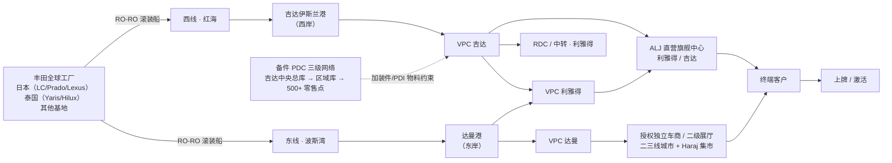
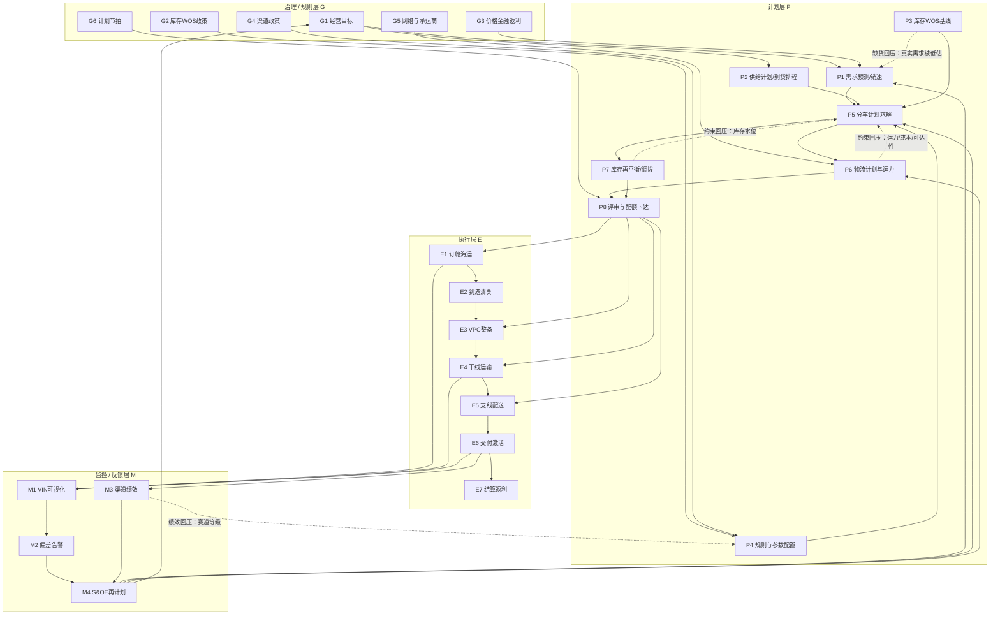
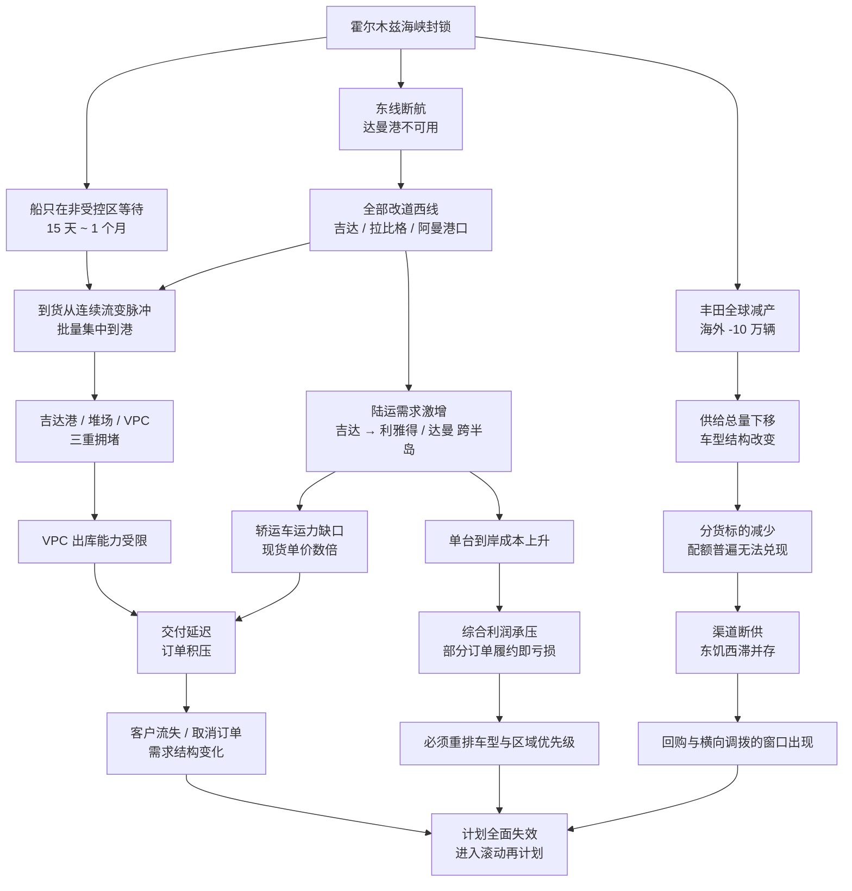
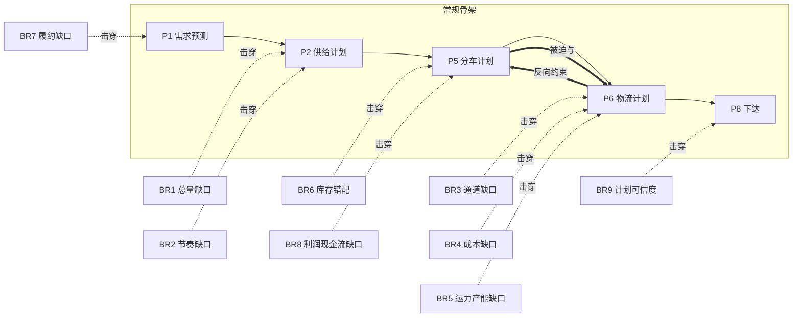
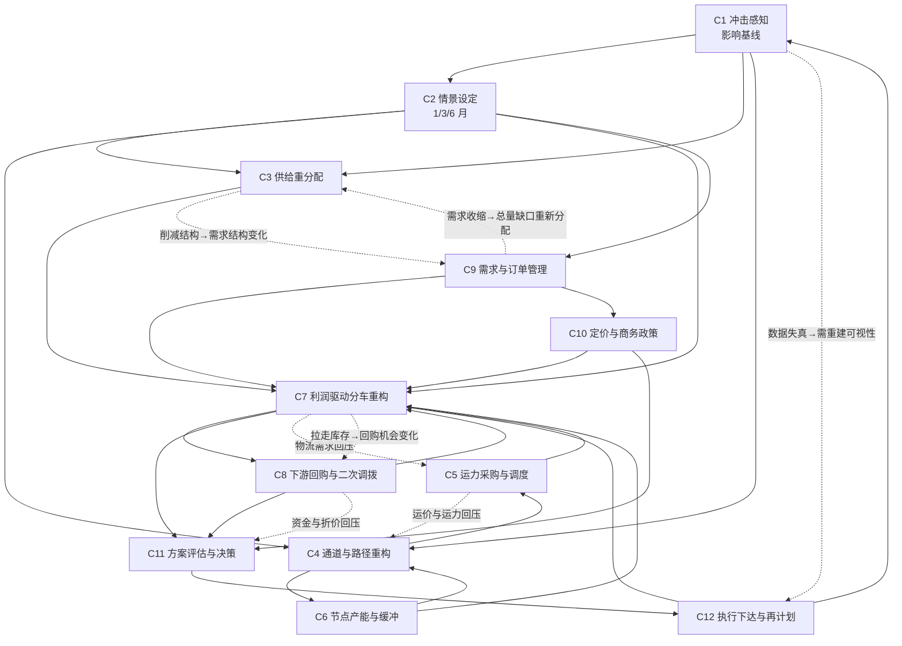

# 整车销售供应链 · 业务全景与决策网络

- 版本：v1.0（首版）
- 定位：**业务层设计文档**。回答"有哪些业务活动、每个活动在解决什么问题、活动之间如何互相牵制"；不进入字段级与算法级细节（字段级见 `docs/01_销售分货/03_本体节点依赖说明.md`）。
- 场景：沙特市场丰田整车销售（全进口 + ALJ 独家总代），常态运转 vs 霍尔木兹海峡封锁后的破局。
- 读法：第 2 章是**常规骨架**，第 3 章是**断链**，第 4—5 章是**危机分支**，第 6—8 章是**决策口径与落地衔接**。只想看结论可直接读 §0 + §4.1 + §5.1。

---

## 0. 摘要

### 0.1 三句话结论

1. **常态下这是一条"计划驱动执行"的稳定流水线**：月节奏定目标与供给，周节奏定分车与运力，日节奏执行交付。销售分货（商业分配）与物流执行（物理约束）**松耦合**——先分货，再找一个足够便宜的路径把车运出去。
2. **霍尔木兹封锁把四个外生量同时改了**：供给总量、到货节奏与确定性、通道结构、单位物流成本。它没有破坏某一个环节，而是**把"分车"和"物流"强行耦合成同一个联合决策问题**——分车不看运力就是一张废纸，物流不看利润就是在烧钱。
3. **因此危机态的业务过程 = 常规骨架 + 一组跨域分支决策**。分支决策互为输入、互相回压，构成网状结构；其中的决策不是"找到最优解"，而是**在不可解的外生约束下，通过可优化的结构变量把综合利润的损失压到最小**。

### 0.2 业务的三种问题性质（全文的分析基准）

| 性质                       | 定义                               | 例子                                                                    | 决策态度                                       |
| -------------------------- | ---------------------------------- | ----------------------------------------------------------------------- | ---------------------------------------------- |
| **不可解（外生）**   | 决策者无法改变总量，只能承受其后果 | 海峡通行、丰田全球减产 10 万辆、达曼港停摆、市场陆运单价数倍上涨        | 不设"解决"目标，转成**约束条件**进入优化 |
| **可优化（结构内）** | 总量给定，但配置方式有巨大空间     | 削减哪些车型/区域、货物走哪条通道、轿运车如何拼载、库存如何在节点间摆布 | **核心决策战场**，靠算法+规则求解        |
| **可解（结构可变）** | 通过投资、合同、政策改变约束本身   | 采购运力、吉达港/VPC 扩能、签包干合同、下游回购、渠道配额合同重签       | **战略级动作**，有前置周期与不可逆成本   |

> **分类轴**：这三类是按"**这个量本身能不能被决策者改变**"切的，不是按对象切的。所以同一个对象可以横跨两类——"达曼港停摆"这个**事实**不可解（东线物理中断），但"用哪些港口、走哪条路"（**通道结构**）是可解的；"陆运现货单价"不可解，但"单台实际运费"（靠装载率、拼载、回程）是可优化的。后文出现的「部分不可解 / 部分可解」一律读作：**该量 = 不可动的部分 + 可动的部分**（见 §4.4）。

> 设计含义：Demo 的 Agent 价值不在于"变出车来"或"把运费谈下来"，而在于**把不可解的部分讲清楚，把可优化的部分算到位，把可解的部分排好时间表**。

### 0.3 编号规则

| 前缀    | 含义                                        | 出现章节 |
| ------- | ------------------------------------------- | -------- |
| `G*`  | 治理/规则层活动（定目标、定政策、定节拍）   | §2.2.1  |
| `P*`  | 计划层活动（把目标变成可执行计划）          | §2.2.2  |
| `E*`  | 执行层活动（把计划变成物理与资金动作）      | §2.2.3  |
| `M*`  | 监控与反馈层活动（感知偏差、触发再计划）    | §2.2.4  |
| `A*`  | 常规流程的隐含假设（被冲击打破的清单）      | §2.4    |
| `BR*` | 断点/缺口（Breakpoint，冲击造成的待解问题） | §3.3    |
| `C*`  | 危机决策活动（危机态专属或大幅变形）        | §4.2    |

> **两个前缀留给现有本体，本文不复用**：`A1`–`A8` 是现有分车本体里的**配置对象**（拆大包、分货周期、销售速度、库存、目标、保底、禁运禁售、注水算法），`S1`/`S2` 是分货任务与参数版本。因此本文的隐含假设一律用 **`AS*`（Assumption）**，与配置对象 `A*` 严格区分——两者含义完全不同，不要混读。

---

## 1. 业务全景

### 1.1 物理拓扑



**拓扑要点**

- **双海岸**是沙特的结构性优势：西线红海（吉达/拉比格），东线波斯湾（达曼）。常态下两条线按区域就近供货。
- **VPC 是缓冲池也是瓶颈**：清关后的 PDI、本地加装（增强空调、彩条、影音系统）都在这里完成，是"延迟分车"（Postponement）的物理载体。
- **零售双轨**：ALJ 直营（5S 超级中心）+ 授权独立车商（覆盖二三线）。两条轨道的库存归属、结算方式、数据可见性都不同——这直接决定了"回购"这一类动作在合同上是否可行。
- **备件网络旁挂**：备件/加装件不到位会让车卡在 VPC，是物流计划的一个隐藏瓶颈。

### 1.2 三条流 × 三个节奏

| 流                    | 内容                               | 关键对象                       | 主要节奏       |
| --------------------- | ---------------------------------- | ------------------------------ | -------------- |
| **实物流**      | 车从工厂到客户                     | VIN、船、港、VPC、轿运车、门店 | 日（事件驱动） |
| **计划/信息流** | 需求→供给→分车→物流→执行→反馈 | 预测、配额、计划、实际         | 月 / 周 / 日   |
| **资金/商务流** | 车款、返利、金融放款、回购、关税   | 发票、返利、贷款、回购协议     | 月 / 事件      |

| 节奏         | 内容                                                     | 决策粒度                       | 冻结特征                       |
| ------------ | -------------------------------------------------------- | ------------------------------ | ------------------------------ |
| **月** | 需求预测基线、供给计划与到货排程、目标与政策、承运商合同 | 车型 × 区域 × 渠道           | 月度锁定，月中只做例外审批     |
| **周** | 分车计划、运力排程、库存再平衡                           | 交易身份 × EAN/料号 × 销售周 | W+1 锁定 / W+2 软锁 / W+3 预测 |
| **日** | 到港、清关、VPC 出库、发运、交付、异常处置               | 单台 / 单车次                  | 已发运不可逆                   |

**分配频率的业务规律（来自现有分货设计）**：相对紧缺的品**一周分一次**，不紧缺的品**一个月分一次**。这条规律在危机态被彻底打破——供给腰斩后**所有品都变成紧缺品**，全网被迫进入周度甚至日度重分配。

> **粒度约定（全文统一）**：政策与计划层主粒度是 **车型 × 区域 × 渠道**；执行与展示层是 **城市 × 车型**；「业务小区」是区域之下用于销速折算的细分。三者通过**城市 ↔ 业务小区 ↔ 区域**映射表关联。Demo 剧本说"各城市销量/库存"时指城市粒度，说"区域配额"时指计划粒度，**两者不可直接相加**。

### 1.3 角色与责任

| 域                                 | 内部角色（ALJ）                                             | 外部角色                         | 关注目标                         |
| ---------------------------------- | ----------------------------------------------------------- | -------------------------------- | -------------------------------- |
| 供给                               | 整车采购 / 商品企划                                         | 丰田 TMC 及区域办、工厂          | 拿到量、拿到对的车型结构         |
| 需求与销售                         | 需求计划、全国销售总监                                      | —                               | 销量、份额、订单满足率           |
| 分车                               | 分车计划员                                                  | —                               | 分配公平性、库存健康、WOS 达标   |
| 物流                               | 供应链与物流总监、调度                                      | 船公司、报关行、轿运承运商、港口 | 成本、时效、运力保障             |
| 渠道                               | 经销商关系经理                                              | 授权经销商 / 二级车商            | 网络健康、渠道满意度、终端覆盖   |
| 财务                               | CFO / 财务控制                                              | 银行、金融公司                   | 综合利润、现金流、资金占用       |
| 节点运营                           | VPC 运营、PDC                                               | —                               | 吞吐产能、PDI/加装达成率         |
| 危机统筹（**仅危机态启用**） | 供应链控制塔、决策委员会（COO 主持，CFO / 物流 / 销售参与） | —                               | 跨域联合决策、方案裁决、跨期取舍 |

> **角色命名对照**（§4.2「主责角色」用简称）：供应链与物流总监 = 物流总监；全国销售总监 = 销售总监；经销商关系经理 = 渠道经理。「供应链控制塔」**不是新部门**，而是危机态下由计划、物流、需求、渠道、财务抽人组成的虚拟联合决策单元，以值守 + 日 S&OE 形式运转（见 §7.1）。

### 1.4 常规流程的顶层目的

常规流程在同时服务四个目标，且这四个目标**天然互相冲突**：

1. **卖得掉**（可得性）：门店有车、客户当周能提车——沙特零售极度依赖"现货可用性 + 月度贷款可负担性"。
2. **不呆滞**（效率）：WOS 不超标、资金不压在库里。
3. **赚得到**（利润）：单车毛利 × 结构 × 物流成本可控。
4. **网络活**（健康）：偏远与小经销商不能被长期断供，否则渠道网络塌方。

**常规流程的全部规则、参数、例会，本质上是这四个目标的制度化妥协。**理解这一点，就理解了为什么危机态下"综合利润最大化"不能退化成"砍掉所有不赚钱的订单"。

---

## 2. 常规流程（Business As Usual）

### 2.1 分层总览

| 层               | 回答的问题                           | 活动   | 节奏          |
| ---------------- | ------------------------------------ | ------ | ------------- |
| 治理/规则层`G` | 按什么原则分？追求什么？谁来定规则？ | G1–G6 | 季 / 年 · 月 |
| 计划层`P`      | 给谁、给多少、什么时间、走哪条路？   | P1–P8 | 月 / 周       |
| 执行层`E`      | 把计划变成物理与资金动作             | E1–E7 | 日            |
| 监控/反馈层`M` | 计划是否还有效？何时重做计划？       | M1–M4 | 日 / 周 / 月  |

### 2.2 活动清单（每个活动"解决什么问题"）

#### 2.2.1 治理/规则层 G

| 编号 | 活动                 | 节奏  | **解决的问题（Why）**                                                  | 关键输入                                    | 决策/动作                                                     | 输出                               | 度量                     |
| ---- | -------------------- | ----- | ---------------------------------------------------------------------------- | ------------------------------------------- | ------------------------------------------------------------- | ---------------------------------- | ------------------------ |
| G1   | 经营目标与结构制定   | 季/年 | 资源永远不够分，必须先定义"什么算赢"，否则每次分配都是一场人际博弈           | 集团目标、市场容量、竞品、汇率              | 定销量/份额/利润/网络健康的目标值与权重，定区域与车型结构导向 | 目标包（区域×车型×渠道）、权重表 | 目标达成率、份额         |
| G2   | 库存与 WOS 政策      | 季/月 | 库存既是可得性的保障，也是资金的坟墓；必须给每个节点一个"合理水位"           | 销速、提前期、资金成本、仓储能力            | 定目标 WOS、安全库存、buffer 预留比例、门店最低库存           | 库存政策、WOS 标准清单             | WOS、呆滞率、缺货率      |
| G3   | 价格/金融/返利政策   | 月    | 沙特零售的购买决策主要被"月供可负担性"驱动，价格工具是调节需求形状的主要杠杆 | 竞品金融方案、银行政策、成本                | 定利率贴息、贷款方案、返利结构、促销节奏                      | 商务政策包                         | 单车净收入、贷款渗透率   |
| G4   | 渠道政策与赛道分级   | 季    | 经销商能力差异巨大，平均分配等于惩罚优秀的、拖死弱小的                       | 历史销量、CSI、周转率、资金实力             | 定客户分类、赛道等级、权益与义务、准入退出                    | 渠道政策、赛道等级清单             | 渠道达成率、CSI          |
| G5   | 物流网络与承运商策略 | 季/年 | 运力不能临时买，成本靠合同锁；网络布局决定长期成本底盘                       | 运量预测、承运商能力、港口/VPC 产能、合同价 | 定港口与 VPC/RDC 布局、承运商组合、合同结构与锁价             | 网络方案、承运商合同               | 单台物流成本、时效达成率 |
| G6   | 计划节拍与冻结规则   | 季    | 计划改得太勤，执行层就会瘫痪（计划 nervousness）；必须给"变更"定价格         | 提前期、执行刚性、客户承诺                  | 定月/周节奏、冻结窗、例外审批权限                             | 计划日历、变更规则                 | 计划变更率、执行达成率   |

#### 2.2.2 计划层 P

| 编号 | 活动                   | 节奏                    | **解决的问题（Why）**                                                                                  | 关键输入                                                 | 决策/动作                                                                                   | 输出                         | 度量                               |
| ---- | ---------------------- | ----------------------- | ------------------------------------------------------------------------------------------------------------ | -------------------------------------------------------- | ------------------------------------------------------------------------------------------- | ---------------------------- | ---------------------------------- |
| P1   | 需求预测与销速测算     | 月/周                   | 分货需要一个可信的分母。若用"历史卖了多少"，会被缺货严重低估真实需求                                         | 真实 SO、激活、预测 SO、订单、竞品、季节                 | 选口径（真实 SO / 激活 / 预测 SO）、算日均销速、按业务小区折算、修补异常渠道                | 销售速度、需求基线           | 预测偏差、缺货率                   |
| P2   | 供给计划与到货排程     | 月                      | 全进口模式下供给是外生的，必须先把它翻译成"什么车型、什么时候、到哪个港、多少量"                             | 丰田分配量、船期、订单确认、拆大包比例                   | 申请/确认要货、把 EAN 供给拆到料号、排到货时点                                              | 可分货供给（B4）、到货排程   | 供给达成率、到货准时率             |
| P3   | 库存与 WOS 基线测算    | 周                      | 分货的起点是"现在还剩多少、还能撑几周"，算错了后面全错                                                       | 期初库存、在途/计划入库、卖出折算、销速                  | 定折算窗口、算卖出折算量、算分货前库存与分货前 WOS                                          | 分货前库存、分货前 WOS（B3） | 库存准确率、WOS 偏差               |
| P4   | 分车规则与参数配置     | 周/版本                 | "公平、效率、战略"是价值判断，必须固化成可复算的规则，否则无法解释、无法审计                                 | 渠道政策、目标 WOS、保底策略、禁运禁售、订单优先级       | 配置 A1–A8：拆大包、分货周期、销售速度、库存、目标、保底、禁运禁售、注水算法；形成参数版本 | 参数版本（可回溯、可对比）   | 规则命中率、版本可解释性           |
| P5   | **分车计划求解** | 周（紧缺）/月（不紧缺） | **核心商业问题**：有限供给下，给谁、给多少、分几轮、留多少，才能同时兼顾销量、利润、渠道公平与库存健康 | 需求 B1、目标 WOS B2、库存 B3、供给 B4、保底 B5、规则 A8 | 算保底→划不参与集合→剩余池注水→级差定档→绩效倾斜→秩序扣减→两轮分配→并入保底→取整    | 最终分货结果 B10、留仓 B9    | 订单满足率、分货后 WOS、渠道公平度 |
| P6   | 物流计划与运力排程     | 周                      | 车分出去不等于到得了店；装载率、线路成本、时效决定"纸上计划"能否落地                                         | 分车计划、库存位置、可用运力、线路成本、门店收货能力     | 选路径（港→VPC→RDC→店）、拼车组合、车型混装、指派承运商、排发运日                        | 干线/支线发运计划            | 装载率、单台运费、时效达成率       |
| P7   | 库存再平衡与调拨       | 周                      | 网络里永远同时存在"多的"和"少的"，横向搬动常比纵向补货更快更便宜                                             | 各节点库存与销速、调拨成本、在途                         | 定跨区/跨店调拨量、RDC 补货、RDC 之间的平衡                                                 | 调拨计划                     | 调拨成本、缺货缓解率               |
| P8   | 计划评审与配额下达     | 周/月                   | 多目标冲突时必须有一个人拍板，并对渠道给出明确承诺                                                           | 分车结果、物流可行性、财务口径、渠道诉求                 | 评审取舍、确认配额、发布给经销商、同步承运商                                                | 配额通知、发运指令           | 方案通过率、承诺兑现率             |

#### 2.2.3 执行层 E

| 编号 | 活动                           | 节奏    | **解决的问题（Why）**                                    | 关键输入                     | 决策/动作                              | 输出               | 度量                         |
| ---- | ------------------------------ | ------- | -------------------------------------------------------------- | ---------------------------- | -------------------------------------- | ------------------ | ---------------------------- |
| E1   | 订舱与海运                     | 日      | 计划量必须变成真实舱位，否则"计划"只是愿望                     | 供给计划、船期、舱位         | 订舱、装船、跟踪航程与跳港             | 在途 VIN 清单      | 订舱达成率、航程偏差         |
| E2   | 到港、清关与合规               | 日      | 让车合法入境，且不因单证问题在港口产生滞留费                   | 提单、报关资料、认证         | 报关、缴税、查验应对                   | 已清关车辆         | 清关时效、异常率             |
| E3   | VPC 整备（PDI + 加装）         | 日      | 让车符合沙特本地规格与质量标准；这一步是"延迟分车"的物理兑现点 | 已清关车辆、加装件、工位产能 | PDI 检验、加装配件、贴标清洁、质量放行 | 可交付车辆         | PDI 达成率、加装缺料停线时长 |
| E4   | 干线运输（VPC → RDC/城市）    | 日      | 大批量跨区移动必须靠规模把单台成本压下来                       | 发运计划、轿运车、路况       | 装车、在途、卸货、异常改道             | 到库车辆           | 装载率、单台干线成本         |
| E5   | 支线配送（RDC → 门店/经销商） | 日      | 末端是多点小批量，单店单独派车极不经济，必须拼线               | 发运计划、门店收货窗口       | 拼线、装车、交付、签收                 | 到店车辆           | 单台支线成本、准时率         |
| E6   | 交付、上牌与激活               | 日      | 车只有在交付并激活后才真正"算卖出"，才触发厂家结算与金融回款   | 到店车辆、客户订单、金融批复 | 交车、上牌、激活、POS 录入             | 真实 SO / 激活数据 | 交付周期、激活率、订单取消率 |
| E7   | 结算、返利与金融放款           | 月/事件 | 渠道需要现金流才能继续进车；钱流不闭环，物流就会停             | 交付记录、合同、返利规则     | 开票、返利结算、贷款放款、回购结算     | 资金流闭环         | 回款周期、渠道资金健康度     |

#### 2.2.4 监控/反馈层 M

| 编号 | 活动                     | 节奏    | **解决的问题（Why）**                                | 关键输入                          | 决策/动作                               | 输出                 | 度量                   |
| ---- | ------------------------ | ------- | ---------------------------------------------------------- | --------------------------------- | --------------------------------------- | -------------------- | ---------------------- |
| M1   | VIN 全链路可视化         | 日/实时 | 没有管道可视性，"在途"就是一个黑箱，任何决策都是猜         | 船期、港口、VPC、轿运车、门店事件 | 打通过港→VPC→装车→在途→卸货的全状态 | 管道看板             | 数据完整率、状态时效   |
| M2   | 计划 vs 实际偏差与告警   | 日/周   | 计划一旦失效必须尽早知道，越晚发现代价越大                 | 计划、实际、偏差阈值              | 算偏差、分级告警、触发再计划            | 偏差报告、告警       | 偏差幅度、告警响应时长 |
| M3   | 渠道与终端绩效监控       | 周/月   | 网络健康是隐性资产，等到经销商倒闭就已经太晚               | 经销商库存、销速、资金、CSI       | 算库存天数、售罄率、达成率、风险评级    | 渠道健康度报告       | 天数库存、风险经销商数 |
| M4   | S&OP / S&OE 例会与再计划 | 周/月   | 跨部门必须在固定节拍上对齐，否则每个部门各自最优、整体最差 | 需求、供给、物流、财务、渠道      | 对齐差异、裁决冲突、修订计划            | 会议决议、计划修订单 | 决议执行率、计划稳定性 |

### 2.3 常规决策网络

#### 2.3.1 网络图



#### 2.3.2 网络的三种边（理解"网状"的关键）

常规流程**看起来是流水线，实际上是网**。图里的边只有三种，理解了这三种边，就看懂了危机为什么会失控：

| 边类型                   | 方向     | 含义                           | 例子                                                 | 危机态变化                                       |
| ------------------------ | -------- | ------------------------------ | ---------------------------------------------------- | ------------------------------------------------ |
| **数据边**         | 前 → 后 | A 的输出是 B 的输入            | P1 销速 → P5 分车；P5 结果 → P6 物流               | 不变，但数据本身失真（在途黑箱、需求被缺货掩盖） |
| **约束边（回压）** | 后 → 前 | 下游的能力上限压缩上游的可行域 | 运力不足 → 分车计划必须改；库存水位 → 下一轮可分量 | **从"松弛"变成"绷紧"**，回压成为主导       |
| **目标边（权衡）** | 双向     | 两个目标此消彼长，需要显性定价 | 利润 vs 份额；公平 vs 效率；可得性 vs 资金占用       | 权重剧烈变化，原有妥协方案失效                   |

> **关键判断**：常态下约束边是"松弛"的（运力充足、成本稳定），所以业务可以按"先分车、再找路"的流水线方式运转，看起来不像网。危机态下约束边绷紧，**流水线立刻显形成网**——这就是"决策网络"从隐性变成显性的过程。

#### 2.3.3 常规流程中的六个反馈环

| 环                  | 上行链路             | 反向约束                       | 耦合变量                   | 时滞   |
| ------------------- | -------------------- | ------------------------------ | -------------------------- | ------ |
| R1 分车 ↔ 物流     | 分车产生运输需求     | 运力/成本/可达性限制分车可行域 | 可用车次、单台运费、可达性 | 周     |
| R2 分车 ↔ 库存     | 分车消耗库存         | 库存水位限制下一轮可分量       | 分货前库存、WOS            | 周     |
| R3 分车 ↔ 需求     | 分到车才有交付与激活 | 激活/真实 SO 决定下轮销速权重  | 销售速度、缺货率           | 周—月 |
| R4 物流 ↔ 库存     | 运输产生在途与备货   | 提前期与方差决定安全库存       | 在途天数、提前期方差       | 周     |
| R5 渠道绩效 ↔ 规则 | 绩效产生分级依据     | 赛道等级与配额规则影响绩效     | 达成率、CSI、返利          | 月—季 |
| R6 计划 ↔ 计划节拍 | 计划产生变更需求     | 冻结窗约束变更频率             | 计划变更率                 | 周     |

> **与 §0.1「松耦合」不矛盾**：这六个环在**常规态就已存在**，只是增益很低——运力充足、成本稳定、提前期方差小，回压幅度小到可以忽略，于是流程呈现"串联流水线"的表象。危机态不是**新增**了环，而是把这些环的**增益放大**到不能忽略，"网"才从隐性变显性。判断一个环是否"成网"看的是**回压幅度**，不是有无连接。

### 2.4 常规流程的隐含假设（AS 清单）

**这一节是全文的枢纽**：冲击之所以叫冲击，不是因为它"坏"，而是因为它**让下面这些从未被写下来的假设同时失效**。

| 编号 | 隐含假设                             | 为什么平时成立                 | 失效后的后果                             |
| ---- | ------------------------------------ | ------------------------------ | ---------------------------------------- |
| AS1  | 供给总量连续、可预期                 | 全球多工厂联动，月度分配量稳定 | 分货从"怎么分得公平"变成"总量少了先保谁" |
| AS2  | 到货节奏可预测（JIT 可行）           | 船期稳定，提前期方差小         | 安全库存假设崩塌，计划全盘漂移           |
| AS3  | 双港可自由选择                       | 西线红海 + 东线波斯湾互为备份  | 备份失效，全部压力集中单点               |
| AS4  | 海运是低成本干线                     | 滚装船单位成本远低于陆运       | 被迫用最贵的陆运替代最便宜的海运         |
| AS5  | 运力充足、价格稳定                   | 市场承运商充分竞争             | 运力成为稀缺资源，价格失控               |
| AS6  | 各节点库存可支撑正常周转             | 按目标 WOS 布货                | 东饥西滞并存，WOS 指标失去意义           |
| AS7  | 按目标 WOS 公平注水即可              | 供给相对充裕，分到就能运到     | 分到的量运不出去，公平规则反而制造拥堵   |
| AS8  | 低库存/JIT 是效率最优                | 波动小，缓冲是浪费             | 缓冲不足放大冲击，效率最优变成脆弱最优   |
| AS9  | 需求由可得性和金融驱动，价格弹性有限 | 市场增长、竞品格局稳定         | 溢价市场出现，拒绝履约反而更赚钱         |
| AS10 | 吉达单枢纽产能足够                   | 东线分担了东部省的量           | 港口/堆场/VPC 三重拥堵                   |

---

## 3. 冲击：霍尔木兹海峡封锁的传导

### 3.1 事实基线

| 事实                                                         | 量级                                       | 对业务的直接含义                               |
| ------------------------------------------------------------ | ------------------------------------------ | ---------------------------------------------- |
| RO-RO 无法安全穿越海峡进入波斯湾（达曼、科威特、阿联酋港口） | —                                         | 东线通道物理中断                               |
| 日本向中东整车出口量与出口额暴跌                             | > 90%（4 月）                              | 供给输入近乎停摆                               |
| 丰田单月对中东出口削减                                       | 正常份额的 60%–70%                        | 不是延迟，是**总量消失**                 |
| 丰田海外减产                                                 | 约 10 万辆，持续至 2027 年初               | 中长期供给曲线整体下移                         |
| 船舶在非受控区域等待                                         | 15 天 ~ 1 个月                             | JIT 彻底失效，到货变成脉冲                     |
| 受影响主力车型                                               | Land Cruiser、Hilux、RAV4、Corolla Touring | 恰好是沙特销量与利润的主力                     |
| RAV4 部分地区销量降幅                                        | 约 36%                                     | 断供直接转化为销量损失                         |
| 中东年出口规模                                               | 约 60 万辆                                 | 这是丰田的核心海外市场之一，不会放弃，但会重构 |

> **口径必须分清（否则会与 §5.2 打架）**：上表「> 90%」是**冲击当月（4 月）相对常态的单月出口跌幅**，是急性期的谷底值；「削减 60%–70%」指当月削减量相当于其正常月度出口份额的 60%–70%，即**可用率约 30%–40%**。而 §5.2 的情景参数是**规划用的阶段均值**（含改道、库存缓冲与产能重排后的可分配量），两者不是同一口径。做 Demo 时以 §5.2 的参数为输入、以本表为"为什么参数这么低"的事实依据。

### 3.2 传导链：从海峡到门店



> 图内节点用 `K*`（传导）编号，**刻意与活动编号 `E*`、反馈环编号 `R*` 区分**，避免与 §2.2.3 / §2.3.3 撞号。

**传导链的三个特征**

1. **不是线性衰减，而是放大器串联**：海峡（外生）→ 通道（结构性）→ 运力（市场性）→ 成本（财务性）→ 需求（客户性），每一级都有正反馈（等待越久→批量越集中→拥堵越重→等待更久）。
2. **供给侧的不可解与成本侧的不可解同时发生**：既没有车，也没有便宜的路。这两件事平时从不同时发生，所以组织没有现成的应对流程。
3. **传导终点是"利润"而不是"缺货"**：缺货是症状，真正的决策问题是**在必须缺货的前提下，缺哪一部分的货损失最小**。

### 3.3 断点清单（BR）

| 编号 | 断点（缺口）                     | 打破的假设 | 直接症状                                   | 受影响的常规活动   | **性质**                        |
| ---- | -------------------------------- | ---------- | ------------------------------------------ | ------------------ | ------------------------------------- |
| BR1  | **供给总量缺口**           | AS1        | 配额无法兑现，所有品变紧缺品               | P2、P5、G1         | 不可解（外生），可优化结构            |
| BR2  | **到货节奏与确定性缺口**   | AS2、AS8   | 船期漂移，到货脉冲，缓冲被击穿             | P2、P3、P6、E1     | 不可解于海峡，可解于缓冲与改道        |
| BR3  | **通道结构缺口**           | AS3        | 东线不可用，西线与第三国口岸过载           | P6、E1、E2、G5     | 可优化（路径组合）+ 可解（投资/协议） |
| BR4  | **单位物流成本缺口**       | AS4、AS5   | 单台陆运成本数倍上涨                       | P6、P5、G3、G5     | 单价不可解，结构可优化                |
| BR5  | **物理运力与节点产能缺口** | AS5、AS10  | 轿运车缺口、港口/VPC/堆场拥堵              | P6、E3、E4、G5     | 可解（采购/扩能/调度）                |
| BR6  | **库存空间错配**           | AS6        | 东部省断供，西部/南部呆滞，WOS 指标失真    | P3、P5、P7、M3     | 可解（横向调拨 + 回购）               |
| BR7  | **订单履约与需求缺口**     | AS9        | 实名订单积压，低利润订单履约即亏损         | P1、P5、E6、G3     | 部分可解（优先级 + 金融 + 替代车型）  |
| BR8  | **利润与现金流缺口**       | AS9        | 成本上涨无法全额转嫁，回购与扩能都需要现金 | G1、G3、P5、P7、E7 | 可优化（组合与定价）                  |
| BR9  | **计划可信度缺口**         | AS7、AS8   | 计划频繁失效，渠道不信任配额，执行层瘫痪   | P4、P8、M2、M4、G6 | 可解（滚动机制 + S&OE 加密）          |

---

## 4. 危机分支：问题—活动—决策

### 4.1 分支问题地图

常规骨架 + 断点插入位置（断点用 `!!` 标记）：



**核心命题**：常规态下 `P5 分车` 与 `P6 物流` 是**串联**的（先分后运）；危机态下它们变成**同一个联合决策**（分车必须知道运力可达性与单台运费，物流必须知道每台车的利润贡献）。这个耦合是整个危机分支的逻辑起点。

### 4.2 危机决策活动 C

| 编号 | 活动                             | 对应断点                            | **解决的决策问题**                                                    | 关键输入                                                                       | 策略选项                                                                                             | 输出                         | 主责角色               |
| ---- | -------------------------------- | ----------------------------------- | --------------------------------------------------------------------------- | ------------------------------------------------------------------------------ | ---------------------------------------------------------------------------------------------------- | ---------------------------- | ---------------------- |
| C1   | **冲击感知与影响基线**     | BR1–BR9                            | 现在到底发生了什么？影响了多少量、多少钱、多少天？                          | 海峡状态、船期、港口拥堵、在途、各节点库存、下游库存与销速、现货运价、订单积压 | 事件分级（提示/预警/危机）、冲击域识别、基线快照                                                     | 影响基线（量/成本/时效三维） | 供应链控制塔           |
| C2   | **情景设定与参数化**       | BR1、BR2、BR4、BR9                  | 封锁会持续多久？不同时长下世界长什么样？                                    | 历史事件、船期、运价曲线、丰田产能信息                                         | 1 个月 / 3 个月 / 6 个月；确定性三情景 vs 概率情景；参数表（供给可用率、提前期、运价倍数、运力上限） | 情景参数集（供 What-If）     | 需求计划 + 物流 + 财务 |
| C3   | **供给重分配**             | BR1                                 | 总量少了，砍谁、保谁？砍的量落在哪些车型/区域/渠道？                        | 供给曲线、区域利润贡献、订单积压、渠道合同                                     | 按利润保 / 按战略车型保 / 按订单保 / 按合同保；车型替代（高配→低配、SUV→皮卡）                     | 分车型×区域×渠道的削减方案 | 商品企划 + 销售        |
| C4   | **通道与路径重构**         | BR3                                 | 车从哪进、走哪条路、在哪中转，才能既通又相对便宜？                          | 港口接卸能力、第三国口岸（阿曼）、路网、边境、关税                             | 全量改吉达 / 吉达+阿曼双口岸 / 海陆联运 / 铁公联运 / 多港接驳                                        | 通道组合方案与分流比例       | 物流总监               |
| C5   | **运力采购与调度**         | BR4、BR5                            | 运力不够，从哪里补、补多少、按什么优先级分配？                              | 承运商可用运力、现货报价、合同余量、铁路运力                                   | 现货抢运 / 短期包干合同 / 长约加量 / 铁路+公路 / 回程拼载                                            | 运力保障方案、承运商组合     | 物流调度               |
| C6   | **节点产能与库存缓冲**     | BR2、BR5、BR6                       | 吉达港/VPC/堆场扛不住，怎么扩、缓冲垫在哪一层？                             | 节点吞吐上限、堆场容量、PDI/加装工位、加装件供应                               | 扩吉达接卸 / 临时堆场 / 启用第二 VPC / 前置安全库存 / 在途缓冲                                       | 产能与缓冲配置方案           | VPC 运营 + 物流        |
| C7   | **利润驱动的分车重构**     | BR7、BR8（物流成本经 BR4 间接传导） | 从"按 WOS 公平注水"转向"按边际利润 + 可达性 + 订单优先级分配"，怎么定权重？ | 单车边际利润（扣除动态物流成本）、运力可达性、订单类型、渠道政策               | 利润优先 / 实名订单优先 / 战略车型优先 / 渠道保底维持 / 混合权重                                     | 危机态分车计划               | 分车计划 + 财务        |
| C8   | **下游回购与二次调拨**     | BR6、BR7、BR8                       | 从下游零售商手里把呆滞车买回来再投放到高利润市场，是否真的更赚？            | 下游库存与销速、回购折价、短途调拨成本、远途进口+陆运成本、溢价空间            | 全价回购 / 折价回购 / 换货 / 委托代销 / 不回购只调拨                                                 | 回购与再分配方案 + 协议      | 渠道经理 + CFO         |
| C9   | **需求与订单管理**         | BR7、BR8                            | 需求端能不能被"塑形"，减少低价值需求的资源占用？                            | 订单簿、客户分层、金融方案、替代车型库存                                       | 实名订单优先 / 暂停低利润配额 / 贴息与延长期限 / 引导替代车型 / 主动延期并补偿                       | 需求排序与引导方案           | 销售总监               |
| C10  | **定价与商务政策调整**     | BR8                                 | 成本涨了，能转嫁多少？转嫁会不会加速客户流失？                              | 价格弹性、竞品动作、金融成本、渠道承受力                                       | 提价 / 减返利 / 保价保量 / 金融补贴替代降价                                                          | 危机期商务政策               | CFO + 销售             |
| C11  | **方案组合评估与决策**     | BR8、BR9                            | 多个方案 × 多个情景，哪个综合利润与风险最优？                              | 各方案的成本/收入/履约/风险、约束集、目标权重                                  | 单一方案 / 组合方案 / 分阶段方案 / 带触发条件的预案                                                  | 推荐方案 + 权衡说明          | COO / 决策委员会       |
| C12  | **执行下达、跟踪与再计划** | BR9                                 | 方案落地后世界还在变，如何滚动修正而不制造混乱？                            | 执行反馈、偏差告警、情景更新                                                   | 压缩冻结窗 / 提高 S&OE 频率 / 触发式再计划 / 授权下放                                                | 执行指令 + 滚动修订          | 供应链控制塔           |

### 4.3 危机决策网络（网状）



**四组最关键的耦合（Demo 要重点演示的"网"）**

| 耦合                    | 冲突本质                   | 典型两难                                                           | 消解变量                                                                         |
| ----------------------- | -------------------------- | ------------------------------------------------------------------ | -------------------------------------------------------------------------------- |
| **C7 ↔ C4 / C5** | 商业分配 vs 物理可达       | 利雅得需求旺但运力紧张，达曼有剩余运力但需求弱                     | **运力影子价格**——把运力稀缺性折算成每台车的成本加价，让分车自己避开死路 |
| **C7 ↔ C8**      | 高利润市场优先 vs 渠道公平 | 把回购来的车全投利雅得，会打击被回购区域的渠道信心                 | **渠道保底 + 回购补偿**——用确定性的补偿换不确定的销量                    |
| **C9 ↔ C3**      | 需求侧 vs 供给侧           | 削减哪款车取决于需求能否被引导；需求能否引导取决于替代车型是否有货 | **替代矩阵**——车型×区域的替代关系表                                     |
| **C8 ↔ C11**     | 战术动作 vs 综合利润       | 回购价格谈得越高越容易成交，但越贵越不划算                         | **回购上界 = 远途进口+陆运成本 − 短途调拨成本**                           |

### 4.4 可解边界与决策杠杆

| 量               | 性质         | **不可动的部分** | **可动的部分**                     | 决策杠杆   | 优化目标                                                                         |
| ---------------- | ------------ | ---------------------- | ---------------------------------------- | ---------- | -------------------------------------------------------------------------------- |
| 供给总量         | 不可解       | 丰田全球减产、海峡封锁 | 削减结构（车型/区域/渠道）、车型替代     | C3、C9     | 单位供给的利润贡献最大化                                                         |
| 到货时点与确定性 | 不可解于海峡 | 船期与等待             | 港口选择、提前锁舱、安全库存位置         | C4、C6     | 缺货损失 + 资金占用最小                                                          |
| 单位陆运价格     | 部分不可解   | 市场现货单价           | 合同结构、装载率、拼载、回程、铁路替代   | C5、C4、C6 | 单台实际运费最小                                                                 |
| 通道结构         | 可解         | 东线物理中断           | 西线分流、第三国口岸、多式联运           | C4、C6     | 通道总成本 + 时效达标                                                            |
| 港口/VPC 产能    | 可解         | 现有吞吐上限           | 扩能、临时堆场、第二 VPC、班次           | C6         | 吞吐缺口最小化                                                                   |
| 运力总量         | 可解         | 市场可用车次           | 采购、合同锁量、铁路、优先级分配         | C5         | 运力缺口按利润排序填补                                                           |
| 库存空间分布     | 可解         | 已发生的错配           | 横向调拨、回购、二级车商库存再利用       | C8、C7     | 错配成本最小化                                                                   |
| 需求结构         | 部分可解     | 客户的真实购买意愿     | 优先级排序、金融引导、替代车型、主动延期 | C9、C10    | 收入损失 + 客户流失最小                                                          |
| 综合利润         | 目标函数     | —                     | 以上所有                                 | C11        | 多期综合利润（含跨期流失成本；网络价值以硬约束形式进入，**不计入利润项**） |
| 计划可信度       | 可解         | 世界的不确定性         | 滚动窗口、冻结规则、S&OE 节拍、沟通机制  | C12、C2    | 计划变更率与执行达成率的平衡                                                     |

### 4.5 危机态对常规活动的"改造关系"

| 常规活动              | 危机态的变形                                                                    | 由哪个 C 驱动 | 变化点                                                                                         |
| --------------------- | ------------------------------------------------------------------------------- | ------------- | ---------------------------------------------------------------------------------------------- |
| P1 需求预测           | 从"历史外推"变成"可得性约束下的需求 + 流失估计"                                 | C9、C1        | 需求不再是独立变量，而是供给的函数                                                             |
| P2 供给计划           | 从"申请多少"变成"接受削减并主动选择削减结构"                                    | C3、C2        | 从要货谈判变成组合优化                                                                         |
| P3 库存基线           | 增加"港口/在途积压"与"不确定提前期"两个维度                                     | C6、C1        | WOS 分母失真，需改用情景化提前期                                                               |
| P4 规则配置           | 新增"危机参数版本"：利润权重、可达性权重、订单优先级、豁免等级                  | C7            | 规则从"公平优先"切换到"利润+可达性优先"，且需保留常规版本可回切                                |
| **P5 分车计划** | 从"目标 WOS 公平注水"变成"多目标分配：利润 × 可达性 × 订单优先级 × 渠道保底" | C7、C8、C9    | **最核心的变形**，供给池从"可分货量"扩展为"可分货量 + 回购量 + 调拨量"，且按到货时点分层 |
| **P6 物流计划** | 从"找最便宜的路径"变成"在可用通道与运力下找可行路径 + 反向约束分车"             | C4、C5、C6    | **从执行环节升级为决策环节**，具备否决分车的能力                                         |
| P7 库存再平衡         | 从"常规补货"升级为"跨区调拨 + 下游回购 + 二次投放"                              | C8            | 从节点间搬动扩展到产权间转移                                                                   |
| P8 评审与下达         | 从周例会升级为日/事件驱动的决策 + 触发式再计划                                  | C12、C11      | 决策授权下放与升级路径显性化                                                                   |
| G1 经营目标           | 从"保量"转向"保利润 + 保网络存活"                                               | C11           | 目标权重临时重排，并记录回切条件                                                               |
| G2 库存政策           | 安全库存整体上移，buffer 比例提高                                               | C6            | 用资金换确定性                                                                                 |
| G3 商务政策           | 从"促销拉量"转向"金融稳客户 + 部分成本转嫁"                                     | C10、C9       | 工具从价格转向金融                                                                             |
| G5 承运商策略         | 从"最优成本组合"转向"保运力优先 + 成本次之"                                     | C5、C4        | 合同从年度长约增加短期包干                                                                     |

### 4.6 与故事线（Demo 剧本）的支撑映射

| story.md 故事线节点                                                         | 支撑的危机活动 | 需要的数据                                                     | Agent 输出                           |
| --------------------------------------------------------------------------- | -------------- | -------------------------------------------------------------- | ------------------------------------ |
| 1. 智能问数看数据（各城市销量、陆运成本、各城市库存、下游零售商库存与销量） | C1 + M1/M3     | 城市×车型销量、现货运价、节点库存、下游库存与销速、在途与压港 | 冲击影响基线看板（量/成本/时效三维） |
| 2. 给出各种物流方案和建议                                                   | C4 + C5 + C6   | 港口能力、路网、承运商运力与报价、节点吞吐                     | 通道组合与运力保障备选方案集         |
| 3. 从综合利润角度推荐方案                                                   | C11 + §6      | 单车边际利润、动态物流成本、约束集                             | 方案对比表 + 推荐方案 + 权衡说明     |
| 4. 从下游零售商回购车辆并重组库存是否提高利润                               | C8             | 下游库存与销速、回购折价、远途进口+陆运成本、溢价              | 回购可行性判定 + 建议清单 + 协议要素 |
| 5. 对封锁不同周期（1/3/6 月）给出不同方案                                   | C2 + §5       | 情景参数、合同周期、产能投资周期                               | 三情景方案包 + 触发条件 + 退出条件   |

---

## 5. 时间维度：1 / 3 / 6 月策略切换

### 5.1 三阶段策略

| 维度                          | **短期 · 约 1 个月（≤6 周，防守与缓冲）** | **中期 · 3 个月（战术重构）**                         | **长期 · 6 个月+（战略重组）**                                              |
| ----------------------------- | ------------------------------------------------- | ------------------------------------------------------------ | ---------------------------------------------------------------------------------- |
| **判断依据**            | 事件突发，信息不全，渠道未定                      | 封锁未解除，市场运价结构已成型                               | 结构性成本**水平**不回落（价格自峰值回落但仍显著高于常态），供给曲线整体下移 |
| **核心目标**            | 不断供核心、不恶化管理、不锁死未来选择            | 在受限供给与高成本下最大化综合利润                           | 重建成本结构与网络结构                                                             |
| **供给动作（C3）**      | 暂停低优先级配额，实名订单优先，消耗现有缓冲      | 高利润车型优先，暂停低利润车型导入，推进车型替代             | 与 TMC 协调源头生产计划，重设车型结构                                              |
| **通道与运力（C4/C5）** | 锁现货运力、锁现有合作车队，不做大规模结构调整    | 签 3 个月短期陆路专线包干，启动铁路+公路多式联运，扩吉达接卸 | 建立常态化"红海—阿拉伯半岛陆路大通道"，第二 VPC 立项                              |
| **分车（C7）**          | 冻结低优先级、维持常规规则但提高保底权重          | 切换到"利润驱动 + 可达性约束"的分车规则                      | 重塑与下游零售商的合同配额规则                                                     |
| **库存与渠道（C6/C8）** | 评估但不启动大规模回购；先做低成本横向调拨        | 启动回购与横向调拨，VPC/堆场扩能，安全库存上移               | 针对东部省重规划销售目标与展厅形态                                                 |
| **需求侧（C9/C10）**    | 用金融工具稳住客户，主动延期并补偿                | 金融补贴替代降价，引导替代车型                               | 产品线重新设定（含电动/混动引入节奏）                                              |
| **决策节奏（C12）**     | 事件驱动 + 日 S&OE                                | 日 S&OE + 周方案刷新                                         | 月 S&OP + 季度战略复盘                                                             |
| **明确不做**            | 不签长约、不大额回购、不上重资产                  | 不改源头生产、不重签长期渠道合同                             | ——                                                                               |
| **升级/退出条件**       | 封锁 > 4–6 周，或缓冲降至阈值以下 → 升中期      | 封锁 > 3 个月，或结构性成本水平不回落 → 升长期              | 封锁解除 → 按**回切清单**逐步恢复常规，保留已验证的结构性改造               |

> **阶段时长与升级触发不一致是刻意的**：阶段按"约 1 / 3 / 6 个月"命名，是为了对应业务上的"周度缓冲 / 结构性运价成型 / 产能投资周期"；但**升级触发发生在 4–6 周**，因为缓冲耗尽早于阶段标称时长。执行上按**触发条件**切换，不按日历切换。

> **设计原则**：短期方案的**首要任务不是最优，而是不要锁死未来的选择权**（不签长约、不上重资产）。这让短期的"次优"成为长期"最优"的必要条件——这正是"跨期决策"在危机中的体现。

### 5.2 情景参数化（What-If 滑杆的底层参数）

| 参数                                           | 1 个月     | 3 个月        | 6 个月+                              | 对分车的影响           | 对物流的影响     |
| ---------------------------------------------- | ---------- | ------------- | ------------------------------------ | ---------------------- | ---------------- |
| 供给可用率（相对常态，**规划均值口径**） | 30%–40%   | 40%–50%      | 50%–60%                             | 决定缺口规模与削减结构 | 决定运量基数     |
| 到货提前期                                     | +15–30 天 | +20–40 天    | +30–60 天                           | 安全库存与承诺周期     | 运力排程不确定性 |
| 到货方差                                       | 高         | 高            | 中（新常态被适应）                   | 需要用情景而非点估计   | 需要预留峰值运力 |
| 东线可用性                                     | 0          | 0             | 0 或部分恢复                         | 东部省是否单独政策     | 是否恢复双港分流 |
| 陆运单价倍数                                   | 2–3×     | 2–4×        | 1.5–3×（自峰值回落，但仍高于常态） | 边际利润排序剧变       | 合同 vs 现货组合 |
| 可用轿运车运力                                 | 缺口 30%   | 缺口 30%–40% | 缺口收窄（投资到位）                 | 可达性成为硬约束       | 运力分配规则     |
| 吉达/VPC 吞吐上限                              | 常态       | +30%（扩能）  | +60%（+第二 VPC）                    | 决定入港分流           | 决定堆场缓冲     |
| 需求价格/金融弹性                              | 低（恐慌） | 中            | 高（替代与延迟购买成型）             | 定价与引导空间         | 运量结构变化     |
| 回购可得量与折价                               | 小/折价高  | 中            | 大/折价低（下游也缺现金流）          | 回购成为有效供给源     | 短途调拨量上升   |

> **口径说明**：本表的"供给可用率"是**规划用的阶段可分配量均值**（已含改道、库存缓冲、产能重排），不是单月出口跌幅。§3.1 的「> 90%」是冲击当月的急性谷底，二者不可混用。另：本表**未标时间锚点**——Demo 需先固定"封锁第 0 天"的日期，所有参数才有口径（见 §9 Q13）。

---

## 6. 目标函数与决策口径

### 6.1 综合利润口径（Agent 推荐方案的统一标尺）

```
综合利润 =
  Σ(车型 × 区域 × 渠道 × 时段) [
      单车净收入（终端售价 − 促销 − 返利）
    − 到岸成本（FOB + 海运 + 关税 + 清关）
    − 变动物流成本（路径段 × 单台运费 × 装载率修正）
    − 资金占用成本（库存天数 × 资金成本率）
    − 交付服务成本（PDI/加装/上牌/交付）
    − 合同违约成本
  ]
  + 回购再投放的净增益（目标市场溢价 − 回购折价 − 短途调拨成本）
  − 结构性成本（扩能投资、包干合同增量、临时仓储）
  − 需求流失的机会成本（跨期惩罚项）
```

> **两个容易读错的地方**：① **收入口径**——公式的收入项要按**交易口径**取数：直营轨用终端零售价，授权经销轨用**批发价**（ALJ 对车商的出货价），两轨不可混加；跨渠道方案对比时必须分别列出并加总净贡献，不能只比"售价"。② **回购不是纯成本**——回购折价是**买回车源的代价**，对应的是"省下远途进口 + 高价陆运"和"在高利润市场多赚的溢价"，因此它**只出现在 `回购再投放的净增益` 里，不重复计入费用项**；只把它当成本会得出"回购必然减利润"的错误结论。

**四个必须显性化的口径（否则方案对比会骗人）**

| 口径                           | 为什么必须                                        | 做法                                                             |
| ------------------------------ | ------------------------------------------------- | ---------------------------------------------------------------- |
| **边际口径而非平均口径** | 决策永远发生在边际上："第 N 台车运到达曼还赚不赚" | 用边际利润（含边际运费、边际运力机会成本）排序，而不是平均毛利   |
| **运力机会成本**         | 运力是危机期最稀缺资源，占用即放弃                | 引入运力影子价格：把运力从低价值用途挪到高价值用途的收益差       |
| **跨期客户流失成本**     | 今天拒绝一台车，可能损失未来五年的售后与换购      | 给客户分层（实名订单/高价值/可挽回），对不可挽回客户增加流失惩罚 |
| **渠道网络价值**         | 偏远渠道断供会导致网络塌方，是隐性资产损失        | 设渠道保底配额作为约束（不进入利润优化），而不是当做成本项去权衡 |

### 6.2 约束清单

| 类别       | 具体约束                                      |
| ---------- | --------------------------------------------- |
| 供给       | 车型 × 时点的可分货量；在途/在库不可凭空创造 |
| 通道与运力 | 路径 × 时段的可用车次；港口/口岸吞吐上限     |
| 节点       | VPC 工位产能、堆场容量、门店收货与存储能力    |
| 库存       | 门店最低库存、安全库存、渠道保底配额          |
| 合同与合规 | 禁运禁售、渠道配额承诺、锁价合同、关税与认证  |
| 资金       | 回购资金上限、经销商信贷额度、扩能投资预算    |
| 服务       | 客户订单交付承诺（实名订单）                  |
| 时间       | 提前期、冻结窗、决策周期                      |

### 6.3 目标冲突与消解机制

| 冲突对                    | 各自诉求             | 冲突点                          | 消解机制                                                      |
| ------------------------- | -------------------- | ------------------------------- | ------------------------------------------------------------- |
| 销售 vs 物流              | 要量、要份额         | 运力有限，分出去可能运不走      | 联合决策：物流对分车拥有基于运力的**否决权 + 影子价格** |
| 渠道 vs 财务              | 保网络、保经销商存活 | 保网络要牺牲短期利润            | 渠道保底配额作为**硬约束**，其余部分利润最大化          |
| 短期利润 vs 长期份额      | 砍低利润车型止损     | 砍掉客户可能再也回不来          | 客户分层 + 流失惩罚项 + 主动延期与补偿                        |
| 公平 vs 效率              | 按规则平均分配       | 平均分配 = 全网都缺，且运力浪费 | 规则从"平权"改为"保底 + 效率"，保底内公平、保底外用利润排序   |
| 总部（TMC）vs 本地（ALJ） | 全球产能配置最优     | 本地市场损失与全球优先级冲突    | 用情景化的供给曲线谈判 + 分阶段承诺                           |
| 计划的稳定 vs 响应        | 执行层要稳定         | 世界在变，不调就错              | 分级冻结窗 + 触发式再计划条件预先约定                         |

**统一消解原则**：**把隐性权衡显性定价**——运力有影子价格、库存有影子价格、客户流失有影子价格。定价之后，大部分"部门博弈"自动变成"同一目标函数下的求解问题"，剩下真正需要人拍板的只有权重设定与不可量化项。

---

## 7. 决策节奏与协同机制

### 7.1 危机态节奏表

| 节奏                | 触发方式                           | 决策范围                           | 参与者                    | 输出              | 冻结规则           |
| ------------------- | ---------------------------------- | ---------------------------------- | ------------------------- | ----------------- | ------------------ |
| **实时/小时** | 事件（到港、断航、拥堵、运价跳变） | 异常处置、改道、紧急调运           | 控制塔值守                | 事件响应单        | 无                 |
| **日 S&OE**   | 每日固定                           | 运力分配、发运调整、订单优先级例外 | 物流 + 分车 + 销售 + 渠道 | 当日执行调整      | 已发运不可逆       |
| **周刷新**    | 每周固定                           | 分车计划、回购决策、通道分流比例   | 加财务、商品企划          | 周计划 + 方案更新 | D+1 锁定、W+1 软锁 |
| **月 S&OP**   | 每月固定                           | 目标权重、商务政策、合同与投资     | 加 CFO、COO               | 月度重基线        | 月度目标锁定       |
| **情景刷新**  | 封锁状态变化时                     | 情景参数、策略阶段切换             | 决策委员会                | 阶段切换决策      | ——               |

### 7.2 滚动窗口与冻结规则

```
常规态：  W+1 锁定  │  W+2 软锁  │  W+3 及以后 预测态
危机态：  D+1 锁定  │  W+1 软锁  │  W+2 及以后 情景态
```

- **冻结窗缩短**：从"锁定一周"变为"锁定一天"，因为世界变化太快，锁死等于失真。
- **软锁窗扩大**：用"可调整区"吸收不确定性，让渠道知道"配额是活的"，降低信任崩塌。
- **可承诺区收窄**：对客户与渠道的交付承诺期缩短，避免大面积违约。

---

## 8. 与本体/数据的衔接

### 8.1 现有分货本体的覆盖范围

| 常规活动              | 覆盖的本体对象（输入 + 产出）                                                   | 覆盖度                                                                          |
| --------------------- | ------------------------------------------------------------------------------- | ------------------------------------------------------------------------------- |
| P1 需求预测与销速     | `01` 需求侧宽表、`02` SO 预测、`B1` 需求合并宽表                          | ✅ 完整                                                                         |
| P2 供给计划与到货排程 | `03` 供给侧宽表、`B4` 可分货量、`A1_拆大包`                               | ⚠️ 业务上产出"到货排程"，但**无本体对象承载时点，也无船期不确定性数据** |
| P3 库存与 WOS 基线    | `B3` 库存合并宽表、`A4_库存配置`                                            | ✅ 完整                                                                         |
| P4 分车规则配置       | `A1`–`A8`、`S1_分货任务`、`S2_参数版本`                                | ✅ 完整                                                                         |
| P5 分车计划求解       | `B1`、`B2`、`B3`、`B4`、`B5`、`B6`、`B7`、`B8`、`B9`、`B10` | ✅ 完整                                                                         |
| P6 物流计划与运力     | ——                                                                            | ❌**无对象**                                                              |
| P7 库存再平衡与调拨   | ——                                                                            | ❌ 无对象                                                                       |
| E1–E7 执行层         | ——                                                                            | ❌ 无对象（仅有 VIN 级追踪的概念需求）                                          |
| M1–M4 监控与再计划   | ——                                                                            | ❌ 无对象                                                                       |
| C1–C12 危机决策      | ——                                                                            | ❌ 无对象                                                                       |

**结论**：现有本体是**"分车本体"**，只覆盖了常规骨架的一条腿（商业分配）。要做"整车销售供应链"的 Demo，需要扩展出**物流执行本体**与**危机决策本体**两条腿。

> **覆盖度的适用范围**：上表评估的是**常规态**活动。危机态下即使是"✅ 完整"的对象也需要改造（如 `B4` 需升级为带时点与可达性的供给池，见 §8.3），所以"完整"不等于"危机态可直接用"。

### 8.2 需要新增的本体对象（初稿）

| 对象                                 | 主键（建议）                 | 解决的问题                     | 关键字段（示例）                                 | 服务于     |
| ------------------------------------ | ---------------------------- | ------------------------------ | ------------------------------------------------ | ---------- |
| `Scenario` 情景                    | scenario_id                  | 承载 1/3/6 月不同假设          | 封锁周期、供给可用率、提前期、运价倍数、运力上限 | C2、C11    |
| `DisruptionEvent` 冲击事件         | event_id                     | 记录外生冲击及其状态           | 类型、地点、开始时间、影响通道、严重度           | C1、C12    |
| `Corridor` 通道                    | corridor_id                  | 描述可用的物流走廊             | 起讫点、方式（海运/陆运/铁路）、容量、时效、单价 | C4         |
| `Port` / `NodeCapacity` 节点产能 | node_id                      | 描述港口/VPC/堆场/门店吞吐上限 | 节点类型、日吞吐、堆存容量、当前利用率           | C6         |
| `CarrierCapacity` 可用运力         | carrier_id × lane × period | 描述可采购的运力与价格         | 可用车次、报价、合同类型、提前期                 | C5         |
| `FreightRate` 运价                 | lane × mode × date         | 动态运费基础                   | 单价、币种、有效期、来源（合同/现货）            | C5、C11    |
| `ShipmentPlan` 发运计划            | plan_id × leg               | 分车结果 → 物理发运的桥       | 起讫节点、车型 VIN 清单、承运商、装载率、发运日  | P6、E4、E5 |
| `InTransit` 在途                   | vin × status                | 管道可视性的基础               | VIN、当前节点、状态、预计到达、延误天数          | M1、C1     |
| `Order` / `FirmOrder` 订单       | order_id                     | 实名订单优先级的依据           | 客户、车型、定金、承诺交付日、优先级             | C9、C7     |
| `DownstreamInventory` 下游库存     | dealer_id × ean × date     | 回购与调拨的前提               | 库存量、销速、库龄、库存天数                     | C8、M3     |
| `BuybackOffer` 回购方案            | offer_id                     | 回购可行性与协议               | 经销商、车型、数量、折价率、补偿方式             | C8         |
| `AllocationOption` 方案            | option_id × scenario_id     | 方案对比与推荐                 | 方案类型、输入假设、利润、履约率、风险           | C11        |
| `DecisionRecord` 决策记录          | decision_id                  | 可回溯、可审计、可回切         | 决策内容、依据方案、决策人、生效时间、回切条件   | C11、C12   |
| `CostModel` 成本模型               | model_id × version          | 单台边际成本口径               | 成本分项、分摊规则、影子价格                     | §6        |

### 8.3 对现有 B4「可分货量」的关键改造

危机态下 `B4 可分货量` 需要从**单一标量**升级为**带两个维度的供给池**：

```
B4（常规）：  EAN × 料号 × 月 × 周  →  可分货量
B4*（危机）： EAN × 料号 × 月 × 周  ×  【到货时点分层】 × 【通道可达性】
             = 可分货量
             + 回购可得量        （来自 C8）
             + 跨区可调拨量      （来自 P7）
```

理由是：危机态下"有多少量"不再是唯一问题，**"什么时候到、能不能到"同等重要**。如果供给池不带时点与可达性维度，分车结果就无法与运力约束对齐，两个决策仍然是串联而非联合，网状结构就落不了地。

### 8.4 数据依赖缺口

| 缺口                        | 当前状态         | 影响的活动      | 优先级 |
| --------------------------- | ---------------- | --------------- | ------ |
| 运力与运价的实时/近实时数据 | 无               | C4、C5、C11、P6 | 高     |
| 港口与堆场吞吐与拥堵        | 无               | C6、C4、C1      | 高     |
| VIN 级在途与状态            | 概念需求，无对象 | M1、C1          | 高     |
| 下游经销商库存与销速        | 无               | C8、C1、M3      | 高     |
| 未满足订单与需求流失        | 无               | C9、§6.1       | 中     |
| 单车边际成本（含运费分摊）  | 无               | §6、C11        | 中     |
| 加装件/备件到位情况         | 部分（备件网络） | C6、E3          | 中     |

---

## 9. 待确认问题

> **开工前必须先定的三件事**（其余问题可以在设计过程中逐步收敛）：
>
> 1. **Q1** 分车与物流是"一个联合优化引擎"还是"两个引擎 + S&OE 迭代"——这是 §4.1 核心命题能否落地的架构分叉。
> 2. **Q8** 决策粒度（VIN 级 / 车型×城市级 / 混合）——直接决定 §8.2 全部对象的主键。
> 3. **Q2 + Q4** 综合利润的时域/折现，以及需求流失是否建模——不建模会让 Demo 推荐的"利润最优方案"系统性偏向砍单。
>
> 另外需要一个**时间锚点**：先固定"封锁第 0 天"的日期（Q11），§5.2 的情景参数与 §3.1 的事实基线才能对齐。

| 编号 | 问题                                                                                                  | 影响                                                              |
| ---- | ----------------------------------------------------------------------------------------------------- | ----------------------------------------------------------------- |
| Q1   | 分车与物流是**一个联合优化引擎**，还是**两个引擎 + S&OE 迭代**？Demo 上哪种更容易讲清楚？ | 决定危机本体的结构（是否合并 B4/B8 与运力对象）                   |
| Q2   | 综合利润的时域与折现怎么定？短期 1 个月是否引入流失惩罚项？                                           | 决定 §6.1 公式的具体形态                                         |
| Q3   | 回购的商务形式是回购、换货还是委托代销？会计上如何认定？                                              | 决定 C8 的可执行边界与`BuybackOffer` 字段                       |
| Q4   | 需求流失是否建模？如果不建模，"利润最大化"会系统性高估砍单收益                                        | 决定 §6.1 惩罚项是否进入 Demo                                    |
| Q5   | 6 个月情景下，东部省（达曼）市场是否整体降级？还是维持保底并等待恢复？                                | 决定 C3/C7 的区域权重                                             |
| Q6   | 备件/加装件约束是否纳入本 Demo 范围？（VPC 加装缺料会直接堵住物流）                                   | 决定 E3/C6 的建模深度                                             |
| Q7   | 是否考虑阿曼等第三国口岸？其合规、关税与跨境运输成本是否可获取？                                      | 决定 C4 的方案空间                                                |
| Q8   | 决策粒度：VIN 级、车型 × 城市级，还是两者混合（计划粗、执行细）？                                    | 决定所有本体的主键设计                                            |
| Q9   | 情景是确定性三情景，还是带概率的期望值优化？（确定性更适合 Demo，概率更真实）                         | 决定 C2/C11 的算法形态                                            |
| Q10  | 危机参数是否作为现有`S2_参数版本` 的一个新版本管理？如何保证可回切？                                | 决定 §4.5 规则改造的落地方式                                     |
| Q11  | `B9 留仓量` 在危机态的去向：是留给下周，还是立即进入回购/调拨池？                                   | 决定 B9 与 C8 的耦合方式                                          |
| Q12  | 渠道保底配额是硬约束还是软约束（可购买豁免）？                                                        | 决定 §6.3 公平 vs 效率的消解方式                                 |
| Q13  | **时间锚点**：以哪天作为"封锁第 0 天"？当期库存/在途快照取哪一天？                              | §3.1 事实基线与 §5.2 情景参数的对齐前提；也是 C1 影响基线的输入 |
| Q14  | **Demo 验收标准与输出形态**：方案对比表/看板/建议书各自要哪些字段？准确率或口径校验怎么定义？   | §4.6「Agent 输出」目前只有名称，无法判断 Demo 是否做完           |

---

## 附录 A. 术语表

| 术语              | 含义                                                                          |
| ----------------- | ----------------------------------------------------------------------------- |
| BAU               | Business As Usual，常态流程                                                   |
| VPC               | Vehicle Processing Center，车辆配送/加工中心（清关后 PDI、加装、分拨）        |
| RDC               | Regional Distribution Center，区域分拨中心                                    |
| PDI               | Pre-Delivery Inspection，交车前检查                                           |
| WOS               | Weeks of Supply，库存可支撑周数                                               |
| RO-RO             | Roll-on/Roll-off，汽车滚装船                                                  |
| 分车 / 分货       | Vehicle Allocation，把可得车辆按规则分配给交易身份                            |
| 交易身份          | 分货的接收方（直营店、授权经销商、二级车商等）的编码                          |
| 注水算法          | 按水位从低到高抬升、逐级填充分配额的分配算法                                  |
| 保底              | 对零消耗/新商/最小分货量设置的最低配额                                        |
| 赛道等级          | 交易身份的分级，用于级差定档与倾斜                                            |
| 留仓              | 本轮未分出的供给                                                              |
| 延迟分车          | Postponement，把分配决策点后移到 VPC 完成整备之后                             |
| 陆桥 / 陆路大通道 | 沙特陆桥，跨阿拉伯半岛的公路干线                                              |
| S&OP / S&OE       | 销售与运营规划 / 销售与运营执行                                               |
| 影子价格          | 稀缺资源（运力、库存、客户）的隐性机会成本                                    |
| 计划 nervousness  | 计划频繁变更导致执行层瘫痪的现象                                              |
| SO                | Sales Order，销售订单；「真实 SO」指实际成交/开票，「预测 SO」指预估          |
| 激活              | 车辆完成零售交付后的系统激活记录，是"车真正卖出去了"的凭证                    |
| EAN               | 商品编码，整车销售分货的最小商品粒度                                          |
| 料号              | EAN 之下的物料编码；「拆大包」= 把 1 个 EAN 的供给按比例拆到 N 个料号         |
| 赛道等级          | 交易身份的分级，用于级差定档与倾斜注水                                        |
| 级差定档          | 按赛道等级给不同客户设不同的分配水位档位                                      |
| 绩效倾斜          | 在赛道内按绩效系数对分配水位做的额外倾斜                                      |
| 秩序扣减          | 对第一轮分货量按扣减比例做扣减，并允许再分配                                  |
| CSI               | Customer Satisfaction Index，客户满意度指数，渠道分级的核心依据之一           |
| WOS               | Weeks of Supply，库存可支撑周数                                               |
| JIT               | Just-In-Time，准时制/低库存运营                                               |
| buffer            | 按比例预留、不进入正常注水的那部分供给                                        |
| FOB               | Free On Board，离岸价，到岸成本的起点                                         |
| ALJ               | Abdul Latif Jameel，丰田在沙特的独家总经销商                                  |
| PDC               | Parts Distribution Center，备件分销中心                                       |
| 5S 超级中心       | ALJ 直营店形态：新车销售、原厂配件、售后保养、汽车金融、保险五位一体          |
| Haraj             | 沙特大型汽车交易集市，二级车商聚集地                                          |
| 供应链控制塔      | 危机态下跨部门抽人组成的虚拟联合决策单元（非固定部门）                        |
| 回切清单          | 封锁解除后把"危机参数/规则"恢复为常规版本的检查项清单（内容待补，见 §9 Q10） |

### A.2 现有本体编号速查（来自 `docs/01_销售分货/03_本体节点依赖说明.md`）

| 编号   | 名称                   | 编号            | 名称                                                                    |
| ------ | ---------------------- | --------------- | ----------------------------------------------------------------------- |
| `B1` | 需求合并宽表           | `B7`          | 参与分货商宽表                                                          |
| `B2` | 目标WOS                | `B8`          | 注水算法结果                                                            |
| `B3` | 库存合并宽表           | `B9`          | 留仓量                                                                  |
| `B4` | 可分货量               | `B10`         | 最终分货结果                                                            |
| `B5` | 保底                   | `S1` / `S2` | 分货任务 / 参数版本                                                     |
| `B6` | 不参与分货商/预留-宽表 | `A1`–`A8`  | 拆大包 / 分货周期 / 销售速度 / 库存 / 目标 / 保底 / 禁运禁售 / 注水算法 |

## 附录 B. 活动—问题速查索引

| 想解决的问题           | 看哪些活动               |
| ---------------------- | ------------------------ |
| 车分给谁、分多少       | P4、P5、C7、C8           |
| 车怎么运、走哪条路     | P6、E4、E5、C4、C5       |
| 成本为什么涨、能压多少 | G3、G5、P6、C5、C10、§6 |
| 库存多了少了怎么办     | G2、P3、P7、C6、C8       |
| 订单交付不了怎么办     | P8、E6、C9、C12          |
| 渠道撑不住怎么办       | G4、M3、C8、C10、§6.3   |
| 计划总是失效怎么办     | G6、M2、M4、C2、C12      |
| 封锁持续多久该怎么办   | C2、§5                  |
| 方案怎么比较、怎么拍板 | C11、§6、§7            |

## 附录 C. 一页纸对照

| 维度           | 常规态               | 危机态（霍尔木兹封锁）                               |
| -------------- | -------------------- | ---------------------------------------------------- |
| 供给           | 连续、可预期         | 总量下移 + 脉冲到货                                  |
| 通道           | 双港自由选择         | 东线中断，西线过载                                   |
| 运力           | 充足、价格稳定       | 缺口 + 单价数倍                                      |
| 分车逻辑       | 目标 WOS 公平注水    | 利润 × 可达性 × 订单优先级 × 渠道保底             |
| 物流角色       | 执行（找最便宜的路） | 决策（对分车拥有否决权 + 影子价格）                  |
| 分车与物流关系 | 串联（先分后运）     | 联合（互为约束的回压环）                             |
| 库存策略       | JIT / 低缓冲         | 缓冲上移，用资金换确定性                             |
| 需求侧         | 促销拉量             | 金融稳客户 + 部分转嫁 + 主动延期                     |
| 决策节奏       | 月 + 周              | 日 + 事件 + 情景刷新                                 |
| 目标函数       | 销量 + 库存健康      | 综合利润（含跨期流失成本；网络价值以硬约束形式体现） |
| 组织形态       | 分部门 S&OP          | 控制塔 + 日 S&OE + 决策委员会                        |
| 优化自由度     | 结构内优化为主       | 结构内优化 + 结构性改造（投资/合同/回购）            |
