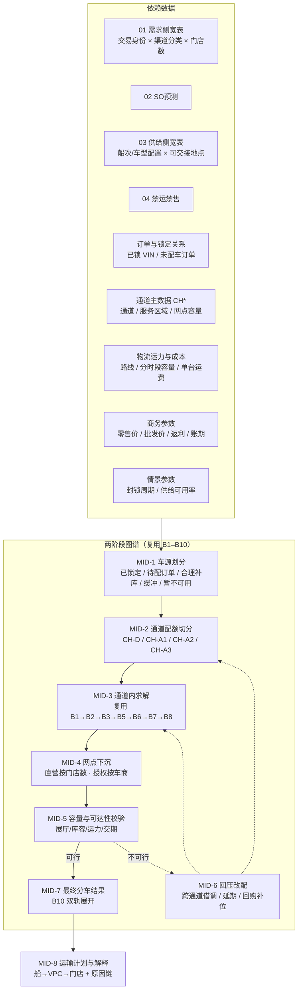

# 直营 × 授权双轨：授权商规模、双轨分车比例与分车计划图谱设计

- 版本：v1.0（首版）
- 定位：承接 `01_gemini调研/04_销售网络.md`（网络调研）+ `01_销售分货/03_本体节点依赖说明.md`（B 节点依赖）+ `01_销售分货/本体设计.png`（图谱形态）+ `02_codex设计/01_整车销售供应链业务过程与决策网络.md`（N01–N05 / E00–E06 业务过程）。
- 回答三个问题：**① 分车要依赖哪些数据？② 图谱里要考虑哪些规则与参数？③ 这些规则与参数在图谱中产出哪些中间数据？**
- 口径纪律：本文所有"事实"标注来源；所有"估算/推荐值"单列标注 **【估算】**，供 demo 参数化使用，不代表任何企业真实内部数字。demo 的规则、参数与算例均为虚构设定。

---

## 0. 摘要

### 0.1 三句话结论

1. **授权商数量的量级远大于直营**：ALJ 直营约 **31–35 个** Toyota 展示/服务中心（可核实），而授权独立车商是一张**分层长尾网络**——区域独家授权集团（个位数）+ 授权二级展厅（数十家）+ Haraj 交易市场展厅（数十至上百家），量级落在 **数十到数百** 之间；网点数量比约 **1 : 6 ~ 1 : 10**。
2. **分车比例不是"直营 vs 授权"两个数字，而是一套"通道配额 → 通道内求解"的两阶段结构**：现状推荐基线 **直营 65%–80% : 授权 20%–35%（中枢 70 : 30）【估算】**；危机态下授权轨被优先压缩到 **15%–25%**，同时直营轨的"订单保护 + 保底"权重上升、绩效倾斜权重下降。
3. **现有本体图谱（B1–B10 / A1–A8）只表达"通道内"的分货，缺少"通道间"的切分**：只要给 `01_需求侧宽表` 的 **渠道分类 / 客户类型** 两个已有字段挂上"通道归属"，再把 `A2_分货周期` 扩一个「通道配额」参数组、把 `B4` 拆成两级供给池，**不需要新造一套本体**就能表达双轨分车；且中间产物（通道配额表、通道内分配结果、回压后的改配记录）天然可解释。

### 0.2 编号规则（本文新增前缀）

| 前缀 | 含义 | 本文位置 |
|---|---|---|
| `CH*` | 通道（Channel）主数据与通道级配置 | §1.3、§3.1 |
| `DR*` | 双轨分车规则（Dual-track Rule） | §3.1 |
| `MID*` | 图谱中间产物（Intermediate Data） | §3.3、§3.4 |

> 沿用既有前缀不重复：`G/P/E/M`（业务活动）、`AS/BR/C`（假设/断点/危机活动）、`S1/S2/A1–A8/B1–B10/01–04`（本体对象）。本文一律不与它们撞号。

---

## 1. 调研补充：授权商数量与双轨结构

### 1.1 可核实的事实（公开来源）

| 事实 | 数值 | 来源 |
|---|---|---|
| 沙特 2024 年轻型车新车上牌 | 826,580（+7.8%）～ 827,857 辆，为 9 年新高 | [Focus2move](https://www.focus2move.com/saudi-arabia-auto-market-2024/)（摘要）、[Best Selling Cars Blog](https://bestsellingcarsblog.com/2025/01/saudi-arabia-full-year-2024-toyota-yaris-sedan-and-hyundai-accent-on-top-highest-volume-in-9-years/) |
| 品牌排名 | Toyota 第一，Hyundai / Kia / Nissan / Ford 依次其后 | [Gulf Saudi Expo 引述](https://gulfsaudiexpo.com/blog/revving-up-2024-toyota-tops-as-chinese-brands-surge-in-saudi-arabia) |
| Toyota 授权经销商（ALJ Motors）展示厅数量 | **31 个**（2026-02 口径）／ **34–35 个**（导购平台口径） | [poidata.io 品牌报告](https://poidata.io/brand-report/abdul-latif-jameel-motors-toyota%D8%B9%D8%A8%D8%AF-%D8%A7%D9%84%D9%84%D8%B7%D9%8A%D9%81-%D8%AC%D9%85%D9%8A%D9%84-%D9%84%D9%84%D8%B3%D9%8A%D8%A7%D8%B1%D8%A7%D8%AA-%D8%AA%D9%88%D9%8A%D9%88%D8%AA%D8%A7/saudi-arabia)、[ZigWheels KSA](https://www.zigwheelsksa.com/new-cars/toyota/dealers)、[SayaraBay](https://www.sayarabay.com/new-cars/toyota/dealers) |
| 直营零售主体 | **Abdul Latif Jameel Retail Company Ltd.**（CR# 4030794548） | [toyota.com.sa/en/about](https://www.toyota.com.sa/en/about) 页脚 |
| 授权车商下单通道 | **B2B Car Store**（`carstore.toyota.com.sa`）+ B2B Parts Store | 同上页脚 |
| 授权网络的实际形态 | 区域独家授权集团（如 Babgi 在吉赞 **14 个**综合设施）+ 北部批发大户 + 二级展厅 + Haraj 交易市场展厅 | `04_销售网络.md` §授权独立车商网络架构 |
| 备件零售网点 | 500+ 个直营/授权零部件零售点（说明"授权长尾"体量） | `04_销售网络.md` §内陆物流中枢 |

> **关键取舍**：34 个"Toyota Centers"是直营展示/服务中心；授权车商**不在** ALJ 的门店名录里（它们是独立法人），所以任何"官方门店数"都**必然低估授权网络**。这也是调研里授权数量一直拿不到确切数字的原因。

### 1.2 授权商数量的分层估算【估算】

| 层级 | 定义 | 典型玩家 | 网点数量级【估算】 | 单车流向 |
|---|---|---|---|---|
| **L1 区域独家授权集团** | 一省/一大区独家分销权，含销售+售后+备件 | Babgi（吉赞，14 网点）、Al Owdah（卡西姆/冰雹）、Al Yahya（阿西尔/南部高地） | **4–8 家集团**，合计 **30–60 个网点** | 大额批发，二次分销给 L2/L3 |
| **L2 授权二级展厅** | 有 Toyota 授权认证、以零售为主 | 各区域城市展厅、Al Katheri / Hala Auto 类跨区展厅 | **30–60 家** | 批发→零售 |
| **L3 Haraj / 集市展厅与服务商** | 交易市场内展位、以现货与置换为主 | 利雅得 Shefah、吉达 Haraj 内展位 | **80–200 个展位** | 小批量、高频 |
| **合计** | — | — | **约 110–270 个授权触点** | — |

**由此得到两条可直接进 demo 的参数**：

- **网点数比**：授权触点 : 直营中心 ≈ **110–270 : 34**，即 **1 : 4 ～ 1 : 8**；若把 500+ 备件点算作网络密度证据，长尾更长。
- **交易身份数比**（对分车模型更关键）：真正参与"批发分车"的**授权交易身份**只有 **L1+L2 ≈ 35–70 个**，因为 L3 通常由 L1/L2 二次供货、不在 ALJ 的批发账户体系内。**这是分车图谱的参与主体规模**：直营 1 个零售主体（含 34 个网点）+ 授权 35–70 个批发账户。

> **设计含义**：分车模型的两端是**不对称的**——直营是"1 个交易身份 × 34 个门店"（宽而浅），授权是"35–70 个交易身份 × 1–14 个门店"（窄而深）。所以直营轨的分车天然是"先到交易身份、再按门店数放大"，授权轨是"逐车商求解"。这个不对称是 §3 规则的出发点。

### 1.3 双轨的通道画像（`CH*` 主数据）

| 通道码 | 通道 | 交易身份 | 结算口径 | 库存归属 | 数据可见性 | 价格基数 | 单台毛利结构 |
|---|---|---|---|---|---|---|---|
| `CH-D` | 直营零售（ALJ Retail Company） | **1 个**（+ 34 网点） | 终端零售价 | ALJ | 全量实时（自有 DMS） | **MSRP − 促销** | 零售毛利 + 金融/保险/售后 |
| `CH-A1` | L1 区域独家授权 | 4–8 个 | **批发价**（ALJ→车商出货价） | 车商 | 部分（依赖车商上报 / 库存融资数据） | **批发价** | 批发价差 + 返利 |
| `CH-A2` | L2 授权二级展厅 | 30–60 个 | 批发价 | 车商 | 弱（多为月度上报） | 批发价 | 批发价差 + 返利 |
| `CH-A3` | L3 Haraj / 集市 | 80–200 个（多数不直连） | 现货 / 二次分销 | 车商 | 基本不可见 | 批发价（经 L1/L2） | 价差 + 溢价（不受 ALJ 控制） |

**三个必须写进设计的结论**：

1. **两轨收入不可混加**：直营取终端零售价、授权取批发价（`02_codex设计` §6.1 已明确此口径）。任何"综合利润"必须分别列示净贡献再加总。
2. **授权轨的库存是"别人的库存"**：AJL 看不到实时库存 → **状态数据缺失是常态**，模型必须允许"数据缺失 + 保险库存 + 合约保底"三条补丁（对应本体 `B3` 的 `allow_negative`、`B5` 的保底、`AS6`）。
3. **L3 是"价格之锚"也是"风险之锚"**：Haraj 现货加价会反噬直营定价与品牌，这也是 `04_销售网络.md` 里"回购 + 重新组合"机制的商业理由——回购不是为了补量，而是**夺回价格控制权**。

---

## 2. 双轨分车比例【估算 + 参数化】

### 2.1 常态基线

| 口径 | 直营 `CH-D` | 授权 `CH-A*` | 说明 |
|---|---|---|---|
| **销量占比（基线）** | **70%** | **30%** | 中枢推荐值 |
| 区间 | 65%–80% | 20%–35% | 视车型/区域浮动 |
| 网点数量占比 | ~15%–25% | ~75%–85% | 直营少而重、授权多而轻 |
| 单点月均销量（推算） | 34 网点 × ~500 台 ≈ 17,000 台/月 | 50 账户 × ~250 台 ≈ 12,500 台/月 | 与上表占比自洽【估算】 |

> **为什么基线是 7:3 而不是 5:5**：① ALJ 是**总代理 + 零售商双重身份**，直营轨承担品牌标准、金融渗透、售后利润，天然拿量与拿好车型；② 授权轨的核心价值是**地理渗透**（二三线 + 偏远省份），其人均产出低；③ 研究材料里的 5 个授权集团多为"区域独家 + 批发放量"，走的是量而非结构。综合看 **7:3** 最符合"直营立标准、授权扩渗透"的网络定位。

### 2.2 按车型的分轨差异【估算】

| 车型族 | 直营占比 | 授权占比 | 理由 |
|---|---|---|---|
| 乘用车（Yaris / Camry / Corolla） | 75%–85% | 15%–25% | 城市零售 + 金融渗透驱动，直营优势大 |
| HEV / 高端 SUV（Highlander、Lexus 系） | 85%–95% | 5%–15% | 服务能力与体验要求高，授权网络不承接 |
| 越野（Land Cruiser LC70/LC300、Prado） | 50%–60% | 40%–50% | 南部高地/北部沙漠依赖授权渗透 |
| 商用皮卡（Hilux） | 40%–50% | 50%–60% | 工矿企业 + 批发大户渠道为主 |

**含义**：分车比例**必须按车型配置（EAN/料号）分别设，而不是全局一个百分比**——这正是本体 `A2_分货周期` 里 `category` / `eans` 能承载的粒度。

### 2.3 危机态（霍尔木兹封锁）的通道调整【估算】

| 情景 | 直营占比 | 授权占比 | 配套动作 |
|---|---|---|---|
| 常态 | 70% | 30% | — |
| 30 天（1 个月） | **75%–80%** | **20%–25%** | 冻结低优先级授权配额；直营优先保实名订单 |
| 90 天 | **78%–85%** | **15%–22%** | 授权保底下调但**保留**（防网络塌方）；启动回购补充车源 |
| 180 天 | **80%–88%** | **12%–20%** | 重签渠道配额合同；直营承接更多结构，授权转向服务型角色 |

**三条护栏（护栏本身是约束，不进入利润优化——同 `03_ds设计/01` §6.1）**：

1. **授权保底不可清零**：偏远渠道断供 → 网络塌方 → 份额永久损失（`BR6`）。
2. **回购作为独立通道**：`CH-R`（回购/调拨量）单独登记，**不混入本船供给池**（同 `02_codex设计` §8.4）。
3. **不承诺即不销售**：授权轨的配额必须与物流可达性联合校验，避免"分得到、运不到"（`AS7`）。

---

## 3. 分车逻辑：依赖数据、规则与参数、图谱中间数据

### 3.0 双轨分车主流程（与现有图谱的对接）



> **与现有图谱的关系**：`MID-2` 是**新增的一层**（现有 `本体设计.png` 里没有）；`MID-3` 完整复用 `B1/B2/B3/B4/B5/B6/B7/B8`；`MID-1/MID-4/MID-5/MID-6/MID-7/MID-8` 是把 `02_codex设计` 的 N01–N05 落到本体对象上。
>
> 各节点的**左 → 右依赖总览**（含中间数据节点与中间配置节点的逐列对齐图）见 **§3.4**。

---

### 3.1 问题①：依赖哪些数据？

#### 3.1.1 现有本体里**已经有的**（无需新增）

| 数据 | 现有落点 | 字段 | 双轨分车怎么用 |
|---|---|---|---|
| 需求侧客户与商品 | `01_需求侧宽表` | 交易身份编码、交易身份名称、门店数、渠道分类、**客户类型（直供商/电商/原一代/其他）**、业务大区/小区、地理大区/小区、赛道等级、是否核心零售商 | **通道归属的原始依据**：`渠道分类 + 客户类型 → CH-*` |
| 需求侧目标与秩序 | `01_需求侧宽表` | WOS标准周数、分货绩效倾斜比例、扣减比例 | 通道内求解的目标 WOS 与扣减 |
| 需求侧销速输入 | `01_需求侧宽表` | 真实SO 5 列、激活 5 列、修补 2 列、销速系数 2 列、期初库存、总计划入库量、是否新商 | `B1` 销速、`B3` 库存基线 |
| 预测 | `02_SO预测` | 交易身份编码 × EAN × 自然周 × SO预估 | `B1.so_estimate_avg` |
| 供给 | `03_供给侧宽表` | EAN、物料编码、规格、自然周、可分货数量 | `B4` 可分货量；**需扩展**见下 |
| 合规 | `04_禁运禁售` | 交易身份 × EAN × 物料编码 × 始发仓 × 禁运原因 × 仓库/客户所在国 | `B6` 规则 2 |
| 任务与版本 | `S1_分货任务`、`S2_参数及规则` | 任务ID、EAN、状态 / 版本名称、参数来源、执行状态 | 分车任务与**通道参数版本** |
| 规则参数 | `A1–A8` | 见 `03_本体节点依赖说明.md` §4.3/§8.2 等 | 通道内求解 |
| 网点规模 | `01_需求侧宽表.门店数` | 门店数 | **直营轨下沉的唯一放大因子**；授权轨不需要 |

#### 3.1.2 **需要新增/扩展**的数据（按优先级）

| 优先级 | 新增数据 | 建议落点 | 字段（最小集） | 为什么现有图谱不够 |
|---|---|---|---|---|
| **P0** | **通道主数据** | 新对象 `CH_通道主数据`（配置类，建议 `A9`） | `channel_code`、`channel_name`、`channel_type`(直营/授权)、`settle_price_basis`(零售价/批发价)、`inventory_owner`(ALJ/车商)、`default_share_ratio`、`service_region_list`、`visibility_level` | 现在"直营/授权"只是 `渠道分类` 的一个取值，**没有通道级的配额、结算与可见性属性** |
| **P0** | **通道-交易身份映射** | `01_需求侧宽表` 加一列 `channel_code`（由 `渠道分类 + 客户类型` 派生） | `channel_code` | 让 `B1/B6/B7` 能以通道为维度分组，不必改主键 |
| **P0** | **通道配额参数** | `A2_分货周期` 扩一个参数组（或新 `A9_通道配额`） | `channel_quota_mode`(按比例/按绝对量/不启用)、`channel_quota_ratio`(json: EAN族→通道→比例)、`channel_quota_floor`(授权最低占比)、`channel_quota_cap` | 现有 `A2` 只有单一供给池，**没有"先切通道"这一步** |
| **P1** | **本船供给的车源结构** | `03_供给侧宽表` 扩列，或新增 `05_船次供给清单` | `vessel_id`/`batch_id`、`车型配置`、`数量或VIN`、`交接地点`、`可用时间`、`可用状态` | 现有 `03` 只有 `EAN × 物料编码 × 规格 × 周 × 可分货数量`，**没有船次、地点、时间、状态**；而这三个是 `02_codex设计` §3.1 的核心输入 |
| **P1** | **订单与锁定关系** | 新增 `06_订单与锁定` | `order_id`、`交易身份`、`接收门店`、`车型配置`、`数量`、`交期`、`已锁VIN/数量`、`订单优先级` | 分车的第一条规则是"先保护已锁定"，现有本体完全没有订单对象（`01` 只有汇总的真实SO/激活） |
| **P1** | **通道内保底策略扩展** | `A6_保底配置` 扩参数 | `authorized_channel_fallback_units`、`authorized_channel_fallback_by_store`、`dealer_floor_min_units`（车商最低库存）、`network_health_floor`（渠道存活底线比例） | 现有 8 个保底参数是"国内/海外 × 零消耗/最小分货/新商/双0"，**没有"授权渠道"这一维** |
| **P1** | **网点容量** | 新增 `CH_网点容量`（或在 `CH_通道主数据` 内 JSON） | `网点编码`、`展厅容量`、`库存上限`、`月均销量`、`收货窗口` | `门店数` 只给了个数，**给不了"能不能接得下"**（`02_codex设计` §2.4 的容量约束） |
| **P2** | **物流可达性与运力** | 新增 `07_路线与运力` | `起点`、`终点`、`运输时间`、`分时段容量`、`单台运费`、`可用状态` | `04_禁运禁售` 只表达"能不能卖"，不表达"运不运得动、贵不贵" |
| **P2** | **商务参数** | 新增 `08_商务参数`（或并入 `A3/A5`） | `车型×区域×渠道` 的 `零售价`、`批发价`、`返利`、`账期`、`资金成本率` | `03_ds设计/01` §6.1 的两轨收入口径**目前没有任何数据落点** |
| **P2** | **情景参数** | `S2_参数及规则` 加"情景版本" | `封锁周期`、`供给可用率`、`提前期增量`、`运价倍数`、`运力缺口`、`东线可用性` | `03_ds设计/01` §5.2 的参数表需要版本化载体 |
| **P3** | **回购与调拨可行性** | 新增 `09_回购与调拨` | `车商`、`车型`、`可转让量`、`回购折价`、`权属确认状态`、`调出地需求` | `02_codex设计` §8.4 要求回购车源**单独登记**、不混入本船口径 |

#### 3.1.3 依赖关系总表（谁能喂给谁）

| 规则/计算 | 需要的数据 | 数据从哪来 | 缺了会怎样 |
|---|---|---|---|
| 车源划分 | 本船清单 + 锁定关系 | `05` + `06` | 无法区分"已锁定/待分配"，第二条守恒式失效 |
| 通道配额切分 | 通道主数据 + 配额参数 + 车型分轨比例 | `CH` + `A9/A2` | 只能全局按 WOS 注水，无法"直营立标准、授权扩渗透" |
| 通道内求解 | `B1`+`B2`+`B3`+`B4`+`B5`+`B6`+`B7`+`A1–A8` | 现有本体 | 现有能力，不受影响 |
| 直营网点下沉 | `门店数` + 网点容量 + 各城市需求 | `01` + `CH_网点容量` | 只能分到"直营通道"一个数，**给不出城市级去向** |
| 授权车商求解 | 授权交易身份 + 车商保底 + 车商历史销速 | `01` + `A6` 扩展 | 长尾车商要么全给、要么全不给，网络塌方风险 |
| 容量/可达性校验 | 展厅与库容 + 路线运力 + 交期 | `CH_网点容量` + `07` + `06` | 分出一张"运不走/接不下"的纸面计划（`AS7`） |
| 改配与回压 | 不可行清单 + 可替代清单 + 调整代价 | `MID-5` 输出 + `A8` | 无法解释"为什么中部门店少了 10 辆" |
| 双轨利润比较 | 两轨价格与费用 + 资金占用 | `08` + `07` | 会把零售价和批发价混加，方案对比失真 |

---

### 3.2 问题②：图谱里要考虑哪些规则与参数？

#### 3.2.1 规则清单（`DR*`，按执行顺序）

| 编号 | 规则 | 解决的问题 | 参数/输入 | 约束 | 落到哪个本体节点 |
|---|---|---|---|---|---|
| `DR1` | **两段区分：锁定优先** | 本轮要覆盖哪些需求？哪些车已被占用、哪些还能分？ | 订单优先级、交期、允许替代的配置、已锁 VIN；**三类需求口径：① 已锁定 ② 已确认未配车 ③ 合理补库** | 一车不得重复占用；② 不得重复扣减；③ 必须是缺口量 | `MID-1`（新增，喂 `B4`） |
| `DR2` | **通道配额切分（先切通道）** | 这一船按什么比例分给直营与授权？ | `channel_quota_mode/ratio/floor/cap`、车型分轨比例 | 授权最低占比（渠道存活底线）；两轨之和 = 待分配量 | `MID-2`（新增，切 `B4`） |
| `DR3` | **通道内需求与库存基线** | 每条通道内，各车商/门店缺多少？ | 销速、目标 WOS、分货前库存 | 通道内独立计算，不可跨通道互抵 | `B1`/`B2`/`B3`（复用） |
| `DR4` | **通道内保底** | 谁必须先拿到最低量？ | 零消耗/最小分货/新商/双0 + **授权渠道保底** | 保底也占用供给；不能为保底超分 | `B5`（扩参数）+ `B6`（复用） |
| `DR5` | **通道内不参与集合** | 谁本轮不参与注水？ | 禁运禁售、分货前 WOS 超标、赛道豁免 | 豁免等级不设上限 | `B6`（复用） |
| `DR6` | **通道内注水与级差** | 剩余池怎么分？ | 级差模式、合理率上限、注水基线口径、赛道内倾斜 | 分货后 WOS ≤ 上限 × 目标 WOS（豁免除外） | `B7`/`B8`（复用） |
| `DR7` | **直营网点下沉** | 直营通道的量怎么落到 34 个门店？ | 门店数、各城市需求份额、网点容量 | Σ门店分配 = 通道配额；不得突破单店容量 | `MID-4`（新增，`B10` 扩展） |
| `DR8` | **授权车商分配** | 授权通道的量怎么落到 35–70 个账户？ | 车商历史销速、车商保底、配额系数、资金/信用额度 | 不得超过车商信用与库容；新商走新商保底 | `MID-4`（新增，`B10` 扩展） |
| `DR9` | **容量与可达性校验** | 分出去的车接得下、运得走吗？ | 展厅/库容、路线运力、收货窗口、交期 | 不可行必须显式反馈，不得硬塞 | `MID-5`（新增，回压 `MID-2`/`MID-3`） |
| `DR10` | **应急预留（VPC 缓冲）** | 留多少车等后续需求？ | 预留比例/数量、释放条件、VPC 库容 | 预留与已分配互斥，不重复计量 | `B9` 留仓量（复用并扩展语义） |
| `DR11` | **双轨利润/贡献比较** | 这个分法比另一个好在哪？ | 零售价/批发价、返利、运费、资金成本、渠道保底（硬约束） | 两轨收入不可混加；保底不进利润项 | `MID-8`（新增，`B10` 后置评估） |
| `DR12` | **改配与回压** | 运力/容量不足时改谁？ | 调整代价、冻结范围、订单保护、可替代清单 | 已执行部分保留事实 | `MID-6`（新增） |
| `DR13` | **危机态重排** | 封锁后规则怎么变？ | 情景参数、通道配额调整、回购补位 | 授权保底不可清零；回购单独登记 | `MID-2`/`MID-6`（参数版本切换） |

#### 3.2.2 参数清单（按本体节点归位）

**A. 新增参数（分车双轨专属）**

| 参数 | 类型 | 推荐基线【估算】 | 作用 |
|---|---|---|---|
| `channel_quota_mode` | 枚举 | `by_ratio` | 通道配额启用方式（按比例/按绝对量/不启用） |
| `channel_quota_ratio` | json | 乘用车 `CH-D 0.80`／越野 `CH-D 0.55`／皮卡 `CH-D 0.45` | **按车型族设分轨比例**（§2.2） |
| `channel_quota_floor` | 数值 | 授权 ≥ 0.15（危机态 ≥ 0.12） | 渠道存活底线（硬约束） |
| `channel_quota_cap` | 数值 | 直营 ≤ 0.90 | 防止极端情景把授权清零 |
| `authorized_channel_fallback_units` | 数值 | 2–4 台/车商/轮次 | 授权车商最低保底 |
| `dealer_floor_min_units` | 数值 | 按车商规模分档 | 车商最低库存（门店 floor 的授权版） |
| `network_health_floor` | 数值 | 0.85（授权轨道达成年下限） | 网络健康护栏 |
| `order_protection_scope` | 枚举 | `locked_vins + confirmed_orders` | 保护范围（已锁 VIN / 已确认订单 / 两者） |
| `vpc_buffer_ratio` | 数值 | 5%–10% | VPC 缓冲比例（`B9` 的显式参数化） |
| `buffer_release_condition` | 表达式 | 封锁 > 4 周 或 覆盖 < 阈值 | 缓冲释放条件 |
| `cross_channel_borrow_enabled` | 布尔 | `true`（危机态） | 是否允许跨通道借调 |
| `repurchase_pool_enabled` | 布尔 | `false`（常态）/ `true`（≥90 天） | 回购量是否进入本轮供给池 |

**B. 复用参数（来自 `A1–A8`，双轨后按通道分别取值）**

| 参数 | 来源 | 双轨后的差异 |
|---|---|---|
| 拆包比例 `share_map` | `A1` | 同一套（供给侧，与通道无关） |
| 周期模式 / 分货周 / 规划周数 / 月末日期 | `A2` | 直营可按周、授权按周或双周（车商响应慢） |
| 扣减量 / buffer 预留比例 | `A2` | **按通道分别设**：授权轨 buffer 更高（周转慢、资金弱） |
| 激活回看天数 / 需求口径 / 修补开关 | `A3` | 授权轨数据可见性差 → 提高"修补替换"与"预测 SO"权重 |
| 卖出折算偏移量 / 是否可负 | `A4` | 授权轨 `allow_negative` 建议 `false`（无法确认欠货） |
| 统一 WOS / 绩效倾斜方式 | `A5` | **直营可开绩效倾斜、授权建议关闭**（避免长尾被系统性挤压） |
| 保底 8 参数 | `A6` | 增加"授权渠道"维（见上表） |
| 禁运禁售开关 | `A7` | 同一套 |
| 级差模式 / 合理率上限 / 豁免等级 / 注水基线口径 / 海外合理率上限 | `A8` | **授权轨合理率上限放宽**（车商库存本就偏高）；豁免等级可含"区域独家" |

**C. 约束清单（不进优化、只做可行性筛）**

| 类别 | 约束 | 数据来源 |
|---|---|---|
| 唯一性 | 同一 VIN/数量不得重复占用 | `05` + `06` |
| 车型匹配 | 订单车型配置必须匹配 | `06` |
| 容量 | 展厅容量、库容、收货窗口 | `CH_网点容量` |
| 运力 | 路线 × 时段可用车次、装载限制 | `07` |
| 合规 | 禁运禁售、渠道配额承诺、锁价合同 | `04` + `08` |
| 资金 | 回购资金上限、车商信贷额度 | `08` + `09` |
| 服务 | 实名订单交付承诺 | `06` |
| 渠道 | 授权保底 / 网络健康底线 | `network_health_floor` |

---

### 3.3 问题③：规则与参数在图谱中输出哪些中间数据？

> 读法：每行 = 一个中间产物（`MID-*`），列出「由哪些规则/参数产生」→「输出哪些字段」→「下游谁消费」→「能解释什么」。这正是 `03_ds设计/01` §2.3.2 所说的**"数据边"**；而 `MID-5 → MID-2/MID-3` 是**"约束边（回压）"**。

#### `MID-1` 车源划分结果（`B4` 的上游扩展）

| 项 | 内容 |
|---|---|
| 产生规则 | `DR1` |
| 输入 | `05_船次供给清单`、`06_订单与锁定`、`可用状态` |
| 输出字段 | `vessel_id`、`车型配置`、`数量/VIN`、`locked_qty`（已锁定量）、`order_unallocated_qty`（尚未配车的已确认订单量）、`replenish_qty`（合理补库需求量）、`allocatable_qty`（待分配量）、`unavailable_qty`（暂不可用量）、`unavailable_reason`、`earliest_available_date` |
| **三类需求口径** | 本轮要覆盖的是：**① 本船已锁定订单**（保留占用、不进入自由分配）／**② 尚未配车的已确认订单**（优先参与本轮配车）／**③ 合理补库需求**（按覆盖缺口算）；外加 **④ VPC 缓冲**。`allocatable_qty` 服务的正是 ②+③+④ |
| **两条硬边界** | ②**不得重复扣减**：算待分配池时不预扣、配车后不再扣；③**必须是缺口量**：`max(0, 目标覆盖水位 − 可自由销售现货)`，不是"补满至上限" |
| 守恒校验 | `本船总量 = unavailable + locked + allocatable`（集合互斥） |
| 下游 | `MID-2` 通道配额切分 |
| 解释力 | "这 100 辆里 30 辆已锁定、70 辆能分、5 辆因单证暂不可用；70 辆里先匹配 10 辆待配订单，其余给补库与缓冲" |

> **量级参考与拆分比例**：见 [03_ALJ月度进销与分车需求拆分.md](03_ALJ月度进销与分车需求拆分.md)。demo 基线为月均 22,000 辆，分为已锁定 22% / 待配订单 14% / 合理补库 46% / VPC 缓冲 10% / 到港待分 8%。

#### `MID-2` 通道配额表（**新增的核心中间产物**）

| 项 | 内容 |
|---|---|
| 产生规则 | `DR2`、`DR13` |
| 输入参数 | `channel_quota_mode`、`channel_quota_ratio`、`channel_quota_floor`、`channel_quota_cap`、`CH_通道主数据` |
| 输出字段 | `channel_code`、`channel_name`、`quota_ratio`（生效比例）、`quota_qty_raw`（未取整）、`quota_qty`（取整后）、`quota_basis`（按车型族/区域）、`floor_binding`（是否触底）、`cap_binding`（是否触顶）、`version_id` |
| 取整 | 最大余数法（`B10` 同款口径，余数平局按 `channel_code` 升序） |
| 下游 | `MID-3`（作为各通道的 `Q_total`）、`MID-8`（配额 vs 实际对比） |
| 解释力 | "为什么授权只拿到 18 辆？因为越野车分轨比例 40%，且触及授权保底下限 15%" |

#### `MID-3` 通道内分配结果（复用 `B1–B8`，按 `channel_code` 分组）

| 项 | 内容 |
|---|---|
| 产生规则 | `DR3`–`DR6`、`DR10` |
| 输入 | `B1` 销速、`B2` 目标 WOS、`B3` 分货前库存、`B5` 保底、`B6` 排除集、`B7` 参与集、`A1–A8` |
| 输出字段 | 现有 `B8` 全字段（`alloc_qty_init`、`alloc_qty_skew`、`deduction_qty`、`alloc_qty_deduction`、`alloc_qty_water`、`wos_after`、`round`）**+ 新增 `channel_code`** |
| 分通道实例 | 直营实例（`CH-D`，1 个交易身份）、授权实例（`CH-A1/A2`，N 个车商）；L3 不直连 → 并入其上级 L1/L2 的需求 |
| 下游 | `MID-4` 网点下沉、`MID-8` 解释 |
| 解释力 | "直营 70 辆里，注水 62 + 保底 8；授权 18 辆里，注水 9 + 保底 9（保底占比高说明长尾被保护）" |

#### `MID-4` 网点/车商下沉明细

| 项 | 内容 |
|---|---|
| 产生规则 | `DR7`（直营）、`DR8`（授权） |
| 直营输入/输出 | 输入：`门店数`、各城市需求份额、`网点容量`。输出：`门店编码`、`城市`、`需求份额`、`分配量`、`分配后库存`、`分配后 DOS/WOS` |
| 授权输入/输出 | 输入：车商销速、`authorized_channel_fallback_units`、`dealer_floor_min_units`、信用额度、历史达成率。输出：`车商编码`、`分配量`、`保底量`、`注水量`、`券后库存周数`、`额度占用` |
| 校验 | Σ下沉 = 通道配额；单点不超容量；直营取整用最大余数法 |
| 下游 | `MID-5` 校验、`MID-7` 最终结果、`MID-8` 解释 |
| 解释力 | "直营 70 辆 → 利雅得 4 店 28 辆、吉达 3 店 18 辆……；授权 18 辆 → Babgi 4 辆、Al Owdah 3 辆……" |

#### `MID-5` 校验与不可行清单（**回压的源头**）

| 项 | 内容 |
|---|---|
| 产生规则 | `DR9` |
| 输入 | `MID-4` 下沉量 + `CH_网点容量` + `07_路线与运力` + `06` 交期 |
| 输出字段 | `channel_code`、`对象编码`（门店/车商/VPC）、`计划量`、`可接量`、`可运量`、`缺口量`、`缺口原因`（库容/运力/交期/合规）、`建议动作`、`严重度` |
| 下游 | `MID-6` 改配；反向回压 `MID-2`（配额重切）与 `MID-3`（重新注水） |
| 解释力 | "中部门店少 10 辆：中部线运力 40→30，订单保护占 20，缓冲 5，补库只能给 5，其余 10 辆改分西部或延期"（`02_codex设计` §8.3 原文口径） |

#### `MID-6` 改配与再平衡记录

| 项 | 内容 |
|---|---|
| 产生规则 | `DR12`、`DR13` |
| 输入 | `MID-5` 不可行清单、`cross_channel_borrow_enabled`、`repurchase_pool_enabled`、调整代价 |
| 输出字段 | `调整类型`（跨通道借调/换 VPC/换路线/延期/回购补位）、`原方案`、`新方案`、`调整量`、`新增费用`、`影响对象`、`需批准人` |
| 下游 | 回写 `MID-2`/`MID-3` → 重新迭代；输出给 `MID-7`/`MID-8` |
| 解释力 | "这 10 辆不是把中部的车换到西部中转，而是**改变了 10 辆车的销售去向**"（`02_codex设计` §8.3 的关键区分） |

#### `MID-7` 最终分车结果（`B10` 双轨展开）

| 项 | 内容 |
|---|---|
| 产生规则 | `DR7`/`DR8`/`DR10` 合并 |
| 输出字段 | 在现有 `B10` 18 列基础上补：`channel_code`、`vessel_id`、`承接VPC`、`接收门店`/`车商`、`VPC缓冲标记`、`关联订单`、`分配原因`、`计划时间`、`版本` |
| 守恒校验 | 船→VPC 与 VPC→门店 是**同一批车的两段记录，不可相加**（`02_codex设计` §2.3） |
| 下游 | 运输计划、执行跟踪、结算 |
| 解释力 | 完整可追溯：任一数量都能追到"规则 → 参数版本 → 数据时点" |

#### `MID-8` 双轨解释与评估视图

| 项 | 内容 |
|---|---|
| 产生规则 | `DR11` |
| 输出（渠道视图） | `channel_code` × `配额` × `实际分配` × `配额达成率` × `保底占比` × `注水占比` × `分货后 WOS` × `订单满足率` |
| 输出（利润视图） | **两轨分列**：直营口径（零售价−促销−…）、授权口径（批发价−…）；**不混加**；另列运力影子价格与渠道保底（硬约束口径） |
| 输出（原因链） | 数量变化 → 命中的规则 → 参数版本 → 输入数据时点 → 不可行原因 |
| 输出（情景对比） | 30/90/180 天下同一输出的三套结果 + 升级/退出触发条件 |
| 下游 | Agent 解释、方案评审、渠道沟通 |
| 解释力 | "为什么授权从 30% 降到 18%：供给可用率 30% + 授权保底下限 15% + 运力缺口 30%" |

#### 中间产物依赖速查

```text
MID-1 ──► MID-2 ──► MID-3 ──► MID-4 ──► MID-5 ──┬─► MID-7 ──► MID-8
                  ▲          ▲                 │
                  └──────────┴── MID-6 ◄────────┘
                                （回压/改配，可迭代）
```

### 3.4 图谱依赖总览（ASCII：从左到右的分货计划生成过程）

> §3.0 的 mermaid 讲"主流程"、§3.1 讲"依赖哪些数据"、§3.2 讲"规则与参数"、§3.3 讲"产出哪些中间数据"。本节把四者压成**一张可以逐列对齐阅读的依赖图**，用来回答"**中间数据节点有哪些、中间配置节点从哪一列注入**"。
>
> **读法：一列 = 一个中间数据节点（`MID-*`）；列的"上方"是该节点的下游，列的"下方"是喂给它的上游节点。** 上游中带 `*` 的是**中间配置节点**（`CH*` / `A*` / `S2`），不带 `*` 的是**输入数据节点**（`01`–`09`）或上游中间节点的汇聚。
>
> 图例：`-->` = 分货计划的生成方向（左 → 右）；`|` `^` = 依赖注入方向（下 → 上）；`MID-*` = 中间数据节点；`*` = 中间配置节点；`01`–`09` = §3.1.2 的输入数据节点。

#### 图 A｜主链：中间数据节点逐列展开 + 每列的上游（数据 / 配置）

```text
【主链 · 中间数据节点（MID-*）：左 → 右生成分货计划】
   +-------------+   +-------------+   +-------------+   +-------------+   +-------------+   +-------------+   +-------------+
   | MID-1       |   | MID-2       |   | MID-3       |   | MID-4       |   | MID-5       |   | MID-7       |   | MID-8       |
   | 车源划分    |   | 通道配额    |   | 通道内求解  |   | 网点下沉    |   | 容量校验    |   | 最终分车    |   | 解释评估    |
   | 已锁/待配   |-->| CH-D/CH-A*  |-->| B1~B8 复用  |-->| 直营:门店数 |-->| 不可行清单  |-->| B10 双轨    |-->| 渠道视图    |
   | 补库/缓冲   |   | 比例/保底   |   | 按通道分组  |   | 授权:车商   |   | 回压MID-2/3 |   | 船→VPC→去向 |   | 利润视图    |
   | 规则 DR1    |   | 规则 DR2/13 |   | 规则 DR3~6  |   | 规则 DR7/8  |   | 规则 DR9    |   | 规则 DR7~10 |   | 规则 DR11   |
   +-------------+   +-------------+   +-------------+   +-------------+   +-------------+   +-------------+   +-------------+
          |                 |                 |                 |                 |                 |                 |
          ^                 ^                 ^                 ^                 ^                 ^                 ^
   +-------------+   +-------------+   +-------------+   +-------------+   +-------------+   +-------------+   +-------------+
   | 03 供给侧   |   | *CH 通道    |   | 01 需求宽表 |   | 01 门店数   |   | 07 路线运力 |   | MID1~6 汇聚 |   | 08 商务参数 |
   | 05 船次清单 |   | *A9通道配额 |   | 02 SO预测   |   | *CH网点容量 |   | 06 交期承诺 |   |             |   | *S2情景版本 |
   | 06 订单锁定 |   | 01 通道列   |   | 04 禁运禁售 |   | *A6保底扩展 |   | *CH网点容量 |   |             |   | MID2~7 全链 |
   |             |   | S2 情景版本 |   | *A1~A8 参数 |   | 08 信用额度 |   |             |   |             |   |             |
   +-------------+   +-------------+   +-------------+   +-------------+   +-------------+   +-------------+   +-------------+
【上游 · 依赖注入：* = 中间配置节点；01~09 = 输入数据节点；无 * = 既有参数/上游汇聚】

```

> **读图三条**：
> 1. **主线上只有 7 个中间数据节点**：`MID-1 → MID-2 → MID-3 → MID-4 → MID-5 → MID-7 → MID-8`。`MID-6` **不在主线上**——它是"校验不通过才触发"的回压支路（见图 B），所以主链上 `MID-5` 有两条出边：可行去 `MID-7`、不可行去 `MID-6`。
> 2. **中间配置节点"前重后轻"**：`CH_通道主数据` 与 `A9_通道配额` 只喂 `MID-2`；`A6`（授权维）喂 `MID-4`；`CH_网点容量` 同时喂 `MID-4` 与 `MID-5`；`S2` 情景版本喂 `MID-2` 与 `MID-8`。也就是说**双轨改造的新增配置成本几乎全集中在第 1–2 列**，`MID-3` 及之后只是"按 `channel_code` 分组重跑既有本体"。
> 3. **同一列可以既是接收方又是供给方**：`MID-4` 吃 `CH_网点容量`、`MID-5` 又吃一次——**容量既是"下沉时的约束"、也是"校验时的判据"**，两处必须同源，否则会出现"下沉说放得下、校验说接不下"的自相矛盾。

#### 图 B｜回压支路：`MID-5` 校验不通过时，计划如何被改写并重算

```text
  +------------+            +------------+               +-----------------+
  | MID-5      |            | MID-6      |               | MID-2 / MID-3   |
  | 容量校验   |--不可行--> | 改配回压   |--回压/重算--> | 配额重切/重注水 |
  | 不可行清单 |            | 借调/延期  |               |                 |
  +------------+            +------------+               +-----------------+
        |                                                         |
        | 可行                                                    | 迭代收敛
        v                                                         v
  +------------+                                         +-----------------+
  | MID-7      |                                         | MID-7 / MID-8   |
  | 最终分车   |                                         | 复核与解释      |
  +------------+                                         +-----------------+
```

- **`MID-6` 是唯一的"写回"节点**：它不产生新的分车量，只产生"改配动作 + 调整代价"，并沿 `MID-6 → MID-2 / MID-3` 回压，触发配额重切或重新注水；于是 `MID-5 → MID-6 → MID-2/MID-3 → MID-3 → MID-4 → MID-5` 构成一个**迭代环**，直到 `MID-5` 不再产生不可行项（或不可行项被人工接受）。
- **两条出边语义不同**：`MID-5 --可行--> MID-7` 是**数据边**（结果继续向下传）；`MID-5 --不可行--> MID-6 --回压--> MID-2/MID-3` 是 `03_ds设计/01` §2.3.2 所说的**约束边**。读图时不要把它当成"又被分了一次"：它改变的是**同一批量车的销售去向**，不是新增供给（`02_codex设计` §8.3）。

#### 表 3.4-1 中间数据节点（`MID-*`）注册表

> 上游列中的 `*` 前缀 = 中间配置节点，与图 A 的标记一致。

| 节点 | 名称 | 产生规则 | 上游节点（数据 / `*`配置） | 下游节点 | 关键输出字段 | 详见 |
|---|---|---|---|---|---|---|
| `MID-1` | 车源划分 | `DR1` | `03`、`05`、`06` | `MID-2` | `locked_qty`、`order_unallocated_qty`、`replenish_qty`、`allocatable_qty`、`unavailable_qty` | §3.3 |
| `MID-2` | 通道配额表 | `DR2`、`DR13` | `*CH_通道主数据`、`*A9_通道配额`、`01`（通道列）、`*S2`（情景版本） | `MID-3`、`MID-8` | `quota_ratio`、`quota_qty_raw`、`quota_qty`、`floor_binding`、`cap_binding`、`version_id` | §3.3 |
| `MID-3` | 通道内分配结果 | `DR3`–`DR6`、`DR10` | `01`、`02`、`04`、`*A1~A8` | `MID-4`、`MID-8` | `B8` 全字段（`alloc_qty_water`、`alloc_qty_skew`、`wos_after`、`round`…）+ `channel_code` | §3.3 |
| `MID-4` | 网点 / 车商下沉明细 | `DR7`、`DR8` | `MID-3`、`01`（门店数）、`*CH_网点容量`、`*A6`（授权维）、`08`（信用额度） | `MID-5`、`MID-7`、`MID-8` | `门店/车商编码`、`分配量`、`保底量`、`注水量`、`分配后 WOS`、`额度占用` | §3.3 |
| `MID-5` | 校验与不可行清单 | `DR9` | `MID-4`、`*CH_网点容量`、`07`、`06`（交期） | `MID-7`（可行）、`MID-6`（不可行）；回压 `MID-2`/`MID-3` | `可接量`、`可运量`、`缺口量`、`缺口原因`、`建议动作`、`严重度` | §3.3 |
| `MID-6` | 改配与再平衡记录 | `DR12`、`DR13` | `MID-5`、`09`、`*A9`/`*S2`（借调 / 回购开关） | 回压 `MID-2`/`MID-3`；`MID-7`、`MID-8` | `调整类型`、`原方案`、`新方案`、`调整量`、`新增费用`、`影响对象`、`需批准人` | §3.3 |
| `MID-7` | 最终分车结果 | `DR7`/`DR8`/`DR10` 合并 | `MID-4`、`MID-5`、`MID-6` | 运输计划、执行跟踪、结算、`MID-8` | `B10` 18 列 + `channel_code`、`vessel_id`、`承接VPC`、`关联订单`、`分配原因`、`计划时间` | §3.3 |
| `MID-8` | 双轨解释与评估视图 | `DR11` | `MID-2`~`MID-7`、`08`、`*S2`（情景版本） | Agent 解释、方案评审、渠道沟通 | 渠道视图（配额 / 达成率 / 保底占比）、利润视图（两轨分列）、原因链、30/90/180 天情景对比 | §3.3 |

#### 表 3.4-2 中间配置节点（`CH*` / `A*` / `S2`）注册表

| 配置节点 | 名称 | 归属对象 | 注入到（`MID`） | 关键参数 | 新增/复用 | 详见 |
|---|---|---|---|---|---|---|
| `CH_通道主数据` | 通道主数据 | 新对象（`CH*`） | `MID-2`、`MID-4` | `channel_code`、`channel_type`、`settle_price_basis`、`inventory_owner`、`default_share_ratio`、`service_region_list`、`visibility_level` | 新增 | §1.3、§3.1.2 |
| `CH_网点容量` | 网点容量 | 新对象（或并入 `CH_通道主数据` 的 JSON 列） | `MID-4`、`MID-5` | `网点编码`、`展厅容量`、`库存上限`、`月均销量`、`收货窗口` | 新增 | §3.1.2 |
| `A9_通道配额` | 通道配额参数 | 新配置对象（或 `A2_分货周期` 扩参数组） | `MID-2` | `channel_quota_mode`、`channel_quota_ratio`、`channel_quota_floor`、`channel_quota_cap` | 新增 | §3.1.2、§3.2.2 |
| `A6_保底配置`（授权维） | 授权渠道保底 | 现有 `A6` 扩参数 | `MID-3`、`MID-4` | `authorized_channel_fallback_units`、`dealer_floor_min_units`、`network_health_floor` | 扩展 | §3.2.2 |
| `A1~A8` | 通道内分货规则参数（复用集） | 现有配置对象 | `MID-3` | `share_map`、周期模式、扣减量 / buffer、激活回看、`allow_negative`、统一 WOS / 绩效倾斜、禁运开关、级差 / 合理率上限 | 复用（按通道分别取值） | §3.2.2B |
| `S2_参数及规则`（情景版本） | 情景参数版本 | 现有任务 / 参数对象的版本维度 | `MID-2`、`MID-6`、`MID-8` | `封锁周期`、`供给可用率`、`提前期增量`、`运价倍数`、`运力缺口`、`东线可用性` | 扩展 | §2.3、§3.1.2 |
| `08_商务参数` | 两轨价格与费用 | 新对象 | `MID-4`（信用额度）、`MID-8`（利润） | `零售价`、`批发价`、`返利`、`账期`、`资金成本率` | 新增 | §3.1.2 |
| `09_回购与调拨` | 回购与调拨可行性 | 新对象 | `MID-6` | `可转让量`、`回购折价`、`权属确认状态`、`调出地需求` | 新增 | §3.1.2 |
| 分车专属开关与阈值 | — | 归入 `A2` / `A9` / `S2` 的标量参数 | `MID-1`、`MID-6` | `order_protection_scope`、`vpc_buffer_ratio`、`buffer_release_condition`、`cross_channel_borrow_enabled`、`repurchase_pool_enabled` | 新增 | §3.2.2A |

#### 表 3.4-3 输入数据节点（`01`–`09`）注册表

| 输入数据节点 | 提供什么 | 注入到（`MID`） | 复用情况 |
|---|---|---|---|
| `01_需求侧宽表` | 交易身份、门店数、渠道分类、客户类型、真实 SO / 激活 / 销速、目标 WOS、绩效倾斜与扣减比例 | `MID-1`、`MID-3`、`MID-4` | 复用（新增 `channel_code` 列） |
| `02_SO预测` | 交易身份 × EAN × 自然周 × SO 预估 | `MID-3` | 复用 |
| `03_供给侧宽表` | EAN × 物料编码 × 规格 × 自然周 × 可分货数量 | `MID-1` | 复用（建议扩船次 / 地点 / 时间 / 状态） |
| `04_禁运禁售` | 交易身份 × EAN × 物料编码 × 始发仓 × 禁运原因 | `MID-3`（排除集） | 复用 |
| `05_船次供给清单` | `vessel_id`、车型配置、数量或 VIN、交接地点、可用时间、可用状态 | `MID-1` | **新增** |
| `06_订单与锁定` | 订单号、交易身份、接收门店、车型配置、交期、已锁 VIN / 数量、订单优先级 | `MID-1`、`MID-5` | **新增** |
| `07_路线与运力` | 起点 / 终点、运输时间、分时段容量、单台运费、可用状态 | `MID-5` | **新增** |
| `08_商务参数` | 车型 × 区域 × 渠道的零售价、批发价、返利、账期、资金成本率 | `MID-4`、`MID-8` | **新增** |
| `09_回购与调拨` | 车商、车型、可转让量、回购折价、权属确认状态、调出地需求 | `MID-6` | **新增** |

> **与 §3.3 的分工**：§3.3 回答"每个 `MID-*` 产出哪些字段、能解释什么"；本节回答"节点之间谁依赖谁、配置从哪一列注入、哪一步是回压"。两节合起来就是可落库的**节点 + 边**清单：**节点**见表 3.4-1 / 3.4-2 / 3.4-3，**边**见图 A / 图 B——横向为**数据边**、纵向为**配置注入边**、`MID-6` 回压为**约束边**。

---

## 4. 一个虚构最小算例（100 辆）【演示数据】

> 全部为虚构演示数据，用于核对双轨配额与中间产物；与任何企业真实数据无关。

**输入**：本船 100 辆（同一车型配置）；已锁 30 辆；待分配 70 辆；另有 10 辆已确认未配车订单。通道配额参数：直营 0.70 / 授权 0.30，授权保底下限 0.15。

**步骤 1｜`MID-1` 车源划分**

```text
本船 100 = 已锁定 30 + 待分配 70
待分配池 70 先匹配 10 辆未配车订单 → 剩余 60 辆进入通道配额
```

**步骤 2｜`MID-2` 通道配额**

| 通道 | 比例 | 原始量 | 取整后 | 触界 |
|---|---:|---:|---:|---|
| `CH-D` 直营 | 70% | 42.0 | **42** | — |
| `CH-A1/A2` 授权 | 30% | 18.0 | **18** | — |
| 合计 | 100% | 60.0 | 60 | — |

**步骤 3｜`MID-4` 下沉**（示意）

| 通道 | 对象 | 需求量 | 保底 | 注水 | 分配量 |
|---|---|---:|---:|---:|---:|
| `CH-D` | 利雅得 4 店 | 20 | 4 | 12 | 16 |
| `CH-D` | 吉达 3 店 | 16 | 3 | 9 | 12 |
| `CH-D` | 达曼 2 店 | 10 | 2 | 6 | 8 |
| `CH-D` | 其他城市 | 8 | 3 | 3 | 6 |
| `CH-A2` | Babgi（吉赞 14 网点） | 8 | 4 | 2 | 6 |
| `CH-A1` | Al Owdah | 6 | 3 | 1 | 4 |
| `CH-A1` | Al Yahya | 5 | 3 | 1 | 4 |
| `CH-A2` | 其他授权账户 | 8 | 4 | 0 | 4 |

> 授权轨特征：**保底占授权总量的 14/18 ≈ 78%**——这正是"长尾被保护、但拿不到增量"的量化表现；直营轨保底占比 12/42 ≈ 29%。

**步骤 4｜`MID-5` 回压（引用 `02_codex设计` §8.3 场景）**

```text
中部线运力 40 → 30：订单保护仍占 20，缓冲保留 5 → 门店补库 15 只能给 5
→ 缺口 10：改分西部（若西部门店有需求且容量允许）/ 换路线 / 延期
→ 记录为 MID-6，并回压 MID-2 与 MID-3 重算
```

**步骤 5｜`MID-8` 渠道视图**

| 通道 | 配额 | 实际分配 | 达成率 | 保底占比 | 分货后 WOS |
|---|---:|---:|---:|---:|---:|
| `CH-D` | 42 | 42 | 100% | 29% | 3.1 周 |
| `CH-A*` | 18 | 18 | 100% | 78% | 4.6 周 |

---

## 5. 落到现有本体的改动清单（供 `01_销售分货` 回填）

| # | 改动 | 对象 | 类型 | 影响面 |
|---|---|---|---|---|
| 1 | 新增 `channel_code` 列（由 `渠道分类 + 客户类型` 派生） | `01_需求侧宽表` / `B1`/`B2`/`B3`/`B6`/`B7`/`B8`/`B10` | 字段 | 让所有下游按通道可分组，**主键不变** |
| 2 | 新增 `A9_通道配额`（或并入 `A2` 参数组） | 配置对象 | 新对象 | `MID-2` 的参数来源；建议独立成 `A9` 便于版本化 |
| 3 | `A6_保底配置` 增加授权渠道维度（4 个参数） | 配置对象 | 参数 | 长尾车商保底 |
| 4 | `03_供给侧宽表` 扩船次/地点/时间/状态，或新增 `05_船次供给清单` | 接入对象 | 新对象 | `MID-1` 与 `DR1` |
| 5 | 新增 `06_订单与锁定` | 接入对象 | 新对象 | `DR1` 订单保护；现有本体完全缺失 |
| 6 | 新增 `CH_通道主数据` / `CH_网点容量` | 接入对象 | 新对象 | `MID-2`/`MID-4`/`MID-5` |
| 7 | `B10` 增补 `channel_code`、`vessel_id`、`承接VPC`、`关联订单`、`分配原因` | 结果对象 | 字段 | 双轨可追溯 |
| 8 | 需求侧宽表增补「订单占用量」列 | `01_需求侧宽表` | 字段 | `③ 合理补库 = 目标覆盖水位 − 可自由销售现货` 的分子扣减口径；见 [03_ALJ月度进销与分车需求拆分.md](03_ALJ月度进销与分车需求拆分.md) §4 |
| 9 | `06_订单与锁定` 需能区分「已锁定 VIN」与「已确认未配车」两类行 | 接入对象 | 字段 | `MID-1` 的 ①② 分离 |
| 10 | `B4` 语义扩展为"可分货量（通道前）+ 通道配额（通道后）"两级 | 中间对象 | 语义 | 保持一个实例、靠 `channel_code` 区分 |

> **不建议做的**：不要为直营/授权各造一套 `B1–B10`。双轨是**同一张图谱的两次分组执行**，`round` 字段已经证明了"多轮同对象"的可行性——通道同理。

---

## 6. 与既有文档的衔接

| 本文位置 | 上游依据 | 衔接方式 |
|---|---|---|
| §1 授权商数量与分层 | `04_销售网络.md` §授权独立车商网络架构 | 抽出"分层 + 数量级"用于参数化 |
| §2 双轨比例 | `03_ds设计/01` §1.1（零售双轨）、§6.1（两轨收入口径） | 把定性描述变成可配参数 |
| §3.1 数据依赖 | `01_销售分货/03_本体节点依赖说明.md` §0 依赖总览 | 沿用 `01–04`/`A*`/`B*` 编码，只补必要新增 |
| §3.2 规则参数 | `02_codex设计` §2.4 规则参数表、§9.1 已有本体复用 | 把 N01–N05 落到 `MID-*` |
| §3.3 中间数据 | `02_codex设计` §9.2 对象与关系、`03_ds设计/01` §2.3.2 三种边 | `MID-5 → MID-2/3` 即"约束边（回压）" |
| §4 算例 | `02_codex设计` §8 最小算例 | 把单通道算例扩成双通道 |

## 7. 待确认问题

| # | 问题 | 影响 |
|---|---|---|
| Q1 | 授权渠道的真实"批发交易身份"数量与分层（L1/L2/L3 各多少）？本文给的是量级估算 | 直接决定 `DR8` 的求解规模与保底总额 |
| Q2 | 直营 34 个网点是否全部作为独立"门店"参与下沉，还是按城市聚合？ | 决定 `MID-4` 的粒度与 `B10` 主键 |
| Q3 | 直营与授权之间的**跨通道借调**在合同上是否允许？ | `cross_channel_borrow_enabled` 的默认值 |
| Q4 | 授权轨的库存可见性到底是什么水平（月度上报 / 库存融资数据 / 无）？ | 决定 `A3` 需求口径与 `A4.allow_negative` |
| Q5 | 分轨比例是"按销量"还是"按车型结构"下指标？ | 决定 `channel_quota_ratio` 是标量还是 `EAN族 × 通道` 矩阵 |
| Q6 | 回购车源进入分车池时，是否重新走一遍通道配额，还是直接指定通道？ | 决定 `MID-2` 是否需要"回购专用配额分支" |
| Q7 | 双轨是否需要分别设"计划节奏"（直营周、授权双周/月）？ | 决定 `A2.planning_mode` 是否按通道分列 |

---

## 附：来源清单

**项目内**：[04_销售网络.md](../01_gemini调研/04_销售网络.md)、[03_本体节点依赖说明.md](../../01_销售分货/03_本体节点依赖说明.md)、[本体设计.png](../../01_销售分货/本体设计.png)、[02_codex设计/01](../../02_codex设计/01_整车销售供应链业务过程与决策网络.md)、[03_ds设计/01](01_整车销售供应链业务全景与决策网络.md)、[story.md](../story.md)

**外部（仅用于事实核对）**：[Focus2move 沙特 2024](https://www.focus2move.com/saudi-arabia-auto-market-2024/)、[Best Selling Cars Blog 沙特 2024](https://bestsellingcarsblog.com/2025/01/saudi-arabia-full-year-2024-toyota-yaris-sedan-and-hyundai-accent-on-top-highest-volume-in-9-years/)、[Gulf Saudi Expo 2024 品牌排名](https://gulfsaudiexpo.com/blog/revving-up-2024-toyota-tops-as-chinese-brands-surge-in-saudi-arabia)、[poidata.io ALJ Toyota 门店数](https://poidata.io/brand-report/abdul-latif-jameel-motors-toyota%D8%B9%D8%A8%D8%AF-%D8%A7%D9%84%D9%84%D8%B7%D9%8A%D9%81-%D8%AC%D9%85%D9%8A%D9%84-%D9%84%D9%84%D8%B3%D9%8A%D8%A7%D8%B1%D8%A7%D8%AA-%D8%AA%D9%88%D9%8A%D9%88%D8%AA%D8%A7/saudi-arabia)、[ZigWheels KSA Toyota 经销商](https://www.zigwheelsksa.com/new-cars/toyota/dealers)、[toyota.com.sa 关于页](https://www.toyota.com.sa/en/about)

> 声明：授权商分层数量、双轨比例、保底与配额参数均为 **demo 设定/估算**，不是 ALJ 或丰田的公开数据。外部链接仅支持"市场总量、品牌排名、直营网点数、零售主体名称、B2B 通道存在"这几项事实。
