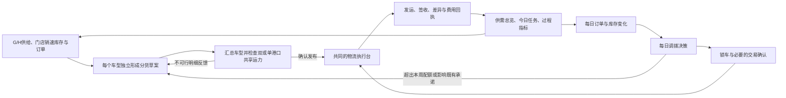

# 整车供应链 Agent 故事线：把一周的供给，兑现成每天的交付

> 版本：v1.1｜日期：2026-09-29
> 用途：产品故事、Demo 演示、后续页面与交互设计的共同依据。
> 场景：沿用项目中的沙特汽车总代理、区域 VPC、直营与授权渠道设定。人物、经营周、订单、配额、运力和演示结果均为虚构，不代表 ALJ 实际运营。
> 本版修订：采用 G/H 全国供给基准、现有79店数据、15个车型独立分货及双/单港口共享运力约束。
> 数据口径：[数据基线与逐车型分车](./04_数据基线与逐车型分车口径.md)。
> 配套文档：[Dashboard 与关键指标设计](./03_Dashboard与关键指标设计.md)。海峡受阻作为进一步的异常情景。

## 1. 新故事的主张

**供应链负责人每周决定“车应该分到哪里”，每天确认“车是否正在按计划到达”，并根据新订单持续决定“哪辆车需要从哪里调到哪里”。Agent 将这三件事连接成一套持续运转的工作。**

故事跟随一个经营周展开：周初形成分货计划，发布后进入运输执行；每天订单与库存发生变化，触发 VPC 到门店、门店之间，以及回购后的配送；执行回执更新供需与任务看板，周末再用真实结果修正下一周。

观众最终应看懂四件事：

1. 每一笔分货都有需求、库存、渠道规则与运输条件支撑。
2. 分货发布后，会形成有车辆、班次、责任人和截止时间的执行任务。
3. 每日调拨承接变化，并保护已经作出的订单承诺。
4. Dashboard 中的风险和指标可以下钻到具体业务对象，再变成下一步动作。

### 1.1 故事组织方式的选择

| 组织方式                         | 适用价值                                   | 本版采用方式                     |
| -------------------------------- | ------------------------------------------ | -------------------------------- |
| **围绕一个经营周持续推进** | 能同时表现周计划、日执行、日调拨及复盘关系 | 主线，所有页面共用同一组业务对象 |
| 围绕一次突发供应中断             | 冲突鲜明，便于讲局部重排和备选方案         | 作为可插入的异常分支             |
| 按分货、运输、调拨分别介绍功能   | 便于介绍模块，但容易失去因果关系           | 仅用于功能索引，不作为演示顺序   |

### 1.2 对已有设计的继承与调整

继承已有文档中的订单保护、按配置分车、直营与授权双轨、运输可行性反馈、库存权属、回购比较及版本追溯。

本版明确调整三个地方：

- **统一周度分货视角。** 每个车型每周独立复核。紧缺车型可以重算，稳定车型沿用已确认安排；G/H 月度供给作为规模输入。一周可以包含多批供给，一批供给也可以跨周执行。
- **将每日调拨独立呈现。** 它有自己的需求池、候选来源、决策与结果，但使用共同的库存和运输执行记录。
- **让 Dashboard 贯穿故事。** 它既是开场的风险入口，也是每日工作入口和周末的复盘依据。

## 2. 三个过程如何分工

### 2.1 业务边界

| 过程         | 核心问题                                            | 节奏与触发                           | 主要输出                                             | 完成的含义                                       |
| ------------ | --------------------------------------------------- | ------------------------------------ | ---------------------------------------------------- | ------------------------------------------------ |
| 周度分货计划 | 本周各配置的车辆给哪个区域、VPC、门店，留多少缓冲？ | 每周固定复核；重大供需变化时修订     | 分货版本、分货明细、缓冲量、未满足需求、运输需求     | 方案通过校验并发布；不表示车辆已到店             |
| 物流执行     | 哪些车辆由谁、在哪个班次、经过哪条线路送到？        | 按日、按班次执行；持续接收事件       | 运输任务、VIN 清单、发运与签收回执、异常记录、费用   | 对应运输段已签收，差异按实际登记                 |
| 每日物流调拨 | 今天的新订单和位置错配，应该用哪里的车解决？        | 每日运行；急单、取消、延期等事件触发 | 调拨方案、锁车关系、调出与调入任务；必要时关联回购单 | 目标车辆到达目标门店并核对需求；回购结算另行闭环 |

**区分依据是业务意图，不是路线名称。** 周初已批准的 VPC→门店补库，由物流执行照计划配送。今天因新订单释放 VPC 预留、改变去向或临时增加配送，则属于每日调拨。两者走同一条路线，也不能生成两张重复运单。

回购包含两件事：取得独立经销商车辆的调度权，以及安排实物移动。交易状态与运输状态分别记录。可以在条件成立后直接“经销商→目标门店”，不强制绕经 VPC。

### 2.2 一条业务闭环



### 2.3 周与日的节奏

以下为演示节奏。D1–D7 是虚构经营周的相对日，不指定沙特实际工作周的起止日期。业务时间显示沙特当地时间，并保留时间区信息。

| 时间               | 负责人和 Agent 做什么                          | 使用什么结果                 |
| ------------------ | ---------------------------------------------- | ---------------------------- |
| 上周结束至 D1 早晨 | 汇总实际到货、订单、可用库存、已确认供给与运力 | 同一截止时点的本周输入快照   |
| D1 上午           | 逐车型比较，汇总物流校验后发布本周分货         | W1-P1及各车型版本、关联运输任务 |
| 每日 08:30         | 检查今日交付、新订单、取消、可调库存与异常     | 当日调拨候选和待处理事项     |
| 每日发运截止前     | 确认 VIN、运力、收货窗口，生成执行安排         | 可执行批次与锁定资源         |
| 日内               | 新急单、运力取消、回执差异触发局部重排         | 差异方案；必要时升级周计划   |
| 每日结束           | 核对实际发运、签收、欠交和未闭环事项           | 次日任务及更新后的供需投影   |
| D7 结束            | 比较周初承诺、当前计划和实绩                   | 下一周有效缺口及规则复核建议 |

## 3. 主角与 Agent 的工作方式

主角 Omar 是供应链负责人。他不需要每天重新描述整套业务，Agent 保留已发布计划、当前执行状态和待决事项。

| 角色                     | 负责判断什么                         | 在故事中的典型追问                       |
| ------------------------ | ------------------------------------ | ---------------------------------------- |
| Omar，供应链负责人       | 履约优先级、区域与渠道平衡、重大变更 | “今天哪几件事需要我决定？”             |
| Layla，分货与销售负责人  | 订单、车型配置、门店需求和配额       | “这家店为什么少分了车？”               |
| Faisal，物流负责人       | 运力、装载、线路、交接和收货窗口     | “分出去的车，这周真能送到吗？”         |
| Hassan，区域与渠道负责人 | 调出门店影响、授权车商交易条件       | “帮这家店，会不会让另一家店缺车？”     |
| Noura，财务负责人        | 回购费用、预算、现金与结算           | “这次回购相比可行替代方案多花了什么？” |

Agent 每次响应采用同一结构：**结论 → 依据 → 候选动作及取舍 → 待确认条件 → 对计划和指标的影响**。用户可以从结论继续问数，也可以打开明细、改约束、比较版本或提交执行。

业务自动化程度由企业已有授权配置决定。演示中，Agent 自动查数、校验、生成建议和登记模拟回执；发布、变更承诺、回购和运输委托显示相应责任人的确认结果。尚未确认或尚无回执的事项保持原状态。

## 4. 故事采用的数据基线

### 4.1 全国供给按 G/H，不能按港口重复计算

供给来源为[按月总表](../../../data/01_供给/按月总表.csv)：G列对应丰田，H列对应雷克萨斯。本故事按用户指定将其作为全国月度供给规模，保留原字段的销量代理/推估来源说明。

| 参考月 | 丰田供给 | 雷克萨斯供给 | 全国月供给 | 七日等效规模 |
| --- | ---: | ---: | ---: | ---: |
| 2025-07 | 20,226 | 1,388 | 21,614 | 4,880.58 |
| 2026-01 | 18,689 | 960 | 19,649 | 4,436.87 |
| 2026-06 | 10,300 | 960 | 11,260 | 2,627.33 |
| **2026-07** | **7,941** | **960** | **8,901** | **2,009.90** |

单位均为台。七日等效规模按当月实际天数折算，不统一除以4。默认采用最近有值的7月强度，建立 **W1：丰田1,793、雷克萨斯217，合计2,010台** 的完整周供给情景；切换月份就重算，不固定使用这一规模。

8/9月 G/H 为空。本版不填造这两个月供给。W1 是虚构完整七日压力测试窗口：采用9月29日库存作为期初，保留不同历史销速窗口，并将9月28日至10月4日的整周运力表作为能力模板。它不表示这些数据原本发生在同一个真实历史周。

双港口与单港口是同一份全国供给的承接方案。基础比较保持全国供给不变，再分别核查交接与道路运输；不能在东西港口各放2,010台，也不能因为关闭一个入口就自动将全国供给减半。

### 4.2 使用现有79店网络、销速与库存

全国视图采用 `data/00_客户` 的 **34家直营、45家L2，共79家门店、46个交易身份、18个城市和5个大区**。直营共同结算身份下仍逐门店分配。演示可以只展开利雅得、吉达、达曼等节点，但底层范围保持完整。

| 品牌 | 门店实物库存 | 自由库存 | 已锁库存 | 冻结库存 | 在途 | 品牌级参考补库缺口 |
| --- | ---: | ---: | ---: | ---: | ---: | ---: |
| 丰田 | 6,011 | 4,688 | 1,091 | 232 | 924 | 1,999 |
| 雷克萨斯 | 698 | 544 | 132 | 22 | 88 | 108 |
| **合计** | **6,709** | **5,232** | **1,223** | **254** | **1,012** | **2,107** |

以上由 `data/03_库存/当前库存_门店.csv` 汇总。实物不含在途，数据也不含VPC存量。L2自由库存仍需确认调度权或交易条件。1,223台已锁库存不能代替本周订单明细；2,107台是品牌级参考水位缺口，需要按车型、配置及交期重新核算。

`data/02_销速` 的历史参考销速约为 **2,404.8424台/周**（沿用运力表未舍入汇总口径）。直营采用最近8个完整周，L2采用3个月月报折周；这不是同一当前周的实际订单需求。

### 4.3 供给先拆到每一个车型，再独立分货

当前CSV尚未包含完整的门店×车型库存和销速。本版将车型结构作为显式演示参数，完整表、比例、取整及校验见[车型数据基线](./04_数据基线与逐车型分车口径.md)。

| 品牌 | 独立分货车型及 W1 供给（台） | 品牌合计 |
| --- | --- | ---: |
| 丰田 | 凯美瑞394；雅力士轿车359；海拉克斯323；卡罗拉215；RAV4 161；兰德酷路泽300 125；兰德酷路泽250/普拉多90；Fortuner 54；汉兰达36；Urban Cruiser 18；Veloz 18 | 1,793 |
| 雷克萨斯 | ES 87；RX 54；NX 33；LX 43 | 217 |
| **合计** | **15个独立车型任务** | **2,010** |

每个车型分别有供给池、订单、库存、销速、目标覆盖、保底、分配结果和缺口。不能在一个“畅销轿车池”里把凯美瑞和雅力士混合分车。

采用另一组明确的销速结构参数后，W1参考消耗取整为2,405台，其中凯美瑞546、雅力士502、海拉克斯371、兰德酷路泽300为87。对应新增供给分别为394、359、323、125，呈现不同的车型压力。完整15车型的供给与消耗流量净差395台，逐车型正向差额476台、反向差额81台。

这些流量差还没有考虑期初车型库存和在途，不能直接叫作最终缺货或留存。周分货以补齐后的门店车型明细重新求解，而不是把流量差直接分摊给门店。

### 4.4 直接采用已有港口运力场景

| 指标 | 双港口 SC-DUAL | 仅西部 SC-WEST |
| --- | ---: | ---: |
| 板车 | 180辆 | 180辆 |
| 有效周运力 | 3,226台 | 1,865台 |
| 参考周运输需求 | 2,404.8424台 | 2,404.8424台 |
| 全网净运力缺口 | 0台 | 540台 |
| 逐路线缺口合计 | 0台 | 548台 |
| 需求加权平均距离 | 332.76km | 723.78km |
| 需求加权满载单台费 | 221.97 SAR | 439.74 SAR |

来源：`data/04_运力/场景运力汇总.csv`。参考运输需求来自历史销速，并非最终分货后的发运量；满载单台费也不是实际账单。540与548不相加，供给流量差也不与运力缺口相加。

仅西部是已有数据提供的候选场景，未来保留哪个港口仍可更换。单港口不会清空东部门店已有库存；港口入口状态、VPC存量和当地配送能力分别处理。

## 5. 主故事：逐车型分货，在单港口压力下兑现每日交付

### 第一幕：D1 08:30，全国看起来有库存，为什么还需要补车？

**画面：供需总览。** 上方显示供给参考月和全国月供给，下方展开79店的区域库存与车型工作台。默认供给为7月8,901台的强度，W1情景供给2,010台。

Omar：

> “先告诉我全国有多少供给，各区库存怎么样，再告诉我具体哪些车型需要优先处理。”

Agent 展示门店实物6,709台、在途1,012台，以及品牌级参考补库缺口2,107台。它指出自由、锁定、冻结和外部权属的不同，不把所有看得见的车当作可调车。

点击 `MOCK-D-001`，页面展示这家利雅得直营店丰田周销速68.5台、自由库存55台、在途48台、目标3周，品牌参考缺口103台。接着要求下钻到车型：这103台中多少是凯美瑞、多少是雅力士，必须由车型库存和需求决定。

**本幕产物：** 全网数据快照、区域问题清单及车型输入状态。已有品牌数据可以直接展示，尚缺的车型明细标为需要补充的演示输入。

### 第二幕：D1 09:00，凯美瑞、雅力士、海拉克斯分别做计划

Layla：

> “先打开凯美瑞的分车任务。不要拿兰德酷路泽的余量抵它的缺口。”

Agent 打开 `W1-TOYOTA-CAMRY`。本车型W1供给394台，参考消耗546台，只说明有152台流量压力。它继续读取本车型各配置的门店库存、订单锁定、及时在途、渠道保底和覆盖目标，得出真正待满足需求。

在补齐的演示明细中，先保护已锁订单，再为未配订单匹配，再分配合理补库及VPC缓冲。任何一笔给门店的数量都能解释来自哪个批次、保障什么需求、为什么先于另一家门店。

随后用户切换雅力士359台供给、海拉克斯323台供给和雷克萨斯LX 43台供给。每个车型使用自己的需求和配置，不共享车辆池。海拉克斯的车队整批要求、凯美瑞的补库覆盖、LX的资金与交期分别参与各自决策，不将某一种逻辑复制成全车型比例。

**画面：15个车型任务列表。** 每行显示本车型供给、数据完整性、待满足订单、补库、拟分配、留存、缺口和运输校验状态。尚无订单明细的行不显示编造的订单数或100%履约率。

**本幕产物：** 15份可解释的分货草案，而非一张品牌配额表。具体发布数量须在车型明细和下一幕资源校验后产生。

### 第三幕：D1 10:00，车型都分好了，共用的路能不能运完？

Faisal：

> “把所有车型放到同一张线路表里。先看双港口，再看只留西部会怎么样。”

双港口按现有城市推荐路线组织承接，单港口切到 `SC-WEST`：全国供给仍采用同一情景，各车型根据去向调整西部承接，东部新增入口停用。港口分担属于计划，不是另一份历史供给。

现有运力比较显示，180辆板车的有效周能力从3,226台下降到1,865台。Agent 下钻 **P-W-RUH 利雅得线路：参考需求501.0761台、容量352台、缺口150台**。352台由该路线所有门店、品牌和车型共同使用。

Agent 将15份车型草案按路线与时段合并，检查真实拟发数量、装载模板和接收条件。如果凯美瑞、海拉克斯和LX争用相同时段，先按订单原承诺和规则保护必要车辆，再将不可行明细反馈对应车型任务，比较改班次、保留库存、跨区来源和补库延期。

全国层面的车型任务彼此独立，共享物流资源使它们需要相互协调。单港口容量缺口不直接等于已经延期的订单数；只有匹配到具体订单和交期才能计算受影响订单。

**本幕产物：** 经运输校验的各车型计划、共享资源占用和显式未满足事项。共同发布记录为W1-P1，下面保留各车型版本与明细。

### 第四幕：D1 11:00，批准的车型计划进入物流执行台

Faisal：

> “今天哪一批车具备发运条件，哪一批还卡在车辆释放或承运确认？”

Agent 将各车型结果组织成班次。车型可以在合法模板下拼载，车辆来源和业务用途仍保持独立。每批显示车型配置、VIN或待绑定数量、发运窗口、预计到达、承运确认、收货窗口和关联分货版本。

现有路线数据是“港口/VPC→城市服务点”的合并节点模型，按这一个现成运输段计算道路能力。只有新增独立中转节点与对应能力数据后，才拆成港口→VPC→门店两段，不能用同一份运力承诺两段都能完成。

发运后减少源地现货、增加在途；签收后减少在途、增加目标门店库存。门店品牌在途1,012台的既有记录需要识别是否已包含在拟发批次中，不能作为新供给再发一次。

**本幕产物：** 按车型可追溯、按班次可执行的运输任务，以及今日发运、收货和阻塞事项。

### 第五幕：D2 08:30，今天的订单按车型找车

Omar：

> “周计划继续走。今天新增的凯美瑞、RAV4和LX订单，分别从哪里补？”

下面三条是追加的日内演示事件，不是从品牌汇总中推断出的真实订单。演示前需补入同配置车辆、交期和来源确认记录。

| 任务 | 车型与数量 | 候选来源 | 与供给基线的关系 |
| --- | --- | --- | --- |
| T01，VPC→门店 | 凯美瑞12台 | W1凯美瑞394台中，在VPC可释放的未占用缓冲 | 是394的子集，确认后改变用途，不另增全国供给 |
| T02，门店→门店 | RAV4 5台 | 同区直营店取消订单后可释放的同配置存量 | 来自期初存量，源店实物减少5、目标店增加5 |
| T03，回购后配送 | 雷克萨斯LX 3台 | 具备雷克萨斯业务资格的L2同配置现货 | 原属外部权属，不增加全国实物量；交易后增加可控量 |

Agent 先检查三组订单是否已在预测中、是否已有在途或分配覆盖，再计算需新增调度的数量。T01需要解释原预留释放后是否损害其他承诺；T02和T03不能把门店的丰田/雷克萨斯品牌自由库存直接视作指定车型。

**本幕产物：** 三张逐车型调拨候选卡，包含来源、目标、原要求到店时间、费用、源地影响和缺少的确认。

### 第六幕：D2 09:00，先看调出店，再比较回购

Hassan：

> “RAV4调走以后，源店的RAV4够不够？不要给我源店所有丰田车的库存总数。”

Agent 展示T02的同车型、同配置双端库存：源店有效订单、可自由量、最低覆盖、预计消耗与及时在途。取消记录生效、调出后水位及运输条件通过后，再锁定5台。不能因为源店另有兰德酷路泽库存就认定RAV4可以调出。

Noura 接着问：

> “LX回购三台，和等待本周43台供给中的车辆相比，为什么值得？”

Agent 逐一比较现有LX供给的配置、释放时间与到店时间，自有库存调拨、车商直接转售、总代理回购以及协商延期。仅当及时内部来源不成立，且回购权属、报价、资金和运输条件确认后，T03才成为可执行方案。

报价按真实运输组织方式比较。现有439.74 SAR是全网满载参考，不能直接乘3当作LX三台专车的实际运费。店间及回购路线不在现成的港口→城市线路中，需要补充。

**本幕产物：** 经确认的调拨单和必要的回购单；运输任务进入同一个执行台，业务单与运输段不重复计数。

### 第七幕：D4，单港口线路变化，只修订受影响车型明细

Faisal：

> “西部到利雅得一个班次取消了，先列出受影响车型和订单。”

Agent 追到具体车辆与车型任务，区分已发运、已冻结和可调整部分。比较换班次、其他合法线路、释放当地库存和延期补库，标明每个方案挤占的共同资源。

纯班次变化保留分货去向与原发布基线，更新运输版本。如果改变门店配额、车型留存或订单来源，修订受影响车型的分货版本；其他车型已完成的安排保留。

演示不预设“取消一班等于全国少交多少订单”。受影响台数来自该班次已绑定的车辆，履约影响来自其原承诺日期。

**本幕产物：** 车型和线路共同可读的变更差异、补库延期与订单风险，以及下一责任人。

### 第八幕：D7，按车型复盘，再汇总全国结果

Omar：

> “每个车型分了多少、到了多少、还缺什么？把单港口造成的影响单独说明。”

复盘首先展开15个车型，分别比较供给释放、原计划、当前计划、实际到店、未执行分配、留存及缺口，再汇总丰田、雷克萨斯与全国。各车型的缺口与余量并列，不净掉以后报成“供需平衡”。

| 复盘问题 | 统计依据 | 不能怎样展示 |
| --- | --- | --- |
| 哪个车型供给不足？ | G/H衍生车型批次与确认释放、逐车型库存投影 | 把476台流量压力称为实际欠交 |
| 哪个车型受运输限制？ | 分货明细关联的路线、时段及可执行数量 | 把540/548台道路压力当作已逾期订单 |
| 日调拨做成多少？ | T01–T03的来源、锁定、发运与到店回执 | 将T01的12台同时记入新增供给和原394台之外 |
| 订单有没有兑现？ | 订单原承诺与逐车签收 | 用1,223台已锁库存作到期订单分母 |
| 下周还要做什么？ | 仍有效的需求、未到在途、待交易与待结算 | 将全部品牌参考缺口与周消耗直接叠加 |

演示如注入三张调拨单全部按期签收，可显示“本组调拨20/20台按期到店”，明确为模拟回执。全国订单总数、履约率及各车型完整分配结果由补充订单和执行数据生成，不再预填全网100%完成的结局。

**故事收束：** 同一份全国供给，被拆成可解释的车型决策，再转成共享道路上的执行。每日调拨持续修补局部错配，复盘保留无法满足的车型和门店需求。

## 6. 三个过程各自需要哪些决策因素

### 6.1 周度分货：先确保可行，再比较经营取舍

| 层次       | 要考虑的因素                                                 | 设计要求                                       |
| ---------- | ------------------------------------------------------------ | ---------------------------------------------- |
| 供给事实   | 车型配置、批次、可用日期、地点、权属、状态、已有锁定         | 可见车辆与可分车辆分开；保留库存来源           |
| 硬性边界   | 有效订单、配置限制、有效保底、禁运禁售、信用额度、容量与时段 | 冲突时列出不可行原因及待决事项，不静默忽略规则 |
| 需求水平   | 订单与预测核销、销售速度、自由库存、及时在途、覆盖目标       | 补库与订单不重复；不同车型使用不同目标         |
| 渠道与区域 | 直营网点、授权车商、区域缺口、调出后服务水位                 | 保底与普通需求重合部分只计算一次               |
| 经营取舍   | 交付、覆盖、库龄、贡献、运输费用、资金占用、计划稳定性       | 费用和贡献缺少依据时保留不可比状态             |
| 发布条件   | VIN 或数量占用、运输及收货可行性、责任人、规则版本           | 数量计划可先不绑定 VIN；发运前必须绑定并重检   |

优先级采用“可用与合法可达 → 保护有效承诺 → 满足有效硬性保底 → 优化剩余资源”。若承诺与保底在供给下不能同时成立，提交显式例外，不靠一个加权分数把冲突掩盖掉。

#### 6.1.1 每个车型独立求解，共享资源统一协调

对于车型m，分别计算订单优先分配、净补库、渠道保底与留存。每个车型都满足自己的来源与去向守恒；全国结果只是这些独立结果的汇总。

```text
车型m可用量 = 车型m有效锁定 + 车型m待分配量
车型m待分配量 = 新增订单分配 + 补库分配 + VPC缓冲 + 未决去向
同路线同时段所有车型的资源占用之和 ≤ 该路线时段已确认容量
```

每个门店的车型需求由订单预测核销、日消耗、期初库存、及时在途和目标库存形成。源表品牌参考缺口不能直接按车型供给比例切分；车型库存、需求结构分别确认，并保留品牌汇总校验。

历史销量数据中丰田直营70%、雷克萨斯直营90%是模拟数据生成参数，不是所有车型的新配额硬约束。直营与L2的有效保底、交期、库存权属、信用与具体车型需求分别判断。

### 6.2 物流执行：每一段都要有可执行条件

运输任务至少回答：运什么、从哪里到哪里、何时可发、最晚何时到、谁承运、如何装载、谁收货，以及哪个业务需求发起了这次运输。

周分货运输和每日调拨运输共用运力。为急单新增班次时，必须检查是否挤占已有任务；未取得承运确认的候选容量不能当作已落实容量。

发运、到货、短少、拒收、车损和账单分别记录。部分签收按 VIN 更新，不用整单完成状态掩盖未到车辆。二段运输中，完成第一段只说明车到了 VPC。

### 6.3 每日调拨：同时保护需求端与来源端

每日候选来源按“目标店现货与既有入库安排 → 可释放 VPC 库存 → 可调门店库存 → 可交易的外部库存”逐层检查；这是搜索顺序，不是固定的成本最优排序。候选集合形成后统一比较及时性、源地影响和总费用。

同一 VIN 在周计划、调拨和运输中的有效锁定共用一套记录。调拨确认前重检订单、锁定和库存版本；发生冲突则撤回过期建议并重新计算。

独立授权车商之间的移动、从其库存调入直营店，均先明确调度授权或交易关系。存在现货不代表总部可以直接调走。回购机会也可以用于补库，但主故事只选择与明确急单绑定的小规模回购。

## 7. 计划、任务与回执怎样连起来

### 7.1 核心对象及关系

| 对象             | 在故事中的用途                           | 关键关联                              |
| ---------------- | ---------------------------------------- | ------------------------------------- |
| 周分货版本与明细 | 保存每笔数量、去向、用途、需求和规则依据 | 快照、规则版本、订单、供给批次        |
| 车辆与占用       | 表达同一辆车的位置、权属、状态及有效占用 | VIN、订单、分货明细、调拨单           |
| 调拨单           | 记录业务意图与双端影响                   | 新需求、来源与目标、源计划、回购单    |
| 回购单           | 记录车辆交易及资金条件                   | 车商、VIN、报价、权属交接、支付与结算 |
| 运输任务与运输段 | 承载实物运输和承运资源                   | 发起业务、车辆清单、班次、前后段      |
| 执行回执         | 证明实际发生的发运、签收或差异           | 运输段、VIN、实际时间、事件来源       |
| 待办与异常       | 说明谁应在何时解决什么                   | 业务对象、原因、截止时间、处理结果    |

以上是本次产品设计对象，不表示项目已具备对应接口或数据表。

### 7.2 状态与变更

| 对象     | 主要状态                                                | 关键规则                                         |
| -------- | ------------------------------------------------------- | ------------------------------------------------ |
| 分货版本 | 草案 → 已校验 → 待确认 → 已发布 → 已结转/被替代     | 草案不占用正式资源；保留原始发布基线             |
| 调拨单   | 候选 → 待条件确认 → 已确认 → 执行中 → 到店完成      | 取消、拒绝、部分完成和失败单列；绑定来源与目标   |
| 运输段   | 待排程 → 待承运确认 → 待发运 → 在途 → 部分/全部签收 | 已发运事实不可抹除；异常作为并行标记             |
| 回购单   | 报价 → 待交易确认 → 可执行 → 权属已交接 → 已结算    | 是否可执行由协议条件决定；到店完成不等于结算完成 |

任务与车辆数分开统计。一张回购单可能关联一张调拨单和若干运输段；待办只统计需要某人处理的事项，运输工作量只统计去重运输段，订单履约只统计去重需求车辆。

确认发布前检查数据和资源是否仍有效。新版本只替换受影响、可变更的部分。已发运车辆的改道必须另建变更记录，不能回写成“从未发运”。

## 8. Dashboard 在故事里的角色

本版设置五个页面，导航为“供需总览 / 今日任务 / 分货计划 / 物流执行 / 每日调拨”。每个过程页上方展示本过程指标，下方展示可操作明细。完整指标口径见配套文档。

| 页面     | 用户要回答的问题                               | 从看板进入的动作                       |
| -------- | ---------------------------------------------- | -------------------------------------- |
| 供需总览 | 供给在哪、何时可用；各区域库存和需求是否匹配？ | 下钻区域和配置，生成分货或调拨候选     |
| 今日任务 | 今天必须完成什么；谁负责；卡在哪里？           | 处理待确认、发运、收货、异常和回购条件 |
| 分货计划 | 分得是否合理、可行；哪些需求仍未满足？         | 比较方案、解释分配、发布或修订         |
| 物流执行 | 是否按时发出和到达；哪里影响了订单？           | 重排班次、协调收货、处置异常           |
| 每日调拨 | 今天缺的车从哪里找；调出方是否安全？           | 比较来源、确认调拨、跟踪回购与到店     |

共同交互链为：**风险或指标 → 明细与证据 → 建议动作 → 方案差异 → 执行状态 → 指标回写**。自由问答始终带着当前品牌、车型、配置、区域、时间窗口、港口场景和版本。供给月度基准、车型情景值、源表参考值与执行回执分别标注。

## 9. 单港口是主线约束，海峡中断作为进一步分支

主线已经采用现有双港口/仅西部场景比较，目的是解释：相同全国供给和相同180辆板车，入口集中后，线路变长、周转变慢，各车型的分货可行性随之改变。

若进一步加入海峡中断，改变的应是具体批次的数量、交接点、释放时间或运输条件。Agent先找受影响车型和订单，再比较上游确认的交接方案、当地调拨与回购。未受影响的东部库存和已经发生的签收继续有效。

30/90/180天情景保留为扩展。不能把“单港口道路能力下降”和“上游供应下降”混成同一个参数；如同时发生，分别记录并通过同一车型库存投影计算影响。

## 10. 建议的15分钟Demo

| 时间 | 页面与场景 | 讲述重点 |
| --- | --- | --- |
| 0–2分钟 | 供需总览 | G/H月供给8,901，W1情景2,010；79店库存与在途 |
| 2–5分钟 | 车型分货工作台 | 逐一展开凯美瑞、雅力士、海拉克斯和LX，说明15个独立车型任务 |
| 5–8分钟 | 共享物流与港口切换 | 同样180辆板车，能力3,226→1,865；下钻利雅得共享线路 |
| 8–11分钟 | 今日任务与每日调拨 | 凯美瑞VPC配送、RAV4店间调拨、LX回购配送 |
| 11–13分钟 | 物流异常 | 班次影响追到车型和订单，局部修订而非重写全网 |
| 13–15分钟 | 车型复盘与全国汇总 | 供给、库存、运力、调拨和实绩分别核对，保留未满足事项 |

收尾的下一周工作：核实最新月/周供给、复核逐车型需求、跟踪未到车辆、补齐未确认运力与回购结算。

## 11. 项目材料与数据的具体使用

### 11.1 业务设计依据

- [原业务过程与决策网络](../02_codex设计/01_整车销售供应链业务过程与决策网络.md)：继承订单保护、逐配置匹配、配送与异常反馈。
- [直营与授权双轨](../03_ds设计/02_直营_授权双轨分车逻辑与图谱中间产物.md)：继承渠道权属、保底与规则解释；当前演示网络使用现有34直营+45L2。
- [本体节点依赖](../../01_销售分货/03_本体节点依赖说明.md)：将B1需求、B2覆盖、B3库存、B4供给、B5保底、B8分配、B9留存、B10结果落到每个车型任务。
- [早期故事设想](../story.md)：承接物流方案、回购及长期情景等问题，供给与数量采用本版数据基线。

### 11.2 数据使用清单

| 来源 | 本版直接使用 | 仍需补充 |
| --- | --- | --- |
| [模拟数据说明](../../../data/模拟数据说明.md) | 网络范围、生成规则、时间窗和单港口假设 | 目标演示周的明确参数版本 |
| [交易身份主数据](../../../data/00_客户/交易身份主数据.csv)、[门店主数据](../../../data/00_客户/门店主数据.csv) | 46主体、79门店、地区、品牌资格与库容 | 车型/配置经营资格如有差异需补充 |
| [按月总表](../../../data/01_供给/按月总表.csv) | G/H全国供给基准及有效月份 | 周/日释放、港口交接、车型配置批次 |
| [主流车型备注](../../../data/01_供给/主流车型备注.csv) | 15车型字典参考 | 采用本文显式结构参数，后续替换确认数据 |
| [门店销速](../../../data/02_销速/销速汇总_门店.csv)、[月度校验](../../../data/02_销速/供给口径与月度校验.csv) | 历史消耗、直营/L2窗口、G/H分摊校验 | 每店车型结构、订单预测核销 |
| [门店库存](../../../data/03_库存/当前库存_门店.csv) | 品牌库存状态、在途、库龄及参考缺口 | 车型/配置/VIN、到货时间、调度权、VPC存量 |
| [门店路线映射](../../../data/04_运力/门店路线映射.csv)、[路线主数据](../../../data/04_运力/路线主数据.csv) | 城市路线、时长、周期、整趟费用 | 店间/回购路线与具体班次、收货窗口 |
| [场景路线运力](../../../data/04_运力/场景路线运力.csv)、[运力汇总](../../../data/04_运力/场景运力汇总.csv) | 双港口与仅西部的共同资源约束 | 车型装载模板、实时确认与执行回执 |

详细数值、车型参数、来源映射和计算边界统一保存在[数据基线与逐车型分车口径](./04_数据基线与逐车型分车口径.md)。不重复生成另一套客户、品牌库存或运力基线，也不修改源CSV。

本次已形成逐车型供给和消耗情景，但现有数据不能直接证明79店×15车型的完整分货结果。车型库存、具体订单和释放批次应作为后续Demo数据扩展；在补齐前，页面显示草案与所缺依据，不能将设计中的流程描述成已经求解成功。

## 12. 故事验收标准

- G/H分别控制两个品牌全国月供给，车型月合计能够对回源表。
- W1的15车型供给合计2,010，切换参考月份重新计算规模。
- 79店和46主体贯穿故事，不把门店明细与账户汇总相加。
- 逐车型建立供给池、规则、需求、分配、留存和缺口，车型之间不互抵。
- 库存现货、在途、已锁、冻结和L2权属分别处理；VPC库存不从门店总数推造。
- 按路线时段汇总所有车型的运输需求，不能为每个车型或门店复制同一容量。
- 单港口影响入口、周转和线路条件，全国供给变化作为另一个明确情景参数。
- 三类日调拨均追到具体车型、来源、交期和双端影响；T01的12台保留在凯美瑞394台的原队列内。
- 保留原计划、当前计划与回执，受影响任务局部修订；无订单和回执数据不预填全网履约结果。
- G/H源值、数据集模拟值、新增车型参数和模拟执行回执分别标识。
