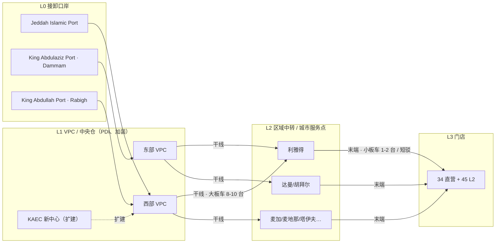

# 港口到门店：整车分拨的运输方式、节点结构与空驶成本

> 版本：v1.0｜日期：2026-09-30
> 用途：为「物流执行」模块与 `data/04_运力` 的口径修正提供外部依据。
> 关联：[周度分货_物流执行_每日调拨_Agent故事线](../04_故事线/02_周度分货_物流执行_每日调拨_Agent故事线.md)、[模拟数据说明](../../../data/模拟数据说明.md)、`data/04_运力/*`
> 标记约定：**✅ 公开来源可核实**｜**⚠️ 行业通行做法，未取得 ALJ 内部资料证实**｜**🧪 本文推算**

---

## 0. 先直接回答三个问题

### Q1：ALJ 的车一般怎么从港口运到门店？

不是"一种方式"，而是**六段链路**，只有中间两段是"运输"，而且大部分车不是从港口直发门店：

`远洋滚装 RoRo → 口岸接卸+清关 → 口岸堆场/VPC（PDI、加装）→ 干线板车到区域中转/城市 → 末端配送到门店 → 例外件直发`

真正的"主力载具"只有一个：**敞篷多层汽车运输车（open car carrier，沙特口语常叫 سطحة / ناقلة سيارات），一趟装 8–10 台**。✅ 这与项目现有数据里"每车次装载量 8 台"完全一致。

### Q2：不可能都在吉达港吧？是空载跑到吉达港吗？

要把**商品车**和**板车**分开看，这是两件事：

| 主体 | 会不会"空载跑到港口" | 结论 |
| --- | --- | --- |
| **商品车** | 不会，也不需要 | 沙特是纯进口市场，没有内陆主机厂。车**只能从口岸进来**，所以"车源起点 = 口岸/VPC"这个假设本身是成立的。✅ 你的直觉需要修正的地方不是"起点在港口"，而是**"只有吉达一个港口"**。 |
| **板车** | 正常业务里不会 | 承运商的板车**驻场在口岸/VPC 周边的车场**，或者由当地承运商承担。真正空驶的不是"进港"，而是**回程**：Jeddah→Riyadh 拉一趟 950 km 重驶，回程 950 km 空返。⚠️ |

所以「空载跑到吉达港」在两种情况下才会真实发生：
1. 板车的**基地在目的城市**（比如车队公司注册在利雅得），接到吉达的货要空驶 950 km 进港；
2. 出现了**门店间调拨 / 回购配送**这类"货在门店、要去别处"的任务，路线方向反过来。

这两种情况现在模型里**都没有字段去承接**。

### Q3：那这个成本怎么算？

行业通行做法就是：**把回程空驶直接摊进整趟报价**。✅ 项目现有 `路线类型.csv` 里写的"整趟报价含回程摊销"方向是对的，**不需要推翻**。

问题在另外四点：

1. **空驶没有被显式记录** → 看不见、量不出、优化不了。全网大约一半的板车公里是空驶（见 §4.3），但现有表里没有任何字段体现。
2. **车队被建模成"绑在路线上的管道"**，而不是"有位置的资产" → 直接丢掉了回程配载、三角调度这类最大的降本杠杆。
3. **缺"进港空驶"字段** → 一旦调度方向反过来（车在目的城市、货在港口），模型会静默漏算几百公里。
4. **缺门店间/回购线路的价格** → 故事线里的 T02（店间调拨 RAV4 5 台）和 T03（LX 回购配送 3 台）**无价可依**。这一点故事线自己也已经指出："店间及回购路线不在现成的港口→城市线路中，需要补充。"

---

## 1. 真实链路：从滚装船到展厅的六段

✅ = 公开来源支持；⚠️ = 行业通行但无 ALJ 内部资料

| 段 | 发生地 | 谁执行 | 载具 | 关键约束 | 项目现有数据是否覆盖 |
| --- | --- | --- | --- | --- | --- |
| **S1 远洋** | 日本/韩国/欧洲/中国 → 红海或波斯湾 | 船公司（PCC/PCTC，单船 2,000–8,000+ 台） | 滚装船 | 船期、海峡风险（霍尔木兹/曼德海峡）✅ | ❌ 只有 G/H 月度供给，无船次 |
| **S2 接卸+清关** | Jeddah Islamic Port / King Abdulaziz Port(Dammam) / King Abdullah Port(Rabigh) / Jubail | 港务局 Mawani + 报关行 | 港内驾驶、堆场 | **沙特港口仅 3 天免堆**，超出后阶梯涨价；达曼 2025-08 曾因车辆堆积被 Mawani 紧急干预 ✅ | ❌ 无港杂、无滞港 |
| **S3 口岸堆场 → VPC/中央仓** | 口岸旁 | 主机厂/总代理（ALJ 自称每天收发约 1,200 台、存储 69,000 台）✅ | 短驳板车 | PDI、加装、软件刷新、PDI 面积 | 🟡 现有模型把 L0+L1 合并成一个"港口/VPC（模拟）"，这一步简化是合理的 |
| **S4 干线** | VPC → 区域中转/城市 | ALJ 自有道路车队 + 3PL（Almajdouie、Bahri-TASARU-MOSOLF 等）⚠️ | **敞篷多层板车 8–10 台** | 装载率、回程空驶、司机短缺 | ✅ `路线主数据.csv` 覆盖；但终点是"城市服务点"，不是门店 |
| **S5 末端** | 城市中转 → 门店 | 当地承运商 / 小板车 / 短驳 | 平板车 1–2 台、液压板、代驾 | **大板车进不了市区门店**（路宽、装卸场地、库容）⚠️ | ❌ 完全没有 |
| **S6 例外** | 门店↔门店、回购、直发 | 同上 | 视批量 | 权属、交易条件 | ❌ 只有 `门店路线映射` 里"同城门店共用"一句话 |

**S5 这一段要特别注意。** 现有 `路线主数据.csv` 的公里数口径写的是"港口/VPC至**目的城市服务点**估算；**不含门店精确导航**"，`门店路线映射.csv` 的末端收货口径是"同城门店共用城市路线运力"。也就是说：**现有运力数据实际上描述的是 L1→L2（VPC→城市），却被当成 L1→L3（VPC→门店）在用。** 这不算错，但必须在文档和页面上说清楚，否则"门店级送达率"会被高估。

---

## 2. 运输方式盘点：沙特现实中有什么

| 方式 | 单趟装载 | 单台成本 | 沙特现实性 | 用在哪 |
| --- | --- | --- | --- | --- |
| **敞篷多层汽车运输车**（open car carrier） | **8–10 台**✅ | 最低 | **主力**，港口/堆场/门店之间大批量移动的决定性方式 ✅ | S4 干线、S3 短驳 |
| **平板 / 液压板**（سطحة عادية / هيدروليك） | 1–2 台 | 高 | 普遍，城市间零散运输的主力市场 ✅ | S5 末端、急单、单台 |
| **封闭板车 / 液压封闭**（سطحة مغلقة） | 1 台 | 最高 | 存在，豪华车专用 ✅ | 雷克萨斯 LX/高值车 |
| **铁路** | — | — | **基本不成立**。GCC 报告把"铁路运力不足"列为长期制约因素，整车海铁联运在沙特"仍处于萌芽阶段"✅；SAR 的 `carcargo` 是**旅客随车托运**（北线），不是经销商批量分拨 ✅ | — |
| **代驾/自走（drive-away）** | 1 台 | 变动大 | 在北美用于展车/调车（Auto Driveaway 一类）✅；**没有证据表明沙特批量新车走这种方式**，且涉及临时牌、里程与磨损入账问题 ⚠️ | 不建议建模 |
| 水运/内河 | — | — | 内陆无通航条件 | — |

**结论：** 板车是唯一需要建模的方式，但要区分**大板车（8–10 台，干线）**和**小板车（1–2 台，末端）**两档装载模板——现在模型只有一档 8 台。

---

## 3. 节点：不是"吉达港"一个点

### 3.1 口岸至少四个，还有区域备用

- **Jeddah Islamic Port**（红海，西部门户）✅
- **King Abdulaziz Port, Dammam**（波斯湾，东部门户）✅ —— 也是沙特主要汽车进口口岸，2025-07 车辆吞吐 69,969 台（同比 -22.66%）✅
- **King Abdullah Port, Rabigh**（吉达以北，有专门的 RoRo 码头）✅
- **Jubail Port**（东部，也在接车）✅
- 区域备用：**Sohar（阿曼）、Khor Fakkan（UAE）** 可作为绕行口岸，再陆运入境 ✅

外部资料还提到一个与项目直接相关的点：**发往利雅得的车通常走达曼清关**（"Riyadh-bound vehicles typically clear through Dammam"）⚠️（来源是国际汽车托运代理商，置信度中等）。如果成立，那"仅西部吉达单港口"就不只是运力问题，还会与真实清关路径冲突——值得在故事里标注为假设而非现实。

### 3.2 ALJ 自己的基础设施（公开可核实）

> "Our central warehousing and port processing facilities in Saudi Arabia can receive and dispatch around **1,200 vehicles per day** with stocking capacity for **69,000 vehicles**. We'll double this capacity when our new processing and logistics center at **King Abdullah Economic City (KAEC)** north of Jeddah opens."
> "**1 million km per month** traveled by our road freight delivery fleet in Saudi Arabia."
> — [Abdul Latif Jameel, Logistics and Freight Solutions](https://alj.com/en/transportation/logistics) ✅

这段是本次调研里**最硬的证据**，它同时说明三件事：

1. ALJ 有**中央仓 + 港口处理**两类设施（不是只有口岸堆场）；
2. **KAEC 新中心会让能力翻倍**——即"节点网络正在扩张"，正是 hub-and-spoke 的方向；
3. ALJ **自己跑道路运输**（1M km/月），说明自有车队 + 3PL 混合，运力不是纯外采。

行业侧也一致：GCC 整车物流正在强化 **hub-and-spoke**（口岸节点 → 内陆分拨），并伴随 SAL 物流区（约 40 亿里亚尔、紧邻 Jeddah Islamic Port，"2 小时卡车可达内陆分销商"）等基建 ✅。

### 3.3 建议的目标节点层级



**现有模型的节点 = L0+L1 合并（`P-W` / `P-E`）。** 缺 L2，所以干线和末端没有分开，也就没有"城市内拼载"和"末端换装"的空间。

---

## 4. 空驶：成本到底藏在哪里

### 4.1 三种空驶，性质完全不同

| 类型 | 触发条件 | 谁承担 | 现有模型 |
| --- | --- | --- | --- |
| **A 进港空驶** | 板车基地在目的城市，需空驶到口岸装货 | 承运商，通常已含在报价 | ❌ 无字段 |
| **B 回程空驶** | 干线送达后返回起点，无回程货 | 承运商，已摊入"整趟报价" | 🟡 隐含，不显式 |
| **C 调拨空驶** | 店间调拨、回购配送，方向与干线相反 | 单独结算 | ❌ 无线路、无价 |

### 4.2 行业怎么处理（可核实的通行做法）

- **回程空驶摊进报价**：中国汽车托运行业的公开说明很直白——"对板车来说，这是一趟'单程票'。司机把你送过去后，很可能需要空驶几百公里回到主干道才能接到下一单。**这部分返程空驶的成本，最终都会体现在给你的报价里**。"✅
- **回程配载（backhaul）**：用返程空车厢装别的货（二手车、事故车、回购车、跨品牌调拨、其他货主货源），把空驶变成收入或减项。这是行业标准降本手段。✅
- **驻场车队**：承运商在口岸/VPC 设点，板车停在附近车场，消除 A 类空驶。⚠️
- **三角/循环路线**：`Jeddah → Riyadh → Dammam → Jeddah`，用 Dammam（东部口岸）的回程货把第二段填满。⚠️

**所以对项目最重要的一句话是：** 现有"整趟报价含回程摊销"没有错，但它把**回程空驶锁死成了成本**。一旦在模型里允许回程配载或跨路线再平衡，那 221.97 / 439.74 SAR 的单台运费就是一个**可以被优化的上限**，而不是一个常量。

### 4.3 用项目自己的数据算一遍 🧪

数据来源：`data/04_运力/场景运力汇总.csv`、`路线主数据.csv`。

| 指标 | 双港口 SC-DUAL | 仅西部 SC-WEST |
| --- | ---: | ---: |
| 参考周运输需求（台） | 2,404.84 | 2,404.84 |
| 每车次装载量（台） | 8 | 8 |
| **推算车次/周** = 需求 ÷ 8 | 300.6 | 300.6 |
| 需求加权平均单程（km） | 332.76 | 723.78 |
| **重驶里程/周** = 车次 × 单程 | **100,030 km** | **217,600 km** |
| **空驶里程/周**（假设回程全空） | **100,030 km** | **217,600 km** |
| **板车总里程/周** | **200,060 km** | **435,200 km** |
| **空驶率** | **50%** | **50%** |
| 年化总里程 | ≈ 10.4 M km | ≈ 22.6 M km |
| 年化 ÷ 12 | ≈ **0.87 M km/月** | ≈ **1.89 M km/月** |
| 需求加权满载单台运费 | 221.97 SAR | 439.74 SAR |

**读出来的三件事：**

1. **空驶率约 50%** —— 在"回程全空"的极端假设下，一半的板车公里是白跑的。这是全网最大的单一成本项，但现有表里一个字段都没有。
2. **仅西部单港口把总里程推到 2.18 倍**（435,200 / 200,060），与单台运费 1.98 倍（439.74 / 221.97）基本吻合。说明现有费用模型在**内部一致性上是对的**，问题只是"没把空驶拆出来"。
3. **与 ALJ 公开数据的量级互验**：ALJ 自述自有道路车队 **1 M km/月** ✅。本模型 SC-DUAL 推算 0.87 M km/月，**属于同一量级**。但也必须说明三点差异：ALJ 的数字是 2016 年前后口径、覆盖整个道路货运体系（含零配件配送）；本模型的周需求来自历史销速折周，约为 G/H 年化水平的**一半**；因此这个比对只能作**数量级参考**，不能当校验通过。

### 4.4 单台运费的现实锚点 🧪

`P-W-RUH`（VPC→利雅得，950 km）：整趟 3,980 SAR ÷ 8 台 = **497.5 SAR/台**。

- 市场上**单台零售**（1–2 台，普通/液压板车）Jeddah→Riyadh 报价约 **900–1,900 SAR** ✅（普通板车 900–1,400，液压 1,900）。
- 所以 497.5 SAR 大约是零售价的 **1/4 ~ 1/2**——对"8 台批量、往返摊销"来说**落在合理区间**。

反过来说：如果有人拿 `439.74 SAR` 或 `497.5 SAR` 去乘一个 3 台的急单，会严重低估。故事线里已经点出这个陷阱（"不能直接乘 3 当作 LX 三台专车的实际运费"），本次调研给了一个可用的对照数：**3 台 LX 走独立板车，应按单台零售价 1,000–1,900 SAR/台 量级估算，而不是 1,300 SAR 打包价。**

### 4.5 "含回程摊销"其实并不透明 —— 一个口径提醒 🧪

对 `P-W-RUH` 反推：

```
整趟费用 = 基础费 750 + 单程 950 km × 3.4 SAR/km = 750 + 3,230 = 3,980 SAR   ✅ 与表中一致
若按往返 1,900 km 计，隐含综合费率 = 3,980 ÷ 1,900 = 2.09 SAR/km
```

也就是说，报价公式实际是"**单程里程 × 距离费率 + 基础费**"，而"基础费"里塞了回程与固定成本。**"回程摊销"的具体金额在数据里不可见。** 后果是：

- 想做回程配载模拟时，**不知道该把多少成本从运费里减掉**；
- 想解释"540 台缺口要花多少钱"时，**只能拿到单台满载价，拿不到边际空驶价**。

**建议：把 `基础整趟费用` 拆成两个显式参数 —— `固定费(SAR/趟)` 和 `空驶单价(SAR/km)`。** 这是全文最重要的一条数据改造建议。

---

## 5. 与现有运力数据的逐项对账

| 现有字段 / 假设 | 与现实对照 | 结论 | 建议 |
| --- | --- | --- | --- |
| 始发节点 `P-W`/`P-E` | 现实是 L0+L1 合并；真实还有 Rabigh / Jubail | 🟡 合理简化 | 保留，但**在文档里标明它代表"口岸+VPC"**，并预留第三节点 |
| 每车次装载量 = 8 台 | 敞篷板车 **8–10 台**✅ | ✅ 成立 | 增加**末端 1–2 台小板车**第二档模板 |
| 终点 = "城市服务点" | 现实确实是城市中转，再末端配送 | ✅ 口径正确 | **明确区分 L2 与 L3**，别把城市当门店 |
| "整趟报价含回程摊销" | 行业通行✅ | ✅ 方向对 | 拆出 `固定费` 与 `空驶单价` |
| 满载摊销 = 整趟 ÷ 8 | 现实有不满载发车 | 🟡 已声明 | 已注明"不足 8 台仍按整趟计价"，建议再加 `实际装载率` 字段 |
| 每辆车整周只属于一条路线 | 现实是驻场 + 回程配载 + 三角调度 | ❌ 关键缺口 | 给车加**"当前所在节点"**，允许跨路线再平衡 |
| 无空驶字段 | 空驶率约 50% 🧪 | ❌ 关键缺口 | 增加 `重驶里程`/`空驶里程`/`空驶率`/`回程配载率` |
| 无末端段 | 大板车进不了市区门店 ⚠️ | ❌ 缺口 | 增加 L2→L3 短驳线路与运力 |
| 无店间/回购线路 | T02/T03 无价可依 | ❌ 缺口（故事线已自认） | 补一个店间/回购的计价器 |
| 无港杂/滞港/PDI | 沙特仅 3 天免堆，超期阶梯涨价✅ | ❌ 缺口 | 单独一层非运费成本 |

---

## 6. 改造建议（按优先级）

### P0 — 不改结构，只加字段

1. **`路线类型.csv`**：`基础整趟费用` 拆为 `固定费(SAR每趟)` + `空驶单价(SAR每公里)`；保留现有"整趟报价"作为对外结算口径。
2. **`场景路线运力.csv`**：新增 `重驶里程(km)`、`空驶里程(km)`、`空驶率`、`回程配载率`（0 = 全空返）。
3. **`路线主数据.csv`**：新增 `起节点层级`（L1）、`终节点层级`（L2），把"城市服务点 ≠ 门店"写进字段而不是写进口径说明。

### P1 — 补全网络

4. **新增 L2→L3 末端短驳**：装载 1–2 台，按台计价，覆盖"大板车到城市服务点 → 门店"这一段。
5. **新增店间/回购线路**：至少给出 `城市↔城市` 的双向价（调拨、回购两个方向），支持 T02/T03 定价。
6. **板车加"位置"属性**：`车队` 表增加 `当前所在节点`、`基地节点`，并允许周内跨路线再平衡。

### P2 — 让空驶可优化，能讲故事

7. **回程配载场景**：设 `backhaul_rate` 参数（如 0% / 20% / 40%），展示同一份供给下运费如何下降——这是"仅西部单港口"之外**第二个有冲突感的情景**。
8. **港杂与滞港成本层**：3 天免堆 + 阶梯费率，可支撑"清关慢了，运费之外又多花了多少"的小高潮。
9. **口岸组合情景扩展**：现有 SC-DUAL / SC-WEST 之外，可加 `SC-TRI`（吉达 + 达曼 + Rabigh），与"KAEC 新中心投产后能力翻倍"呼应。

### 建议的字段落地（示意）

```text
# 路线类型.csv 追加
固定费(SAR每趟), 空驶单价(SAR每公里), 末端装载上限(台), 末端计价口径

# 场景路线运力.csv 追加
重驶里程(km), 空驶里程(km), 空驶率, 回程配载率, 平均实际装载率

# 新增 04_运力/末端接驳.csv
门店编码, 城市服务点编码, 单程公里数(km), 单趟费(SAR), 装载上限(台), 数据性质

# 新增 04_运力/调拨与回购线路.csv
起点节点, 终点节点, 单程公里数(km), 单趟费(SAR), 装载上限(台), 方向, 数据性质
```

---

## 7. 未证实 / 风险清单

| 结论 | 置信度 | 说明 |
| --- | --- | --- |
| 敞篷板车 8–10 台、是沙特整车分拨主力 | 高 ✅ | 行业运营方公开表述 |
| ALJ 每天收发约 1,200 台、存储 69,000 台、KAEC 扩产翻倍、1M km/月 | 高 ✅ | ALJ 官网自述，但是 **2016 年前后口径** |
| 沙特港口 3 天免堆、超期阶梯涨价 | 高 ✅ | 运营方公开说明；具体费率未取得 |
| 铁路基本不用于沙特整车批量分拨 | 中高 ✅ | GCC 行业报告将"铁路运力不足"列为制约；SAR 的 car cargo 为旅客随车托运 |
| 发往利雅得的车通常走达曼清关 | 中 ⚠️ | 仅见于国际汽车托运代理商页面，未见官方数据 |
| 板车"驻场口岸"、大板车进不了市区门店 | 中 ⚠️ | 行业通行常识，**未取得 ALJ 或沙特承运商的一手证实** |
| ALJ 承运商名单（Almajdouie、Bahri-TASARU-MOSOLF） | 中 ⚠️ | 这些是沙特知名 FVL 玩家，但**无证据表明它们是 ALJ 的实际承运商** |
| 本文所有里程/费用推算 | 推算 🧪 | 基于项目模拟数据，**不是 ALJ 真实账单** |

> **合规声明：** 全文未使用任何 ALJ 内部数据。凡涉及 ALJ 的事实均来自其官网公开表述或第三方公开报道；所有费用、里程、空驶率为基于项目 `data/04_运力` 的推算，不得对外表述为真实运营数据。

---

## 8. 参考来源

**ALJ 与沙特整车物流**
- [Abdul Latif Jameel — Logistics and Freight Solutions](https://alj.com/en/transportation/logistics)：中央仓与港口处理设施、1,200 台/日、69,000 台存储、KAEC 扩产、1M km/月
- [Abdul Latif Jameel — Transportation Overview](https://alj.com/en/transportation/transportation-overview)
- [GCC Automotive Logistics Market — Mordor Intelligence](https://www.mordorintelligence.com/industry-reports/gcc-automtoive-logistics-market)：交通占 63.40%、整车占 62.30%、沙特占 40.55%；hub-and-spoke、SAL 物流区、铁路运力不足、司机短缺、2026-03 达曼 60 天费用豁免
- [TASARU / Bahri / MOSOLF 三方合资](https://www.tasaru.com/tasaru-bahri-and-mosolf-group-join-forces-to-deliver-comprehensive-automotive-logistics-for-the-kingdom)
- [Almajdouie Logistics — GCC 整车物流头部企业](https://www.sphericalinsights.com/blogs/top-25-companies-in-gcc-finished-vehicle-logistics-market-2026-2035-expert-view-by-spherical-insights)（含与 GEFCO 的整车物流合资）

**口岸与清关**
- [沙特港口车辆拥堵，Mawani 紧急干预（Asharq Al-Awsat）](https://english.aawsat.com/business/5177153-vehicle-congestion-king-abdulaziz-port-prompts-urgent-action-saudi-ports-authority)：2025-07 达曼车辆吞吐 69,969 台
- [King Abdullah Port — RO/RO Terminal](https://www.kingabdullahport.com.sa/terminals/ro-ro-terminal/)
- [Saudi Arabia Ports & Maritime | Vision 2030](https://vision2030.ai/sectors/logistics/ports-maritime)：达曼为年度数十万辆进口车的主要入口
- [USA to Saudi Arabia Car Shipping — Naviautotransport](https://naviautotransport.com/international-car-shipping/us-to-saudi-arabia)：利雅得方向通常走达曼清关（置信度中）

**运输方式与运营实践**
- [Starlinks — Everything You Need to Know About Car Transportation in Saudi Arabia](https://www.linkedin.com/pulse/everything-you-need-know-car-transportation-saudi-arabia-cpdtf)：敞篷板车 8–10 台；平板 1–2 台；封闭/液压板；first/middle/last mile 三段结构
- [Starlinks — RoRo Vehicle Import Logistics in Saudi Arabia](https://www.linkedin.com/pulse/roro-vehicle-import-logistics-saudi-arabia-what-car-dealers-ttodf)：Jeddah + Dammam 双口岸作业、3 天免堆与阶梯费率、吉达与利雅得车场
- [Saudi Arabia Railways — 车辆托运服务](https://www.sar.com.sa/ar/freight/carcargo)：北线旅客随车托运（非经销商批量分拨）

**空驶与回程成本**
- [揭秘汽车托运：从"笼车"物理空间看运费背后的底层逻辑](https://db.m.auto.sohu.com/model_0/a/747015676_256408)：返程空驶成本计入报价
- [Backhaul Carrier: Definition & Optimization](https://docshipper.com/glossary/backhaul-carrier-definition-logistics)
- [What is Backhaul? — Fleetx](https://blog.fleetx.io/what-is-backhaul)

**价格锚点**
- [شحن سيارة من جدة إلى الرياض — Satha Group](https://jeddah.sathagroup.com)：单台 Jeddah→Riyadh 普通 900 SAR / 液压 1,900 SAR
- [سطحة من الرياض إلى جدة — Jatt Service](https://jattservice.com)：单台 900–1,400 SAR
