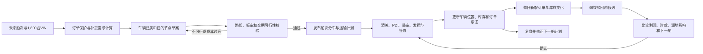

# 吉达单港危机下的分车物流与调拨 Agent 故事线

> 版本：v1.0
> 日期：2026-09-30
> 用途：AI Agent 产品故事、Demo 演示、业务讨论和后续页面设计的共同依据。
> 业务背景：霍尔木兹海峡封禁后，原本经吉达港和达曼港进入沙特的丰田与雷克萨斯车辆，只能从吉达港入境。
> 口径说明：本文中的船次、订单、车辆数量、成本、交期和人物均为 Demo 设定，不代表 ALJ 的真实经营数据；实际落地时应由真实系统数据替换。

## 1. 故事要解决的问题

过去，ALJ 可以根据西部、中部和东部的销量，将车辆分别从吉达港、达曼港送往吉达、利雅得和达曼三大车辆处理和配送中心（Vehicle Processing Center，VPC）。门店再根据所在区域，从对应 VPC 获得车辆。这是一套以双港入口和固定区域归属为前提的物流网络。

霍尔木兹海峡封禁后，达曼港入口失效，所有车辆只能从吉达港进入沙特。原有规则随之失效：如果仍把东部车辆先送到达曼 VPC，再从达曼配送到门店，一些车辆会绕路、重复装卸，甚至从达曼反向运输到更靠近利雅得的门店。

与此同时，进口供给大幅下降。供应减少快于需求收缩，有限车辆开始被多类需求同时争抢：

- 已付款或已承诺的零售订单；
- 有时限和违约风险的企业大单；
- 雷克萨斯和高配丰田等高利润、强配置订单；
- 为避免区域断货而产生的门店补货；
- 每天新增、取消或变更的订单；
- 已经位于门店或授权车商处、可能被调拨或回购的库存。

因此，新的 Agent 不能只回答“这船车怎么分”，也不能只回答“这一单从哪里运”。它要持续回答同一个问题：

> **在供给稀缺、单港入境和道路运力受限的情况下，每一台车应该服务哪一个需求，走哪一条路线，何时到达；当新订单出现后，是否值得改变原计划？**

故事的核心主张是：

> **Agent 将船次分车、逐单物流和每日调拨放在同一个决策闭环中。分车决定车辆服务谁，物流决定承诺能否兑现，订单变化再触发局部重排。**

## 2. 一批车辆贯穿三个过程

故事从一艘将在两周后抵达吉达港的滚装船开始。Demo 假设船上有 1,800 台丰田和雷克萨斯车辆，并且每台车已有 VIN、车型、配置、颜色和预计释放时间。车辆释放时间包括清关和售前检查（Pre Delivery Inspection，PDI）所需时间。

这 1,800 台车不会分别进入三个独立模块。系统为每台车维护一条持续更新的记录：

```text
VIN
├── 车辆属性：品牌、车型、配置、颜色、尺寸、重量
├── 当前状态：在途、待清关、待 PDI、可发运、运输中、已到店
├── 需求占用：企业订单、零售订单、补货计划、缓冲库存或尚未分配
├── 目的节点：VPC、城市服务点、门店或企业交付中心
├── 物流方案：运输段、承运商、板车、装载位、发运和到达时间
└── 版本记录：为什么分给这里、何时改派、谁批准、影响了什么
```

同一台车只能有一个有效占用。分车计划、运输任务和每日调拨共享这条记录，避免同一 VIN 被企业订单、补货计划和调拨申请重复使用。

### 2.1 三个过程的边界

| 过程           | 触发起点                         | 核心问题                                                     | 主要输出                                           |
| -------------- | -------------------------------- | ------------------------------------------------------------ | -------------------------------------------------- |
| 船次分车计划   | 一艘船预计两周后到达吉达港       | 这批车服务哪些订单和区域，哪些用于补货，预留多少机动量？     | VIN 分配、需求占用、目的节点、未满足需求和计划版本 |
| 逐单物流方案   | 分车时形成需求，或日常产生新订单 | 这台或这批车从哪里发、经过哪里、如何拼载、何时交付？         | 推荐线路、运输方式、班次、费用、时效和备选方案     |
| 每日回购与调拨 | 调拨员每天收到一批待满足订单     | 是调用本地库存、改派在途车、跨区调拨、回购，还是等待下一船？ | 调拨方案、回购单、锁车结果、运输任务和双端影响     |

区分三者的依据是业务意图，而不是路线名称。船次计划中已安排的“吉达港至利雅得”属于计划执行；新订单出现后，将一台尚未发运的车从利雅得补货池改派给东部客户，属于调拨；二者可以共用同一个物流班次，但不能重复生成运输需求。

### 2.2 决策闭环



## 3. 主角和 Agent 的分工

故事主角 Omar 是全国供应链负责人。他面对的不是一个一次性优化题，而是一套每天变化的承诺。

| 角色                     | 负责的业务判断                     | 在故事中的典型问题                               |
| ------------------------ | ---------------------------------- | ------------------------------------------------ |
| Omar，供应链负责人       | 履约优先级、区域保障和重大改派     | “这船车按什么原则分？今天哪些变化需要我批准？” |
| Layla，销售与分车负责人  | 订单真实性、配置匹配和补货优先级   | “这 60 台是已签企业订单，还是销售预测？”       |
| Faisal，物流负责人       | 线路、装载、运力、收货窗口和风险   | “东部订单为什么直发，而不是先进达曼 VPC？”     |
| Hassan，区域与渠道负责人 | 调出方影响、授权车商协调和区域底线 | “从这家店拿走 8 台，会不会造成当地断货？”      |
| Noura，财务负责人        | 回购价格、增量利润、预算和结算     | “多花的回购和运输成本，是否仍低于失单代价？”   |

Agent 自动完成数据汇总、候选生成、约束校验、方案比较、影响分析和计划草案。以下动作保留人工确认：

- 发布或大幅修改船次分车计划；
- 改变已对客户承诺的交付时间；
- 从一个区域抽走保底库存；
- 向独立授权车商回购车辆；
- 追加未锁定的外部运力；
- 接受成本更高但具有战略价值的例外方案。

Agent 每次回答都采用同一结构：**结论、依据、执行方案、备选方案、影响、待确认事项**。

## 4. 第一幕 船到吉达前两周的分车与物流联合求解

### 4.1 T-14 天危机看板打开

Omar 在早会上打开 Agent：

> “两周后有一船 1,800 台车到吉达。达曼港还不能用。告诉我这批车应该怎么分，并确保物流真的能执行。”

Agent 不直接给出“吉达多少、利雅得多少、达曼多少”。它先显示五组互相牵制的信息：

1. 船次供给：1,800 个 VIN 的车型、配置、颜色、清关和 PDI 释放节奏；
2. 订单需求：已付款零售订单、企业合同、交付日期、配置替代规则和逾期代价；
3. 补货需求：门店可售库存、销量、库存覆盖天数、区域保底和在途车辆；
4. 物流能力：吉达港集疏运能力、板车位置、装载模板、司机工时、线路时长和收货窗口；
5. 后续供给：下一船 ETA、可能到货的同配置车辆和可信度。

Agent 首先指出本次计划与旧规则的差异：

> “达曼港入口失效后，东部订单不再自动归属达曼 VPC。车辆目的地应按最终需求位置和运输可行性重新计算。利雅得承担中轴截流，达曼 VPC 只接收确需在东部形成安全库存的自由车辆。”

### 4.2 分车优先级先保护承诺再恢复库存

Agent 先冻结不具备分车条件的车辆，再将有效供给按四层业务需求逐层锁定。后一层不能占用前一层已经锁定的车辆。

| 优先层 | 需求类型                                         | 分车逻辑                                       | 允许改变的条件                     |
| ------ | ------------------------------------------------ | ---------------------------------------------- | ---------------------------------- |
| P0     | 法规、质量或不可发运车辆                         | 先冻结，不进入可分池                           | 清关、质量或合规状态恢复           |
| P1     | 企业合同、已付款订单、已承诺且不可替代的零售订单 | 按 VIN 或精确配置硬锁定，并校验交期            | 客户取消、订单条件变化或负责人批准 |
| P2     | 高利润、高流失风险或稀缺配置订单                 | 比较贡献利润、客户等待容忍度和物流成本后锁定   | 有更高价值需求且原承诺可被保护     |
| P3     | 区域和门店补货                                   | 先补最低库存覆盖，再按销量、缺口和区域公平分配 | 新订单出现或运输能力变化           |
| P4     | 全国机动缓冲                                     | 保留在吉达或利雅得可快速改派的位置             | 紧急订单、运输异常或区域断货触发   |

补货不是把剩余车辆简单按历史销量分完。Agent 对每个车型和配置分别计算：

```text
有效补货缺口
= 目标库存覆盖量
- 当前可售库存
- 已确认在途
- 已分配未发运
+ 已知订单需求
+ 区域最低保障缺口
```

目标库存覆盖天数可按车型、区域和危机等级调整。供给短缺时，Agent 先把每个区域提升到最低保障线，再把剩余车辆分给销速更高、缺货损失更大的位置，避免强势区域拿走全部供应。

### 4.3 Demo 分车结果包含需求归属与物流去向两个维度

下表用于演示 Agent 的表达方式，数值均为 Demo 假设。

**维度一：1,800 台车服务什么需求**

| 需求归属               |            数量 | 说明                                           |
| ---------------------- | --------------: | ---------------------------------------------- |
| 企业大单               |             240 | 已签合同并有集中交付期限，以 Hilux、Camry 为主 |
| 已付款或已承诺零售订单 |             290 | 精确到车型、配置、颜色和交付门店               |
| 高利润及稀缺配置订单   |              90 | 雷克萨斯、高配 Land Cruiser 等                 |
| 区域与门店补货         |             780 | 先补安全线，再按销速和缺口分配                 |
| 全国机动缓冲           |             300 | 保留在吉达和利雅得，供未来两周新订单调用       |
| 港口异常缓冲           |             100 | 应对清关、PDI、质损和运力波动，不提前承诺      |
| **合计**         | **1,800** | 每台车只能属于一个有效需求类别                 |

**维度二：1,800 台车走哪条物理路径**

| 物流去向         |            数量 | 主要路径                       | 为什么这样走                               |
| ---------------- | --------------: | ------------------------------ | ------------------------------------------ |
| 西部订单和补货   |             520 | 吉达港区 → 吉达 VPC/西部门店  | 距离短，按城市和门店收货窗口配送           |
| 中部订单和补货   |             650 | 吉达 → 利雅得 VPC/城市服务点  | 利雅得成为全国中轴和主要机动库存点         |
| 明确的东部订单   |             360 | 吉达 → 东部门店或企业交付中心 | 订单已知时穿透直达，减少在达曼二次装卸     |
| 中东部过渡带订单 |             170 | 吉达 → 利雅得截流 → 区域短驳 | 避免先去达曼再折返                         |
| 东部自由安全库存 |             100 | 吉达 → 达曼 VPC               | 仅用于未来东部需求，不承担无必要的动态中转 |
| **合计**   | **1,800** | 需求归属与物流去向交叉匹配     | 不按 VPC 名称机械分车                      |

例如，一台服务企业大单的 Hilux 可以直接从吉达送到利雅得企业交付中心；一台服务东部高利润订单的雷克萨斯可以从吉达直达东部门店；一台用于东部补货的自由库存才可能进入达曼 VPC。“订单类型”不能直接等同于“物流节点”。

### 4.4 分车计划必须经过物流回压

第一轮业务分车完成后，Agent 将需求转换成运输需求，而不是立即发布计划。

它按以下顺序做物流校验：

1. 将车辆按目的方向、交期、车型尺寸、重量和运输保护要求聚类；
2. 匹配大板车、小板车或高价值车辆专用运输方式；
3. 按 8–10 台大板车的演示装载模板生成配载草案；
4. 检查板车位置、进港空驶、司机工时、装车时间、道路时长和收货窗口；
5. 计算每辆板车的装载率、每台车成本和多点卸货次数；
6. 将运力不足、交期冲突或成本过高的明细退回分车层重新调整。

Agent 不用“全国运力总量足够”代替线路校验。即使总板位充足，吉达到东部的班次也可能不足；同样，某条线路还有空位，不代表这些空位满足高配车保护要求或客户交期。

### 4.5 四种港口发运策略

| 策略           | 适用对象                                 | 典型路线                            | 核心约束                           |
| -------------- | ---------------------------------------- | ----------------------------------- | ---------------------------------- |
| 西部短链配送   | 吉达及西部订单、补货                     | 吉达港区 → 吉达 VPC/城市点 → 门店 | 城市限行、末端收货窗口             |
| 利雅得中轴截流 | 中部补货、中东部过渡带、机动库存         | 吉达 → 利雅得 → 门店群            | 中转换装能力、库存停留时间         |
| 东部穿透直达   | 已知目的地的东部大单、紧急订单和成批订单 | 吉达 → 东部企业交付中心/城市点     | 长途运力、到店接收能力、驾驶工时   |
| 达曼安全库存   | 尚未绑定订单的东部自由库存               | 吉达 → 达曼 VPC                    | 必须证明东部未来缺口，避免无效中转 |

东部穿透直达并不意味着所有大板车都进入市区门店。大批量车辆可以直达郊外企业交付中心或城市服务点，再由小板车完成末端配送。Agent 必须将干线和末端分别计价、排班和跟踪。

### 4.6 T-7 至 T-3 天从建议变成可执行计划

Agent 逐步把草案变成承诺：

- T-7：确认订单、门店库存和下一船信息的截止快照；
- T-6：生成第一版 VIN 分配和线路需求；
- T-5：向自有车队和 3PL 发送运力询价与预约建议；
- T-4：根据承运确认、到店窗口和成本重新配载；
- T-3：发布船次分车计划，锁定必须履约车辆，保留可改派缓冲；
- T-0：车辆到港后按实际清关和 PDI 释放顺序生成装车任务。

发布后的计划不是一张静态表。每条分配都有生效条件和可变更边界：已付款订单属于硬锁定；补货车可在未装车前改派；已经装上东向板车的车辆只有在重大例外下才允许卸车重排。

### 4.7 第一幕输出

Omar 最终看到的不是一个总数，而是四张互相可追溯的结果表：

1. 船次需求分配表：每个 VIN 服务哪笔订单或哪项补货需求；
2. 目的地计划表：每个 VIN 的最终门店、企业交付中心或库存节点；
3. 配载与班次表：每辆板车装哪些 VIN、走哪条线路、何时发运；
4. 风险与例外表：尚未满足的订单、运力缺口、待确认条件和机动缓冲。

## 5. 第二幕 不同订单采用不同的物流方案

分车和物流不能各自独立最优。Agent 在给车辆归属时，已经同步生成逐单物流方案；每天出现新订单时，也继续使用同一套方案模板。

### 5.1 订单类型与推荐方案总表

| 订单类型        | Agent 首选方案                                                       | 备选方案                               | 重点比较                                     |
| --------------- | -------------------------------------------------------------------- | -------------------------------------- | -------------------------------------------- |
| 企业大单        | 以整单交付目标统筹港口车、VPC 库存和门店库存，形成成批直发或集中交付 | 跨店集结、授权车商回购、分批交付       | 合同交期、罚款、集结成本、整单齐套率         |
| 高配车/雷克萨斯 | 精确匹配 VIN，优先使用自有或受控运力，减少装卸                       | 专车、封闭运输、顺路高保护拼载         | 单车利润、客户流失、车况风险、配置不可替代性 |
| 普通零售订单    | 本地库存或既有班次顺路拼载                                           | 配置转化、等待下一船、邻近调拨         | 物流费是否吞噬利润、客户等待容忍度           |
| 补货订单        | 按车型缺口和库存覆盖批量发往 VPC/城市点                              | 延后低销速补货、与订单车共板           | 装载率、区域保底、库存周转、未来调拨空间     |
| 偏远地区订单    | 设置集单窗口，按区域形成满载或接近满载的拼单线路                     | 邻近城市交接、小板车末端、客户协商交期 | 绕行里程、多点卸货、末端能力和订单承诺       |
| 紧急普通订单    | 先查同城和在途可改派车辆，再判断跨区调拨                             | 给予配置替代、明确等待下一船           | 加急成本、原计划受损、客户失单概率           |

### 5.2 场景 A 企业大单按整单求解

Demo 中，一家租车企业要求 3 天内在利雅得交付 80 台白色 Hilux。利雅得可用库存只有 18 台。

如果逐台处理，调拨员可能先从最近门店拿车，随后才发现缺少足够板车，或者抽空了多个门店的安全库存。Agent 将 80 台作为一个订单组合求解：

| 来源                     |         数量 | 方案                                         |
| ------------------------ | -----------: | -------------------------------------------- |
| 利雅得 VPC 自由库存      |           18 | 当日锁定，进入企业 PDI                       |
| 即将从吉达释放的本船车辆 |           42 | 从补货池改为企业订单，整板直发利雅得交付中心 |
| 邻近直营门店自由库存     |           12 | 两条短驳线路集结，不动已锁客户车             |
| 授权车商可回购库存       |            8 | 取得报价和权属确认后，直接送交付中心         |
| **合计**           | **80** | 以整单齐套和交期为目标统一排程               |

Agent 同时给出没有采用的方案：从东部多个门店各抽少量车辆虽然能凑齐，但会增加二次装卸、长途逆向运输和区域缺货风险，因此成本和副作用都更高。

Omar 看到的结论是：

> “推荐组合可以按期交付 80 台，不占用任何已付款零售订单。需批准从本船补货池改派 42 台，并批准回购 8 台。若回购未在今日 15:00 前确认，备选方案是先交付 72 台，剩余 8 台延后两天。”

### 5.3 场景 B 高配车以利润和承诺保护物流成本

一位东部客户订购了指定颜色和内饰的雷克萨斯 LX，当地没有现车。本船有一台完全匹配的 VIN。

Agent 比较三个方案：

| 方案                     | 时效         | 成本特点                             | 风险与结论                         |
| ------------------------ | ------------ | ------------------------------------ | ---------------------------------- |
| 本船车辆从吉达直发东部   | 较快         | 长途运输成本较高，但只发生一次主运输 | 推荐；精确配置且避免后续二次调拨   |
| 先送达曼 VPC，再配送门店 | 增加中转时间 | 多一次装卸和末端运输                 | 不推荐；无必要中转                 |
| 从利雅得门店调现车       | 可能最快     | 已发生首程运输，再增加调拨成本       | 仅当客户交期早于本船可达时间时启用 |

如果高配车需要更高保护等级，Agent 会把专车或封闭运输作为独立报价，不会用满载大板车平均单车成本替代真实成本。只要订单贡献利润、客户流失损失和品牌服务价值足以覆盖增量物流费，就可以批准更高成本的运输方式。

### 5.4 场景 C 普通订单首先避免无利润调拨

一位客户订购白色基础款 Camry，当地门店只有黑色现车，白色车在下一批吉达至该区域的班次中还有空位。

Agent 按顺序给出选择：

1. 如果客户接受黑色车，通过赠送保养或精品完成本地配置转化；
2. 如果客户坚持白色，将同方向白色车加入既有班次，不单独派车；
3. 如果当前没有顺路班次，比较邻近门店调拨与下一船到达时间；
4. 如果跨区专车成本会吞噬订单利润，明确建议等待或转化，不默认批准调拨。

Agent 的价值不是“所有订单都找到车”，而是把失单风险、让利成本、物流成本和等待时间放在一起，防止为了低利润订单产生高成本、低装载率的跨区运输。

### 5.5 场景 D 补货车承担稳定网络的作用

补货没有单个客户催促，但不能因此永远排在最后。若所有稀缺车辆都被即时订单吸走，偏远区域和中小门店会持续失去销售机会。

Agent 为补货设置三道保护：

- 区域最低库存覆盖：优先消除零库存和低于安全线的门店；
- 车型适配：Hilux 等区域性强需求车型与普通轿车采用不同目标水位；
- 可回收性：一部分机动库存放在吉达或利雅得，而不是过早推到网络末端。

补货车辆与订单车可以共板，但必须分别保留业务归属。订单取消时，车辆可以回到补货池；补货车被紧急订单改派时，系统必须显示原门店减少了多少覆盖天数。

### 5.6 场景 E 偏远地区以集单窗口换取可控成本

偏远地区的单台订单如果全部使用专车，物流成本会迅速失控。Agent 建立“集单窗口 + 区域线路”机制：

1. 将相同方向、交期相近的订单和补货需求放入拼单池；
2. 给出最晚等待时间和目标装载率；
3. 达到发车阈值后形成一条主干线路；
4. 主干车辆到区域服务点后，再由小板车完成末端交付；
5. 若高价值订单不能等待，则作为例外单独报价和审批。

Agent 需要限制多点卸货次数。每增加一个停靠点，都可能增加绕行、等待、解绑和重新固定车辆的时间与质损风险。不是“多装一台就一定更省”，而是要在装载率和路线复杂度之间取平衡。

### 5.7 每笔订单的标准决策卡

无论订单类型如何，Agent 最终生成同一结构的决策卡：

| 字段     | 内容                                   |
| -------- | -------------------------------------- |
| 订单承诺 | 车型、配置、数量、交付地点、最晚日期   |
| 推荐车源 | VIN、当前位置、权属、可释放时间        |
| 推荐物流 | 运输段、车型、班次、装载率、预计到达   |
| 总成本   | 调拨、回购、运输、让利和额外处理成本   |
| 订单价值 | 贡献利润、违约损失、客户流失和战略等级 |
| 双端影响 | 目标订单获得什么，来源门店失去什么     |
| 备选方案 | 配置转化、其他车源、下一船或协商延期   |
| 待确认项 | 报价、权属、运力、客户接受和负责人批准 |

## 6. 第三幕 每天从一批待满足订单开始调拨

### 6.1 每日 08:30 调拨员提交订单池

船次计划发布后，市场仍在变化。每天早晨，调拨员将新增订单、昨日未满足订单、取消订单和紧急需求交给 Agent。

Agent 不会直接搜索“全国哪里有同款车”。它先把订单分成四类：

- 必须今日决定的企业或高价值急单；
- 可通过同城或既有线路满足的普通订单；
- 可以等待下一船或接受配置替代的订单；
- 当前无车、无可靠 ETA，需要销售处理预期的订单。

随后，它为每笔订单生成候选车源：

1. 同一城市的 VPC 和直营门店自由库存；
2. 邻近城市的自由库存；
3. 已分配但尚未装车、允许改派的补货车；
4. 正在同方向运输、仍允许在中转点改变去向的车辆；
5. 其他区域门店中超过安全水位的自由库存；
6. 授权车商愿意出售、且满足回购条件的新车；
7. 下一船已确认的同配置 VIN。

“系统里有库存”不等于“可以调”。已绑定客户、冻结、展车状态不合格、权属不属于 ALJ 或会导致来源门店跌破安全线的车辆，均不能作为可执行车源。

### 6.2 调拨决策不是距离最短，而是净价值最高

Agent 对每个候选方案计算订单保护净价值：

```text
订单保护净价值
= 订单贡献利润
+ 避免的违约和失单损失
+ 战略客户价值
- 回购或权属取得成本
- 增量运输与装卸成本
- 配置转化让利成本
- 来源门店的缺货机会损失
- 质损和交付风险成本
```

距离较近的车辆不一定是最佳车源。如果最近门店只有一台安全库存，而稍远门店有多台滞销库存，后者可能是更好的调出方。对于多笔订单，Agent 还要做批量匹配，避免每一单都选择同一辆“最优车辆”。

### 6.3 企业大单触发全网集结与回购

企业大单到来时，Agent 先判断本船尚未发运的车辆能否直接改派。尚未装车的车辆改派通常比从门店回收已经运输过一次的车辆更便宜，也减少重复装卸。

只有在港口车、VPC 库存和可安全调出的直营库存仍不足时，Agent 才启动授权车商回购。回购流程分为交易和运输两个闭环：

```text
订单缺口确认
→ 授权车商可售库存与车况核验
→ 回购报价和信用条件比较
→ VIN冻结
→ 权属与结算条件确认
→ 提车前检查
→ 直接运往企业交付中心或目标门店
→ 到店签收
→ 财务结算
```

车辆可以从授权车商直接送到目标地，不强制返回 VPC。回购单负责记录价格、权属和结算；调拨单负责记录为什么移动；运输任务负责记录如何移动。三者关联，但不混为一张单。

### 6.4 高利润订单触发低干扰调拨

高利润订单的目标不是“不计成本调车”，而是在保住订单的同时，用最低的网络扰动满足需求。

例如，利雅得出现一笔指定配置的雷克萨斯订单。候选车辆分别位于吉达 VPC、达曼门店和一辆即将经过利雅得的东向板车上。Agent 会比较：

- 从吉达单车运输是否能赶上交期；
- 达曼门店调出后是否损害当地已知订单；
- 在途车是否允许在利雅得截流，且不会破坏原订单承诺；
- 下一船是否在客户可接受时间内到达；
- 哪个方案的增量物流费占订单贡献利润最低。

若在途车辆尚未越过利雅得、原用途只是达曼补货，并且达曼仍高于安全库存，Agent 可以推荐在利雅得截流。这比先把车运到达曼再反向调回更便宜，也减少一次装卸。

### 6.5 普通订单优先转化或顺路拼载

对利润较薄的普通订单，Agent 使用成本护栏：

- 同城调拨或既有班次有空位时，可以自动生成低成本建议；
- 需要新增长途专车时，先提出颜色或配置转化；
- 下一船已确认且等待时间接近调拨时间时，推荐锁定下一船 VIN；
- 没有可靠船期时，不用“请客户等待”掩盖无供应事实，而是明确标记供给不可承诺。

### 6.6 调出门店必须被保护

每个调拨建议都显示调出前后对比：

| 指标               | 调出前 | 调出后 | 是否越线           |
| ------------------ | -----: | -----: | ------------------ |
| 同配置自由库存     |      6 |      3 | 否                 |
| 未来 14 天已知订单 |      1 |      1 | 否                 |
| 库存覆盖天数       |     24 |     12 | 否，最低线为 10 天 |
| 下一批确认到货     |      4 |      4 | 否                 |
| 预计失销           |      0 |      0 | 否                 |

如果调出会使来源门店跌破安全线，Agent 可以给出方案，但必须标记为例外并说明补偿方式，例如从下一船优先补回、调整该区域配额或由总部承担机会损失。不能只展示目标订单被满足，而隐藏来源端损失。

### 6.7 每日调拨的输出

每天上午，调拨员得到一张按紧急程度排序的工作台：

| 状态          | 含义                                 | 下一步动作               |
| ------------- | ------------------------------------ | ------------------------ |
| 可直接执行    | 车源、权属、运力和收货窗口均已确认   | 锁定 VIN 并生成运输任务  |
| 待业务确认    | 会改变补货计划、客户承诺或区域安全线 | 由相应负责人批准或拒绝   |
| 待回购确认    | 车商报价、车况、权属或结算尚未完成   | 完成回购条件后才可调度   |
| 建议转化/等待 | 调拨净价值为负或下一船更合适         | 销售与客户确认配置或交期 |
| 当前不可满足  | 无合格车源、无可靠船期或无运输能力   | 明确缺口并升级供给问题   |

当订单、库存或运力变化使建议过期时，Agent 自动撤回旧建议并重新计算，不允许调拨员执行基于过期库存快照的方案。

## 7. 一条完整 Demo 故事线

以下顺序适合 12–15 分钟产品演示。

### 场景 1 危机进入运营层

Omar 打开全国供应链总览。页面显示达曼港入口不可用，两周后 1,800 台车集中抵达吉达，东向运输需求和港口释放能力成为红色风险。

Agent 用一句话给出判断：

> “旧的 VPC 归属规则会造成东部绕行和重复装卸。本船应按订单目的地重分，利雅得承担截流，东部已知订单从吉达穿透直达。”

### 场景 2 从 1,800 台总量下钻到需求

Omar 询问：“先保护了什么？”

Agent 展示企业大单、已付款订单、高利润订单、补货和缓冲的分层结果，并允许下钻到具体车型、配置和 VIN。Omar 可以看到某台 Hilux 为什么属于企业订单，而另一台相同车型为什么进入东部补货。

### 场景 3 业务分车被物流约束纠正

第一版方案把过多车辆安排在 T+2 日发往东部，但承运确认只能覆盖其中一部分。Agent 不把这部分运力当作已经落实，而是提出三个调整：

1. 优先发已承诺订单和企业大单；
2. 将部分东部自由补货推迟到下一班；
3. 把中东部过渡带车辆改为利雅得截流，与中部补货共板。

Omar 对比调整前后，可以看到订单履约不变，但低优先补货晚两天，平均装载率提高，达曼 VPC 的无订单中转量下降。

### 场景 4 查看一笔东部高配订单

Faisal 打开雷克萨斯 LX 订单。Agent 推荐吉达直发东部，并解释为什么不先去达曼 VPC。页面同时展示专用运输报价、预计到达时间、装卸次数和备选的利雅得调拨方案。

### 场景 5 次日企业大单打乱原计划

调拨员收到 80 台 Hilux 企业订单。Agent 将订单当作整体，组合使用利雅得库存、本船未发运车辆、邻近直营库存和少量授权车商回购库存。

系统明确提示：“42 台将从原补货池改派，受影响的 6 家门店库存覆盖下降，但仍高于安全线。”Omar 批准改派，Noura 批准回购预算，Faisal 确认班次。

### 场景 6 普通订单没有被昂贵调拨

同时出现一笔普通 Camry 订单。跨区专车虽然最快，但会吞噬大部分订单利润。Agent 推荐把白色车辆加入两天后的既有班次，并给出本地黑色现车转化方案。销售确认客户愿意等待，系统锁定对应 VIN。

这一幕说明 Agent 不只是“更会调车”，也会判断什么时候不应该调车。

### 场景 7 执行结果回到下一轮决策

车辆清关、PDI、装车、在途和签收回执持续更新。某辆板车延误后，Agent 只重排受影响的 16 台车，不重算全部 1,800 台。

故事最后，Omar 看到的不只是“本船已分完”，而是：

- 哪些订单已兑现，哪些仍有风险；
- 哪些补货被企业订单占用，何时补回；
- 每条线路实际花费和装载率；
- 回购车辆是否到店、是否已完成结算；
- 哪些规则需要用于下一船计划。

## 8. Agent 的决策规则

### 8.1 必须遵守的硬约束

1. 同一 VIN 只能存在一个有效业务占用和一个有效运输状态；
2. 不得调动已绑定且未获释放的客户车辆；
3. 不得把“授权车商有库存”视为“总部有调度权”；
4. 运输建议必须有车辆、班次、承运能力和收货窗口支撑；
5. 高价值车辆必须满足相应的保护和承运条件；
6. 已装车车辆的改派要计算卸车、重配载和原承诺影响；
7. 等待下一船必须基于可信 ETA 和可锁定的车型或 VIN，不能基于模糊预测；
8. 调出门店不得在无审批情况下跌破区域或车型安全线；
9. 回购的权属、资金、车况和运输状态必须分别记录；
10. 分车、调拨和运输不能分别重复统计同一台车。

### 8.2 可以优化的软目标

Agent 在满足硬约束后，综合优化：

- 订单按期履约率；
- 企业订单齐套率；
- 贡献利润和避免的违约损失；
- 每台车物流成本；
- 板车装载率和空驶里程；
- 装卸次数与质损风险；
- 各区域最低库存保障；
- 门店库存覆盖差异；
- 未来订单的机动空间。

不同业务阶段可以调整权重。危机初期偏向履约和区域保障；运输稳定后，提高成本和库存周转权重。所有权重变化都应保留版本和批准记录。

## 9. Agent 需要的数据和生成的业务对象

### 9.1 最低数据要求

| 数据域     | 必要字段                                                           |
| ---------- | ------------------------------------------------------------------ |
| 船次与车辆 | 船次、ETA、VIN、车型、配置、颜色、尺寸重量、清关和 PDI 状态        |
| 订单       | 客户类型、数量、配置、交付地点、承诺日期、利润、违约条件、替代规则 |
| 库存       | VIN、位置、权属、可售状态、锁定状态、车龄、车况、下一批到货        |
| 需求与补货 | 门店销速、库存覆盖、未满足订单、安全线、区域和渠道保底             |
| 物流网络   | 港口、VPC、城市点、门店、线路、距离、时长、收费和限行窗口          |
| 运力       | 板车类型、容量、当前位置、可用时间、承运商、报价、保护等级         |
| 回购       | 车商、VIN、报价、税费、信用条件、调度权、权属交接和结算状态        |
| 执行回执   | 清关、PDI、装车、发运、到站、签收、异常、质损和实际费用            |

### 9.2 核心业务对象

| 对象         | 解决什么问题                               |
| ------------ | ------------------------------------------ |
| 船次供给池   | 明确未来两周真正可分的车辆和释放节奏       |
| 需求占用     | 记录每台车服务订单、补货还是缓冲           |
| 分车计划版本 | 记录分配结果、规则、差异和批准人           |
| 物流方案     | 比较一笔需求的不同路线、方式、时效和费用   |
| 配载与班次   | 把车辆变成可执行的运输任务                 |
| 调拨单       | 记录新需求、车源、目标、双端影响和业务原因 |
| 回购单       | 记录报价、VIN、权属、信用、支付和结算      |
| 异常与回执   | 用真实执行更新库存、订单和下一轮计划       |

## 10. 衡量故事是否成功

### 10.1 业务指标

| 指标             | 说明                                           |
| ---------------- | ---------------------------------------------- |
| 订单按期履约率   | 在承诺日期前交付的订单车辆比例                 |
| 企业订单齐套率   | 在同一交付窗口内满足整单数量和配置的比例       |
| 高利润订单保有率 | 因及时找到车源而保住的高利润订单比例           |
| 每台车物流成本   | 干线、末端、调拨、空驶和额外装卸的完整成本     |
| 板车装载率       | 实际装载位与可用装载位的比例                   |
| 重复装卸率       | 发生非必要二次及以上装卸的车辆比例             |
| 调拨净收益       | 被保护利润和避免损失减去回购、运输及来源端损失 |
| 区域保障达标率   | 各区域和关键车型达到最低库存覆盖的比例         |
| 计划稳定性       | 发布后被改派的车辆比例及改派原因               |
| 建议可执行率     | Agent 建议中最终满足权属、运力和收货条件的比例 |

### 10.2 产品验收标准

这条故事线只有满足以下条件，才算真正成立：

1. 任意订单都能追到具体 VIN、车源、物流方案和计划版本；
2. 任意 VIN 都能解释为什么给了这个订单或补货点；
3. 分车计划无法通过的物流约束会回压到业务分配，而不是留到执行时暴雷；
4. 企业大单可以作为整体组合车源，而不是逐台人工搜车；
5. 高利润订单能比较调拨成本与保单价值；
6. 普通订单能够得到“不调拨”的理性建议；
7. 回购与物理运输分别闭环，并能直接从车商送达目标地；
8. 每次调拨同时展示目标端收益和来源端损失；
9. 新订单只触发受影响车辆的局部重排；
10. 计划、执行、调拨和复盘使用同一套车辆与订单状态。

## 11. 故事收束

过去的物流体系把港口、VPC 和门店看成固定关系：从哪个港口进，就进入哪个区域的配送网络。霍尔木兹海峡封禁后，这个前提已经不存在。

新的 Agent 把固定区域规则改造成动态承诺网络：

- 船还没到港时，先把未来供给与真实订单、补货缺口和道路运力连接起来；
- 每台车分给谁的同时，就知道它如何送达；
- 新订单出现时，优先改派尚未产生沉没成本的车辆，再考虑门店调拨和车商回购；
- 对企业大单保护整单履约，对高利润订单保护配置和客户，对普通订单保护利润，对补货保护区域长期销售能力；
- 所有变化最终回到同一套 VIN、订单、库存和运输记录中。

最终，Omar 不再分别管理“分车计划”“物流运输”和“库存调拨”。他管理的是一套持续兑现客户承诺的系统，而 Agent 负责在每一次供应、订单和运输变化后，找出代价最小、解释最清楚、真正能够执行的下一步。

## 12. 参考材料

- [单港进入后的物流方案](../01_gemini调研/01_物流痛点/01_物流方案.md)
- [轿运车物流基础知识](../01_gemini调研/02_轿运车物流/01_基础知识.md)
- [港口装车与运力组织逻辑](../01_gemini调研/02_轿运车物流/02_港口装车逻辑.md)
- [订单调拨逻辑](../01_gemini调研/03_调拨情况/05_调拨逻辑.md)
- [授权门店回购与再调拨](../01_gemini调研/03_调拨情况/03_回购调拨.md)
