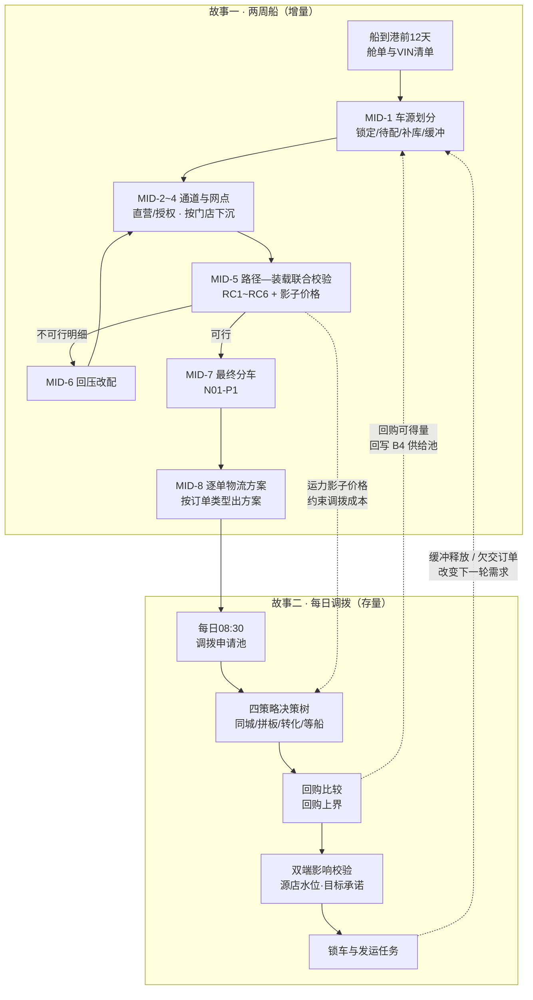

# 故事线重设计 · 总纲：吉达单港下的「分车 × 物流 × 调拨」联合决策

> 版本：v1.0（新故事线首版）｜场景日期锚点：2026-10
> 用途：Demo 剧本、产品设计与后续页面/交互设计的共同依据。
> 场景：沿用项目中的沙特汽车总代理（ALJ）、三大 VPC、直营与授权渠道设定。人物、船名、订单号、配额与演示结果均为**虚构**，不代表 ALJ 实际运营。
> 数据口径：沿用 [周度分货_物流执行_每日调拨_Agent故事线](../04_故事线/02_周度分货_物流执行_每日调拨_Agent故事线.md) 与 [数据基线与逐车型分车口径](../04_故事线/04_数据基线与逐车型分车口径.md)；本目录新增的船量、订单与批次数字**全部标注为「演示设定」**。
> 上游依据：[整车销售供应链业务全景与决策网络](../03_ds设计/01_整车销售供应链业务全景与决策网络.md)、[ALJ月度进销与分车需求拆分](../03_ds设计/03_ALJ月度进销与分车需求拆分.md)、[直营_授权双轨分车逻辑](../03_ds设计/02_直营_授权双轨分车逻辑与图谱中间产物.md)、[港口到门店的运输方式与空驶成本](../05_调研/01_港口到门店的运输方式与空驶成本.md)。
> 用户指定的四份调研文档：[01_物流方案](../01_gemini调研/01_物流痛点/01_物流方案.md)、[轿运车基础知识](../01_gemini调研/02_轿运车物流/01_基础知识.md)、[港口装车逻辑](../01_gemini调研/02_轿运车物流/02_港口装车逻辑.md)、[05_调拨逻辑](../01_gemini调研/03_调拨情况/05_调拨逻辑.md)。

---

## 0. 本目录要交付什么

用户要看到三件事，而且明确要求**第 1、2 件不能独立看**：

| # | 交付内容 | 落点文件 | 起点 |
| --- | --- | --- | --- |
| 1 | **分车计划的故事线**：未来两周到吉达港的一整船车，怎么分（基于已有订单 + 补货逻辑） | [01_故事线一_两周船的分车计划与逐单物流.md](./01_故事线一_两周船的分车计划与逐单物流.md) | 船到港前 12 天拿到舱单 |
| 2 | **每一单的物流方案**：企业大单、高配车、普通订单、补货单、偏远拼单等 | [01_故事线一_两周船的分车计划与逐单物流.md](./01_故事线一_两周船的分车计划与逐单物流.md) 第二幕 + [03_订单类型物流方案矩阵.md](./03_订单类型物流方案矩阵.md) | 分车草案产生的同一批车辆 |
| 3 | **基于订单的回购与调拨**：每天调拨员接到一堆订单作为起点 | [02_故事线二_每日回购与调拨.md](./02_故事线二_每日回购与调拨.md) | 每日 08:30 的调拨申请池 |
| — | 参数、口径与验收 | [04_参数基线与验收标准.md](./04_参数基线与验收标准.md) | — |

**关系图（读法）**：`00` 立规矩 → `01` 看主戏（1+2 联合） → `02` 看日戏（3） → `03` 查方案 → `04` 查参数与验收。

---

## 1. 场景与核心冲突

### 1.1 常态：双港对冲，分车与物流是串联的

常态下丰田与雷克萨斯从**吉达港（西岸）与达曼港（东岸）双港入境**，三大 VPC（吉达 / 利雅得 / 达曼）按就近原则圈定各自的辐射区：

| VPC | 常态辐射范围 | 常态角色 |
| --- | --- | --- |
| 吉达 VPC | 西海岸、麦加、麦地那，南延至吉赞、阿西尔 | 西部门户接收库 |
| 利雅得 VPC | 中部内陆、卡西姆，北延哈伊勒、阿尔阿尔、塔布克 | 中部主力接收库 |
| 达曼 VPC | 东部省、胡富夫、朱拜勒等工业重镇 | **东部主力接收库** |

常态的业务节奏是**先分车、再找一条足够便宜的路运出去**——商业分配（P5）与物理约束（P6）松耦合。这是全部冲突的参照系。

### 1.2 冲击：霍尔木兹封禁 → 单港全纳

海峡实际封禁后，东线物理中断，**达曼港停摆**，所有整船车辆只能从吉达港一个口子进入。冲击同时改变了四个外生量：

| 外生量 | 常态 | 封禁后 | 性质 |
| --- | --- | --- | --- |
| 供给总量 | 连续、可预期 | 大幅下移（丰田全球减产约 10 万辆，日本→中东出口一度 -90%） | 不可解 |
| 到货节奏 | 稳定到港 | 脉冲式整船到港、船期不确定 | 不可解 |
| 通道结构 | 双港自由选择 | 东线中断、西线过载 | 部分可解 |
| 单位陆运成本 | 稳定 | 需求加权平均里程与单台运费近乎翻倍 | 部分不可解 |

### 1.3 两个被「打乱」的具体事实

**事实一：达曼 VPC 的旧模型变成"无效对流"。**

> 旧路径：达曼港 ➔ 达曼 VPC（短途）➔ 东部/中东部门店。
> 不优化的新路径：吉达港 ➔ 干线长途运到达曼 VPC ➔ （发现订单门店其实在靠近中部的偏远大区）➔ 再反向往回运。

这条错误路径**多付一倍干线运费**，且车辆在反复装卸板车中刮蹭概率飙升。所以本故事线采用《[01_物流方案](../01_gemini调研/01_物流痛点/01_物流方案.md)》提出的**"利雅得中轴线截流分拨（Cross-Docking & Interception）"**：达曼 VPC 从"主要新车接收库"**降级为"末端毛细血管配送站 / 纯安全库存库"**，利雅得 VPC 升格为**流量阀门与超级中转站**。

**事实二：供给腰斩后全网进入普遍紧缺，所有品都变成"一周分一次"的紧缺品。**

常态下"相对紧缺的品一周分一次、不紧缺的一个月分一次"这条规律失效（见[业务全景](../03_ds设计/01_整车销售供应链业务全景与决策网络.md) §1.2）。同时需求侧虽有萎缩，但供给下降更快，于是出现两类必须靠**存量调拨**才能接住的场景：

1. **企业大单**：企业/政府下大批量订单，本地 VPC 无货，必须全网回购各门店存量车来满足；
2. **高利润订单**：只要调拨的物流成本相对可控（相对该单利润），就值得调。

### 1.4 一句话冲突

> **单港全纳把"分车"和"物流"从串联变成同一个联合决策问题：分车不看运力就是一张废纸，物流不看利润就是在烧钱。**
> 而紧急程度更高的存量大单，又必须在**同一个 Agent** 里用"回购 + 调拨"去救——这就是本故事线三段戏的同一个内核。

---

## 2. 三个故事的关系（不是三个模块，是一条因果链）

**三条硬连接（Demo 必须演出来的"网"）：**

| 连接 | 冲突本质 | 本故事线的消解变量 |
| --- | --- | --- |
| 分车（故事一）↔ 物流（故事一第二幕） | 商业分配 vs 物理可达 | **运力影子价格**：把路线稀缺性折算成每台车的成本加价，让分车自己避开死路 |
| 分车（故事一）↔ 调拨（故事二） | 一次性分对 vs 事后修补 | **VPC 缓冲释放规则**：缓冲量既是故事的"安全垫"，也是调拨的"第一候选来源" |
| 调拨/回购（故事二）↔ 下一船分车（故事一） | 救今天 vs 救下周 | **回购上界**：回购价 ≤ 远途进口 + 陆运成本 − 短途调拨成本，超过就转为"等下一船" |

---

## 3. 本次重设计相对已有故事线的四个改动

已有故事线（[04_故事线/02](../04_故事线/02_周度分货_物流执行_每日调拨_Agent故事线.md) v1.1）的主线是"围绕一个经营周"，单港口作为主线约束、海峡中断作为分支。本次重设计把**起点换成"一整船车"**，并做四处调整：

| # | 改动 | 理由 |
| --- | --- | --- |
| 1 | **起点从"经营周"改为"一船（Ship-bound）"** | 危机态供给是脉冲式的，一周可能来一船、也可能不来；以船为单位才能把"到货时点"这个维度真正带进分车 |
| 2 | **分车粒度增加"到货时点 × 通道可达性"两个维度** | 直接把[业务全景](../03_ds设计/01_整车销售供应链业务全景与决策网络.md) §8.3 对 `B4` 的改造要求落成剧本 |
| 3 | **把"逐单物流方案"提升为与"分车"并列的主戏，而不是执行环节** | 用户明确要求"1 和 2 不能独立看"；本故事线用 `MID-5 联合校验 + MID-8 逐单方案` 把两者缝在同一次求解里 |
| 4 | **新增"调拨员 Sara 的一天"作为独立第二部** | 用户明确要求以"每天调拨员接到一堆订单"为起点，且要求覆盖回购 |

**继承不变的部分**：订单保护、按配置分车、直营与授权双轨、运输可行性反馈、库存权属、回购比较、版本追溯、`MID-1`~`MID-8` 与 `DR1`~`DR13` 的编号体系。

---

## 4. 人物与 Agent 的分工

| 角色 | 负责判断什么 | 在本故事线的典型台词 |
| --- | --- | --- |
| **Omar**，供应链负责人 | 履约优先级、区域与渠道平衡、重大变更拍板 | "这一船 1,812 台，先告诉我哪 36 台我救不了。" |
| **Layla**，分货与销售负责人 | 订单、车型配置、门店需求与配额 | "别拿兰德酷路泽的余量去抵凯美瑞的缺口。" |
| **Faisal**，物流负责人 | 运力、装载、路径、交接、收货窗口 | "分出去的车，这两周真能送到吗？" |
| **Hassan**，区域与渠道负责人 | 调出门店影响、授权车商交易条件 | "帮这家店，会不会让另一家店缺车？" |
| **Noura**，财务负责人 | 回购费用、预算、现金与结算 | "这次回购比等下一船到底多花了什么？" |
| **Sara**，调拨员（新增） | 每日调拨申请池的处置、锁车与跟单 | "今天这 23 笔申请，哪些我根本不该批？" |

**Agent 的统一响应结构**（全故事线保持一致）：

> **结论 → 依据 → 候选动作及取舍 → 待确认条件 → 对计划和指标的影响**

Agent 自动做的是：查数、求解、路径校验、生成建议、登记模拟回执、留版本。需要人确认的是：发布分车、变更订单承诺、批准回购、委托运输。**未确认或未取得回执的事项保持原状态**，不预填结局。

---

## 5. 数据基线（本故事线默认值）

| 项 | 取值 | 来源/性质 |
| --- | --- | --- |
| 门店网络 | 34 家直营 + 45 家 L2，共 79 店、46 个交易身份、18 个城市、5 个大区 | 已有 `data/00_客户/*` |
| 门店实物库存 | 6,709 台（丰田 6,011 + 雷克萨斯 698） | 已有 `data/03_库存/当前库存_门店.csv` |
| 门店在途 | 1,012 台（丰田 924 + 雷克萨斯 88） | 同上 |
| 板车运力 | 180 辆 | 已有 `data/04_运力/场景运力汇总.csv` |
| 双港有效周运力 | 3,226 台｜需求加权满载单台费 221.97 SAR | SC-DUAL，同上 |
| **仅西部单港有效周运力** | **1,865 台｜需求加权 723.78 km｜满载单台费 439.74 SAR** | **SC-WEST，本故事线主线场景** |
| **本船（N01）卸船量** | **1,812 台 = 丰田 1,614 + 雷克萨斯 198** | **【演示设定】** |
| 船到港日 | **D+12**（计划窗口 12 天 + 执行窗口 5 天 = 两周） | **【演示设定】** |
| 路线价格 | 见 [路线主数据](../../../data/04_运力/路线主数据.csv)：`P-W-RUH` 950 km / 3,980 SAR / 497.5 SAR 每台 | 已有 `data/04_运力/*` |
| 单台零售调拨价锚点 | Jeddah→Riyadh 普通平板 900–1,400 SAR/台，液压板 1,900 SAR/台 | [05_调研](../05_调研/01_港口到门店的运输方式与空驶成本.md) §4.4 |
| 空驶率 | 约 50%（回程全空假设） | 同上 §4.3 |

**口径纪律（全故事线适用）：**

1. **双港与单港是同一份供给的两种承接方案**，不能在东西港口各放一份量，也不能因为关一个口子就把量砍半。
2. **门店铺开的数字与交易身份汇总的数字不能相加**（79 店 ≠ 46 主体）。
3. **港口道路能力下降**与**上游供给下降**是两个独立参数，同时发生要分别记录、再通过同一车型库存投影算影响。
4. 船量、订单、批次、回执等**脚本数字一律标注【演示设定】**；源表数字标注来源文件。

---

## 6. 编号体系（本故事线新增部分）

沿用已有前缀，新增三个专用前缀，避免与 `G/P/E/M/A/AS/BR/C/S/B/DR/MID` 冲突：

| 前缀 | 含义 | 首次出现 |
| --- | --- | --- |
| `RC1`–`RC6` | **路径走廊产品（Route Corridor）**：吉达出发的六条标准物流走廊 | [01_故事线一](./01_故事线一_两周船的分车计划与逐单物流.md) 第二幕 |
| `OT-01`–`OT-09` | **订单类型（Order Type）**：九类订单画像及其标准物流方案 | [03_订单类型物流方案矩阵](./03_订单类型物流方案矩阵.md) |
| `Q-xx` | **每日调拨申请/订单**：故事二中调拨申请池里的具体条目 | [02_故事线二](./02_故事线二_每日回购与调拨.md) |

复用且不改名的：`B1`–`B10`、`A1`–`A8`、`S1`/`S2`、`MID-1`–`MID-8`、`DR1`–`DR13`、`C1`–`C12`、`P1`–`P8`、`E1`–`E7`、`M1`–`M4`、`L0`–`L3` 节点层级。

---

## 7. 建议的 15 分钟 Demo 编排

| 时间 | 页面 | 讲述重点 | 对应交付项 |
| --- | --- | --- | --- |
| 0–2 分钟 | 冲击总览 | 双港 3,226 → 单港 1,865；达曼 VPC 从主力库降级 | 背景 |
| 2–6 分钟 | **分车计划工作台** | MID-1 车源划分 1,812 = 759/394/394/265；逐车型 15 个任务 | 交付 1 |
| 6–10 分钟 | **路径—装载联合校验** | RC1–RC6、影子价格、达曼 VPC 降级、利雅得截流、36 台救不了 | 交付 1+2 的缝合点 |
| 10–12 分钟 | **逐单物流方案卡** | 企业大单 / 高配 LX / 普通单 / 补货单 / 偏远拼单 五张卡 | 交付 2 |
| 12–15 分钟 | **每日调拨工作台** | 23 笔申请、四策略决策树、3 张回购单、双端影响 | 交付 3 |

**收尾的下一步**：核实下一船船期、跟踪未到 VIN、补齐店间/回购线路的计价器、复核授权渠道保底。

---

## 8. 与用户指定四份文档的映射

| 用户给的文档 | 被本故事线的哪一处引用 |
| --- | --- |
| [01_物流方案](../01_gemini调研/01_物流痛点/01_物流方案.md) | §1.3 无效对流、利雅得中轴线截流、路线 A/B/C 三分流 → 落成 `RC3`/`RC4`/`RC5`，并规定"达曼 VPC 只收无主安全库存" |
| [轿运车基础知识](../01_gemini调研/02_轿运车物流/01_基础知识.md) | 装车 2–3 小时、日均 600–800 km、多点派送、强制休息 → 落成装载批次的时间窗与"拼板等待"代价 |
| [港口装车逻辑](../01_gemini调研/02_轿运车物流/02_港口装车逻辑.md) | 自有车队 + 3PL 混合、抵港前 3–5 天锁运力、"候鸟式"前置集结、四步走（PDI→干线→VDC→最后一公里）→ 落成 MID-8 的批次与承运确认 |
| [05_调拨逻辑](../01_gemini调研/03_调拨情况/05_调拨逻辑.md) | 四策略决策树、7 天船期博弈、运力归属与 KPI → 全部落进 [02_故事线二](./02_故事线二_每日回购与调拨.md) |

---

## 9. 阅读顺序建议

1. 先读本文件 §1–§3（10 分钟建立冲突与改动认知）；
2. 读 [01_故事线一](./01_故事线一_两周船的分车计划与逐单物流.md)（主戏，含分车 + 逐单物流）；
3. 读 [02_故事线二](./02_故事线二_每日回购与调拨.md)（日戏，含回购）；
4. 需要具体方案时查 [03_订单类型物流方案矩阵](./03_订单类型物流方案矩阵.md)；
5. 需要讲"数字从哪来、怎么验收"时查 [04_参数基线与验收标准](./04_参数基线与验收标准.md)。
