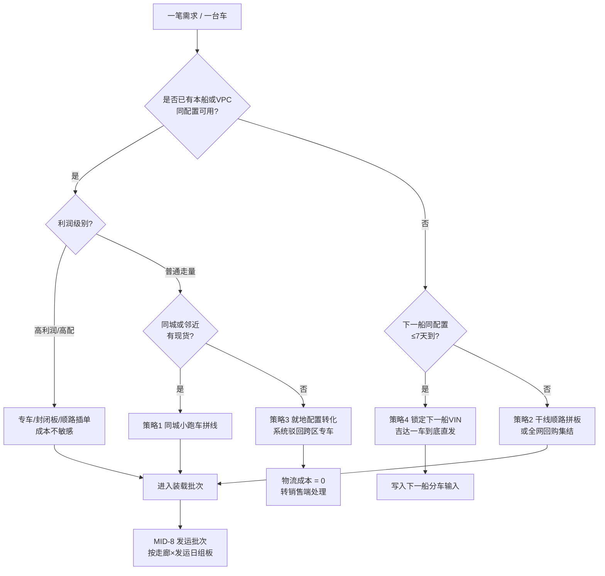

# 故事线一：两周船的分车计划 × 逐单物流方案（联合决策）

> 版本：v1.0｜场景：霍尔木兹封禁、达曼港停摆、全部车辆从吉达港单港入境
> 起点：**一艘滚装船 N01 将在 12 天后抵达吉达港，卸船 1,812 台**
> 本文件的价值：把用户要求的「分车计划」（交付项 1）与「每一单的物流方案」（交付项 2）**写成同一次求解的两个出口**，而不是两个模块。
> 口径与编号见 [00_总纲](./00_README_总纲与联合决策框架.md)；方案细则见 [03_订单类型物流方案矩阵](./03_订单类型物流方案矩阵.md)；参数与验收见 [04_参数基线与验收标准](./04_参数基线与验收标准.md)。
> **所有船量、订单、批次、回执数字均为【演示设定】**；路线里程与费用来自 `data/04_运力/*`。

---

## 0. 这一部戏的一句话

> **船到港前 12 天，Agent 必须同时回答两个问题：这 1,812 台车分给谁？每一台从吉达港出去走哪条路？——这两个答案必须是同一个解，因为两条路的选择会反过来改写"分给谁"。**

到船到港时，Omar 手里应该有一样东西：**一份带路径、带时点、带装载批次、带不可行清单的分车计划**，而不是一张只写数量的配额表。

---

## 1. 案情与数字（本船基线）

### 1.1 船与窗口

| 项 | 取值 | 说明 |
| --- | --- | --- |
| 船名 | `N01`（虚拟船名，仅作剧本代号） | 【演示设定】 |
| 卸船量 | **1,812 台 = 丰田 1,614 + 雷克萨斯 198** | 【演示设定】，比例遵循 W1 情景 89:11 |
| 到港日 | **D+12** | 【演示设定】 |
| 计划窗口 | D-12 → D+0（船到港前 12 天） | 舱单已随船发出，VIN/配置/目的地分配计划在手 |
| 执行窗口 | D+0 → D+5（到港后 5 个发运日） | 【演示设定】，受板车周转与城市限行约束 |
| 承运锁定 | **D+7 起**向自有车队与 3PL 发出调度令 | 依据[港口装车逻辑](../01_gemini调研/02_轿运车物流/02_港口装车逻辑.md)：抵港前 3–5 天为运力锁定期 |

### 1.2 单港运力事实（已有数据，不是设定）

| 指标 | 双港口 SC-DUAL | **仅西部 SC-WEST（主线）** |
| --- | ---: | ---: |
| 板车 | 180 辆 | 180 辆 |
| 有效周运力 | 3,226 台 | **1,865 台** |
| 参考周运输需求 | 2,404.84 台 | 2,404.84 台 |
| 全网净运力缺口 | 0 台 | **540 台** |
| 需求加权平均距离 | 332.76 km | **723.78 km** |
| 需求加权满载单台费 | 221.97 SAR | **439.74 SAR** |

来源：`data/04_运力/场景运力汇总.csv`。**注意**：单港口不是"少了一半供给"，而是"入口集中导致线路变长、周转变慢"。

### 1.3 第一记闷棍：5 天窗口装不下这一船

```
SC-WEST 7 天能力           = 1,865 台
5 天执行窗能力（线性折算）   = 1,865 × 5 ÷ 7 ≈ 1,332 台
本船卸船量                 = 1,812 台
────────────────────────────────────────────
5 天窗口内必然发不出的量     = 1,812 − 1,332 = 480 台
```

**这 480 台就是本故事线的核心决策对象。** Agent 不能把它藏起来，也不能假装运力够；它必须回答：**这 480 台是谁？它们应该晚发、改路、还是留在港口/吉达 VPC？**

而且缓发不是免费的：沙特港口仅 **3 天免堆**，超期阶梯涨价（见[05_调研](../05_调研/01_港口到门店的运输方式与空驶成本.md) §1）。所以"缓发"要同时付 **堆存费 + 资金占用成本 + 客户等待风险**，这就是影子价格的来源。

---

## 第一幕（D-12）：MID-1 车源划分 —— 先把"谁的车"和"什么车"分开

**画面：分车计划工作台 → 本船 N01 车源划分。**

Layla：

> "这一船 1,812 台，先告诉我哪些车已经有主、哪些只是我们想补的库。别把客户的车和我们的库存混在一起算。"

Agent 按[月度分车需求拆分](../03_ds设计/03_ALJ月度进销与分车需求拆分.md) §3.1 的四类口径对本船做 `MID-1` 车源划分（`DR1`）：

| 类别 | 定义 | 本船处理 | 边界纪律 |
| --- | --- | --- | --- |
| **① 本船已锁定订单** | 已确认订单，且 VIN 已随本船锁定 | 保留占用与最终交付对象，**不进入自由分配**；交期内仍可优化运输路径 | 一车不得重复占用 |
| **② 尚未配车的已确认订单** | 已确认订单，未锁定车辆 | 作为**优先待满足需求**参与本轮配车 | 不能在算待分配池时先扣一次、配车后再扣一次 |
| **③ 合理补库需求** | 无明确客户订单的补库量 | 按销量、覆盖、保底、贡献与物流条件分配 | **合理补库 = 缺口量**，不是"补满至目标库存" |
| **④ VPC 缓冲** | 只确定 VPC、暂不定门店的预留 | 留待后续订单或下一轮分车 | 与已分配互斥，不重复计量 |

### 1.1 逐车型划分结果

| 车型 | 品牌 | N01 供给 | ① 已锁定 | ② 待配订单 | ③ 合理补库 | ④ VPC 缓冲 | 锁单占比 |
| --- | --- | ---: | ---: | ---: | ---: | ---: | ---: |
| 凯美瑞 | 丰田 | 355 | 113 | 78 | 99 | 65 | 32% |
| 雅力士轿车 | 丰田 | 323 | 103 | 71 | 90 | 59 | 32% |
| 海拉克斯 | 丰田 | 291 | 151 | 64 | 44 | 32 | 52% |
| 卡罗拉 | 丰田 | 193 | 62 | 42 | 54 | 35 | 32% |
| RAV4 | 丰田 | 145 | 61 | 32 | 30 | 22 | 42% |
| 兰德酷路泽 300 | 丰田 | 113 | 62 | 24 | 16 | 11 | 55% |
| 兰德酷路泽 250 / 普拉多 | 丰田 | 81 | 45 | 17 | 11 | 8 | 55% |
| Fortuner | 丰田 | 49 | 21 | 11 | 10 | 7 | 42% |
| 汉兰达 | 丰田 | 32 | 13 | 7 | 7 | 5 | 42% |
| Urban Cruiser | 丰田 | 16 | 5 | 4 | 4 | 3 | 32% |
| Veloz | 丰田 | 16 | 5 | 4 | 4 | 3 | 32% |
| **丰田小计** | | **1,614** | **641** | **354** | **369** | **250** | **40%** |
| ES | 雷克萨斯 | 79 | 47 | 16 | 10 | 6 | 60% |
| RX | 雷克萨斯 | 49 | 29 | 10 | 6 | 4 | 60% |
| NX | 雷克萨斯 | 30 | 18 | 6 | 4 | 2 | 60% |
| LX | 雷克萨斯 | 40 | 24 | 8 | 5 | 3 | 60% |
| **雷克萨斯小计** | | **198** | **118** | **40** | **25** | **15** | **60%** |
| **合计** | | **1,812** | **759** | **394** | **394** | **265** | **41.9%** |

**守恒校验**：759 + 394 + 394 + 265 = 1,812 ✓；逐品牌小计相加等于合计，不重不漏。

### 1.2 与危机态全网基线的差异，必须解释

| 类别 | 危机态 30 天全网基线 | 本船 | 差异原因 |
| --- | ---: | ---: | --- |
| ① 已锁定 | 38% | **41.9%** | 本船车型结构偏高锁单（越野 55%、皮卡 52%、雷克萨斯 60%），把整体拉高 |
| ② 待配订单 | 20% | **21.7%** | 封禁后积压订单增多 |
| ③ 合理补库 | 28% | **21.7%** | 封禁初期补库目标整体下调，只保核心与必要覆盖 |
| ④ VPC 缓冲 | 16% | **14.6%** | 与 ③ 下调同源，缓冲同步收缩 |

> 口径提醒：这张表是**本船口径**，不是月度口径。不能把本船的四类比例直接当成全网参数，也不能把月度 22,000 台的百分比套到单船上。

### 1.3 本幕就暴露出来的 36 台：救不了的订单

在把 ② 待配订单与本船配置逐条比对时，Agent 报出一个**不可行清单**：

| 欠交项 | 数量 | 本船为何满足不了 | 处置 |
| --- | ---: | --- | --- |
| 兰德酷路泽 300 · 珍珠白 · 米内 | 9 | 本船同配置 17 台已在 ① 中锁给其他客户，其余为其他颜色 | 转 [故事线二](./02_故事线二_每日回购与调拨.md) Q-06 |
| 海拉克斯 · 双排 · 银 | 15 | 本船该配置已全部分配给企业大单与已锁订单 | 转入故事线二 A 组缺口池，与 Q-03 同车型一并处置 |
| 雷克萨斯 LX · 黑外红内 | 12 | 本船该配置仅 5 台，3 台已锁 | 转 [故事线二](./02_故事线二_每日回购与调拨.md) Q-04（等船 vs 调拨） |
| **合计** | **36** | 本船**无法覆盖** | **不计入本船分配，也不得重复计入供给** |

> **设计意图**：这 36 台是故事一与故事二之间的**结构性接口**。分车计划不负责"变出车"，它只负责**诚实地说出哪些需求这一船接不住**，然后把它们交给调拨/回购机制。这正是[业务全景](../03_ds设计/01_整车销售供应链业务全景与决策网络.md) §0.2 那句话的落地：*Agent 的价值不在于变出车来，而在于把不可解的部分讲清楚。*

**本幕产物**：`MID-1 车源划分结果`（含 15 个车型任务、四类互斥集合、36 台不可行清单）。

---

## 第二幕（D-9 → D-6）：MID-5 路径—装载联合校验 —— 分车与物流在这里被缝在一起

这是整个故事线**技术上最重要的 30 分钟**。

### 2.1 先把六条走廊（RC1–RC6）摆上桌

Faisal：

> "别先跟我说分到哪个 VPC。先给我看，从吉达港出去到底有哪几条路，每条路能装多少、走多久、一台多少钱。"

| 走廊 | 路径 | 覆盖目的地 | 单程里程 | 载具与装载 | 单台成本锚点 | 主要服务订单类型 |
| --- | --- | --- | ---: | --- | ---: | --- |
| **RC1** | 吉达 VPC → 西岸同城/短途 | 吉达、麦加、塔伊夫、延布 | 35–340 km | 大板车 8 台 + 3 车位小轿运 | 63.5 – 236.5 SAR | OT-03、OT-04 |
| **RC2** | 吉达 VPC → 利雅得 VPC 截流 → 中部门店 | 利雅得、布赖代、欧奈宰 | 950 km + 末端短驳 | 大板车 8–10 台 + 末端 1–2 台小跑车 | 497.5 + 末端 | 全部类型 |
| **RC3** | 吉达 → 东部 **干线穿透直达（绕达曼 VPC）** | 达曼、胡拜尔、朱拜勒、哈萨 | 1,290–1,490 km | 大板车，中途**只换班不卸车** | 628.5 – 708.5 SAR | OT-01、OT-02、OT-03 |
| **RC4** | 吉达 → 利雅得截流 → 东部门店 | 中东部过渡带、拼不满的东部散单 | 950 + 410 km | 两段大板车 + 利雅得 PDI | 497.5 + 269.75 + 二次装卸 | OT-04、OT-07 |
| **RC5** | 北向拼板 Milk Run | 麦地那 → 欧拉 → 哈伊勒 → 塔布克 | 420 → 1,020 km 串联 | 大板车一路卸货（8 台/趟） | 按串联里程总和计价 | OT-05 |
| **RC6** | 南向拼板 Milk Run | 艾卜哈、海米斯穆谢特、吉赞、奈季兰 | 650–910 km 串联 | 大板车一路卸货（8 台/趟） | 按串联里程总和计价 | OT-05 |

### 2.2 一个必须澄清的误区：利雅得截流的价值不在"省里程"

Agent 把两条去东部的路算平了：

```
RC3 吉达直达东部某店        = 1,370 km（单段，不换装）
RC4 吉达 → 利雅得 → 东部某店 = 950 + 410 = 1,360 km（两段，利雅得 PDI 一次）
```

**里程几乎相等（1,360 vs 1,370 km），但 RC4 多一次卸车、一次 PDI 排队、一次重新装板。**

所以[01_物流方案](../01_gemini调研/01_物流痛点/01_物流方案.md) 中"利雅得截流"的真正价值，必须被重新表述为三件事（本故事线采用此修正口径）：

| # | 利雅得截流的真实价值 | 为什么 |
| --- | --- | --- |
| 1 | **不进入达曼 VPC** | 避免"达曼卸车 → 再倒流回中部/北部"的 300–500 km 无效对流与二次装卸刮蹭风险 |
| 2 | **让中东部过渡带、北部、以及凑不满的散单在利雅得重新组板** | 这些量单独成不了板，必须有一个中轴枢纽做合并 |
| 3 | **把 PDI 与本地加装从爆仓的吉达港产线分流** | 吉达港按 ALJ 公开口径约 1,200 台/天处理能力，1,812 台单船到港会排队 |

> **设计修正（重要）**：源文档把"利雅得截流"当成东部订单的默认解；本故事线把它修正为——**东部的有主订单默认走 RC3 干线穿透（更快、少一次装卸），只有当"凑不满整板"或"需要在利雅得做加装/改配"时才走 RC4。** 这不是推翻源文档，而是把它的判断条件补全。

### 2.3 达曼 VPC 的新角色（路线 C 的落地）

Agent 给出达曼 VPC 的三条硬规则：

| 规则 | 内容 | 依据 |
| --- | --- | --- |
| **V-1** | 达曼 VPC **不再承接任何"有主订单车"** | 有主车绕达曼 VPC 会造成二次装卸与倒流 |
| **V-2** | 达曼 VPC 只接收"**纯东部本地中长期周转的无主安全库存**" | 即 ③ 补库中明确落在东部、且不需要再往中部倒流的部分 |
| **V-3** | 任何进入达曼 VPC 的车，账上必须记**完整全链路成本**：干线 + 二次装卸 + 后续再配送 + 库龄资金成本 | 否则"进达曼 VPC"会显得比"利雅得截流"便宜，这是假象 |

**一句话结论**：达曼 VPC 从"东部主力接收库"降级为"**末端毛细血管配送站 + 纯安全库存库**"（即[01_物流方案](../01_gemini调研/01_物流痛点/01_物流方案.md) 中的路线 C）。

### 2.4 联合校验：把 15 个车型任务摊到 6 条走廊上

Agent 把 `MID-3`（通道内求解）产出的分车草案按**走廊**汇总，检查"本期需求 vs 5 天有效能力"：

| 走廊 | 本期需求（①+②+③） | 5 天有效能力 | 缺口 | 影子价格（SAR/台） |
| --- | ---: | ---: | ---: | ---: |
| RC1 西岸短途 | 246 | 246 | 0 | 0 |
| RC2 中部干线 | 590 | 500 | **90** | 118 |
| RC3 东部穿透 | 375 | 300 | **75** | 165 |
| RC4 利雅得转东 | 85 | 60 | **25** | 96 |
| RC5 北向拼板 | 138 | 128 | **10** | 45 |
| RC6 南向拼板 | 113 | 98 | **15** | 38 |
| **合计** | **1,547** | **1,332** | **215** | — |

**三处必须对齐的口径：**

```text
本期需求 1,547 = ① 759 + ② 394 + ③ 394          （④ 265 不参与本轮抢运）
5 天有效能力 1,332 = SC-WEST 1,865 台/周 × 5 ÷ 7
运力缺口     215 = 1,547 − 1,332                  （= ③ 补库中本轮发不出的部分）
总缓发       480 = 215（③ 不足部分）+ 265（④ 缓冲）= 1,812 − 1,332
```

各走廊的车次数与有效能力均为【演示设定】，用于演示回压机制，不代表真实排班；但**需求合计、能力合计、缺口合计三者必须与 §1.3 的船量守恒咬合**。

**影子价格的算法（本故事线的可解释口径）：**

```text
走廊r影子价格 SP_r（SAR/台）
  = 该走廊需求超出已确认容量的部分 / 该走廊需求 × 单位抢运溢价
  其中 单位抢运溢价 = max( 现货抢运价/合同价 − 1 , 缓发的堆存+资金成本同行折价 )

分车排序用的边际利润口径：
  边际利润(m, r) = 单车净收入 − 到岸成本 − [变动物流成本(r) × (1 + SP_r)] − 资金占用
```

**把这句话翻译成业务语言**：RC3（东部穿透）最贵、最缺车，所以从 RC3 挪一台车出去的机会成本最高；RC1（西岸短途）不仅不缺车，而且缓发两三天几乎没有代价。**于是"谁先发"不取决于谁的需求更急，而取决于"哪个走廊的影子价格更高、哪个走廊晚发代价更低"。**

### 2.5 MID-6 回压改配：215 台运力缺口到底该缓发"谁"

运力缺口 215 台必须缓发。但**"缓发谁"不是一个数值问题，而是一个结构问题。**

**回压前 · 纯商业口径（只看覆盖缺口）的缓发构成【演示设定】：**

| 走廊 | ③ 补库需求 | 按覆盖缺口排序的缓发 | 进入抢运的 ③ |
| --- | ---: | ---: | ---: |
| RC1 西岸短途 | 175 | 25 | 150 |
| RC2 中部干线 | 95 | 95 | 0 |
| RC3 东部穿透 | 60 | 60 | 0 |
| RC5 北向拼板 | 35 | 25 | 10 |
| RC6 南向拼板 | 29 | 10 | 19 |
| **合计** | **394** | **215** | **179** |

> 注：RC4 的 85 台需求全部来自 ① 锁定与 ② 待配订单，**③ 补库为 0**——因为补库走 RC4（利雅得转东，多一次装卸）的性价比低于 RC3 直达。这是"达曼 VPC 降级 + RC3 优先"在数字上的直接体现。

Agent 发现这个结果**方向错了**：纯覆盖缺口排序偏爱"单店小缺口、门店数量多"的西岸（补齐一家小缺口就能让一家店立刻达标），却把**班次刚性最高**的远程拼板排到了缓发队里。

| 缓发对象 | 晚发代价 | 结论 |
| --- | --- | --- |
| **西岸短途（RC1，35–340 km）** | 板车 1 天可周转 6 车次，晚 2–3 天几乎无损失；客户多为同城零售，可协商 | **适合缓发** |
| **北部/南部拼板（RC5/RC6）** | 固定班次**每周仅 2–3 次**，错过一等就是一周；偏远门店渠道保底会被击穿 | **不适合缓发** |
| 东部穿透（RC3） | 影子价格最高（165 SAR/台），缓发等于把最贵的通路堵住 | **不适合缓发** |

**回压动作：按"走廊晚发代价"重排缓发顺序。**

| ③ 补库的抢运构成 | 回压前 | 回压后 |
| --- | ---: | ---: |
| RC1 西岸短途 | 150 | **0** |
| RC2 中部干线 | 0 | **55** |
| RC3 东部穿透 | 0 | **60** |
| RC5 北向拼板 | 10 | **35** |
| RC6 南向拼板 | 19 | **29** |
| **小计（③ 抢运）** | **179** | **179** |

```
回压后缓发池 = RC1 175 + RC2 40 = 215（③ 不足部分）
抢运池      = ① 759 + ② 394 + ③ 179 = 1,332
总缓发      = 215 + ④ 265 = 480 ✓
```

**代价与收益（必须同时讲出来）：**

- **代价**：**150 台西岸短途补库平均晚到 2–3 天**，约 11 家西岸门店的库存水位短期偏低（补库单无客户绑定，可协商）。
- **收益**：**95 台远程拼板车（RC3 60 + RC5 25 + RC6 10）不再缓发**，避免了"等一周 + 约 8 家偏远门店渠道保底被击穿 + 下一船再挤一次运力"的连锁反应。
- **净判断**：按[业务全景](../03_ds设计/01_整车销售供应链业务全景与决策网络.md) §6.1，渠道保底是**硬约束、不进利润优化**，所以这次重排是**约束驱动的必然选择**，不是利润权衡。

> **这就是"1 和 2 不能独立看"的实证**：如果先分车、再找物流，纯覆盖缺口排序会把 95 台远程车排进缓发队——因为偏远门店单店缺口小、算出来"更不急"。只有把**路径、班次刚性、影子价格**放进同一个求解，才会得出"西岸该多缓、远程该多抢"的相反结论。

**本幕产物**：`MID-5 路径—装载校验结果`（含六条走廊的影子价格、容量缺口、班次约束）+ `MID-6 回压改配记录`（含翻转依据与代价）。

---

## 第三幕（D-6）：MID-8 逐单物流方案 —— 同样一船车，五张不同的方案卡

分车结果发布后（`N01-P1`），物流方案不是一张统一的路由表，而是**按订单类型分化的五套方案**。这一幕就是用户要的"每一单的物流方案"。完整矩阵见 [03_订单类型物流方案矩阵](./03_订单类型物流方案矩阵.md)，此处给五张可上台的方案卡。

### 3.1 方案卡一 · 企业大单（OT-01）：60 台海拉克斯

| 项 | 内容 |
| --- | --- |
| 订单 | 某大型租车公司追加 **60 台海拉克斯双排白**，要求 **3 天内**交付至利雅得集中交付中心；逾期罚金高 |
| 本船可用 | 海拉克斯本船 291 台：①锁定 151、②待配 64（无此配置）、③补库 44、④缓冲 32 |
| 门店存量 | 全国门店**无主同配置**共 **19 台**，分散在 6 家店（利雅得 3、达曼 2、吉达 1） |
| **方案** | **32 台本船定向直配（RC2）+ 19 台门店回购集结 + 9 台从低优先补库借用** |
| 运输组织 | 32 台走 RC2 整板：4 车次 × 3,980 SAR = **15,920 SAR**（实载 8/8，497.5 SAR/台） |
| 回购段成本 | 19 台门店 → 集结 VPC 的调拨段：**现无线路、无价**（见 §5 数据缺口），按同城/邻近调拨 350–800 SAR/台估算【演示设定】 |
| 决策 | **批准**，但设三条红线 |
| 红线 1 | 不得击穿 ① 锁定 151 台与已确认的实名零售订单 |
| 红线 2 | 不得击穿授权渠道保底（保底是硬约束） |
| 红线 3 | **回购上界校验**：单台回购价 ≤（远途进口 + 陆地运输成本）−（短途调拨成本），超过则改为"等下一船 + 协商延期" |
| 谁确认 | 大单承诺由 Layla 确认；回购报价与资金由 Noura 确认；运输委托由 Faisal 确认 |

### 3.2 方案卡二 · 高配车（OT-02）：1 台雷克萨斯 LX 黑外红内

| 项 | 内容 |
| --- | --- |
| 订单 | 王室/高管客户，**黑外红内**，配置执念极强，明确不接受替代 |
| 本船可用 | LX 40 台：①锁定 24（含该配置 3 台）、②待配 8（无此配置）→ 本船可定向该配置 **最多 2 台**，到店约 **D+16** |
| 门店存量 | 全国有 **1 台**同配置无主现货，在**达曼门店** |
| 方案 A | 达曼门店 → 利雅得客户：1,370 km，封闭板/液压板**单台零售价约 1,900 SAR**（[05_调研](../05_调研/01_港口到门店的运输方式与空驶成本.md) §4.4），**2–3 天到** |
| 方案 B | 锁定本船那 2 台中的 1 台，吉达一车到底直达利雅得：运费约 497.5 SAR（整板摊销），但**要等 D+16** |
| 方案 C | 就地配置转化（送保养/换内饰）：**不可行**，客户对红内有明确执念 |
| **决策** | **选 A**。理由：LX 单车利润远大于 1,900 SAR 运费；等待 14 天的退单概率高；且方案 A 用的是"存量错配"，不占用稀缺的本船运力 |
| 例外 | 若那台现货已被其他订单锁定 → 自动转方案 B，并把该客户升为"锁定下一船 VIN"的受保护客户 |
| 风沙防护 | 全程**必须上封闭板车或加厚保护衣**，溢价计入该单 COGS（依据[轿运车基础知识](../01_gemini调研/02_轿运车物流/01_基础知识.md)：干线高速风沙会风蚀车漆） |

### 3.3 方案卡三 · 普通订单（OT-03）：散客零售

**正面案例（同城，批准）**

| 项 | 内容 |
| --- | --- |
| 订单 | 利雅得 D-001 散客，1 台凯美瑞白基础款 |
| 现状 | 本店无；同城 D-004 有 1 台无主 |
| 方案 | 策略 1 **同城闪电调拨**：3 车位小轿运，35 km，RT01 整趟 508 SAR |
| 拼载优化 | 同批可带 D-002、D-007 各 1 台 → 实载 3/3，**单台 169 SAR** |
| 决策 | 批准 |

**反面案例（跨区，驳回）**

| 项 | 内容 |
| --- | --- |
| 订单 | 达曼散客，1 台雅力士**银色** |
| 现状 | 全国仅**吉赞**门店有同配置现货 |
| 若调拨 | 吉赞 → 达曼 约 1,500 km，单台专车 **3,000+ SAR** |
| 毛利对照 | 雅力士单车零售毛利**远低于**该运费 |
| **决策** | **系统驳回调拨**，强制走策略 3：**就地配置转化**（销售话术 + 赠 2 年保养 + 少量精品），0 物流成本 |

> **规则**：低利润车型**禁止**为单台开跨区专车。系统在销售端弹窗提示调拨成本，把"物理上的车辆移动"转化为"销售端的需求移动"（依据[05_调拨逻辑](../01_gemini调研/03_调拨情况/05_调拨逻辑.md) 策略 3）。

### 3.4 方案卡四 · 补货单（OT-04）：3 台 RAV4 混动补库——"达曼 VPC 降级"的落地检验

| 项 | 内容 |
| --- | --- |
| 需求 | 朱拜勒直营店 ③ 补库 3 台 RAV4 混动（无客户订单，按缺口口径） |
| 方案甲 | **RC3 吉达直达朱拜勒**：1,490 km，整趟 5,668 SAR。若实载 8 台 → 708.5 SAR/台；**若只发 3 台 → 1,889 SAR/台** |
| 方案乙 | **走达曼 VPC 中转**：吉达→达曼 5,284/8 = 660.5 SAR/台 + 达曼→朱拜勒 870/8 = 108.75 SAR/台 + **二次装卸** ≈ 769 SAR/台起，且车辆进入"盲端仓库"，后续若需往中部倒流成本极高 |
| 方案丙 | **与东部其他门店拼板**（达曼 2 + 胡拜尔 1 + 哈萨 2 + 朱拜勒 3 = 8 台）→ RC3 整板一路串联卸货 |
| **决策** | **选方案丙**；若 D+2 仍凑不满 8 台，则接受方案甲但**并入下一班次**，**默认不走方案乙** |
| 规则依据 | V-1/V-2/V-3：达曼 VPC 只接纯东部本地中长期周转的无主安全库存，且必须记完整全链路成本 |

> **这张卡是整部戏的"题眼"**：同一批补库车，走达曼 VPC（旧模型）在账面上看着便宜（769 vs 708.5 只贵一点点），但一旦把"二次装卸 + 倒流风险 + 库龄资金成本"记进账，结论就翻过来。**分车的落位（门店直落 / 利雅得截流 / 达曼 VPC）由全链路成本决定，而不是由"离哪个 VPC 近"决定。**

### 3.5 方案卡五 · 偏远地区拼单（OT-05）：北向与南向 Milk Run

| 方向 | 门店与台数 | 串联路径 | 里程 | 凑板规则 | 时效与决策 |
| --- | --- | --- | ---: | --- | --- |
| **北向 RC5** | 麦地那 2、欧拉 1、塔布克 5 | 吉达 → 麦地那 → 欧拉 → 塔布克 | 终点 1,020 km，串联约 1,150 km | **累计 ≥ 7 台或达每周 2–3 次固定班次红线**才放行 | 5–7 工作日；**销售签单时必须明确告知交期** |
| **南向 RC6** | 艾卜哈 2、吉赞 3、奈季兰 2 | 吉达 → 吉赞 → 艾卜哈 → 奈季兰 | 650–910 km 串联 | 同上 | 同上 |

**成本口径（必须显式说明）**：按**串联里程总和**计价，不是单点直达价。若用单点直达价去乘，会系统性低估偏远拼单成本；若用"整趟价 ÷ 8"去算不满载的拼板，会低估一倍以上。

**三条纪律**：

1. **拼板等待期要计入承诺交期**：等待 1–3 天不是"物流慢"，是成本最优的必然代价。
2. **偏远门店不得低于渠道保底**，但**补库量按缺口而非满库**——避免"货在沙漠里晒太阳"。沙特内陆 50℃ 高温与沿海盐雾会加速车漆、轮胎与胶条老化（依据[04_vpc逻辑](../01_gemini调研/03_调拨情况/04_vpc逻辑.md)）。
3. 高价值车（LC300、LX）走北向/南向时，**优先用封闭板或加厚保护衣**。

### 3.6 五张卡的共同规则（方案生成的决策树）



---

## 第四幕（D+0 → D+5）：到港与执行 —— 计划变成班次和 VIN

**画面：物流执行台。**

Faisal：

> "今天哪一批车具备发运条件，哪一批还卡在车辆释放或承运确认？"

### 4.1 到港四步（依据[港口装车逻辑](../01_gemini调研/02_轿运车物流/02_港口装车逻辑.md)）

| 步 | 动作 | 本船的关键约束 |
| --- | --- | --- |
| 1 接卸 + 清关 | 码头司机逐台开下船 → 港口缓冲区/PDI 中心 | ALJ 公开口径约 **1,200 台/天**处理能力，1,812 台需约 1.5 天，且会与同期到港车排队 |
| 2 港口 PDI 与分类堆放 | 清关、SASO 认证、撕膜洗车，按目的地静态分类 | **按走廊分类**（RC1–RC6），不按 VPC 分类——这是本故事线与旧流程的物理差别 |
| 3 干线装车 | 大板车按"同大方向满载发车"拼板 | 装满一车需 **2–3 小时**（含倒车上板、四点式绑带），清晨 05:00–06:00 起机避开限行 |
| 4 区域中转 + 最后一公里 | 大板车到城市服务点/VDC，换 1–2 台小板车进城 | 大板车**进不了市区门店**；末端配送集中在 **22:00–05:00** 限行解除窗 |

### 4.2 时间倒推（沙特限行规则）

```
目标：凌晨 01:00 到达利雅得市郊 VDC（避开 06:00–09:00 / 16:00–22:00 限行）
──────────────────────────────────────────────────────
倒推：前一日 11:00–12:00 必须驶离吉达港
     净驾驶 12–14 小时，中途 2 次换班补给（各 45–60 分钟）
司机：双司机轮班，日驾驶上限 9 小时，连续 4.5 小时强制休息 45 分钟
合规：ELD 电子记录 + Naql 平台 + 专业驾驶员卡实名打卡
```

### 4.3 运力是怎么来的（"候鸟式"前置集结）

| 动作 | 时间 | 依据 |
| --- | --- | --- |
| 数据前置 | 船从日本/泰国出发时 | 已拿到 VIN、配置、目的地分配计划 |
| 运力锁定 | **D+7 起**（抵港前 3–5 天） | 向自有车队与 3PL 发调度令 |
| 前置集结 | D+7 → D+12 | 让拉着回程货（二手车、退市车、异形工业品）到吉达的板车**顺路接新车**，彻底避免空车进港 |
| 自有 vs 外包 | 全程 | **自有核心车队**担稳定供应线与高价值车（雷克萨斯、高配 LC）；**3PL** 承担爆发盘 |

### 4.4 每个运输任务必须回答的七个问题

> 运什么（VIN/车型/配置）→ 从哪到哪（走廊 + 节点层级）→ 何时可发 → 最晚何时到 → 谁承运 → 如何装载（模板/实载/重量）→ 谁收货。

**发运与回执的守恒**：

```
发运后：源地现货 −N，在途 +N
签收后：在途 −N，目标门店库存 +N
```

已发运事实**不可抹除**：改道必须另建变更记录，不能回写成"从未发运"。部分签收按 VIN 更新，不用整单完成状态掩盖未到车辆。

### 4.5 一个必须防的坑：在途重复计量

门店品牌在途 **1,012 台**的既有记录里，可能**已经包含**本船拟发的部分批次。Agent 必须先做**在途去重**，否则会把同一台车当成两次供给发出去。

**本幕产物**：按走廊 × 发运日组织的发运批次、VIN 绑定、承运确认、收货窗口、异常与费用记录。

---

## 第五幕（D+7）：复盘与回写 —— 三段戏的接口在这里合上

Omar：

> "这一船分了多少、发了多少、到了多少、还欠什么？把单港口造成的影响单独说。"

### 5.1 复盘表（保留不可满足项，不做"供需平衡"式的净掉）

| 复盘问题 | 统计依据 | 不能怎样展示 |
| --- | --- | --- |
| 哪个车型供给不足？ | 逐车型库存投影 + 本船释放 | 把 36 台欠交说成"已由本船覆盖" |
| 哪一段受运输限制？ | 各走廊容量、车次、班次 | 把"480 台缓发"当成"480 台欠交" |
| 缓发变成了什么？ | 缓发池 480 台的后续处置与到店时间 | 把缓发台的数同时记进"已发运" |
| 分车与物流的联合决策是否有效？ | 回压翻转前后对比：远程误班次数、渠道保底击穿数 | 只报"总运费"不报"晚到天数" |
| 下一船要做什么？ | 未满足需求、仍缓发的量、待交易回购、待结算 | 把品牌级参考缺口与周消耗直接叠加 |

### 5.2 回写到下一轮的三条线

| 回写线 | 内容 | 去向 |
| --- | --- | --- |
| **需求线** | 36 台欠交订单 + 215 台缓发补库（其中 150 台西岸短途因回压后移） | 下一船 N02 的 ② 待配订单池与 ③ 补库基线 |
| **供给线** | 本船 ④ 缓冲 265 台的释放情况、回购可得量 | 更新 `B4` 危机态供给池 |
| **规则线** | 影子价格参数是否需调整、缓发阈值、达曼 VPC 权重 | 更新 `S2 参数版本` |

### 5.3 本部的验收口径

- 1,812 = 759 + 394 + 394 + 265，逐车型可对回；不重不漏。
- 1,812 = 1,332（抢运）+ 480（缓发）；480 = 215（补库）+ 265（缓冲）。
- 六条走廊的容量、车次、影子价格可以逐条解释。
- 五张方案卡各自能回答：为什么是这条路、单台多少钱、谁确认、例外怎么办。
- 36 台欠交**既不计入本船供给**，也不被本船的复盘掩盖。

---

## 6. Agent 做了什么 / 人确认了什么

| 环节 | Agent 自动做 | 需要人确认 |
| --- | --- | --- |
| MID-1 车源划分 | 读舱单、拆四类、做互斥校验、产出不可行清单 | 无（事实性输出） |
| MID-2~4 通道与网点 | 按 `DR2`–`DR8` 切通道、下沉到 79 店 | 通道配额比例（Omar / Hassan） |
| MID-5 路径—装载校验 | 算六条走廊容量、影子价格、班次约束 | 无（可行性事实） |
| MID-6 回压改配 | 生成翻转方案、标代价与收益 | **批准翻转**（Omar + Hassan） |
| MID-7 发布 | 生成 `N01-P1` 版本与明细 | **批准发布**（Omar） |
| MID-8 逐单方案 | 按订单类型生成方案卡、算成本、查配置 | 大单承诺（Layla）、回购（Noura）、运输委托（Faisal） |
| 执行 | 登记模拟回执、更新在途与库存 | 实际发运与签收由承运商/门店确认 |

**统一响应结构**：结论 → 依据 → 候选动作及取舍 → 待确认条件 → 对计划和指标的影响。未确认或未取得回执的事项**保持原状态**，不预填"全网 100% 完成"的结局。

---

## 7. 与用户指定四份文档的对应关系（本部）

| 指定文档 | 在本部的位置 |
| --- | --- |
| [01_物流方案](../01_gemini调研/01_物流痛点/01_物流方案.md) | §2.2 利雅得截流价值修正、§2.3 达曼 VPC 降级三规则、RC3/RC4/RC5 的路线 A/B/C 落地 |
| [轿运车基础知识](../01_gemini调研/02_轿运车物流/01_基础知识.md) | §4.1 装车 2–3 小时与清晨起机、§4.2 双司机轮班与补给、§3.2 风沙防护 |
| [港口装车逻辑](../01_gemini调研/02_轿运车物流/02_港口装车逻辑.md) | §1.1 运力锁定期、§4.1 到港四步、§4.3 候鸟式前置集结、自有+3PL 混合 |
| [05_调拨逻辑](../01_gemini调研/03_调拨情况/05_调拨逻辑.md) | §3.3 策略 3 就地转化与系统驳回、§3.2 策略 4 等下一船；完整四策略见[故事线二](./02_故事线二_每日回购与调拨.md) |
| [长途补给情况](../01_gemini调研/02_轿运车物流/03_长途补给情况.md) | §4.2 限行倒推、ELD/Naql、服务区换班 |
