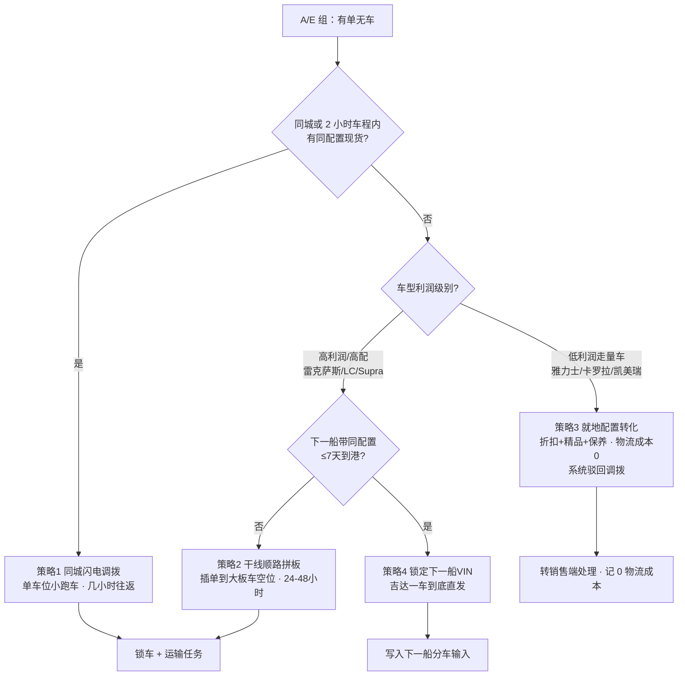

# 故事线二：每天早晨，调拨员 Sara 面对一堆订单

> 版本：v1.0｜场景：与[故事线一](./01_故事线一_两周船的分车计划与逐单物流.md)同一周（船仍在海上，D-6 ~ D0）
> 起点：**每天 08:30，调拨员 Sara 的收件箱里堆着 23 笔调拨申请**
> 本文件的价值：把用户要求的「基于订单的回购和调拨」（交付项 3）写成一条可日复一日运转的工作流，而不是一堆规则。
> 全部数字为【演示设定】；决策框架依据 [05_调拨逻辑](../01_gemini调研/03_调拨情况/05_调拨逻辑.md)、[门店到门店](../01_gemini调研/03_调拨情况/02_门店到门店.md)、[回购调拨](../01_gemini调研/03_调拨情况/03_回购调拨.md)。

---

## 0. 这一部戏的一句话

> **分车计划管的是"增量怎么来"，调拨管的是"存量怎么挪"。当供给腰斩、订单积压时，后者能救回来的利润往往比前者更快——但它的每一笔都在烧运费，所以必须有一个人每天早晨替公司说"不"。**

在[故事线一](./01_故事线一_两周船的分车计划与逐单物流.md)里，分车计划诚实地交出了 **36 台本船覆盖不了的欠交订单**。这一部戏就是接住这 36 台的地方。

---

## 1. 起点：08:30 的申请池

**画面：每日调拨工作台。**

Sara：

> "23 笔。先按'能不能不调'给我分组，别一上来就给我路线和价钱。"

Agent 先把申请池按**业务意图**（不是按路线）分成五组：

| 组 | 定义 | 笔数 | 处置基调 |
| --- | --- | ---: | --- |
| **A 有单无车** | 目标店无同配置现货，客户订单已确认 | 11 | 进入四策略决策树 |
| **B 有车无单** | 门店呆滞库存 / 跨区错配，需要回收再利用 | 4 | 优先转为 A 组的来源，不新增调拨 |
| **C 大单加塞** | 企业/政府大单，本地无货，需全网集结 | 2 | 触发回购机制 |
| **D 退单/取消回流** | 客户取消、订单失效，车已在店或在途 | 3 | 优先找顺路回程配载 |
| **E 跨区急单** | 明确定时限的跨区交付 | 3 | 与 A 组共用决策树，但时限优先 |
| **合计** | | **23** | 其中 **10 笔**需要 Sara 做非例行决策，其余走规则自动放行或自动驳回 |

> **关键设计**：Agent 的价值不是"把 23 笔都排出一条路"，而是**先把不需要决策的挑出去**。A 组里同城有现货的、D 组里能顺路回程的，规则直接放行；真正需要 Sara 花时间的是那 10 笔。

### 1.1 三层候选来源搜索顺序（`DR` 口径，见[双轨篇](../03_ds设计/02_直营_授权双轨分车逻辑与图谱中间产物.md)）

```
第 1 层：目标店现货与既有入库安排（本店在途 / 已排程的 VPC 配送）
第 2 层：可释放的 VPC 库存（本船 ④ 缓冲中可定向释放的部分）
第 3 层：可调门店库存（同城 → 邻近 → 跨区，逐级扩大半径）
第 4 层：可交易的外部库存（授权车商现货 → 回购）
```

**这是搜索顺序，不是成本最优顺序。** 候选集合全部找出来之后，才统一比较**及时性、源地影响、总费用**三者（依据 [05_调拨逻辑](../01_gemini调研/03_调拨情况/05_调拨逻辑.md) §二）。

---

## 2. 四策略决策树（每一笔 A/E 组申请都要跑一遍）



### 2.1 7 天船期博弈线（这是决策树最容易被忽略的一环）

> 若下一艘带同配置车的滚装船 **5 天后**到港：从外地调拨一台要 3 天、运费约 2,000 SAR；等下一船在吉达下船再经优化模型运过来要 5 天、运费约 500 SAR。**此时系统应拦截调拨申请，强制该订单绑定 5 天后抵港那台新车的 VIN。**
> 若下一艘船要等 **45 天**：为防客户跑单，系统放行调拨，立刻从外地调车。

本故事线的 7 天线设在本船 N01（D+12 到港）上；[故事线一](./01_故事线一_两周船的分车计划与逐单物流.md) §3.3 已经把这套博弈写成了一张卡。

**本故事线补一条规则**：单港全纳下，"等下一船"还有一层额外优势——**下一船的车下船后可直接应用"吉达一车到底直发"模型，对东部客户是 0 公里纯新车**；而调拨来的车是"从利雅得门店二次装板"的落地车，车况、里程记录、客户感知都更差。所以 7 天线在单港背景下应适当**放宽到 9–10 天**。

---

## 3. 今天需要 Sara 决策的 10 笔

### 3.1 决策总表

| # | 申请方 | 车型·配置 | 数量 | 组 | 现状与候选来源 | 四策略初判 | 最终决策 |
| --- | --- | --- | ---: | --- | --- | --- | --- |
| Q-01 | 利雅得 D-001 散客 | 凯美瑞 · 白 · 基础 | 1 | A | 本店无；同城 D-004 有 1 台无主 | 策略 1 | **批准**，拼 3 台同线 |
| Q-02 | 达曼 D-031 散客 | 雅力士 · 银 | 1 | A | 全网仅吉赞门店有同配置 | 策略 3 | **驳回调拨**，强制就地转化 |
| Q-03 | 大型租车公司 | 海拉克斯 · 双排 · 白 | **60** | C | 本船可定向 32；门店无主 19，散在 6 店 | 大单集结 | **批准**：32 直配 + 19 回购 + 9 借用 |
| Q-04 | 利雅得 VIP 客户群 | 雷克萨斯 LX · 黑外红内 | **12** | A/C | 达曼店有 1 台现货；本船该配置可定向 2 台 | 策略 1 + 策略 4 | **混合**：1 台立即调拨 + 11 台等船 |
| Q-05 | 塔布克授权车商 | 兰德酷路泽 250 | 2 | A | 利雅得 VPC 缓冲可释放 | 策略 2 | **批准**，并入西北拼板等凑板 |
| Q-06 | 利雅得 D-001 客户 | 兰德酷路泽 300 · 珍珠白·米内 | **9** | A | 本船同配置 17 台已被 ① 锁定，无可释放；门店有 3 台近似配置无主 | 回购 vs 等船 | **部分批准**：3 台回购 + 6 台转下一船 |
| Q-07 | 朱拜勒 D-041 | RAV4 · 混动 | 3 | A | ③ 补库缺口；东部方向池 | 策略 2 | **批准**，走 RC3 拼板，**不进达曼 VPC** |
| Q-08 | 吉达 D-005 | 汉兰达 | 1 | D | 客户取消，车已在店 | 回程配载 | **批准**，配给利雅得等单客户 |
| Q-09 | 艾卜哈门店 | 凯美瑞 | 2 | A/E | 南部方向池 | 策略 2 | **批准**，并入 RC6 南向拼板 |
| Q-10 | 麦地那 D-021 | 雷克萨斯 ES | 1 | A | 同城无；达曼店有 1 台；**本船待配 16 台** | 调拨 vs 改配 | **批准改配**，0 调拨成本 |

### 3.2 三笔最值得讲的

#### Q-03 · 60 台海拉克斯：一整条回购链条

| 步骤 | 动作 | 关键约束 |
| --- | --- | --- |
| 1 | 本船 ④ 缓冲中定向释放 **32 台**给该大单 | 释放后缓冲从 265 → 233，不能击穿其他保底 |
| 2 | 全网搜 **19 台**门店无主同配置（利雅得 3、达曼 2、吉达 1 城共 6 店） | 必须是**无主**且**权属可交易**的车，在库 ≠ 可调 |
| 3 | 启动 **19 张回购单** | 回购上界校验（见 §4.2） |
| 4 | 二次点检：0 公里、保护膜完好、随车工具齐全 | 二次点检不合格 → 退回或换车 |
| 5 | 二次装板 → 集中到利雅得集中交付中心 | **禁止代驾自走**，全程上板车 |
| 6 | 剩余的 **9 台**从最低优先级补库中借用 | 借用的 9 台要记入下一轮补库缺口，不得静默消失 |

**二次运费谁承担？**（依据[回购调拨](../01_gemini调研/03_调拨情况/03_回购调拨.md) §3）

| 原因归属 | 二次运费承担方 | 门店 KPI 影响 |
| --- | --- | --- |
| 总部战略原因（大客户、战略车型） | **总部物流预算** | 返还信用额度，不扣门店利润 |
| 门店自身原因（错判市场、盲目要车） | **扣原门店利润** | 直接影响门店 P&L |
| 总部当初强塞的滞销车 | 总部 | 不扣门店 |

本单属于**总部战略原因**（大客户 SLA + 高额逾期罚金），因此二次运费进总部预算。

#### Q-04 · 12 台雷克萨斯 LX：把一单拆成两种解法

| 子单 | 数量 | 处置 | 理由 |
| --- | ---: | --- | --- |
| 最高优先客户 | 1 | **立即从达曼门店调拨**（封闭板，1,370 km，约 1,900 SAR/台） | 该客户不可等；LX 单车利润远超运费 |
| 其余客户 | 11 | **3 台**从本船该配置定向（D+16 到店）+ **8 台**锁定下一船并给补偿 | 8 台同时用专车跨区调拨的运费会吃掉结构利润；主动延期 + 补偿比硬调更合理 |

**这里的博弈点**：12 台里只救 1 台，其余 11 台走"等 + 补偿"，会不会引发退单？Agent 必须给出**客户分层**（实名订单 / 高价值 / 可挽回）和**流失惩罚项**，而不是只报运费（依据[业务全景](../03_ds设计/01_整车销售供应链业务全景与决策网络.md) §6.1）。

#### Q-06 · 9 台兰德酷路泽 300：一次真实的"回购 vs 等船"计算

| 项 | 计算 |
| --- | --- |
| 需求 | 9 台 LC300 珍珠白米内，全网无同配置现货，本船也无 |
| 路径 A：门店回购 | 全网找到 3 台**近似配置**（同色系，非米内）无主车，可协商配置转化 → 3 台回购 |
| 路径 B：等下一船 | 剩余 6 台锁定下一船，客户给补偿 + 优先交付权 |
| 为什么不是 9 台全部回购 | 全网根本没有 9 台可回购的近似车；强行回购会把 3 家门店的水位打到保底线以下 |

**这条规则最重要**：**回购不是无限弹药**。它的上界同时受三道约束——回购价上界、全网可回购台数、源店水位下限。

---

## 4. 回购机制（本故事线的核心增量）

### 4.1 三种回购形态

| 形态 | 定义 | 适用场景 | 资金与账务 |
| --- | --- | --- | --- |
| **全价回购** | 按该车当前账面价买回 | 总部战略调整（大客户、车型重配） | 总部承担，返还门店信用额度 |
| **折价回购** | 低于账面价买回，差价即门店损失 | 门店错判市场、呆滞车 | 二次运费 + 折价扣门店利润 |
| **换货** | 以车换车，不动现金 | 门店车型结构错配（要皮卡给了轿车） | 双方调整库存与考核基数 |

### 4.2 回购上界公式（本故事线统一口径）

```text
回购可接受溢价上限（单台）
  = 目标市场的干线运费 + 末端配送费 − 门店→集结地短途调拨费
```

**利雅得算例（用现有路线数据）：**

| 项 | 取值 | 来源 |
| --- | ---: | --- |
| RC2 吉达 → 利雅得干线满载摊销 | 497.5 SAR/台 | `P-W-RUH` 3,980 ÷ 8 |
| 末端城市服务点 → 门店短驳 | 约 20 SAR/台 | 【演示设定】，需补末端线路表 |
| 门店 → 集结地短途调拨 | 约 400 SAR/台 | 【演示设定】，现无线路价 |
| **可接受溢价上限** | **≈ 117.5 SAR/台** | 497.5 + 20 − 400 |

**结论（要敢于说出口）**：回购的谈判空间只有约 **100–400 SAR/台**。超过这个数，**等下一船更划算**——因为下一船的车下船后可以直接"吉达一车到底直发目标市场"，少一次门店→集结的逆向运输。

> 口径提醒：`497.5` 是**满载摊销**，不能拿去乘一个 3 台的小单当专车价；单台专车要走零售价量级（普通平板 900–1,400 SAR/台，液压/封闭 1,900 SAR/台，见[05_调研](../05_调研/01_港口到门店的运输方式与空驶成本.md) §4.4）。**回购段与干线段的计价口径必须分开写。**

### 4.3 回购的完整闭环（六步）

```
① 总部触发回购指令（大单 / 呆滞 / 渠道保底冲突）
        ↓
② 系统冻结 VIN（Lock Status）：原门店销售员无法再售出或绑定
        ↓
③ 财务内部清算：从原门店考核库存中剔除，返还信用额度（Credit Note）
        ↓
④ 二次点检：0 公里、保护膜完好、无展厅刮蹭、随车工具齐全
        ↓
⑤ 二次装板：全程上板车，禁止代驾自走；里程严格控制在 10 km 以内
        ↓
⑥ 运抵目标门店 / 集中交付中心 → 到店完成
```

**两条状态纪律**：

- **权属交接与实物移动分开记录**：回购单的状态是"报价 → 待交易确认 → 可执行 → 权属已交接 → 已结算"；运输段是"待排程 → 待承运确认 → 在途 → 已签收"。**到店完成 ≠ 结算完成。**
- **回购不增加全国实物量**：只改变"可控量与位置"。复盘时不能把回购的车同时计入"新供给"和"调拨量"。

---

## 5. 双端影响校验：每一次调拨都要问两个门店

Hassan：

> "调走以后，源店的同车型够不够？不要给我源店所有丰田车的库存总数。"

Agent 对每一笔调出做**同车型、同配置**的双端水位表：

| 校验项 | 源店（调出） | 目标店（调入） |
| --- | --- | --- |
| 实物库存 / 自由库存 | 必须按车型拆 | 同上 |
| 有效订单与已锁量 | 调出后是否影响本店承诺 | 调入后是否满足原承诺交期 |
| 最低覆盖水位（保底） | **调出后不得低于保底线** | 不得超库容上限 |
| 预计消耗与及时在途 | 调出后多久会缺 | 是否已有在途重复覆盖 |
| 权属与交易条件 | 在库 ≠ 可调；授权车商需先取得调度权或交易关系 | 是否接受二次点检结果 |
| 运费归属 | — | 由**接收方门店**承担，计入该单 COGS |

**Q-03 的双端影响示例**（从 24 家候选门店中抽 6 家展示；被剔除的候选由第 7 家替补，最终形成 19 台回购清单）：

| 源店 | 调出台数 | 该店海拉克斯自由库存 | 调出后水位 | 判断 |
| --- | ---: | ---: | ---: | --- |
| 利雅得 D-003 | 1 | 4 | 3（≥ 保底 2） | 可调 |
| 利雅得 D-009 | 1 | 3 | 2（= 保底 2） | 可调但需报备 |
| 利雅得 D-014 | 1 | 2 | 1（< 保底 2） | **不可调**，改从缓冲借 1 台 |
| 达曼 D-031 | 1 | 5 | 4 | 可调 |
| 达曼 D-033 | 1 | 3 | 2 | 可调 |
| 吉达 D-005 | 1 | 6 | 5 | 可调 |

> **规则**：源店水位校验是**硬门槛**，不是罚分项。任何一笔调出使源店低于保底线，都必须显式例外审批，不能靠一个加权分数掩盖。

---

## 6. 每日输出与状态机

### 6.1 一天的输出

| 输出 | 内容 | 有效期 |
| --- | --- | --- |
| 调拨方案 | 每笔申请的处置结论 + 依据 + 代价 | 当日 |
| 锁车关系 | 同一 VIN 在周计划、调拨、运输中共用一套记录 | 确认前重检 |
| 运输任务 | 与周分货的运输任务**共用同一个执行台** | 到签收 |
| 回购单 | 报价、折价率、权属交接、支付与结算 | 独立闭环 |
| 待确认清单 | 需 Sara / Hassan / Noura 确认的事项 | 当日截止 |
| 例外升级 | 超出本周配额或影响既有承诺的，回写[故事线一](./01_故事线一_两周船的分车计划与逐单物流.md)的分车版本 | 触发式 |

### 6.2 调拨单状态机

```
候选 → 待条件确认 → 已确认 → 执行中 → 到店完成
         ↓              ↓
      已驳回         已取消 / 部分完成 / 失败（单列，不掩盖）
```

### 6.3 冲突重检（防止用过期数据锁车）

调拨确认前**必须重检**订单、锁定、库存版本。发生冲突则**撤回过期建议并重新计算**，不得沿用一个已经失效的候选。

**最容易踩的三种过期**：

1. 候选来源的那台车，在确认前被本店卖掉了；
2. 那台车早就已经有一张在途运输任务在覆盖（重复计量）；
3. 目标客户已经在别处被满足了（重复满足）。

---

## 7. 每日指标（本部专用）

| 指标 | 口径 | 红线/目标 |
| --- | --- | --- |
| **调拨成本 / 该单毛利** | 逐笔计算，不取平均 | 超过 30% 触发驳回或转策略 3 |
| **驳回率** | 驳回笔数 ÷ A 组笔数 | 不是越低越好；低利润车驳回率应显著高 |
| **驳回后成交转化率** | 驳回后走就地转化成交的笔数 ÷ 驳回笔数 | 目标 ≥ 50%（证明"转化为需求移动"有效） |
| **回购净增益** | 目标市场溢价 − 回购折价 − 短途调拨成本 | 必须为正才批准回购 |
| **源店水位击穿数** | 调出后低于保底的门店数 | **必须为 0**（例外需显式审批） |
| **承诺兑现率** | 按时到店 ÷ 已承诺笔数 | 高价值客户单独立口径 |
| **平均决策时长** | 申请进入 → 出具结论 | 例行笔应秒级；非例行笔当日闭环 |
| **在途重复计量数** | 被同一 VIN 覆盖两次的任务数 | **必须为 0** |

---

## 8. Agent 做了什么 / Sara 确认了什么

| 环节 | Agent 自动做 | 需要 Sara 确认 |
| --- | --- | --- |
| 申请池分组 | 按业务意图分 A–E 五组，挑出例行笔 | 无 |
| 候选来源搜索 | 按四层顺序找候选，做在途去重与锁定重检 | 无 |
| 四策略初判 | 跑决策树、算成本、比对船期 | 无 |
| 驳回建议 | 对低利润跨区单给出"策略 3"方案与话术素材 | **确认驳回** |
| 回购比较 | 算上界、查全网可回购台数、查源店水位 | **确认回购报价与条件**（Noura） |
| 双端影响 | 逐笔同车型双端水位表 | 例外审批（Hassan） |
| 锁车与任务 | 生成调拨单、运输任务、锁车关系 | 确认执行与运输委托 |
| 回写 | 把借用/延期/回购可得量写回下一轮分车输入 | 无 |

---

## 9. 与[故事线一](./01_故事线一_两周船的分车计划与逐单物流.md)的三处咬合（不能独立看）

| # | 咬合点 | 故事一 → 故事二 | 故事二 → 故事一 |
| --- | --- | --- | --- |
| 1 | **36 台欠交** | 故事一 MID-1 产出不可行清单 | 故事二 Q-04 / Q-06 处置并回写结果 |
| 2 | **④ VPC 缓冲 265 台** | 故事一把它标为"可释放缓冲" | 故事二 Q-03（32 台）与 Q-05（2 台）把它作为第 2 层候选来源，共释放 **34 台** |
| 3 | **走廊影子价格** | 故事一算出 RC2/RC3 影子价格 118/165 SAR/台 | 故事二用影子价格给调拨的干线拼板段定价，避免"用空车价格抢占干线稀缺运力" |

**第 3 条是本故事线最容易被做错的一处**：如果把店间/回购调拨当作"插进正在跑的大板车空位，所以便宜"，就会与[故事线一](./01_故事线一_两周船的分车计划与逐单物流.md)的稀缺运力打架。正确做法是：**调拨占用干线空位时，必须按当时的走廊影子价格计价**，否则"顺手捎一台"会变成系统性抢夺有主订单车的运力。

---

## 10. 本部的验收口径

- 23 笔申请全部有归属（放行 / 驳回 / 升级），**不出现"待处理但无人负责"**。
- 10 笔非例行决策每一笔都能回答：为什么是这条策略、成本多少、源店是否安全、谁确认。
- 4 层候选来源的搜索顺序可追溯；候选集合形成后**统一比较**，不边搜边定。
- 每一笔回购都能对上：可接受溢价上限、全网可回购台数、源店水位下限**三道约束**。
- 双端水位表按**同车型同配置**出，不用品牌总数替代。
- 调拨单、回购单、运输段、执行回执分别记状态；**到店完成不等于结算完成**。
- 与[故事线一](./01_故事线一_两周船的分车计划与逐单物流.md)共用的 VIN 锁定与运输任务**不重复计数**。
- 借用/延期的量**写回下一轮分车输入**，不静默消失。
