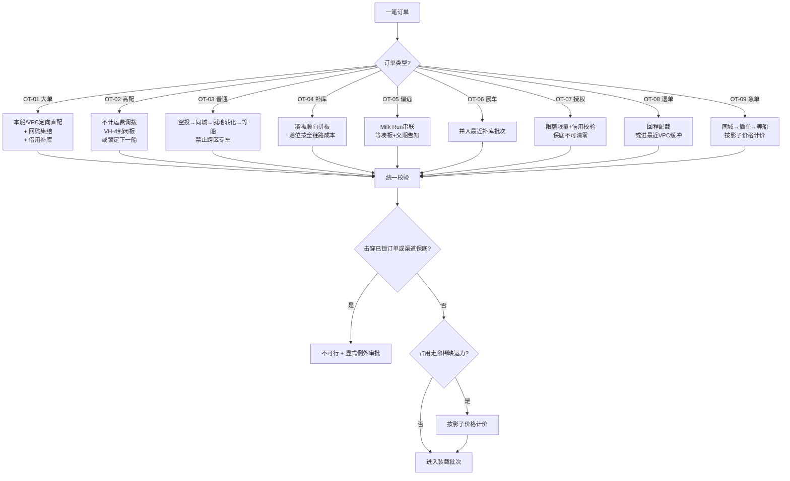

# 订单类型 × 物流方案矩阵（参考手册）

> 版本：v1.0｜用途：为 [故事线一](./01_故事线一_两周船的分车计划与逐单物流.md)（分车 + 逐单方案）与 [故事线二](./02_故事线二_每日回购与调拨.md)（调拨 + 回购）提供可查的方案字典。
> 标记：**✅ 来自已有数据**｜**⚠️ 行业通行做法**｜**🧪 本文推算/演示设定**
> 路线里程与费用均取自 `data/04_运力/路线主数据.csv`、`路线类型.csv`，为**模拟数据**，不是 ALJ 真实账单。

---

## 1. 载具模板：全故事线只有四种板车

| 代码 | 载具 | 单趟装载 | 单台成本 | 主要用途 | 依据 |
| --- | --- | ---: | --- | --- | --- |
| **VH-1** | 敞篷多层大板车 | **8–10 台** ✅ | 最低 | 干线、港口/堆场大批量移动 | [05_调研](../05_调研/01_港口到门店的运输方式与空驶成本.md) §2 |
| **VH-2** | 3 车位 / 2 车位小轿运（小跑车） | 2–3 台 ⚠️ | 中 | 城市末端"精准空投"、同城多点拼线 | [01_vpc到门店](../01_gemini调研/03_调拨情况/01_vpc到门店.md) |
| **VH-3** | 单车位平板拖车 | 1 台 ⚠️ | 高 | 同城急单、店间闪电调拨 | [02_门店到门店](../01_gemini调研/03_调拨情况/02_门店到门店.md) |
| **VH-4** | 封闭板车 / 液压封闭板 | 1 台 ⚠️ | 最高 | 雷克萨斯 LX、LC300 等豪华车，防沙尘风蚀 | [轿运车基础知识](../01_gemini调研/02_轿运车物流/01_基础知识.md) |

**不建议建模的方式**：铁路（沙特整车批量分拨基本不成立 ✅）、水运（内陆不通航）、代驾自走（无证据表明沙特批量新车走此方式，且涉里程与磨损入账 ⚠️）。

**装载模板的第二档缺口**：现有 `data/04_运力/*` 只有"每车次 8 台"一档，**缺 VH-2/VH-3/VH-4 的末端模板**，因此"末端拼线"和"单台专车"在现有模型里无价可依（见 §6）。

---

## 2. 九类订单的总览矩阵

| 代码 | 订单类型 | 典型车型/配置 | 批量 | 交期刚性 | 默认走廊 | 默认载具 | 成本敏感度 | 决策主责 |
| --- | --- | --- | --- | --- | --- | --- | --- | --- |
| **OT-01** | 企业/政府大单 | 海拉克斯、凯美瑞、LC | 50–500 | **极高**（SLA+罚金） | RC2 / RC3 整板直达 | VH-1 满板 | 中（先保兑现） | Layla + Omar |
| **OT-02** | 高端与豪华车 | LX、LC300、Supra、雷克萨斯全系 | 1–5 | 高（易退单） | 就近或 RC2 | VH-4 / VH-3 | **低**（利润厚） | Layla |
| **OT-03** | 普通散客零售 | 雅力士、卡罗拉、凯美瑞 | 1–2 | 中 | RC1 / 同城 | VH-2 / VH-3 | **高**（利润薄） | Sara |
| **OT-04** | 无主补库 | 全车型 | 按缺口 | 低 | RC2 / RC3 / RC4 | VH-1 拼板 | 高 | Faisal |
| **OT-05** | 偏远地区拼单 | 全车型 | 1–3/店 | 低（5–7 日） | RC5 / RC6 | VH-1 Milk Run | 高 | Faisal |
| **OT-06** | 展车 / 试驾车 | 主流款 | 1–2 | 低 | 随补库批次 | VH-1 / VH-2 | 中 | Layla |
| **OT-07** | 授权车商批发 | 皮卡、越野为主 | 5–50 | 中 | RC2 / RC3 / RC4 | VH-1 | 高 | Hassan |
| **OT-08** | 退单 / 返修回流 | 全车型 | 1–3 | 低 | 逆向 / 回程配载 | VH-2 / VH-3 | 中 | Sara |
| **OT-09** | 跨区急单调拨 | 中高端为主 | 1 | **极高** | 策略 1 / 2 | VH-3 / VH-1 插单 | 低 | Sara |

---

## 3. 逐类方案卡

### OT-01 企业/政府大单

| 项 | 内容 |
| --- | --- |
| 画像 | 租车公司（如 Key Car Rental）、政府部门、阿美石油等，突然下达大批量同车型同配置急单 |
| 触发条件 | 交期 ≤ 15 天；逾期罚金高；涉及长期战略合作 |
| **标准方案** | **本船/VPC 同配置定向直配 → 不足部分全网回购集结 → 仍不足则协商延期并给优先交付权** |
| 运输组织 | VH-1 **满板单一目的地**，装载率目标 ≥ 95%；**避免多点卸货**（每多一个卸点就多 2–3 小时装卸） |
| 优先级 | **高于补库，低于已确认实名零售订单** |
| 红线 | ① 不得击穿已锁订单；② 不得击穿授权渠道保底（硬约束）；③ 回购须过"上界 + 可回购台数 + 源店水位"三道校验 |
| 成本口径 | 整趟费 ÷ **实际装载台数**（不是 ÷ 8）；回购段与干线段的计价口径分开写 |
| 例外 | 回购谈不下来 → 转"协商延期 + 违约金对赌"；源店水位不足 → 从 VPC 缓冲补位 |

### OT-02 高端与豪华车

| 项 | 内容 |
| --- | --- |
| 画像 | 雷克萨斯 LX/ES/RX/NX、LC300、Supra；客户对内饰颜色、轮毂、音响有强执念，**不接受妥协** |
| 触发条件 | 客户明确配置要求；单车利润极高；极易因等待退单 |
| **标准方案** | **策略 1 同城 → 策略 2 跨区插单 → 策略 4 等下一船（吉达一车到底直发）**；只要全网有无主同配置现货就**不计运费地调**（但必须记账） |
| 运输组织 | **VH-4 封闭板或加厚保护衣**（防沙漠风沙风蚀车漆）；全程上板车，**禁止代驾自走**；里程 ≤ 10 km |
| 成本锚点 | 单台专车走**零售价量级**：普通平板 900–1,400 SAR/台，液压/封闭 1,900 SAR/台 ✅ |
| 决策规则 | 若下一船 ≤ 9–10 天到且有空余同配置 → 优先绑定下一船 VIN（更便宜、车况更好）；否则立即调拨 |
| 例外 | 现货被他人锁定 → 自动转"锁定下一船 + 补偿"；**不得用近似配置硬顶**，除非客户书面同意 |

### OT-03 普通散客零售

| 项 | 内容 |
| --- | --- |
| 画像 | 雅力士、卡罗拉、凯美瑞等走量车；客户对价格/月供敏感，配置可引导 |
| 触发条件 | 有单无车；利润薄，**跨区运费容易直接吃掉整车毛利** |
| **标准方案（严格优先级）** | **① VPC 同配置夜间精准空投 → ② 同城/邻近小跑车调拨 → ③ 就地配置转化（0 物流成本）→ ④ 等下一船** |
| 运输组织 | VH-2 小轿运，22:00–05:00 限行解除窗，拼线多点投递（一辆 3 车位小轿运可服务同线 3 家店） |
| **硬规则** | **低利润车型禁止为单台开跨区专车**。系统在销售端弹窗提示调拨成本，强制走策略 3 |
| 转化素材 | 折扣、赠精品、升级保养套餐（依据 [05_调拨逻辑](../01_gemini调研/03_调拨情况/05_调拨逻辑.md) 策略 3） |
| 例外 | 客户拒绝转化且愿意承担溢价 → 需销售经理审批；否则转等下一船 |

### OT-04 无主补库

| 项 | 内容 |
| --- | --- |
| 画像 | 门店/车商按覆盖缺口产生的补库量，**无客户订单绑定** |
| 触发条件 | `合理补库 = max(0, 目标覆盖水位 − 可自由销售现货)`，其中可自由销售现货 = 现货 − 订单占用 |
| **标准方案** | **顺向拼板，等待凑板**（同方向累计 ≥ 7 台或达固定班次红线） |
| **落位决策（本故事线核心）** | 补库车**可以**进达曼 VPC，但必须比较三条路的**全链路成本**：① 吉达直达（RC3）② 利雅得截流（RC4）③ 进达曼 VPC 再配送 |
| **默认结论** | 优先 RC3 直达或 RC2/RC4 截流；**达曼 VPC 只接"纯东部本地中长期周转"的无主库存**，且必须记完整全链路成本 |
| 成本口径 | 全链路 = 干线 + 二次装卸 + 后续再配送 + 库龄资金成本 + 堆存费（沙特港口仅 **3 天免堆**，超期阶梯涨价 ✅） |
| 反模式 | **"离哪个 VPC 近就进哪个"** —— 这是旧模型的核心错误，会制造 300–500 km 的无效对流 |

### OT-05 偏远地区拼单

| 项 | 内容 |
| --- | --- |
| 画像 | 塔布克、哈伊勒、艾卜哈、海米斯穆谢特、吉赞、奈季兰等；单店每日订单零散 |
| 触发条件 | 去某方向订单累计达到凑板阈值，或到达固定班次日（每周 2–3 次） |
| **标准方案** | **串联"Milk Run"一路卸货**：如 `利雅得 → 麦地那 2 台 → 欧拉 1 台 → 塔布克 5 台` |
| 时效 | **5–7 工作日**；销售签单时必须明确告知客户交期 |
| 成本口径 | 按**串联里程总和**计价，**不是单点直达价** |
| 纪律 1 | 不得单独为 3 台车跑 700 km（"这一趟油费、过路费和司机人工直接亏死"） |
| 纪律 2 | 偏远门店**不得低于渠道保底**，但**补库按缺口而非满库**——避免车在 50℃ 沙漠或盐雾海边长期露天老化 |
| 纪律 3 | 高价值车走南北向时优先 VH-4 或加保护衣 |

### OT-06 展车 / 试驾车

| 项 | 内容 |
| --- | --- |
| 画像 | 门店展车、试驾车、5S 中心陈列车 |
| 特点 | 优先级高（关系门店开业/形象）但**时效不刚性** |
| 标准方案 | **并入最近的补库批次**，不单独派车；按"最晚可接受时间"排队 |
| 注意 | 展车一旦展示产生里程与外观磨损，后续若转为销售车需重新评估车况与定价 |

### OT-07 授权车商批发

| 项 | 内容 |
| --- | --- |
| 画像 | 独立法人车商，覆盖二三线城镇与 Haraj 集市；**35–70 个交易身份** |
| 特点 | 直营是"1 个交易身份 × 34 门店"（宽而浅），授权是"35–70 个交易身份 × 1–14 门店"（窄而深） |
| 标准方案 | 按车商信用额度和库容**限额限量**；运输可走 RC2/RC3/RC4 |
| **红线** | 授权渠道有约 **12–15% 的硬保底下限，不可清零**；补库轨比例常态约 直营 65% : 授权 35%，危机态向直营倾斜 |
| 例外 | 车商信用额度不足 → 需前置资金校验，不得先发货后收款 |

### OT-08 退单 / 返修回流

| 项 | 内容 |
| --- | --- |
| 画像 | 客户取消订单、贷款未获批、车辆返修回流 |
| 特点 | 是**逆向物流**，方向与干线相反，正好可以填回程空驶 |
| **标准方案** | **优先做回程配载（backhaul）**：把返程空车厢装成"返程货"，把空驶从成本变成减项 |
| 止损规则 | 车辆在途被取消 → 立即重算目标店；若无人接单，进最近的 VPC 缓冲而不是"在路上来回拉" |
| 成本口径 | 现有报价公式把回程空驶**锁死成了成本**（`整趟 = 基础费 + 单程里程 × 距离费率`，"基础费"里塞了回程与固定成本）；一旦允许回程配载，**221.97 / 439.74 SAR 的单台运费就是可优化的上限，而不是常量** |

### OT-09 跨区急单调拨

| 项 | 内容 |
| --- | --- |
| 画像 | 跨区客户有时限要求（含 E 组申请） |
| 标准方案 | 策略 1（同城）→ 策略 2（干线插单）→ 策略 4（等船） |
| **成本关键** | 若占用正在跑干线的空位，**必须按当时的走廊影子价格计价**（故事一算出 RC2 约 118 SAR/台、RC3 约 165 SAR/台），否则"顺手捎一台"会系统性抢夺有主订单车的运力 |
| 驳回条件 | 调拨成本 / 该单毛利 > 30% → 驳回或转策略 3 |

---

## 4. 决策树（所有订单类型共用一张图）

---

## 5. 成本口径对照表（最容易被算错的地方）

| 场景 | 错误算法 | 正确算法 | 差异量级 |
| --- | --- | --- | --- |
| 企业大单 50 台 | 497.5 × 50 | 7 车次 × 3,980 = 27,860 SAR（实载 50/56） | 单台 557 vs 497.5 |
| 偏远 3 台去吉赞 | 3,198 ÷ 8 = 400 × 3 = 1,200 | 整趟 3,198（不足 8 台仍按整趟计价） | **2.7 倍** |
| LX 3 台专车 | 439.74 × 3 = 1,319 | 单台零售价 1,000–1,900 × 3 | **2–4 倍** |
| 补库走达曼 VPC | 只看干线 660.5 | 660.5 + 二次装卸 + 后续再配送 + 库龄资金 | 常被低估 20–40% |
| 回程配载节约 | 视为 0 收益 | 空驶率约 **50%**，回程配载是全网最大单一降本杠杆 | 最高可降近半 |

---

## 6. 现有数据缺口（直接影响方案能不能算出来）

| 缺口 | 影响的订单类型 | 建议补什么 |
| --- | --- | --- |
| **末端短驳线路（L2→L3）** | OT-03、OT-06 | `04_运力/末端接驳.csv`：门店编码、城市服务点、单程 km、单趟费、装载上限 |
| **店间/回购线路价** | OT-08、OT-09、回购 | `04_运力/调拨与回购线路.csv`：起讫节点、单程 km、单趟费、装载上限、方向 |
| **板车"位置"属性** | OT-04、OT-08 | 车队表加"当前所在节点""基地节点"，支持回程配载与三角调度 |
| **空驶字段** | OT-08 | `场景路线运力.csv` 加 `重驶里程`/`空驶里程`/`空驶率`/`回程配载率` |
| **固定费与空驶单价拆分** | 全部 | `路线类型.csv` 把 `基础整趟费用` 拆为 `固定费(SAR/趟)` + `空驶单价(SAR/km)` |
| **港杂 / 滞港 / PDI 成本层** | OT-04 | 单独一层非运费成本（3 天免堆 + 阶梯费率） |
| **船次供给清单（按周/按船）** | 全部 | `05_船次供给清单`：船名、ETA、卸船量、逐车型配置、产地 |
| **订单池（已锁 VIN / 待配数量）** | OT-01、OT-02 | `06_订单与锁定`：客户、车型、配置、定金、承诺交付日、优先级 |

---

## 7. 一页速查：什么情况下"不调拨"才是对的

| 情境 | 正确动作 | 依据 |
| --- | --- | --- |
| 低利润走量车 + 跨区缺口 | 就地配置转化（策略 3） | 运费吞噬毛利 |
| 高配车 + 下一船 ≤ 9–10 天到 | 锁定下一船 VIN | 单港下单船直达更便宜、车况更好 |
| 补库车 + 达曼 VPC 顺路 | **仍要算全链路成本** | 避免"进达曼再倒流" |
| 偏远单店 3 台 | 等凑板，不单独发车 | 单趟成本固定 |
| 退单车 + 有返程板车 | 回程配载 | 空驶率约 50% |
| 回购价超过上界 | 转等下一船 | 回购上界 ≈ 目标干线费 − 短途调拨费 |
| 源店水位将低于保底 | 从 VPC 缓冲补位 | 源店水位是硬门槛 |
| 授权车商信用额度不足 | 不发货 | 信用是硬约束 |
