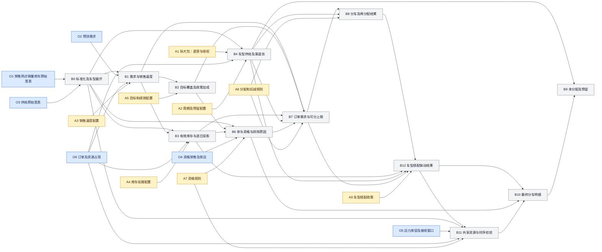

# 周度分车模块设计方案

> 版本：v1.2 评审稿｜日期：2026-09-30
> 本版调整：取消保底；A1按车型拆分直营/授权渠道池；统一销售网点称谓；计算粒度收敛到车型。
> 范围：业务规则、计算引擎、计算图谱及 GUI 设计。本文定义拟建设的能力，不表示引擎或页面已经实现。
> 配套：[计算节点与字段字典](./02_计算节点与字段字典.md)、[GUI 页面与交互设计](./03_GUI页面与交互设计.md)。

## 1. 模块要解决的问题

周度分车需要回答：**在一周内，对每一种车型，基于各门店的销售速度、库存、订单、经营目标和渠道政策，应该分给谁、分多少、留下多少，以及为什么。**

本方案沿用参考本体的三类节点：

- **蓝色是原始输入**：接入的销售网点、销量、库存、供给、预测、订单、资格和运输条件，保留原始粒度及来源。
- **黄色是业务参数与规则**：销售口径、库存处理、目标覆盖、绩效倾斜、重点渠道与区域加成、禁售及分配约束。
- **灰色是计算产物**：由蓝色和黄色节点逐步计算得到，保存输入依据、命中规则、计算公式及每轮结果，最终形成门店×车型的最终分车量。

灰色节点同时承担三个职责：参与下一步计算、支持 GUI 解释、作为后续分析的数据。图谱中的一个节点代表一类数据对象；点开后可以查看该对象的多行记录，而不是在总览画布上画出每一家店的每一条数据。

用户完成一次分车的工作路径为：选择经营周和输入快照 → 配置参数与规则 → 计算 → 查看结果和溯源 → 比较方案 → 校验共享资源 → 发布。**计算出分车量与完成实际发运是不同状态。**

### 1.1 方案选择

| 方案                         | 优点                                                 | 代价与局限                                           | 本次取舍                 |
| ---------------------------- | ---------------------------------------------------- | ---------------------------------------------------- | ------------------------ |
| 固定业务 DAG＋参数化分配引擎 | 每一步可复算，灰色节点可落表，适合图谱展示和版本比较 | 需要先定义字段、规则顺序和边界                       | **推荐，一期采用** |
| 一个综合评分直接按比例分配   | 容易做出第一版总量                                   | 难解释库存、渠道、订单与约束冲突，容易把加成重复计算 | 不作为核心引擎           |
| 用户任意拖拽节点和编写公式   | 灵活，可覆盖不同业务                                 | 容易出现环、量纲错误与未经校验的公式，治理成本高     | 后续有明确需求再扩展     |

一期用户可以配置已定义规则、查看图谱、调整方案；计算图谱由引擎定义维护。业务人员不需要通过拖线来完成分车。

### 1.2 本次边界

包含逐车型供给及渠道池、逐网点计算、直营和授权差异、畅销与非畅销车型搭配、参数版本、分配轮次、灰色节点快照、结果解释和物流校验接口。车型独立核算供给和需求，存在搭配政策时联合决定配额。每日调拨、回购交易、VIN 装车排程、财务结算由已有故事线的其他模块承接。

## 2. 参考依据与当前数据边界

本方案以用户给定的[本体设计图](../../01_销售分货/本体设计.png)和[本体语义层表格](../../01_销售分货/本体语义层设计.xlsx)为对象结构依据，以[数据基线与逐车型分车口径](../../02_故事设计/04_故事线/04_数据基线与逐车型分车口径.md)和[data 模拟数据说明](../../../data/模拟数据说明.md)为本项目数值口径。

[节点依赖说明](../../01_销售分货/03_本体节点依赖说明.md)和[双轨分车设计](../../02_故事设计/03_ds设计/02_直营_授权双轨分车逻辑与图谱中间产物.md)作为补充参考。前者文首版本日期晚于本次设计日期，并引用了当前目录未提供的关系文件，不能把这些引用当作已核验的当前版本；本方案直接对照实际 PNG、XLSX 和 CSV，并明确记录调整。双轨设计中的早期网点估算和渠道比例不覆盖后续实际生成的数据基线。

新增参考[4S店拿货与配额调研](../../02_故事设计/01_gemini调研/05_4s店.md)。该材料明确描述了约4–6周库存、历史交车量/KPI影响配额，以及“5台畅销车型搭配3台非畅销车型”的政策。本方案将其作为业务机制参考，不能据此断言具体品牌、沙特总代理或当前L2网络均执行相同标准；5:3是示例比例，不是现有数据中的合同事实。

### 2.1 已核对的数据

| 项目         | 当前值或口径                                           | 对设计的影响                                   |
| ------------ | ------------------------------------------------------ | ---------------------------------------------- |
| 销售网点网络     | 79 店，34 家直营、45 家 L2；46 个交易身份；18 个城市   | 逐店计算，交易身份用于政策、结算及汇总         |
| 直营身份     | 34 店共用`MOCK-TD-001`                               | 不能按交易身份将直营库存先净额抵消             |
| 品牌组合     | 79 店经营丰田，20 店另经营雷克萨斯，共99个店×品牌组合 | 不为未授权品牌自动补零或生成候选               |
| 门店库存     | 实物6,709，自由5,232，已锁1,223，冻结254，在途1,012台  | 实物三状态守恒；在途另列；不含 VPC 未分配库存  |
| 品牌参考缺口 | 丰田1,999，雷克萨斯108，共2,107台                      | 只是品牌级参考，不能直接作为车型最终需求       |
| 销速         | 直营8个完整周；L2为92天月报折周                        | 显示各自时间窗，L2周明细不是实测周报           |
| 全国月度供给 | G/H约定作供给规模；2026-07为7,941/960台                | 保留其“销量代理/推估”的原字段性质            |
| 缺失月份     | 2026-08/09的G/H为空                                    | 不填零、不复制7月作为实际发生值                |
| W1情景       | 15车型、丰田1,793、雷克萨斯217，共2,010台              | 虚构完整七日窗口，不能反复累加来重建月供给     |
| 运力         | SC-DUAL 3,226台；SC-WEST 1,865台；各180辆板车          | 两个互斥情景，不叠加；容量由多车型、多门店共享 |

门店销速显示值加总约2,404.8425台/周；运力汇总采用未舍入基准2,404.8424。差异是显示舍入，不通过修改原始数据抹平。

### 2.2 两种运行模式

| 模式     | 输入及用途                                                           | 允许输出                                           |
| -------- | -------------------------------------------------------------------- | -------------------------------------------------- |
| 演示推演 | 现有CSV＋显式车型结构、到达时间、订单等模拟扩展                      | 情景分车量、计算图谱、参数比较；只进入模拟发布流程 |
| 正式计划 | 最新销售网点×车型数据、已确认供给批次、订单占用、及时在途和可用物流资源 | 通过完整校验后发布业务计划                         |

现有 CSV 可以直接支撑品牌基线和资源压力展示；**不足以直接计算真实的79店逐车型最终分车明细**。缺的主要是逐车型库存、订单与占用、供给释放批次、在途预计到达时间、经营绩效及重点渠道标签。文档中的参数建议和算例均是本次设计，不宣称来自这些 CSV。

## 3. 计算粒度与对象边界

### 3.1 最小计算单元

**最小业务粒度为“经营周 × 销售网点 × 车型”，数量单位为整数台。** 每次运行另带`run_id`；车型由唯一`model_id`标识，品牌是车型主数据的归属。例如`TOYOTA-COROLLA`表示丰田卡罗拉，`TOYOTA-CAMRY`表示丰田凯美瑞，两者各有独立供给、库存、销速和分车量。

本模块直接使用“车型”，不以SKU作为页面术语。若外部接口必须使用SKU字段，其在本模块只能映射到上述车型编码，不能因此增加配置粒度。年款、动力版本、配置等级、颜色和VIN均不进入本次分车维度；同一车型的这些明细在接入时汇总，并保留来源引用。卡罗拉的不同颜色或配置不会成为多个可独立分配的对象。

- 不同车型不相互替代，也不将卡罗拉与凯美瑞库存合并抵消。
- 供给账本仍保留来源批次、始发地及可用窗口，用于守恒与物流衔接；这些是履约明细，不是新增产品粒度。最终业务表一行一个“周×网点×车型”，来源明细可展开。
- 订单接入的是经来源系统确认可按本车型履约的数量和期限；具体车辆匹配在后续执行模块处理。本模块不据车型总量断言某种颜色或配置订单已经可交付。
- 车型搭配是两个车型配额之间的政策关系，不能合成一个产品池。
- 一期经营周为完整七天，业务时区为`Asia/Riyadh`。跨月周按实际日历对齐，不用月销量除4，也不按月份重复生成车辆。

### 3.2 销售网点的称谓

沙特丰田官网使用 **Sales Centers / Showrooms** 表达销售中心和展厅；网点查询同时区分展厅、维修、配件等功能，因此不能把所有网点一概命名为“4S店”。[丰田沙特常见问题](https://www.toyota.com.sa/en/faq)、[丰田沙特网点查询](https://www.toyota.com.sa/en/find-a-center)（查阅：2026-09-30）。

沙特MAXUS官方网络页使用阿拉伯语“موزعينا المعتمدين”（我们的授权经销商/分销商），并列出具体公司与展厅，支持用“授权经销商展厅”指代下游销售网点。[MAXUS沙特授权网络](https://maxus.sa/ar/find-a-dealer/)（查阅：2026-09-30）。这些来源支持称谓选择，不证明项目中每家模拟网点的实际授权或所有权。

| 本系统用语 | 英文展示建议 | 在本方案中的含义 |
| --- | --- | --- |
| 销售网点，行内简称“门店” | Sales Outlet | 接收分车的物理销售地点，统一对象名称 |
| 直营销售中心，渠道简称“直营店” | Direct-operated Sales Center | 项目主数据标记为直营的销售网点 |
| 授权经销商展厅，渠道简称“授权店” | Authorized Dealer Showroom | 项目主数据标记为授权经营的销售网点，兼容原L2编码 |
| 经营主体 | Operating Entity | 关联交易/结算身份；一个主体可以有多个网点 |

以上中文及英文展示名是本项目的用语选择，直营/授权属性以主数据为准，不能从名称或官网列表推断。“客户”不再作为分车对象或GUI字段名；原始`data/00_客户/`目录及源字段保持不变，由适配层映射，详见字段字典。主机厂、全国总代理、经营主体、物理网点是不同层级。

### 3.3 先拆渠道，再分网点

**每款车型的可分量，必须先由A1拆成直营池与授权池，再在各自池内分到具体网点。** 两类渠道共用一套计算链；直营使用周报，授权店使用月报折周及上报时效。直营共用结算身份，但每店库存、目标与库容独立，不按主体净额抵消。

A1按车型和经营周定义两个渠道比例，允许品牌/全局模板继承，最终逐车型冻结。没有比例时标记“待配置”，不自动全国混分。现有模拟数据中的丰田70%/30%、雷克萨斯90%/10%只是历史数据生成比例，只有被明确选为本轮情景参数后才用于A1。

渠道预算覆盖本轮订单分配、普通补库及政策搭配全部新增量，不只约束最后的普通剩余量。渠道内未用量默认保留；一期跨渠道调整须修改A1并生成新运行，不在求解中自动借用另一渠道的车。授权店已有库存用于判断其补车需求，不自动成为总部可调往别店的资源。

**保底不在本版范围内**：不配置新店最低量、零销速铺货量、合同保底或库存底线，不保留关闭状态的表单和计算分支。已有承诺及有效订单按真实资源占用与需求处理，不构成给每家网点的最低分配保证。

## 4. 三色计算图谱

沿用原本体的三色结构及仍适用的节点编号。A1改为“拆大包：直营/授权渠道分池”；原A6与B5退出本版，编号不复用。增加B0数据适配、B11共享校验、A9/B12车型搭配，以及O5物流与O6订单输入。



图中省略每个节点都依赖的任务、参数版本、数据快照和经营窗口公共信息。完整入边及字段见配套字典。B11 校验不通过时创建新的求解轮次或运行修订，不在同一个节点快照上循环改数。

## 5. 黄色节点的业务参数设计

### 5.1 参数目录

下列“默认”均为本方案建议。源文件没有经营绩效和重点渠道系数，首次导入不自动生成这些经营判断。

| 节点                  | 可配置内容                                                                | 建议初始值或行为                                                       | 主要影响         |
| --------------------- | ------------------------------------------------------------------------- | ---------------------------------------------------------------------- | ---------------- |
| A1 拆大包 | 按车型配置直营/授权比例、继承范围、生效周、整数并列顺序 | 两渠道比例合计100%；未配置则不求解；跨渠道改配需新版本 | B4渠道预算 |
| A2 分车周期 | 周起止、快照截止、释放窗口、预留方式 | 单周；预留默认0；固定量/比例互斥 | B4全国可分池 |
| A3 销售速度           | 历史/预测口径、直营与L2回看窗口、异常修补、需求修正                       | Demo沿用直营8周/L2三个月折周；需求修正系数默认1                        | B1销速及未来消耗 |
| A4 库存处理           | 自由/锁定/冻结口径、及时在途、库存截止、过期处理、投影窗口                | 仅自由库存进入补库水位；只计及时且未占用在途；不对实物库存乘经营加成   | B3库存与缺口     |
| A5 目标配置           | 目标参考区间、基础WOS、库存口径、绩效/渠道/区域系数、加成上下限           | 新4S参考模板区间4–6周、建议基准5周；旧Demo保留3/4周；系数默认1        | B2目标库存       |
| A7 资格与硬限制       | 经营资格、业务暂停、禁售、路线禁运、收货要求、额度校验                    | 强制资格必须满足；禁运按始发地和路线判断                               | B6候选及B11校验  |
| A8 分配规则           | 注水口径、整数分配、秩序扣减、配额回流、并列规则                          | 目标达成率注水；最大余数整数化；扣减默认关闭；稳定编码并列排序         | B7、B8           |
| A9 车型搭配 | 主配/搭配车型、比例、硬搭配或软建议、超需求额度、库存警戒/硬上限、窗口 | 无实际政策时关闭；演示显式启用5:3；不自动判定车型滞销 | B12及下游 |

源表 `目标库存覆盖(周)`保留原历史参考值；当前运行实际使用 A5 冻结后的值。旧CSV的3/4周不回写为5周；第7.1节新版算例显式采用5周模板，切换模板必须生成新参数版本并重新计算。主数据中的`销速分摊基础权重`是生成模拟销量的权重，不能未经业务定义直接当成绩效。

**目标区间、目标点和硬上限分开。** 4–6周是新模板的基准参考区间，建议选5周作为初始目标点，按渠道、车型和门店覆盖；它不表示必须补到6周，也不保证紧缺车型一定能达到4周。绩效加成后超出参考区间时显示差异，最终仍受独立的经营硬上限约束。

**库存口径必须可见。** 调研中的月度库销比没有给出完整库存状态口径，“1–1.5个月≈4–6周”也只是近似，按30天/月折算约为4.3–6.4周。一期新模板将4–6周用于本项目既有的“目标自由库存覆盖”参数，这是明确的业务假设；旁边另显示“实物库存覆盖=含锁定/冻结的店内实物÷同口径周销速”，在途另列。两种覆盖不能直接混比。若业务要求以总实物为目标，需按期末预计仍占用的锁定/冻结量转换自由目标，另建口径版本，不能只换字段名。

### 5.2 加成具体作用在哪里

一期采用“**政策作用于目标，物理消耗使用基础预测**”：

```text
综合目标系数 = clip(绩效系数 × 重点渠道系数 × 重点区域系数, 系数下限, 系数上限)
处理后目标WOS = clip(基础目标WOS × 综合目标系数, WOS下限, WOS上限)
目标自由库存T = ceil(目标参考周销速 × 处理后目标WOS)
```

建议演示限制：综合系数0.5–1.5、目标WOS 0.5–8周。业务可在参数模板中调整，GUI显示命中和截断前后值。3.3周×4台/周得到13.2台，整车目标向上取整为14台；显示取整增加量，避免误以为目标完全等于13.2台。

例如：绩效系数1.10使同样销量的门店获得更高目标；重点区域系数1.20支持战略铺货。二者都不意味着车辆物理消耗自动增加10%或20%。节假日、促销等确有需求变化时，由 A3 的需求修正单独调整预测并保留依据。

A1决定渠道总预算，A5决定该预算内的网点目标；同一渠道政策若只计划倾斜一次，应选择其中一个作用位置，并用政策原因ID检查重复设置。

同一政策原因只能选择一个作用位置。不能把“重点渠道20%加成”同时乘销速、乘目标WOS、再乘注水权重。未来若提供“仅调整分配优先级”模式，则与同原因的目标加成互斥，并使用新的算法版本。一期不同时开放原参考中的所有两轮/三轮绩效算法，避免多个入口表达同一政策。

### 5.3 规则作用域与覆盖

规则包含：规则ID、参数版本、适用品牌/车型、渠道、区域、交易身份或门店、有效期、条件、结果、作用位置、优先级、创建依据。

标量参数按照“精确门店×车型 → 交易身份×车型 → 渠道×车型 → 区域×车型 → 车型 → 品牌 → 全局”选择最具体的匹配。相同层级有多个不同值时，先比较显式优先级；仍相同则报冲突，不能依赖导入顺序。交叉规则在保存前展开作用域检查。

绩效、渠道、区域是三个独立系数类别，每类按上述规则只选一个值，再按5.2合成。禁售、硬上限等限制取交集，普通门店覆盖不能解除强制限制。用户停用一个业务规则时显示影响范围；正式资格缺失或无效不能通过加成和手工改量绕过。

### 5.4 规则执行顺序

1. 校验网点/车型输入、参数、经营资格及数据版本。
2. 扣除不可用、既有占用和预留，由A1把各车型可分量拆成直营与授权预算。
3. 计算各网点销速、目标、库存投影、订单缺口和普通补库需求。
4. 在各渠道内先处理有效订单，再按目标达成率注水、整数化、扣减及回流。
5. 将主配车型结果作为暂定配额，联动搭配车型；两者分别占各自车型的同渠道预算。
6. 联合检查供给、渠道预算、车型搭配、库容、额度和规划运输资源。
7. 保存最终分车、需求缺口、政策额外量及未分配原因，形成可评审的周计划。

## 6. 灰色节点的计算逻辑

### 6.1 B0 标准化及车型展开

从原始 CSV 读取品牌和门店记录，保留原文件、行主键、日期和数据性质。补齐单位、主数据映射并检查唯一键，不能通过内连接悄悄丢失缺数据门店。

演示模式按输入快照附带的显式车型结构展开，结构属于数据准备假设，不再借用A1：供给使用供给结构、销量使用销速结构，自由/锁定/冻结/在途使用各状态独立结构。整数数量采用最大余数法，保持每个原门店×品牌×状态合计不变。没有车型状态参数时，节点显示“缺车型结构”，不自动套用销量比例。

库龄是另一个库存分类，不能把独立拆出的库龄与状态直接交叉相加。需要逐车型库龄时补充交叉分布或逐车明细。所有展开结果标记`derived_simulation`并挂来源及参数，不伪装成蓝色原始数据。

### 6.2 B1 需求与销售速度

统一使用“台/周”和“台/日”两个明确字段：`周销速 = 日销速 × 7`。即使规划只有部分周，标准周销速也不变，期间消耗按实际天数算。

Demo直营：完整56天销量÷56×7；L2：92天销量÷92×7。若直接使用已汇总周销速，不再次除7或除4。展示窗口、是否模拟、源截止日及是否修补。修补必须生成规则记录，不能覆盖原数。

正式模式按需求ID、车型和时间桶核销预测：

```text
剩余预测 = max(0, 原预测 − 被有效订单消耗的预测量)
待由自由资源覆盖的消耗C = 尚未绑定既有资源的有效订单 + 剩余预测
```

已有库存或在途锁定的订单不再次进入自由库存消耗，但其已消耗的预测仍被核销。非预测内订单属于增量需求。仅凭数量相近不能认定一笔订单已在预测内；没有订单/预测核销信息时，标记预测假设，不将“订单＋全量预测”直接相加。

无销量记录是缺失，记录为0才是零销速。零销速不自动获得铺货量；有有效订单时处理订单，有明确搭配政策时仅走其有限额度路径。若有经确认的车型预测，可显式选用预测口径；不以极小虚拟销速替代0来规避除零。

### 6.3 B2 目标覆盖及政策加成

根据 A5 计算基础WOS、各项命中系数、处理后WOS、目标自由库存T。目标对应**本次规划期末**的合理自由库存；补库需求同时考虑本期将消耗的车辆。

保留“若不加成的目标”和“政策后的目标”，但只有选定的政策目标进入求解。参数变化的实际分车影响需要重新运行，不能把目标增加量直接等同于分车增加量。

### 6.4 B3 有效库存与时序

```text
实物库存 = 自由库存 + 订单已锁库存 + 冻结库存
期末净资源E = 期初自由库存 + 期内及时自由在途 − 待覆盖消耗C
基础净补库需求 = max(0, T − E)
```

E可以为负，表示未覆盖需求；实物库存不能为负。将 E 截断为0再算缺口会吞掉已经出现的不足，因此同时存`期末预计自由库存=max(0,E)`和`无新增供给时的缺口=max(0,-E)`。

正式模式逐日重放到货与需求。周末到货不能满足周初订单；汇总 E 只用于水位分配解释。基于已有自由资源与及时在途优先匹配有效订单，得到仍需要本轮新车保护的数量H及最晚到达时间。

库存覆盖周数统一为`库存÷周销速`，用日销速作分母时必须再除7。分车后的期末预计自由库存为`max(0,E+最终分车量)`，预计覆盖用该值除以周销速，未覆盖需求另列。销速为0显示“不适用”，缺失则显示“缺数据”。期初覆盖和期末预计覆盖分列，不混用。

当前CSV没有到达日的在途，演示中只有在明确选择“本窗口及时到达”的模拟假设后才计入；正式模式缺到达日则不视为已证实的及时供给。未知在途单独列出，不默认为不存在。

### 6.5 B4 车型供给及渠道池

每个供给批次、车型和可用时段只有一份账本：

```text
供给基数S = 不可用/未释放X + 既有承诺P + 政策预留R + 本轮待分Q
R = 固定预留，或 floor((S − X − P) × 预留比例)
Q = S − X − P − R
```

X/P/R互不重叠且总量不能超过S；源系统给净量时记录已扣集合，不重复扣减。既有在途若已在P占用，只在目标网点B3体现到货，不再次进入Q。预留是供应方暂不下分的量，默认0，不是给网点的最低量。

**A1把每款车型的Q拆成两个渠道预算：**

```text
直营比例w_direct + 授权比例w_authorized = 1，且各在[0,1]
原始预算q_c = Q × w_c
先取floor(q_c)，不足的整车按小数余数从大到小补齐
余数相同时按已冻结的渠道编码排序
Q_direct + Q_authorized = Q
```

例如凯美瑞Q=394，显式选择70%/30%的演示规则后得到直营276、授权118；这只是A1的演示取值，不声称是当地现行合同。B4保存全国账本与渠道预算两个关联子表；渠道池共用源批次账本，不复制两份物理库存。不能在每个批次独立四舍五入后改变全国的渠道预算。

B8在渠道预算内分配。扣减、物流回退、搭配回退都返回原车型原渠道；未用量留存。跨渠道重分需显式修改A1、生成新参数版本、重算受影响车型及搭配组。某渠道订单缺口超过本渠道Q时显示冲突，不私自挪用另一渠道预算。

品牌→车型的演示供给拆分在B0数据准备完成；A1只负责车型→两渠道。两个港口共享一份全国供给，不因为多了始发地而多生成车辆。

### 6.6 B6 参与资格与排除原因

每个网点×车型及候选来源保留资格结论：

| 情况 | 分配处理 | 记录 |
| --- | --- | --- |
| 正常且有净需求 | 进入所属渠道的B7/B8 | 需求、来源和可分上限 |
| 零销速且无订单/有效预测 | 不参加普通注水，不自动铺货 | WOS不适用；政策搭配另由A9判断 |
| 库存足、普通需求为0 | 普通申请为0；保留合法政策候选骨架 | 是否具备政策额外承接能力 |
| 禁售或无经营资格 | 分车为0，不能借搭配绕过 | 资格来源及排除原因 |
| 某路线禁运 | 排除该路线；有合法替代路线可继续 | 来源及路线级限制 |
| 必要数据缺失 | 未计算，不记成0 | 阻塞字段及影响范围 |

资格与普通补库资格分开。具备车型资格不意味着必定分到车；同样，普通需求为0不等于失去经营资格。有硬订单但资格或资源不满足时显示冲突，不能把订单删掉后宣称已完成。

### 6.7 B7 订单需求与可分上限

对合格网点i，采用同一数量总额上的需求，不叠加重复用途：

```text
普通净补库申请D_i = ceil(max(0, T_i − E_i))
H_i = 经现有自由资源和及时在途核销后，仍需本轮新车履约的有效订单量
需求上限N_i = max(D_i, H_i)
普通可分上限U_i = min(N_i, 本行明确的整数硬上限, 已分摊的整数资源额度)
```

D通常已含订单消耗，不再加一次H。H只来自可追溯的真实订单，不允许填写“至少给该店几台”来产生H。未启用的可选上限视为不限制；必填资源缺失不能当作无限额度。

普通补库以N封顶。A9明确允许的政策搭配可以超N，必须单列政策量；B7保存需求上限与物理/资金硬限制两组字段，B12最多突破前者。若配置WOS硬上限，先转为整数库存上限，再限制到货后库存；适用用途要明确，不能让订单或政策车默认豁免库容、资格和运输约束。

信用额度由经营主体跨车型共享，库容由网点跨品牌共享，路线运力由同路线时段共享。不能把完整资源额度重复给每一车型行；B11联合检查，必要时分摊资源预算后重算。

### 6.8 B8 分车及再分配

**第一步，在各车型各渠道内处理订单。** 检查`H_i≤U_i`、`ΣH_i≤Q_channel`及来源/交期资源，先分配`a_i=H_i`。不可满足时保存订单缺口和冲突，不能给出“全部履约通过”；可保留候选建议供修订。没有有效订单则a为0，不预先给任何网点固定台数。

**第二步，在同一车型、同一渠道内按目标达成率注水。** 对周销速>0、T>0且未封顶的候选求解：

```text
x_i(λ) = min(U_i − a_i, max(0, λ × T_i − (E_i + a_i)))
Σx_i = min(渠道剩余供给, 候选剩余可分上限之和)
```

λ是共同目标达成率，当前`(E_i+a_i)/T_i`更低的网点优先得到补充，达到上限后停止。政策已经通过T生效，不再次乘绩效系数。零T/零销速不进入除法；订单数量单独处理。

连续解采用单调水位求解，先对各x取整数下界，剩余整车按小数余数从大到小分。并列依次比较最早有效交期、网点编码、车型编码；每次检查上限。保留连续值、取整增量及稳定排序依据。

**第三步，秩序扣减及同渠道回流。** 一期仅对普通分配扣减一次：

```text
扣减k_i = floor(max(0, 初始总分配 − 已分有效订单量) × 扣减比例)
回流池 = 同车型同渠道内Σk_i
B8候选量 = 初始总分配 − k_i + 回流领取z_i
```

比例为0–1并保留依据。实际被扣减的网点×车型不参与本次回流；其余合格网点按同一水位及上限领取。无法接收的量在原渠道留存。每阶段保存增减和累计量，不能把累计量当新增量相加，也不能扣减后通过车型搭配把车补回。

### 6.9 B12 车型搭配联动结果

“先分畅销、再搭非畅销”在引擎中表示**先生成畅销车型暂定配额，再联动校验和调整整组配额**。不能先发布畅销量，之后才发现搭配车型没有供给或门店无法接收。没有启用A9时，B12原样透传B8结果。

**一期支持一主配车型对应一搭配车型、同一门店、同一结算窗口的比例规则。** 主配通常是紧缺畅销车，搭配可以是常规或非畅销车型，由有效政策指定；畅销不等于高毛利、滞销不等于零销量。当前CSV没有标签和搭配合同，不自动给真实车型贴标签。同一车型在同一范围不能参与多条相互重叠或循环搭配，保存时拒绝冲突。

A9保存：政策发布方及依据、适用渠道/门店、两个车型、比例、有效期、硬/软模式、是否允许超普通需求、单店额外台数上限、搭配后实物覆盖警戒线和硬上限、资金与接货条件。比例的分子、分母必须是正整数，两个车型必须不同；政策停用使用开关，不能用零比例规避校验。当前目标期为周，一期不默认跨周累计抵扣；月/季商务任务只作参考，不能每周重复领用同一份额度。

**比例计算与普通需求分开：**

```text
h = 本轮主配车可受搭配限制的普通分配量，不含已承诺和订单保护
r = 搭配数量 ÷ 主配数量，例如3/5
搭配要求c_req = ceil(r × h)
c_credit = 本轮同门店、同窗口已分配且指定用于抵扣的搭配车普通量
政策新增搭配量p = max(0, c_req − c_credit)
搭配车最终量 = 既有本轮候选量 + p
```

抵扣量必须有唯一占用记录，不可跨门店、跨政策、跨周重复抵扣。历史在库不自动抵扣本周拿货要求；已承诺、订单保护车辆默认也不抵扣。已满足普通需求的搭配车仍记普通用途，附“同时满足搭配”的标签，不再加算一次车辆。政策新增p记“政策搭配”用途，不进入终端销量、终端订单或正常需求满足率。

“5搭3”一期按`ceil(3h/5)`逐店累计取整，例如h=3要求2台，并非每满5台才触发；不支持把该规则暗中解释为只能整组5+3。若合同要求整组交付，必须另建明确的整组规则版本。

**求解顺序与回退：**

1. 固定B8的有效订单分配量；普通单车型结果是可调整候选。
2. 从B4搭配车型的同渠道剩余预算及关联供给中为p寻找来源，按普通分配已确定的业务优先级、最早交期及稳定门店编码处理。先保留其他门店已有普通候选，首版不为政策压库主动抢走其已算普通量。
3. `p`受明确的单店政策额外额度、搭配车剩余供给以及健康/资金/物理硬限制约束。超过普通需求或软目标参考区间可以有据地分配；超过禁售、绝对台数/库容、资金或政策硬上限不可分。硬WOS上限是否适用于政策额外量必须显式声明，不能默认豁免。零销速时不用WOS除法，必须提供绝对库存和额外台数上限。
4. **硬搭配**：设本店最多还能接收的政策额外量为p_max，则`h ≤ floor((c_credit+p_max)/r)`。搭配不够时减少可调整主配量；保护量不被扣除，也不因此强制加上未约定的搭配义务。若有效合同明确覆盖硬承诺而两者冲突，报不可行，不自行改承诺。
5. **软建议**：主配量可保留，实际政策新增量取`min(p,p_max)`，未完成要求为`max(0,c_req−c_credit−实际政策新增量)`，记录原因，不显示“硬搭配已满足”。硬模式不可在求解中自动降为软模式。若关闭“允许超普通需求”，p_max还必须扣除正常需求上限限制，不能仅凭搭配要求突破。
6. 回退主配量回到自身车型的原渠道池，只在有主配需求、政策资格及剩余搭配能力的门店间重新分配；不得突破此前秩序扣减或渠道上限。搭配量的增加也占用对应车型的渠道预算。本运行已实际扣减的门店×车型不接受B12任何正向增量，防止用主配回流或政策新增搭配量补回扣减。
7. 每次变动重新计算搭配要求。若主配量减少，撤销不再需要且未执行的政策新增p，普通抵扣量恢复原普通用途；不把已不必要的政策车继续硬塞。保存逐轮增减及剩余原因。与B11资源修订共用最多3次的自动修订预算，耗尽时输出可行部分或冲突，未满足硬搭配的结果不能发布。

首版是确定性的有界修订，不承诺求出最大化畅销量的全局最优方案；保守留存必须展示原因。对已发布的搭配组，后续改配/退配也按整组关系复核，不能只改一个车型绕过条件。

B12必须产出：正常需求建议量、原主配候选量、搭配要求、普通量抵扣、政策新增量、主配回退量、调整后分车、政策未满足量、分配前后自由/实物覆盖及库存风险。另存`超普通需求量=max(0,调整后该车型总分车−不含搭配政策的需求上限)`，它是政策新增量中超过正常需求的部分，不能再与政策新增量相加。由此既能表达主机厂/总代理的商务推货，也能呈现门店被增加了多少库存负担。返利可作为政策依据记录，本版不在缺价格、资金成本和返利条款时计算“压库净收益”。

### 6.10 B11、B10、B9 联合校验与最终结果

B11将B12联动后的各车型结果合并，检查：各车型各渠道预算不超额、搭配关系成立、同批次未超分、供给占用未重复、各日门店实物不超过库容、身份额度、来源及到达时点、共享路线规划容量。未来出库只有具备有效安排才释放库容，不用乐观销量预测证明仓位一定可用。

本模块检查车型数量层面的规划运力、库容、可用窗口及交期。现有8台/车次仅能用于Demo容量筛查；缺必要的规划资源时标记“未校验”。配置、颜色、VIN和具体装载由后续物流执行负责；这些字段缺失不单独阻塞车型配额计算或发布，但周计划发布不能标为“已完成实际车辆匹配/可直接装车”。

共享冲突优先保护已承诺和已执行部分，按配置的业务优先级及稳定并列规则回退普通补库，再带资源预算生成新修订。搭配车型被回退时必须同时重算对应主配配额，不能保留违反比例的畅销量。回退释放的供给重分或留存；每次修订都重新检查全体受影响车型。B12与B11共用最多3次自动修订，仍不可行则输出冲突供人工改约束，不能无限循环或给出假通过。

B10保存销售网点、车型、来源、数量、用途、未满足量和依据，另有结果状态。未通过共享校验的数值是“候选分车量”，通过后才标记“最终分车量”；演示发布状态仍与正式发布区分。

B9在最终数量确定后核对：

```text
每个车型每个渠道：Q_channel = 该渠道最终新分车量 + 该渠道未分配量
全国：Q = Σ本轮最终新分车量 + 自由未分配量
S = X + P + 政策预留R + Σ本轮最终新分车量 + 自由未分配量
```

未分配按互斥主原因拆分：无有效需求、资格受限、车型来源不匹配、渠道配额、接货/库容/额度、运输、整数或其他已登记限制。多个原因可作标签，但不能重复汇总台数。政策预留与自由未分配分列；尚未释放或仅有计划的供给不称为“实物留仓”。未满足订单和补库也按需求用途去重展示。

## 7. 可以手算的图谱示例

### 7.1 渠道拆分与网点分车算例

以下为独立构造的四网点、同车型“丰田凯美瑞”教学算例，不是现有CSV求解，也不是W1的394台情景。采用4S参考模板基准5周；关闭A9，无既有承诺或有效订单。供给20，预留2，Q=18；A1明确采用直营50%、授权50%，各9台。假定到货及时、共享资源可用，网点D禁售。

| 输入或节点 | 网点A | 网点B | 网点C | 网点D |
| --- | ---: | ---: | ---: | ---: |
| 渠道 | 直营 | 授权 | 授权 | 直营 |
| 周销速 | 4 | 3 | 2 | 1 |
| 基础目标WOS | 5 | 5 | 5 | 5 |
| 绩效系数 | 1.10 | 1 | 1 | 1 |
| 重点区域系数 | 1 | 1.20 | 1 | 1 |
| B2处理后WOS | 5.5 | 6 | 5 | 5 |
| B2目标自由库存T | 22 | 18 | 10 | 5 |
| 期初自由库存 | 5 | 2 | 5 | 1 |
| 及时自由在途 | 2 | 1 | 1 | 0 |
| 本周待覆盖消耗 | 4 | 3 | 2 | 1 |
| B3期末净资源E | 3 | 0 | 4 | 0 |
| B6资格 | 正常 | 正常 | 正常 | 禁售 |
| B7有效需求上限U | 19 | 18 | 6 | 0 |

直营9台仅A可接收，初始A=9、D=0。授权池9台在B/C之间注水：`λ=(9+4)/(18+10)=13/28`，连续量为`[8.357143,0.642857]`，最大余数整数化得到B=8、C=1。

演示为B启用20%秩序扣减：`floor(8×20%)=1`，退回授权池。B不再参加本次回流，C有需求与资源余量，领取1台；该车不流向直营A。

| 最终产物 | 网点A | 网点B | 网点C | 网点D | 合计 |
| --- | ---: | ---: | ---: | ---: | ---: |
| 初始分配 | 9 | 8 | 1 | 0 | 18 |
| 扣减 | 0 | 1 | 0 | 0 | 1 |
| 回流领取 | 0 | 0 | 1 | 0 | 1 |
| B10最终分车 | **9** | **7** | **2** | **0** | **18** |
| 期末净资源加分车 | 12 | 7 | 6 | 0 | — |
| 期末预计自由覆盖周数 | 3 | 2.3333 | 3 | 0 | — |
| 相对目标缺口 | 10 | 11 | 4 | 5 | 30 |

渠道守恒：直营`9=9+0`，授权`9=7+2`；全国`20=预留2+最终18+未分配0`。A/B/C合格补库缺口共25台，D的5台是资格排除下的潜在目标缺口，不进入合格需求满足率分母。

GUI点击“B最终7台”：凯美瑞可分18 → A1授权50%得到9 → 本店目标18、净资源0 → 授权池注水8 → 扣减1 → 最终7。既可追溯本店需求，也可追到上游渠道预算。

### 7.2 五台畅销搭三台非畅销的算例

独立模拟同一渠道内一店两车型：主配H可分5台，搭配C可分3台；无已承诺或有效订单，B8正常需求候选H=5、C=1。A9启用硬比例3/5，允许政策额外配2台，其余资格、渠道预算和物流条件可行。

- 搭配要求`ceil(5×3/5)=3`台；普通C=1台抵扣一次，政策额外配C=2台。
- 最终H=5、C=3；C拆为普通需求1台＋政策搭配2台。两车型分别守恒：H为5=5+0，C为3=1+2+0。
- 若C的绝对承接上限改成2台，则普通1台外最多再配1台，主配最多`floor(2÷(3/5))=3`台。最终H=3、C=2；主配留2台、搭配留1台，不出现“5台主配照发，少配1台也算通过”。本例只有一家候选门店，无可接收回流对象。

第二种情况下页面应解释：“原拟分H 5台，因C最多接收2台，硬搭配约束将H下调至3台；C中1台为正常补库、1台为政策搭配。”这与第7.1节独立，不混入20台算例。

## 8. 引擎执行、版本与追溯

### 8.1 执行组件

| 组件           | 职责                                       | 输入与输出                         |
| -------------- | ------------------------------------------ | ---------------------------------- |
| 数据适配与快照 | 读取来源、统一编码、验证粒度及状态         | 原始输入→不可变数据快照及B0       |
| 参数解析       | 检查作用域、冲突、范围、生效期             | 参数版本→每行实际命中的参数与规则 |
| DAG执行器      | 按拓扑顺序计算、缓存、记录异常             | 节点定义＋上游快照→灰色节点结果   |
| 分配求解器     | 渠道内订单分配、注水、整数化、扣减及回流             | B4/B7→B8轮次记录                  |
| 车型联动器     | 按A9计算搭配、额外配车和主配回退           | B3/B4/B7/B8＋A9→B12联动结果       |
| 共享约束校验器 | 合并联动结果检查资源、比例和时序，提出修订 | B12＋资源→B11检查及冲突           |
| 结果与发布服务 | 形成B10/B9、冻结版本、预留资源及交接       | 已校验结果→发布记录和运输需求     |
| 溯源查询       | 查询公式、行、参数命中、上下游及版本差异   | 结果单元格→完整证据链             |

图谱表示计算依赖，不要求一期建设图数据库。可以用版本化节点/边定义、关系表和运行记录承载；前后端共用定义。核心求解是确定性数值计算，Agent负责解释、提出参数候选及组织用户操作。

### 8.2 版本对象

每次运行冻结`任务ID、运行ID、参数版本、数据快照、图谱版本、算法版本、情景、经营窗口、父运行ID`。同一参数版本换一份数据也必须生成新运行。源文件保存内容校验值和记录主键，不能只保存可能变化的本地路径。

每个灰色节点保存输入引用、输出字段、值与单位、命中规则、计算状态、耗时、异常、缓存来源。派生值至少能回到“来源行/字段＋参数规则＋公式版本”。零分配也保留解释行，缺失不写0。

节点缓存必须包含输入快照、参数命中结果、图谱和算法版本。修改A5时可复用未变B0/B1/B3，但重算B2及其下游。A9变化重算整组B12及下游，并更新跨车型运行清单；任一组内车型变化都使旧搭配结果过期。共享资源变化可能影响其他车型，不能只重算选中车型就跳过联合检查。

### 8.3 状态与发布

建议状态：草稿 → 输入校验 → 计算中 → 结果待校验 → 可评审 → 已发布；另有失败、部分结果、已过期和已被新版本替代。取消计算保留日志，部分结果不成为正式版本。

发布时校验数据和资源版本仍有效，以幂等发布键一次性冻结供给占用及发布明细；并发占用冲突则失败并返回重算范围。再次点击发布返回已有发布结果，不生成第二份运输需求。已发布版本不可覆盖，修订只调整允许变更的未执行部分，已发运量保持事实。

输出给物流模块的是分车来源、目的门店、车型、数量、需求用途及交期。具体班次、VIN绑定和签收由物流模块负责；接口需要保证同一根需求不会生成重复执行单。

## 9. 一期范围与验收

### 9.1 建议建设顺序

1. 完成蓝色输入契约及B0适配，明确正式缺数与演示扩展。
2. 完成A1–A5、A7–A8的有效值解析和单车型计算，支持渠道分池、4S目标模板、订单、注水及整数守恒。
3. 完成A9/B12车型联动及B11共享校验、修订记录，再接通发布边界。
4. 完成参数工作台、图谱逐行溯源、版本对比和结果表，使用第7节算例演示完整链路。

一期不要求任意公式编辑、自动学习绩效系数、完整多目标最优化或自动修订商业合同。能力未实现时不在GUI显示可用开关。

### 9.2 验收场景

| 场景                                | 应有结果                                                      |
| ----------------------------------- | ------------------------------------------------------------- |
| 相同快照、参数、算法重复运行        | 每行整数分配及原因一致                                        |
| A5某门店绩效从1调整至1.1            | B2目标改变，下游重算；历史销量、实物库存和物理消耗不随之乘1.1 |
| 同原因同时配置销速和目标加成        | 保存时提示重复作用并拒绝含糊配置                              |
| 直营同身份多网点 | 库存和需求逐店计算，不因34家共用主体重复放大需求 |
| 供给0或没有合格候选                 | 分配0，记录未满足或留存；不除零                               |
| 新店零销速 | 无订单/有效预测时不自动铺货；WOS不适用；明确的政策搭配单列 |
| 库存或车型结构缺失                  | 保留候选行和阻塞原因，不能输出伪0分配                         |
| 预测已有订单                        | 先核销，不将全量订单再叠加全量预测                            |
| 周末在途、周初订单                  | 不认定该在途能按期保障订单                                    |
| 禁售网点同时有订单 | 分车0并保留订单冲突，不能绕过资格 |
| 扣减且无回流接收者                  | 扣减量进入未分配，守恒仍成立                                  |
| 余数并列、更改输入行顺序            | 按稳定编码决胜，结果不漂移                                    |
| 多车型争同一路线、库容或额度        | 全量联合检查，不复制容量                                      |
| SC-DUAL切换SC-WEST                  | 全国供给不自动翻倍或减半，共享运力重新校验                    |
| 人工修订比例或目标后越过硬约束 | 显示具体冲突，不能直接覆盖灰色结果 |
| 已发布后源数据变更                  | 旧版可回放；新数据生成新运行，发布前显示过期                  |
| 重试发布与重复执行回执              | 占用及需求不重复创建                                          |
| A1比例缺失或不合计100% | 阻塞该车型；不切换为全国混分 |
| 渠道比例60%/40%、可分量7台 | 最大余数得到4/3台，合计7；非整数阶段保留依据 |
| 一个渠道没有需求 | 该渠道预算留存；不隐式给另一个渠道 |
| 同车型不同颜色/配置输入 | 汇总为同一model_id，不生成多个分车结果维度 |
| 卡罗拉与凯美瑞同时计算 | 两个独立供给池，结果不相互抵消 |
| 第7.1节算例                         | 最终9/7/2/0，两渠道各9，政策预留2，总量20；每一步可追溯                  |
| 切换4S目标模板                      | 显示4–6周参考、5周基准及自由库存口径；源CSV的3/4周不被改写   |
| 硬5搭3、已有1台正常搭配车           | 新增政策车2台；不能再额外重复发3台                            |
| 搭配车承接上限2台                   | 第7.2节主配回退至3台、搭配2台，各车型独立守恒                  |
| 无搭配车供给/无资格或超过硬库存上限 | 不强行发搭配车，回退普通主配量并说明原因                      |
| 搭配车被物流回退                    | 同组主配配额重新检查，旧比例通过状态失效                      |
| 已有主配订单保护量                  | 默认不作为搭配触发基数，不能因搭配不足直接扣减                |
| 同一搭配车被两个政策引用            | 抵扣占用冲突，不能重复计满足量                                |

### 9.3 评审时需要确定的业务选项

当前稿已有可执行的建议默认值，以下决定应在落地配置前由业务选定，不妨碍按本文评审完整方案：

| 选项             | 本稿建议                                            | 改动的影响                                 |
| ---------------- | --------------------------------------------------- | ------------------------------------------ |
| 绩效主要作用位置 | 目标WOS                                             | 若改为优先级，需更换算法版本及算例         |
| 4S目标库存参考   | 4–6周、建议基准5周，一期明确采用自由库存口径       | 按渠道/车型覆盖；实物库销比另列            |
| 车型搭配         | 逐车型显式配置，一期同店同周一对一比例；无政策时关闭 | 允许有据的超需求量，硬搭配不满足则回退主配 |
| A1渠道拆分 | 每车型明确直营/授权比例，两个渠道预算合计等于可分量 | 改比例生成新运行，不能自动跨渠道借量 |
| 秩序扣减范围 | 仅普通分配，不扣有效订单分配量 | 回流限定原车型原渠道 |
| 预留量           | 默认0，比例与固定数量二选一                         | 改变本周可分量与可供日调拨释放的池         |
| 正式输入接入标准 | 网点×车型、同截止、可核验占用及交期 | 不要求颜色、配置或VIN维度 |

本方案的完成标准是：用户既能在参数页看见生效政策，也能从任意最终分车量沿灰色节点追到原始数据和参数，并复核供给、需求及共享资源没有被重复计算。
