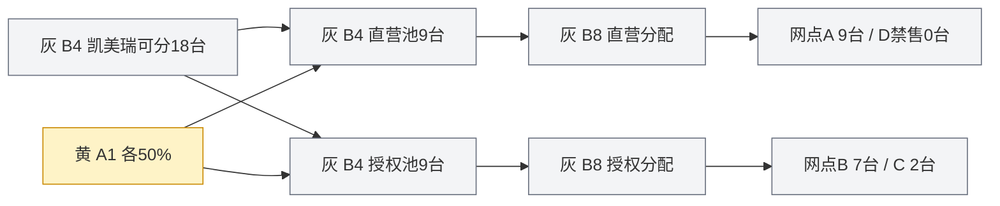

# 周度分车 GUI 页面与交互设计

> 版本：v1.2 评审稿｜日期：2026-09-30  
> 配套：[业务与引擎方案](./01_周度分车模块设计方案.md)、[节点与字段字典](./02_计算节点与字段字典.md)。  
> 本文给出页面结构、布局草图、业务字段和交互状态，供后续GUI实现使用。

## 1. 用户任务与页面结构

统一称“销售网点”，渠道选项为“直营店/授权店”；网点详情显示完整类别“直营销售中心/授权经销商展厅”，主体汇总显示“经营主体”。名称依据见[主方案第3节](./01_周度分车模块设计方案.md#3-计算粒度与对象边界)。不在业务页面使用“客户”指代这些网点，来源字段抽屉可显示原列名用于对账。

结果最小行是“经营周×销售网点×车型”，例如“W1×利雅得某展厅×丰田卡罗拉”。产品筛选只到品牌/车型，不提供年款、配置、颜色或VIN筛选。A6/B5不进入页面、参数目录或图谱，不提供保底及最低铺货的隐藏开关。


分车负责人主要完成三件事：配置本周分车政策、理解和比较计算结果、将通过校验的方案发布。区域负责人主要复核门店差异，物流负责人检查共享运输资源，管理者查看总体结果及政策取舍。

“周度分车”作为独立模块，包含一个周计划总览和一个车型工作台。车型工作台采用六个页签，始终保留同一任务、运行版本和筛选上下文。

> **实施现状（v1.3 合并）**：设计与策略调整两个前端实施合并为**唯一**的周度分车工作台（`frontend/src/components/strategy/StrategyWorkbench.tsx`），不再有“原工作台／新工作流”两个入口。页签收敛为六个：数据分析（含数据准备与车型总览内容）、策略调整（原参数与规则）、分车结果（含方案对比）、计算图谱、校验与发布、执行样本。同一套页签支持两个范围：CUI 任务范围（数据分析看板 + 三方案对比）与情景与教学范围（源数据／全国模拟展开／四网点算例／车型搭配算例的独立试算、历史版本与模拟发布）。下表为最初设计稿，字段与语义仍有效。

| 页面/页签 | 用户要回答的问题 | 核心内容 |
| --- | --- | --- |
| 周计划总览 | 本周有哪些车型，哪些可以评审？ | 15车型列表、输入完整性、供给、结果状态、联合资源校验 |
| 数据准备 | 原始数据齐不齐，采用什么日期和假设？ | 蓝色输入、来源、缺数、模拟扩展 |
| 参数与规则 | 哪些政策正在生效，能改什么？ | 黄色参数表单、规则清单、覆盖关系和命中预览 |
| 计算图谱 | 这个数字如何一步步算出来？ | 三色依赖图、灰色节点数据和公式 |
| 分车结果 | 哪家店分多少，为什么、还缺什么？ | 逐网点逐车型结果，零分配原因、预留明细 |
| 方案对比 | 调参之后谁增谁减，约束有什么变化？ | 同口径版本差异、可比性、资源变化 |
| 校验与发布 | 是否满足约束，能否交接物流？ | 冲突清单、可执行条件、发布范围及版本 |

总览到车型工作台再到门店结果是一条连续下钻路径，不重复创建多个互不关联的任务。页面中的“计算完成”“校验通过”“计划已发布”“已发运”分别显示。存在车型搭配时，总览标记政策组，点击任一成员可同时查看关联车型；不能把成员车型单独发布而遗漏搭配条件。

## 2. 周计划总览

### 2.1 页面布局

```text
周度分车  /  W1完整七日情景
运行模式：演示推演    输入快照：H_MOCK_20260929_V1
供给参考：2026-07     运力场景：SC-WEST      当前方案：P1

[全国情景供给 2,010] [拟分车 —] [政策预留 —] [自由未分配 —]
[渠道拆分：待配置] [计算完整性：待补车型明细]     [联合运输校验：未运行]

品牌/车型           供给台数   直营池/授权池   数据状态       拟分车
丰田 凯美瑞              394       — / —       缺车型库存       —
丰田 雅力士轿车          359       — / —       缺车型库存       —
丰田 海拉克斯            323       — / —       缺车型库存       —
…… 其余车型
雷克萨斯 LX               43       — / —       缺车型库存       —

[打开车型] [校验全部输入] [计算已就绪车型] [查看共享资源]
```

这是使用当前数据打开页面时的初始状态示意。2,010和各车型供给来自既有W1情景；“拟分车”和“缺口”没有结果前显示空值，不使用供需流量差冒充最终求解。

### 2.2 指标与操作

- **供给**显示“情景供给”或“已确认供给”，旁边给出来源期间。
- **拟分车/最终分车**只汇总选中运行的有效B10结果，标记计算覆盖范围。部分车型未算时不把部分和称全国最终量。
- **政策预留**与**自由未分配**分开，点击进入B9。
- **未满足需求**按订单、普通补库去重拆分；禁售等潜在需求另列。不把参考周消耗、库存水位缺口和运输缺口相加。
- 切换港口场景保留当前方案，建立比较候选并重新校验物流，不直接覆盖历史结果。
- 一键计算只执行已就绪范围，其余车型仍显示阻塞。跨车型联合发布必须使用完整、匹配的运行集合。

## 3. 参数与规则页

### 3.1 布局与A1拆大包

```text
凯美瑞 / W1 / 参数版本V2草稿
当前结果来自V1；草稿尚未计算

左侧参数组             中间编辑区：A1拆大包             右侧生效预览
直营/授权拆分 ←       应用车型 [丰田 凯美瑞]          本周可分量 394台
周期与预留             直营店比例 [70] %               直营池 276台
销售速度               授权店比例 [30] %               授权池 118台
库存处理               合计100%                        总量校验 394台
目标与政策加成         未用额度：留在原渠道            参数性质：演示
资格与限制             跨渠道调配：修改比例后重算      影响节点 B4及下游
分配算法               生效经营周 [W1]                 [查看网点范围]
车型搭配政策           比例依据 [演示政策，不代表合同]

[保存草稿] [检查规则冲突] [生成新版本并试算]
```

上例明确假定394台均可分、没有预留/既有占用，70%/30%为用户选择的演示比例。预览为`394×70%=275.8→276`与`394×30%=118.2→118`。预留或既有占用变化时先更新B4全国Q，再预览渠道拆分；不会把394固定当成净可分量。

批量模式一行一个车型，列出品牌、车型、比例来源、直营%、授权%、净可分量、两渠道整数预算、冲突及有效期。允许品牌模板继承，逐车型可覆盖；比例缺失或总和不是100%时不能试算该车型。页面没有“关闭分池并全国混分”的选项。

A5表单仍包含4–6周参考区间、基准5周、自由库存口径和绩效/渠道/区域系数；可按网点或车型覆盖，旧CSV的3/4周保留来源值。字段旁解释“重点区域加成提高目标，不修改历史销量”。参数明确台、周、百分比等单位，不要求用户理解内部字段名。

A1比例与A5渠道加成分开说明：前者决定渠道可用总量，后者改变渠道池内网点目标。若某项政策意图只在两者之一生效，应设置相同原因标识并检查重复倾斜，不能因重复配置隐式放大。

### 3.2 业务参数的呈现方式

| 参数组 | 主表单 | 展开明细 |
| --- | --- | --- |
| A1 直营/授权拆分 | 逐车型渠道比例、经营周、依据 | 模板继承、两池整数预算、取整依据、留存规则 |
| 周期与预留 | 经营窗口、供给截止、预留方式 | 固定量/比例互斥；不可用、既有承诺与预留去重 |
| 销速 | 直营/授权店口径、回看期、预测来源 | 修补规则、需求变化系数、最大允许数据年龄与过期策略 |
| 库存 | 快照截止、及时在途、投影窗口 | 缺到达时间的处理、负净资源解释、锁定与冻结排除依据 |
| 目标 | 参考区间、基准WOS、库存口径、绩效、重点渠道/区域 | 作用域覆盖、总加成上下限、取整后的目标台数 |
| 资格 | 品牌/车型资格、禁售、路线禁运 | 适用来源、日期、触发依据、额度和收货条件 |
| 分配 | 水位口径、整数并列规则、秩序扣减 | 仅普通分配可扣、被扣门店不参与当次回流、封顶规则 |
| 车型搭配 | 主配车型、搭配车型、数量比例、硬搭配/软建议 | 同店同周、取整方式、普通量抵扣、政策额外台数上限、库存健康/资金/接货限制、政策依据 |

每组提供“当前有效值”和“来源规则”。继承值显示来源层级，用户选择“为该范围覆盖”才新增覆盖记录。缺输入的能力显示具体条件，如“尚未接入绩效等级，当前按系数1”；不能展示一组编造的真实经营评分。

当前只支持的算法选项才可编辑。未来高级选项在设计中有记录，不提前做一个看似可用但无计算逻辑的开关。

### 3.3 规则清单

除表单外提供表格视图：规则名称、业务类型、适用范围、生效期、条件、处理值、作用位置、硬/软、优先级、状态、依据。

示例规则均标记“方案示例”：

| 规则 | 条件 | 处理 | 图谱位置 |
| --- | --- | --- | --- |
| 高绩效门店倾斜 | 已接入且有效的绩效等级命中 | 目标系数1.10 | A5→B2 |
| 东部重点铺货 | 区域=东部且在活动期内 | 目标系数1.20 | A5→B2 |
| 临时禁售 | 有效禁售名单命中 | 分车0并解释原因 | O4/A7→B6 |
| 秩序扣减 | 有有效依据 | 普通量扣20%，有效订单量不扣；回原渠道 | A8→B8 |
| 主配5台搭配3台 | 生效期内的指定门店与两车型 | 按普通主配量计算要求，扣正常搭配抵扣，增加政策量；硬条件不满足回退主配 | A9→B12 |

保存前显示影响对象数、重复加成、同级覆盖冲突、比例和、上下限及数据缺口。影响对象数是规则匹配数量；实际增减车量只能由试算得出。

### 3.4 参数修改与撤销

编辑黄色节点或表单生成同一参数草稿。未保存时提示草稿状态；保存不会修改已发布版本。用户可撤销本次草稿或恢复某历史版本为新草稿。

点击“试算”冻结参数草稿和选定输入，产生新run_id。计算期间再改草稿不改变正在运行的版本。完成后提供“查看新结果”和“与基线比较”。禁止将旧结果显示为已使用新参数。

### 3.5 车型搭配政策编辑

```text
政策：主配H与搭配C                  模式：硬搭配
发布方/政策依据 [____________]       适用渠道/门店 [____________]
主配车型 [H]  每 [5] 台              搭配车型 [C] 至少 [3] 台
结算窗口 [W1]                       取整：逐店累计向上取整
触发基数：普通主配量                 已承诺/有效订单：不触发
抵扣：本轮同店普通搭配量             历史库存：不抵扣
允许超过普通需求 [是]               单店政策额外上限 [2] 台
库存健康警戒 [按政策填写] 周         实物硬上限 [按政策填写] 台
资金/接货条件 [查看]                 零销速：必须填写绝对限制
[查看命中门店] [预览联动影响] [生成新版本试算]
```

上例是教学政策，无实际依据时不自动启用。界面同时展示正常建议量、拟追加政策量、分配后自由/实物库存覆盖；即使非畅销车没有补库缺口，也可以在明确的政策额度内追加，超出硬承接限制则显示对应主配需回退多少。

硬搭配和软建议的区别写在控件旁：硬搭配无法落实时主配减量；软建议保留主配但记录未完成要求。不得让用户把硬搭配的缺口隐藏成普通提示。5:3按逐店累计比例计算，3台主配要求2台搭配，明确区别于“只有凑够5台才触发”。

4–6周只显示在对应口径的目标参考区间。实物库存覆盖另有明确标签，不拿自由库存WOS直接判断实物库销比是否健康。策略加成或政策配车使库存超出目标参考区间时展示风险；是否停止分配由独立的硬限制决定。

## 4. 计算图谱页

### 4.1 默认布局及三色语义

横向从左至右按“输入 → 车型总供给/网点需求 → 直营及授权分池 → 池内逐网点分配 → 车型搭配 → 校验与结果”排列。黄色参数靠近所影响的灰色节点，任务和版本放在页面顶部。

| 类型 | 建议视觉 | 卡片内容 | 点击行为 |
| --- | --- | --- | --- |
| 蓝色输入 | 淡蓝填充，标“输入” | 名称、粒度、记录数、来源日期、数据性质 | 来源字段、样本、缺失、关联对象 |
| 黄色规则 | 淡黄填充，标“参数” | 参数组、有效版本、覆盖规则数、是否有草稿 | 只读查看或进入草稿编辑 |
| 灰色计算 | 浅灰填充，标“计算” | B编号、业务名称、状态、记录数和关键结果 | 公式、数值、规则命中、上下游 |

颜色始终表达类型。运行成功、失败、等待等状态通过文字和角标表示，不把灰色计算节点整块改成绿色而丢失三色含义。色弱用户可通过标签和形状区分，不单靠颜色。

画布控制包括适合屏幕、缩放、搜索节点、只看当前路径、显示/隐藏参数边、展开阶段。默认不展示所有门店和所有运算字段，以免主图变成不可阅读的连线网。

### 4.2 全国、渠道、网点三层范围

1. **车型全国**：B4显示该车型S/X/P/R/Q，和两个渠道预算，不展开全部网点。
2. **车型×渠道**：展开B4看直营/授权两池，显示A1比例、整数预算、已用和未分配；进入B8只查看该渠道候选。
3. **网点×车型**：从结果选中网点，高亮它的需求、目标、库存、所属渠道池和命中规则；B8进一步展开订单、注水、扣减、回流阶段。



以上是主方案第7.1节的实例展开，B4中的两个子卡属于同一语义节点的渠道记录，不新增两份供给。点击B网点时显示“全国可分18、授权渠道预算9、本店最终7”，避免把18或9误读为本店独享。

开启搭配时提供政策组视图：并排展示主配和搭配各自的渠道预算及B8结果，共同连到A9/B12，然后分别回到B10。两个车型各自扣本渠道预算，不能跨车型或跨渠道混用剩余量。B3可展开逐日投影，B11可展开共享资源。

### 4.3 灰色节点详情抽屉

抽屉依次包含：

- **结果**：关键字段、值、单位、期间、状态。
- **业务解释**：一句说明本步做了什么。
- **公式与代入**：可读公式、实际输入、取整及封顶。
- **数据明细**：可筛选、分页、导出对应节点快照。
- **命中规则**：有效规则、被覆盖规则、未适用原因。
- **来源与上下游**：原输入行、参数版本、上游节点和受影响的下游节点。

以主方案教学算例的店B为例，点B2显示：

```text
目标库存覆盖 6周         目标自由库存 18台
基础5周 × 绩效1.00 × 渠道1.00 × 区域1.20 = 6周
周销速3台 × 6周 = 18台 → 整车目标18台
命中：教学算例的重点区域规则
下游：分配需求上限、注水分配、最终结果
```

点B8显示每阶段累计量和增减量，明确“累计8”不是本阶段又加8。B3显示“期末净资源”为负时解释成需求尚未覆盖，不显示负实物库存。

### 4.4 正向影响与反向溯源

**反向路径**：在B10或结果表点击7台 → B8初始8/扣1/回流0 → B7订单与上限 → B2目标18、B3净资源0 → B1销速、蓝色来源和黄色政策。

**渠道路径**：网点B的B8 → B4授权池9 → A1授权50%及全国可分18 → 蓝色供给与A2占用/预留。

**正向路径**：选择A5某条区域规则 → 命中销售网点与车型 → B2及下游 → 共享资源影响提示 → 生成新版本试算。只修改一条规则也可能改变同池其他门店分配，应显示本渠道池及关联搭配车型影响，不只标记规则直接命中的门店。

图谱边可以显示“提供周销速”“提供目标库存”“供给上限”“资格筛选”等业务含义。选中一条边可查连接键及记录数，便于发现重复连接。

B12的反向解释示例：“搭配C最终3台＝正常补库1台＋为主配H 5台追加2台政策量”。用户能继续追到H的暂定配额、5:3规则、C的供给与承接上限；回退时显示原配额、最终配额及被哪条限制减少。

### 4.5 计算与异常状态

| 状态 | 页面表现 | 用户可做什么 |
| --- | --- | --- |
| 等待上游 | 节点角标“等待” | 查看正在处理的上游 |
| 计算中 | 进度按已完成节点/阶段展示 | 查看日志、取消运行 |
| 已完成 | 有结果、完成时间和运行版本 | 查看明细与溯源 |
| 缺数据 | 列出具体字段及影响对象 | 打开来源或演示扩展 |
| 被规则排除 | 保留0分配及原因 | 查看规则，获授权后修改草稿 |
| 失败 | 显示校验冲突、失败节点 | 修订数据或规则后新建运行 |
| 使用缓存 | 标注复用来源及时间 | 检查来源版本，正常溯源 |
| 结果已过期 | 顶部说明发生变化的数据/资源 | 新建运行后再发布 |

多个节点可以等待，不用随机百分比模拟精确进度。失败结果不会被完整绿色路径覆盖。

## 5. 分车结果页

### 5.1 默认结果表

固定显示销售网点、渠道、区域、车型和最终分车。其余字段按业务组展开：

| 分组 | 列 |
| --- | --- |
| 需求 | 周销速、尚未覆盖订单、基础及处理后目标WOS、目标库存 |
| 库存 | 自由、已锁、冻结、及时自由在途、期末净资源 |
| 规则 | 绩效/渠道/区域系数、所属渠道池、排除原因 |
| 分配 | 初始分配、扣减、回流、搭配回退/重分、政策新增量、最终分车、需求用途 |
| 结果 | 期末预计自由/实物覆盖、超普通需求量、库存风险、未满足量及类型、来源批次、到达窗口 |
| 校验 | 库容、额度、运输、发布状态 |

允许按区域、渠道、门店、车型、资格状态筛选。经营主体和品牌汇总为折叠层级，底层始终是门店与车型。“政策新增配车量”与“其中超过正常需求的量”分别列示，不重复相加；政策量不冒充新增终端订单，普通抵扣量不再计一次搭配数量。可筛选“有政策配车”“主配因搭配减量”“超库存警戒”的门店。

禁止直接平均门店WOS作为全国WOS；需要汇总时用同口径库存之和÷周销速之和，并对零销速库存另作说明。

### 5.2 为什么分了这些车

选中一行打开解释侧栏：

```text
网点B / 授权经销商展厅 / 丰田凯美瑞 / 教学算例
最终分车 7台

全国可分18台，A1授权比例50%，本渠道预算9台。
本店本期净资源0台，区域加成后目标18台。
在授权池内与网点C共同注水，本店初始得到8台。
按20%向下取整扣减1台，退回授权池；本店不参加此次回流。
最终7台，距目标仍缺11台，期末预计自由覆盖2.3333周。

[查看渠道拆分] [查看计算路径] [查看规则依据] [比较方案]
```

若为0分车，首句直接给原因；若数据缺失，则显示“未计算”，不写“分车0台”。解释由实际节点值和公式模板构成，Agent补充说明时引用这些证据。

### 5.3 人工修订

一期人工修订通过修改A1渠道比例、A5目标或其他已支持的业务参数后重新试算完成，不开放“至少再给某店几台”的最低量指令或直接覆盖最终数量。用户提出增配意图时，页面展示可调整参数及依据；如果只想调整渠道资源，则进入A1。

修订前后展示网点、同渠道其他网点、关联车型、预留及规划资源的变化。修改搭配成员时整组重算；已发布版本生成新修订，已发生的发运事实不覆盖。

## 6. 方案对比页

基线和候选并排显示运行ID、数据快照、参数版本、算法版本、资源场景。首先判断是否同口径：

- 同输入和算法，只改参数，可以说明“本次调参的结果差异”。
- 数据、资源或算法也变更时，显示各类变化，不能把全差额归因于绩效参数。
- 多个参数同时变化时，默认给总变化，不把交互影响硬拆为可相加的单因素贡献。需要单因素解释时，在相同快照上新增单因素试算。

上部显示分车总量、两渠道预算及使用量、预留/未分配、订单履约、门店缺口、约束冲突变化；中部按车型、渠道、区域、门店展开增减；下部显示规则改动和关键灰色节点差异。另列主配量、普通搭配抵扣、政策额外量、主配回退、搭配缺口及分配后实物覆盖，以区分“多满足真实需求”与“多完成商务拿货要求”。

图谱对比可高亮发生变化的节点，但保留三色类型。差值同时标“基线→候选”，避免把+2误读为累计分车量。

## 7. 校验与发布页

### 7.1 三层检查

| 层次 | 内容 | 未通过时 |
| --- | --- | --- |
| 数据与规则 | 必填、时效、主键、配置冲突、模拟/正式边界 | 定位蓝色来源或黄色规则 |
| 单车型分配 | 全国及渠道守恒、整车、订单、资格、车型匹配 | 定位B4/B7/B8及受影响结果 |
| 跨车型规划条件 | 搭配比例与唯一抵扣、规划路线容量、库容、额度、释放时点及交期 | 打开B11冲突并创建修订 |

每条校验列出已用量、上限、差额和影响记录。例如“P-W-RUH剩余容量不足”必须以当前拟发分配和有效占用求得，不能直接复用原CSV按历史销速得到的150台压力作为本方案实际超量。

### 7.2 发布摘要

发布摘要列出本次有效车型版本、总新分车量、既有承诺、预留、未分配、未满足硬义务、允许保留的软缺口和运输校验状态。正式发布按钮只在后端确认条件满足时可用。启用硬搭配时发布整组有效版本，列明政策新增台数及库存负担；不能只发畅销车型，再把未落实的搭配留给下次处理。

允许有供给不足造成的软补库缺口，只要其原因和数量清楚，且不违反硬承诺；“可发布”不等于所有门店都已补至目标。缺必要的车型级规划数据不能被当作普通软缺口跳过。颜色、配置、VIN与装车在后续物流执行确认，不因为它们尚未绑定而阻塞车型配额发布；页面显示“周计划已发布，待执行匹配”，不显示“已可装车”。

演示模式按钮标为“保存模拟发布版本”，不能与正式下发混淆。发布完成后展示发布号和物流需求链接；“已发布”不展示“已发运”。

## 8. 角色与交互约束

| 角色 | 主要能力 |
| --- | --- |
| 查看者/区域负责人 | 查看结果、溯源、比较、按权限范围导出 |
| 分车配置人员 | 编辑参数草稿、创建规则、试算、提交方案 |
| 物流负责人 | 查看共享资源、提供校验与修订依据 |
| 发布责任人 | 依据企业已有授权发布和修订计划 |

这是产品角色设计，具体身份和授权由项目接入。Agent建议参数变化时展示变更内容和影响范围，由具备权限的用户应用为草稿；自然语言解释不会直接改变已发布结果。

所有页面保留未保存草稿提示。表格导出携带运行版本、筛选范围、数据性质和字段单位；计算图谱可导出当前路径及节点明细，但不能导出一个没有版本依据的图片充当完整审计记录。

## 9. GUI验收演示

建议用三组互不混淆的演示验证页面：

1. **现有数据基线**：展示79店、15车型、W1供给2,010台和数据缺口，检查蓝色来源、输入快照中的模拟展开假设与黄色A1渠道规则，没有补齐时最终分车保持未计算。
2. **四店教学算例**：加载主方案第7.1节的独立模拟快照，查看直营/授权各9台，A/B/C/D最终9/7/2/0台和预留2台；从店B的7台完整追到每一步。

3. **两车型搭配算例**：按主方案第7.2节展示H=5、C=3，其中C为普通1台＋政策2台；把C承接上限改为2台后，联动变为H=3、C=2，分别显示留存2台/1台。

第二组继续演示禁售、渠道预算不足、零销速无订单不自动分车、比例冲突、改参数后结果过期、扣减无回流对象等分支；增加同车型不同颜色/配置归并为一行的检查。所有分支都有实际计算状态支撑，不只更换页面上的数字和解释文案。

GUI验收标准：参数页改动可追到计算运行，图谱节点读的是该运行真实产物，结果表能返回同一证据链；不能出现三个页面各自展示一套不一致的数字。
