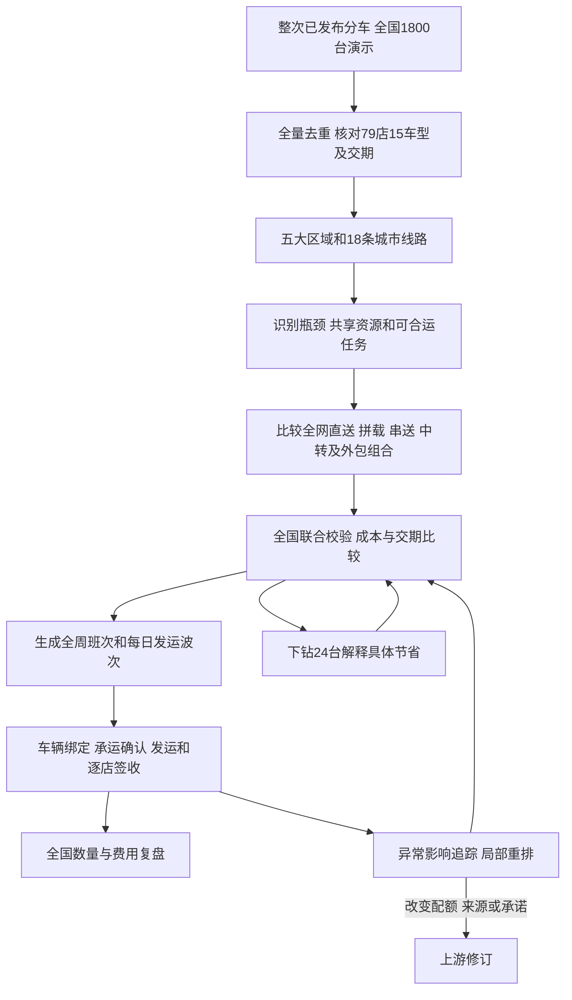

# 物流执行故事线与成本优化方案

> 版本：v1.1 全国物流故事设计稿｜日期：2026-09-30  
> 承接：已发布的周度分车计划及其修订版本。  
> 目标：在车辆去向、交付承诺和执行约束得到满足的前提下，选择总成本最低的可行运输组合。  
> 本文定义拟建设的业务流程和演示故事，不表示相关优化、承运接口或执行回执已经实现。

物流执行需要回答：**已经决定给各门店的车，应该怎样组合、什么时候发、由谁承运、经过哪里，才能按要求送到且少花钱。**

建议采用“统一运输需求池＋多方案比较＋按班次执行”的组织方式。各车型的分车结果统一进入运输池，先保护交期，再寻找同店混装、跨店拼载、邻城串送和回程配载的机会；中转、外包和等待集货只有在完整成本更低、资源和时间都成立时才采用。最终方案通常是多种运输方式的组合，不要求全国使用同一种方式。

**主故事承接整次周度分车，覆盖79家门店、18个城市和15个车型的全国网络。** 以项目既有W1供给2,010台为背景，新增一组“分配1,800台、未分配210台”的模拟输入，展开全网运输需求、线路瓶颈、运输组合、每日执行和全国复盘。1,800台是用于业务设计的演示规模，正式运行时由实际发布的分车明细决定。

24台仅保留为全国计划中的局部下钻，用来解释具体拼载和串送如何省钱；其余1,776台同样参加排程与费用比较。局部成本和节省比例不能外推为全国结果。

阅读时可先看第5节的全量规模与第6节的八幕故事；第3至4节解释运输选择和成本，第7至11节供产品、运营和研发对齐执行规则。

## 1 业务边界与依据

### 1.1 分车决定去向 物流决定运法

| 业务过程 | 负责的决策 | 交给下一环节的结果 |
| --- | --- | --- |
| 周度分车 | 哪个车型给哪家店、多少台、什么用途、何时需要 | 已发布版本、分车明细、来源和交期、规划资源占用 |
| 物流执行 | 具体车辆匹配、拼载、班次、线路、承运人、交接与费用 | 运输任务、资源占用、发运和签收回执、异常及费用记录 |
| 每日调拨 | 新订单或库存错配出现后，要不要改用其他来源或改变去向 | 经确认的调拨需求，进入同一个运输需求池 |

物流可以把两家店的车辆放在同一辆板车上，但不能因此改变两家店的配额。分车量、目的店、来源权属或有效承诺需要改变时，退回分车或调拨流程形成修订，再更新运输任务。

这里的“车”分为两个对象：待交付的商品车以“台”计；承运商品车的汽车运输板车以“辆”计；一次运输任务以“车次”计。三者不能混用。

### 1.2 以最新分车规则为准

继承[周度分车模块 v1.2](../01_周度分车/01_周度分车模块设计方案.md)和[周度分车策略调整方案](../02_周度分车-策略调整/01_业务流程与方案总览.md)：

- 上游按车型计算配额，不恢复旧故事中的保底规则。配置、颜色和VIN由物流执行按实际需求继续核对，不反向要求上游必须先完成逐车排程。
- 直营和授权渠道的预算、用途与来源关系保留。跨渠道同车运输不等于跨渠道转移配额或调度权。
- 车型搭配按有效政策处理。没有“同车交付”条款时，不强制搭配车型同一车次；如果运输调整破坏同店、同结算窗口等条件，触发整组复核。
- 上游已做B11规划校验，执行前仍需核对真实车辆、板车、装载模板、时点和承运确认。规划通过不等于已经可以装车。
- 已发布分车不可覆盖。已发运事实保留，修订只影响允许变更的部分。

### 1.3 当前数据支持到哪里

以下均为项目既有模拟口径，来源见第12节。

| 项目基线 | 现有数值或粒度 | 在物流故事中的用途 |
| --- | --- | --- |
| 销售网络 | 79家门店、18个城市、46个交易身份 | 关联目的地、资格和收货主体；一个结算主体不等于一个收货地点 |
| W1供给情景 | 15个车型、2,010台 | 供给背景，不直接作为本周待发运数量 |
| 双港口道路模板 | 180辆板车、有效周能力3,226台 | 常态资源对照 |
| 仅西部道路模板 | 同样180辆、有效周能力1,865台 | 受限场景对照，不与双港口容量相加 |
| 仅西部历史需求压力 | 全网净缺口540台、路线缺口合计548台 | 识别瓶颈，不能当作本计划实际欠交量 |
| 路线费用 | 港口/VPC到城市服务点的模拟整趟费 | 首轮道路估算，不是门到门完整结算价 |
| 装载和资源 | 8台/车次、90%规划可用率、按路线分配板车 | 演示筛查；正式执行需要合法装载模板和逐车日历 |

W1是既有文档定义的虚构完整七日窗口，不是现实运营周实绩。本文D1至D7均沿用这个演示窗口，作业时间统一按Asia/Riyadh解释；转入正式排程时必须换成明确日期和有效资源。

SC-WEST源模板既停用东部始发线路，又已计入12%运价上涨。不能再乘一次1.12，也不能直接用该模板证明现实中东部VPC存量无法发出。本文保持这一模板的边界；若只限制新船到港，应另建保留东部存量配送的资源情景。

## 2 怎样把分车计划变成运输需求

### 2.1 接收和分层

接收到已发布分车版本后，先将每条“来源×门店×车型×用途”转为运输需求。未发布候选可以预演运法，但不预订实际运力、不生成正式发运单。

| 需求层次 | 判断条件 | 处理方式 |
| --- | --- | --- |
| 可安排 | 来源可提、需求有效、车辆条件可确认、收货窗口明确 | 进入候选组车与排程 |
| 待释放 | 有已发布数量，但车辆尚未清关、完成检查或释放 | 保留需求和预计时间；只能作条件排程，不能标记可发运 |
| 待补信息 | 缺精确来源、交期、车型匹配或可执行路线 | 显示缺项及责任人，保留数量 |
| 已在执行 | 对应需求已有有效运单、在途或签收 | 关联已有记录，只安排尚未覆盖的余额 |
| 待上游修订 | 无可行车辆来源，或必须改变配额、门店和承诺 | 输出冲突及候选调整，不在物流环节自行改分车 |

需求至少携带：根需求编号、分车版本和明细编号、车型、数量、目的店、来源或可用来源范围、用途、最早可提时间、最晚到店时间、允许的交付窗口、已有占用、搭配关系和数据性质。

上游B11已为本需求保留的规划运力需要关联继承。物流细排时，将本需求的规划占用原子地替换为实际班次占用，其他需求的占用继续保留；不能先把自己的预留全部扣成不可用，再额外申请一份运力，也不能在替换中给其他任务留下抢占空档。

若上游只给出城市或供给批次，物流补充物理提车点与实际可用车辆。匹配到同一已批准来源范围内的具体车辆属于执行细化；超出来源范围或挪用其他需求的锁定车辆，必须回到上游。

### 2.2 先确定不可改变的条件

成本比较前，冻结本次需要运送的有效需求和评价范围：

1. 每家店、每个车型的应交数量及原交期；普通补库也需有最晚可接受到店时间，不能无限等待。
2. 已承诺、已发运及其他任务占用；本次只使用剩余资源。
3. 可提车辆、权属和质量状态；同车型不同配置不能在未经业务认可时替换。
4. 装载模板、承运资质、驾驶和作业规则、港口/VPC与门店作业窗口、逐日库容。
5. 可用报价、报价期限、计费范围、取消条件、公司与经销商承担费用的边界。

比较方案必须承接相同的需求。把少运几台、推到下周或让经销商承担费用得到的账面下降，分别列为交付范围变化、延期或费用转移，不能称为运输效率改善。

## 3 可以组合使用的物流方案

### 3.1 方案库

| 运输方案 | 适用情况 | 省钱来源 | 成立条件与可能增加的费用 |
| --- | --- | --- | --- |
| 整车直送 | 单店量较大，或交期紧、途中无需再分拨 | 少装卸、少中转、路线简单 | 不足载时仍付整趟费；目的店可接板车；直送来源已经具备交车条件 |
| 同店跨车型混装 | 同来源、同门店有多个小批量车型 | 合并重复车次 | 车型装载兼容、释放和交期有交集；不能仅凭总数≤8判定可装 |
| 同城多店拼载串送 | 同城门店的小批量可在同一窗口交付 | 共用一段长途，降低空位 | 增加停靠、绕行和卸车时间；装载顺序支持逐店卸车 |
| 邻城多点串送 | 目的地处于可行走廊，例如达曼与胡拜尔组合 | 一趟覆盖多个城市，减少独立长途 | 必须有完整多站路线、报价、时间和剩余载荷校验，不能直接拼接源表费用当新报价 |
| 干线加区域中转配送 | 多批次集中到有能力的中转点，末端小批量较多 | 干线集约化，末端路线集中安排 | 多一道装卸、堆存和衔接；中转场、两段运力和库容都要有数据 |
| 定班集货与短时等待 | 非紧急补库能等待下一批已确认车辆 | 提高装载率、减少车次 | 等待产生堆存、资金和缺货风险；必须有最晚发车时间及兜底方案 |
| 回程配载与循环运输 | 已有返程附近存在有效调拨或回收运输需求 | 降低整个往返任务的空驶或取得合同折扣 | 回程需求真实有效，时间和车型兼容；原报价含回程摊销时不能再凭空扣一次回程费 |
| 外包拼板或临时专车 | 小尾量、偏远线路、急单、现有车队不足 | 小量按台报价可能低于自开专车；增加可用资源 | 最低收费、接送费、保险、可承诺班次、交期和装载须确认；可询价不等于有运力 |
| 经销商自提或共同提车 | 合同允许且经销商能够组织运输 | 可能减少总部配送支出 | 对比全链路费用、补贴和风险；只转移付款人不算总成本节省 |

铁路、沿海滚装等多式联运可以作为长期候选。现有资料没有对应班期、站点、整车承运条件、两端短驳和报价，本版不把它们纳入可执行排序，也不预设其比公路便宜。跨境绕行或改进口港还会改变供给来源与到货时点，应先回到上游情景规划。

### 3.2 推荐的组合思路

**大批量优先检验直送，小批量优先检验拼载，只有中转节省大于新增处理成本时才中转。** 这只是生成候选的顺序，最终仍比较同一任务范围内的成本。

例如，一家门店已有8台兼容车型、车辆已齐、交期紧，直送通常值得首先比较；同城两店各4台且交期允许，则应比较串送；两城各有少量车辆时，应同时评估两趟直送、一趟串送、干线加短驳和承运商拼板。不能先定全部直送或全部经过VPC，再寻找支持它的理由。

跨车型、跨品牌、跨渠道可以共用物理运力，但装载、保管、单证和合同条件必须允许；每台车辆仍保持原需求和结算归属。

## 4 怎样判断成本最低

### 4.1 先可行 再比较成本

采用两层决策：先排除不满足硬性条件的运输组合，再在可行集合中比较成本。交期不可满足时显示无可行方案，比较补运、改约或上游修订的影响，不把迟到方案放进按时交付最低价的榜首。

```text
第一层：车辆可用、权属与质量有效、车型匹配、全部应交量有安排、
        不重复占用、装载和作业可行、到店不晚于有效承诺。
第二层：在通过第一层的组合中，最小化同口径的可比总成本。
同成本时：优先减少中转和改动，并保留更充足的时间余量。
```

原交期与经授权修改后的交期同时保存。即使客户同意延期，复盘仍显示相对原承诺的变化，不能通过改时间使原逾期记录消失。

### 4.2 成本必须算完整且不重复

```text
可比总成本 = 干线与直送费用 + 末端配送费用 + 装卸与中转费用
           + 增量等待与堆存费用 + 增量资金占用
           + 有依据的风险成本 + 变更或取消费用
           − 已确认且未在报价中抵扣的折扣
```

| 成本项目 | 计算和使用规则 |
| --- | --- |
| 整趟运输 | 按实际需要的车次×有效整趟费；不足载不按满载单台价折算整趟账单 |
| 按台拼板 | 按承运商阶梯价、最低收费和接送费计算；只在舱位及到达承诺有效时参与推荐 |
| 自有车队 | 决策看可避免的燃料、人工、路桥、维护等增量费用；固定成本单列，不能同时加整趟承运报价和同一趟运营成本 |
| 回空与调车 | 原整趟报价已经含回程摊销时不重复加收；新增调车或绕行按合同另计，节省需有联合行程或折扣依据 |
| 中转与末端 | 每一实际运输段、每次处理分别计费；同一报价已经覆盖的环节不能再收一遍 |
| 等待与堆存 | 比较方案相对共同起点增加的车日和费率，识别免费期、阶梯费和港口堆存触发点 |
| 资金占用 | 仅计因方案造成的增量占用，使用确认的车值、资金率及天数；不得与包含资金成本的综合车日费重复 |
| 货损与交付风险 | 有概率、损失及责任依据才折算金额；没有依据则单列风险和敏感性，不默认等于零 |
| 变更费用 | 已订班次退订、改单、加急、临时场地等增量费用；重新排程只比较尚可改变的成本 |

同时展示公司支付成本和全链路可比成本。经销商自提、供应商补贴或返程分摊可能改变付款人，不能据此认定总运输成本下降。

海运、关务、税费等相同且不受本次决策影响的费用可以从排序中剔除，但必须注明范围。一旦更换入口、贸易方式或权属，相关差异重新进入比较。必要费用缺报价的方案标记待估价，不能将空值按0排序。

### 4.3 三条可以向业务解释的判断式

**拼载值不值得等：**

```text
可避免的车次费用 > 新增绕行和停靠 + 等待堆存 + 增量资金与风险 + 变更费
且预计到店时间仍满足承诺
```

可避免很重要：车次已经支付且不可取消时，拼载未必再省一整趟费。也不能为等待尚未确认的下一批车无限推迟发车。

每个候选的最晚发起时间由所有停靠点共同限制：对每家店，用最晚到店时间减去从发起到该店的完整作业时长和约定余量，再取最早的结果。预约、途中停靠和装卸都计入相应路径；下一批可提时间晚于该界限，就不能继续等待它拼载。

**中转值不值得做：**

```text
干线 + 中转装卸 + 中转停留 + 末端配送 + 增量风险
< 覆盖相同门店和交期的直送或串送成本
```

**外包值不值得用：**

```text
外包完整报价 + 必要接送与变更成本
< 自营可避免费用 + 可量化的资源机会成本
```

资源机会成本体现占用这辆板车后，其他已承诺任务是否被迫加急或外包。没有可靠金额时，用联合排程和并列方案展示影响，不编造一个罚分。

### 4.4 优化的是整个运输组合

先冻结已执行及不可撤销任务，再把可调整需求按来源、方向、可提时间、交期和装载条件生成候选班次。比较中允许拆批、合批、换停靠顺序及使用不同承运方式，但每个候选都要明确车辆覆盖、完整路径、占用时间和费用。

联合选择时保证：每笔需求被完整覆盖且只覆盖一次；同一VIN不重复锁定；同一板车不同时跑两条线路；中转前后数量和时序衔接；所有车型与任务共享同一资源余额。多段运输的一台商品车可以出现在多张分段运单中，但到店完成量只计算一次。

源CSV给出的路线容量是固定车队分配结果，不是车队重排后的理论最优。要把其他线路板车调过来，需新增调车时间、成本和资源版本，并重新验证被调出线路。90%折减已经体现在有效容量中，不再重复折减；改用实际可用车辆日历时应替换该近似模型，不能同时套两遍。

一期建议采用可解释的候选生成与联合校验，输出已评估候选中的最低成本方案。后续可建立整数优化模型；只有在输入完备、候选覆盖范围明确且求解器给出最优证明时，才声称该模型范围内的全局最优。若仍有非零最优间隙，只显示当前最好可行方案及距理论下界的差距。大模型负责解释和整理候选，金额、装载和时间校验由确定性计算完成。

## 5 整次周度分车的全国物流演示

### 5.1 全量规模与数量边界

**主故事处理的是一次覆盖全国销售网络的周度分车，物流计划必须承接该版本的全部分车明细。** 系统读取79家门店、18个城市、5个区域和15个车型；没有当期分车的门店可以为0，但不能为了简化演示只计算被选中的几家店。

为把业务规模讲清楚，本版在既有W1供给2,010台的背景下，新增一组明确的演示输入：上游本轮分配1,800台，另有210台未分配，本轮1,800台均需要从来源点运往目的店。1,800和210是本文设定的故事输入，不是现有CSV已经求出的真实分车结果，也不是强制规定每周都按这个比例分车。

| 数量层次 | 本例数量 | 含义 |
| --- | ---: | --- |
| 全国W1供给情景 | 2,010台 | 沿用项目既有车型供给情景 |
| 本轮分车量 | 1,800台 | 新增演示条件，上游已明确车辆去向和需求用途 |
| 本轮未分配量 | 210台 | 不自动生成运输任务，不默认已经成为某个VPC的实物库存 |
| 本轮应运输量 | 1,800台 | 本例假设全部需要实物移动，未被既有运单覆盖 |
| D1可提数量 | 1,500台 | 新增释放时序假设，仍需通过班次和车辆校验 |
| 后续批次释放数量 | 300台 | 新增假设，按各自释放和交期排程，不假定D1已可发 |
| 详细解释的局部任务 | 24台 | 是1,800台中的子集，只用于下钻，不另加到全国总量 |
| 其余全国任务 | 1,776台 | 同样参加排程、费用和资源校验，不能在演示中被忽略 |

本例设定全国来源为P-W。为展示执行阶段的资源变化，另设上游P1按原资源版本完成规划，执行前资源快照变为当前SC-WEST模板，原运力校验随即失效，物流必须重新复核。**不能把后文发现的路线冲突解释成原计划仍已通过当前资源校验，也不能在冲突未解决时确认全部可执行。** 这些均为新增故事条件，不表示项目存在真实已发布的1,800台计划。

正式接入时，以实际发布版本求和替换1,800；从需求中扣除无需移动或已被有效执行记录覆盖的部分，再接入其他已批准、且尚未覆盖的运输需求。每日调拨和历史未完成任务单列来源并去重，不能简单把各模块总数相加。

### 5.2 全国车型明细必须保持供给守恒

下面的供给列来自既有W1车型结构；演示分车列将1,800按各车型供给占比用最大余数法拆分，余数相同按表中顺序处理。这只用于构造物流故事的上游输入，不代替实际分车算法，不据此推断某店的需求或库存。

| 品牌 | 车型 | W1供给 | 本轮演示分车 | 未分配 |
| --- | --- | ---: | ---: | ---: |
| 丰田 | 凯美瑞 | 394 | 353 | 41 |
| 丰田 | 雅力士轿车 | 359 | 321 | 38 |
| 丰田 | 海拉克斯 | 323 | 289 | 34 |
| 丰田 | 卡罗拉 | 215 | 193 | 22 |
| 丰田 | RAV4 | 161 | 144 | 17 |
| 丰田 | 兰德酷路泽300 | 125 | 112 | 13 |
| 丰田 | 兰德酷路泽250/普拉多 | 90 | 81 | 9 |
| 丰田 | Fortuner | 54 | 48 | 6 |
| 丰田 | 汉兰达 | 36 | 32 | 4 |
| 丰田 | Urban Cruiser | 18 | 16 | 2 |
| 丰田 | Veloz | 18 | 16 | 2 |
| 雷克萨斯 | ES | 87 | 78 | 9 |
| 雷克萨斯 | RX | 54 | 48 | 6 |
| 雷克萨斯 | NX | 33 | 30 | 3 |
| 雷克萨斯 | LX | 43 | 39 | 4 |
| **合计** | **15个车型** | **2,010** | **1,800** | **210** |

### 5.3 全国量要展开到每条城市线路

为显示全网调度问题，城市演示量按SC-WEST各启用路线的历史参考周需求权重，用最大余数法分配1,800台，余数相同按路线编码排序。容量直接采用该场景原值；城市量是新增分布假设，不能当作实际门店分车结果。

| 区域 | 城市及路线 | 演示待运输量 | 原模板有效周容量 | 本轮路线缺口 |
| --- | --- | ---: | ---: | ---: |
| 中部 | 利雅得 P-W-RUH | 375 | 352 | 23 |
| 西部 | 吉达 P-W-JED | 330 | 345 | 0 |
| 东部 | 达曼 P-W-DMM | 166 | 158 | 8 |
| 东部 | 胡拜尔 P-W-KHO | 113 | 108 | 5 |
| 西部 | 麦加 P-W-MAK | 106 | 129 | 0 |
| 西部 | 麦地那 P-W-MED | 108 | 115 | 0 |
| 西部 | 塔伊夫 P-W-TAI | 47 | 64 | 0 |
| 东部 | 哈萨 P-W-HOF | 54 | 57 | 0 |
| 中部 | 布赖代 P-W-BUR | 98 | 100 | 0 |
| 中部 | 欧奈宰 P-W-UNA | 32 | 36 | 0 |
| 北部 | 哈伊勒 P-W-HAI | 47 | 50 | 0 |
| 北部 | 塔布克 P-W-TAB | 48 | 50 | 0 |
| 南部 | 艾卜哈 P-W-ABH | 97 | 100 | 0 |
| 南部 | 海米斯穆谢特 P-W-KHM | 33 | 36 | 0 |
| 南部 | 吉赞 P-W-JAZ | 43 | 43 | 0 |
| 南部 | 奈季兰 P-W-NAJ | 32 | 36 | 0 |
| 西部 | 延布 P-W-YAN | 33 | 43 | 0 |
| 东部 | 朱拜勒 P-W-JUB | 38 | 43 | 0 |
| **合计** | **18条城市线路** | **1,800** | **1,865** | **36** |

这就是全量故事的第一处冲突：全国总容量看似富余65台，但利雅得缺23台、达曼缺8台、胡拜尔缺5台，局部合计缺36台；其他线路合计富余101台，却不能在不改变板车分配、行程和时间的情况下直接抵扣。36是本例重新计算的路线压力，不能沿用历史销速情景下的540或548。

这些是周度数量筛查结果。即便解决36台缺口，也不代表全部交期可满足；还需核对车型装载、班次、释放时点和收货窗口。车型表与城市表是同一批1,800台的两种汇总，不相加，也不能代替门店×车型×来源×交期的完整交叉明细。

区域层面汇总为：中部505台、西部624台、东部371台、北部95台、南部205台。页面从全国下钻到区域、城市、门店车型，底层始终使用同一批需求。

### 5.4 全网比较的运输组织方式

全国优化先安排大批量稳定干线，再处理尾量和跨城协同。不同区域的方案不能各自独占同一辆板车；区域间会争用的资源，最终回到全国统一检查。

| 全国方案 | 怎样组织本轮1,800台 | 重点核查 | 成本比较方式 |
| --- | --- | --- | --- |
| N0 门店独立发运 | 按各门店的车型兼容和交期组车，不跨店合并 | 同城重复长途、小尾量和未满载；仍须处理36台路线压力 | 用全部门店任务形成基线，不能拿24台的费用乘倍数 |
| N1 城市内集中组车 | 同来源同城市的多个门店跨车型拼载，按可行窗口发车 | 城市内绕行、卸车顺序、释放错峰；拼满不自动增加原模板容量 | 汇总各城市所有实际车次、末端和等待成本 |
| N2 全网组合运输 | 满载直送＋城市拼载＋邻城串送＋经比较有效的中转；针对瓶颈调整车队或补外包 | 调出线路影响、新路线周期、中转衔接和共享资源 | 比较整张计划总成本，新增调车及外包费用都计入 |
| N3 定向外包补运 | 保持已可执行的干线，对瓶颈任务和不合适自营的小尾量询价 | 外包班次、到达承诺、最低收费和自营可避免成本 | 与N2比较解决相同冲突的完整增量成本 |

推荐优先评估N2，再与N3及N1的可行版本比较。可以采用“N2为主、部分线路外包”的组合，但只有全量联合校验与报价完整后才选定成本最低者。当前源数据不能支持预填一个全国最优金额或保证节省比例。

**可以先量化车次规模和基础道路预算：** 只按8台/车次、完全忽略城市及时间限制，1,800台至少需要225个装载车次；保持表中18条独立直送线路、各城市允许周内自由合并时，`Σceil(城市数量÷8)=233`车次。180辆板车与233车次不是同一单位，短途车辆可周转多次，长途车辆则可能一周只有一趟。

把这233个城市车次乘对应SC-WEST整趟价，得到**819,287 SAR的城市级基础道路估算**。它没有解决36台局部容量冲突，也未计时窗拆批、真实车型装载、逐店末端、中转、等待和补运差价，因此只能是估算锚点，不能标为全国可执行预算或最低成本。允许跨城串送后，车次和路径也会改变，233并非所有运输组织方式的共同下界。

全国正式费用应由全量班次明细加总。比较时同时展示：固定应交1,800台、按原交期可交量、未排程量、待释放量、总车次、所需板车日、外包量、完整成本和仍缺的确认。全国路线总览保留全部18条线路，不能只展示被优化的线路而隐藏其他线路的费用增加。

### 5.5 从全国计划下钻到24台局部任务

下面的24台定位为全国1,800台中的教学子集：利雅得16台、达曼5台、胡拜尔3台，分别占用上表对应城市额度；车型合计凯美瑞15台、卡罗拉9台，也包含在全国车型量中。**其余1,776台仍在全量排程中，不能因为镜头切到这里就变成资源空闲。**

门店编码和城市取自现有主数据；这6条任务及其释放、交期、价格条件为新增模拟明细，用于解释业务如何下钻。它们不代表现有CSV已包含整套全国交叉明细，也不与既有前端27台物流样本相加。正式全国回放需从同一发布版本导入完整明细并同时对齐车型、城市和门店汇总。

本组20台D1可提、4台后续释放，分别包含在全国1,500和300的释放分组中。全国统计一次，本组明细只提供解释。

本组车辆来源均为P-W西部可交接点，车型按表匹配且8台混装模板在局部样例中假设已验证；不借用未知车辆填满空位。四种局部方案使用同一全国剩余资源快照，并额外假设本组所需班次、作业与中转条件可满足。这个局部条件不能证明全国36台路线缺口已经解决；全国推荐仍需联合重排或补运验证。同一时段已被本组选定方案占用的资源不能再分给其他需求，未使用的资源则回到全国可用池。

| 需求 | 目的门店 | 车型 | 数量 | 最早可提 | 最晚到店 | 用途 |
| --- | --- | --- | ---: | --- | --- | --- |
| R1 | MOCK-D-001 利雅得01店 | 凯美瑞 | 6 | D1 08:00 | D3 18:00 | 有效订单交付 |
| R2 | MOCK-D-001 利雅得01店 | 卡罗拉 | 2 | D1 08:00 | D4 18:00 | 普通补库 |
| R3 | MOCK-D-002 利雅得02店 | 凯美瑞 | 4 | D1 08:00 | D4 18:00 | 普通补库 |
| R4 | MOCK-D-003 利雅得03店 | 卡罗拉 | 4 | D2 08:00 | D4 18:00 | 普通补库 |
| R5 | MOCK-D-012 达曼01店 | 凯美瑞 | 5 | D1 08:00 | D4 18:00 | 普通补库 |
| R6 | MOCK-D-015 胡拜尔01店 | 卡罗拉 | 3 | D1 08:00 | D4 18:00 | 普通补库 |
| 合计 | 5家门店 | 凯美瑞15台、卡罗拉9台 | **24** | — | — | 数量和去向在比较中不变 |

### 5.6 局部价格来源和新增条件

金额均为SAR。既有价格取自SC-WEST场景行，沿用整数整趟费，不根据显示的单台摊销费倒推。

| 输入 | 数值 | 性质与计费范围 |
| --- | ---: | --- |
| P-W至利雅得整趟费 | 4,458 | 源CSV模拟价，已含场景涨价与回程摊销，不含本样例末端服务费 |
| P-W至达曼整趟费 | 5,918 | 同上 |
| P-W至胡拜尔整趟费 | 5,990 | 同上 |
| 同城串送增加第二站 | 300/车次 | 新增模拟报价，覆盖该车次的绕行和额外停靠道路费用 |
| P-W至达曼再至胡拜尔 | 6,100/车次 | 新增完整多站道路模拟报价，已含跨城绕行及回程，不再叠加5,918和5,990 |
| 门店末端服务 | 120/店次 | 新增模拟费，含城市服务点后的到店服务和卸车；由对应最终配送车辆完成；不包含表中另列的绕行和短驳道路费 |
| 增量等待综合费 | 10/台天 | 新增模拟参数，按实际小时折天，已合并本例增量堆存与资金费用，不能再重复加资金成本 |
| 东部中转处理 | 40/台 | 新增模拟费，涵盖中转点额外卸车、交接和再装车 |
| 中转停留 | 0.5天 | 新增模拟条件，8台均计增量等待费用 |
| 东部末段短驳 | 600/车次 | 新增模拟道路报价，覆盖中转点到达曼店、再将3台送胡拜尔店的完整路径；门店末端服务费另计 |

D方案的5次门店末端服务由对应最终配送车辆完成，东部两店由短驳车完成，不能同时再计原干线板车的门店配送。中转点作为独立模拟节点，假设设在达曼原城市服务点，因此沿用该段干线价；东部8台先交接入场，再在末段车次按站卸载。真实中转场位置变化时必须重新取干线报价。

样例额外约定：全部待比较班次尚未订约，费用可避免，无取消费；各候选满足同一收货和交期条件；没有方案差异化的税费、保险或预期货损费用。上述约定只用于教学计算，正式数据中未知的差异费用不能据此置零。

本例仅将列明的待发和中转停留折算成增量时间成本，其余在途时长差异暂假设不产生另行可计的费用。正式比较应按完整占用时间补算资金差异；不能把本例可比成本称为全链路完整实际成本。

源路线P-W至利雅得单程规划时间为29.3小时，至达曼46.9小时，至胡拜尔47.3小时。同城第二站新增3小时，多站直达胡拜尔按52小时计算，东部中转方案按完整链路不超过72小时校验；后三项为本文模拟条件，均另核对收货预约。实际车辆、装卸日历和时间余量缺失时，不得沿用这些条件确认真实发运。

### 5.7 局部四种候选保持24台全部按时到店

| 方案 | 运输组织 | 道路费 | 末端与中转处理费 | 增量等待费 | 可比合计 |
| --- | --- | ---: | ---: | ---: | ---: |
| A 逐单逐车型直送 | R1至R6各开一趟，6个长途车次、6次门店服务 | 29,740 | 720 | 0 | **30,460** |
| B 同店合并直送 | R1和R2混装，其他各自直送，5个长途车次、5次门店服务 | 25,282 | 600 | 0 | **25,882** |
| C 同店混装加拼载串送 | R1和R2一趟；R3等R4一天后串送一趟；R5和R6邻城串送一趟 | 15,316 | 600 | 40 | **15,956** |
| D 利雅得拼载加东部中转 | 利雅得同C；东部8台一趟到中转点，再作区域交付，3个长途加1个短驳车次 | 15,734 | 920 | 80 | **16,734** |

计算过程如下：

```text
A道路费 = 4×4,458 + 5,918 + 5,990 = 29,740
A合计 = 29,740 + 6×120 = 30,460

B道路费 = 3×4,458 + 5,918 + 5,990 = 25,282
B合计 = 25,282 + 5×120 = 25,882

C道路费 = 2×4,458 + 300 + 6,100 = 15,316
C合计 = 15,316 + 5×120 + 4×1×10 = 15,956

D道路费 = 2×4,458 + 300 + 5,918 + 600 = 15,734
D处理费 = 5×120 + 8×40 = 920
D等待费 = 4×1×10 + 8×0.5×10 = 80
D合计 = 15,734 + 920 + 80 = 16,734
```

本组在给定条件下推荐C。相对A少花14,504 SAR，降幅约47.6%；相对已经完成同店合并的B仍少花9,926 SAR。后者更适合说明进一步优化的价值，避免只选择效率很低的基线夸大收益。

节省可以拆清楚：A到B合并同店车型，节省一趟4,458及一次到店服务120，共4,578；B到C的利雅得拼载节省`4,458−300−40=4,118`，东部串送节省`5,918+5,990−6,100=5,808`，合计9,926。

中转方案D比C多778，原因是东部中转的`5,918+600+320+40=6,878`高于直接串送的6,100。设置中转点并不自动省钱；需要更多可合并货量、更低末端费或更好的周转收益才值得重新比较。

### 5.8 局部推荐方案的班次安排

| 班次 | 装载及路径 | 发起时间 | 模拟到店预约 | 该班次可比成本 |
| --- | --- | --- | --- | ---: |
| L1 | R1凯美瑞6＋R2卡罗拉2，P-W直送利雅得01店 | D1 08:00 | D2 14:00至18:00 | 4,458＋120＝4,578 |
| L2 | R3凯美瑞4＋R4卡罗拉4，P-W至利雅得02店再至03店 | D2 08:00 | D3 14:00至18:00，按停靠顺序预约 | 4,458＋300＋240＋40＝5,038 |
| L3 | R5凯美瑞5＋R6卡罗拉3，P-W至达曼01店再至胡拜尔01店 | D1 08:00 | 达曼D3 09:00至12:00，胡拜尔D3 13:00至18:00 | 6,100＋240＝6,340 |
| 合计 | 3趟、24台、5家店 | — | 全部不晚于原交期 | **15,956** |

发起时间是演示的可提车与运输计时起点，源路线时长已含其规划处理时间，不再重复加同一项。正式班次需分别记录装车、出场和到店时刻。

R3等待一天是可计算的主动选择；R1的6台订单车随L1先走，不为凑其他批次拖延。若R4未按时释放，系统在L2最晚可发时点前重新比较拆批、外包及替代班次，不继续假定8台一定能凑齐。

本例每趟恰好8台只用于演示；大型SUV、皮卡等加入时，需重新验证装载模板。正式装载率按模板有效车位或占用单位计算，不能把所有车型都套成8台。

## 6 整次周度分车的物流执行故事线

主角沿用已有故事：Omar负责供应链取舍，Faisal负责物流排程，门店负责预约与签收，财务核对费用。**故事镜头依次是全国1,800台、五大区域、18条城市线路、局部班次，再回到全国交付与费用。** 第5节24台只在需要解释具体运法时出现。



### 第一幕 接收整次分车计划 看清全国要运多少

**场景：D1早班，Omar和Faisal打开已发布分车版本，进入物流执行。**

Omar：“这次分出去的车全部安排下去。先看全国怎么运，保证交期，再找成本最低的组合。”

Agent读取完整发布范围，保留79家门店和15个车型的输入检查。在本次演示中，全国供给背景2,010台，分配1,800台、未分配210台；物流承接1,800台，D1可提1,500台、后续释放300台。页面同时展示车型、区域和门店的核对结果。

原资源版本已经变化，原规划通过状态不能沿用。已在途和既有有效运输安排优先关联，输入缺项按整笔需求显示；不能把演示聚焦的24台当成全国待发量，也不能把后续释放300台直接标为已发。

**本幕产物：** 全国运输总任务、全量需求池、释放分组、原交期和需重新校验的资源版本。

### 第二幕 总运力够 为什么还有线路运不完

Faisal：“1,800台小于1,865台，为什么还要补运力？”

Agent展开18条线路，指出利雅得375对352、达曼166对158、胡拜尔113对108，合计36台路线缺口；其余线路富余101台。GUI高亮对应城市、受影响门店与车型，并展示全国和区域两个层次的资源占用。

这时需要比较的，是能否调来板车、改变周转和停靠组织、使用合适中转或定向外包。不能只把101减去36便宣布全部可运，也不能把36直接叫作已逾期客户订单。受影响交付量还取决于具体车辆与原交期。

**本幕产物：** 全国瓶颈清单、受影响需求和可协调资源，而非仅一张总量通过的绿灯。

### 第三幕 把全国大批量干线与零散尾量一起优化

Faisal：“先把可以满载的干线排出来，再比较尾量拼载、邻城串送和外包，看看全网总费用。”

Agent生成N0至N3的候选组合。稳定大批量按来源和交期组织直送；同城多店需求找合法混装；邻城小批量比较串送；具备独立节点及两段能力时再评估中转。面对局部缺口，调车方案必须解释调出线路影响，外包方案必须有可承诺的资源。

页面以同一批1,800台为分母，同时比较按期可交、未排程、车次、板车日、完整费用与待确认条件。819,287 SAR仅显示为233个理想城市车次的基础道路估算，不能替代候选的全量成本，更不能在路线冲突未解决时成为可执行推荐。

**本幕产物：** 覆盖整次分车的运输候选，列出全国收益、局部代价和未解决事项。缺完整报价和交叉明细时保留条件方案，不编造全国最优金额。

### 第四幕 下钻24台 解释其中一项节省

Omar：“全国方案里，利雅得和东部这几趟为什么这样拼？展开给我看。”

GUI从全国方案下钻第5节的6条需求。该组24台不是独立新增计划，三条候选班次必须使用全国资源余额；其余1,776台的已确认占用继续保留。

Agent解释：“这组车辆在既定模拟条件下，3趟组合成本15,956 SAR。相对同店合并直送的25,882，利雅得等待后拼载少4,118，东部串送少5,808，合计少9,926。中转反而比串送贵778。”

如果该局部选择占用了其他全国任务的紧缺板车，还须把其他任务因此增加的费用一起比较；局部最低不能直接等同于全国最低。全国报表不能用47.6%的局部降幅外推1,800台的节省，也不能将15,956再重复加到已含这组班次的全国费用上。

**本幕产物：** 从全网方案到需求、车次、费用和交期的解释路径。演示结束返回全国总览。

### 第五幕 一次选定全周方案 分日分波次执行

Faisal：“按选定版本安排本周全部班次，今天能走的先走，后续批次提前预约。”

在全量资源和报价校验通过后，按企业授权确认运输版本。系统将全国任务拆成逐日发运波次，按每条需求的最晚到店时间倒排；不能让所有线路为了满载都等到周末，也不能强行把1,800台平均分成七份。

可提车辆匹配实际VIN、板车、司机、装载模板和收货窗口；后续释放车辆保留条件预订。数量预留转为VIN占用，上游规划运力转为实际班次占用，避免重复扣减。承运未接受的任务继续显示待确认。

执行台默认展示全国今日应发、已发、待释放和阻塞，再下钻到区域及班次。可以查看局部L1至L3，但其3趟不是全国总车次。

**本幕产物：** 全周班次计划、各日作业清单、全国共同资源占用和分批确认状态。

### 第六幕 出现取消班次 先找影响范围再局部重排

**异常分支：局部班次L2在D2发起前被取消。** Faisal要求系统定位受影响任务。

Agent追到R3和R4共8台，锁定未受影响的既有安排，再在全国可用资源中比较其他班次、调车和外包。若动用的资源与其他区域存在竞争，应连同这些任务一起重新校验；不能只看当前屏幕中的8台。

按局部教学条件，下一原班次D4出发会晚于交期；当天外包两店串送道路价5,300，替换原4,758，且取消免费、末端和等待不变，则该组增加542，局部预计成本由15,956变为16,498。只有其余全国任务的数量、安排和费用均不受影响，全国当前预算才也仅增加542；否则展示所有受影响班次的净变化。

原预算和原承诺保留。纯换班次更新运输版本；若需要挪用别店车辆、改变配额或改约，则回到分车或调拨流程修订。其他1,792台不是重新全量下单，而是保留未受影响的事实与安排，并重新验证可能共享的资源。

**本幕产物：** 异常影响范围、局部和全国预算差异、修订版本及下一责任人。

### 第七幕 发运 签收和日调拨都进入同一本执行账

全国各班次按回执推进发运、在途和签收。镜头可下钻L3：达曼签收5台后，仍有3台运往胡拜尔；不能第一站签收就把8台全部完成。全国统计同样逐根需求核销，不能重复汇总城市、门店及分段运单。

新到的每日调拨T01至T03进入共同运输池，保留各自供给或存量来源。系统先寻找全网已有合法余位和回程机会，再比较独立发车。局部三趟满载不代表全国所有班次都满载；反过来，全国有空位也不代表地点、方向和时点符合这笔调拨。

原分车1,800台保留固定评价口径，日内新增或取消用变更桥表展示：原应交量、批准增加、批准取消、当前应交量。每日调拨占用了原分车车辆时，要先改变原需求覆盖关系，不能一台同时履约两笔需求。

**本幕产物：** 全网实际状态、逐店签收、调拨增量和一致的库存记录。

### 第八幕 回到全国 看整次分车有没有兑现

Omar：“这轮1,800台交到哪里了？什么还没到？全国总成本比基线少了多少？”

GUI先给全国，再展开5个区域、18个城市、79家门店和15个车型；显示有任务的组合及没有分车的对象，未计算与0明确区分。原分车量、当前应交量、按原交期完成、逾期完成、在途、待发与异常待处理互相核对。210台未分配继续留在分车结果中，不混成运输未完成。

费用同时保留原预算、当前预计、已发生未结算、确认账单和实付。全国成本从全部相关班次汇总；24台下钻组可以解释其中一项，但不能代替全国成果。已确认的局部节省不能乘以75倍推算全国节省。

没有全国完整回执和账单时，如实显示待完成与待核对，不预设1,800台全部按期或全国节省某个百分比。复盘最后输出仍需处理的需求，以及下周需要更新的班期、报价和装载条件。

**本幕产物：** 整次分车的全国交付结果、成本归因、未完事项和可复用运输方案。

## 7 执行对象 状态和数量闭环

### 7.1 最少需要保留的业务对象

| 对象 | 关键内容 | 为什么需要 |
| --- | --- | --- |
| 运输需求 | 根需求、上游版本、来源、门店、车型、数量、用途和交期 | 证明运输在兑现哪笔分车或调拨 |
| 运输方案版本 | 输入快照、候选、成本边界、选择理由、有效条件 | 回放原建议和修改原因 |
| 班次与停靠 | 板车、承运人、司机、各站窗口、装卸顺序和资源占用 | 保证同一车辆不重复排程 |
| 商品车绑定 | VIN、配置、权属、质量状态、需求归属和占用阶段 | 防止重复装车和错误车型替代 |
| 分段运单 | 运输段、前后交接点、车辆清单、回执和数量差异 | 支持中转且不重复统计最终交付 |
| 费用记录 | 报价范围、计价单位、责任主体、预算、预提、账单和实付 | 区分估算、应付与实际支出 |
| 异常及修订 | 原因、受影响对象、可调整范围、处理人和版本差异 | 保留事实并限制重排范围 |

### 7.2 状态要对应实际事件

运输需求依次经历待补条件、待排程、已排程、部分执行、完成或取消；班次依次经历草案、待确认、已确认、待装车、已发运、部分签收、签收完成。异常作为独立标识叠加，不把发生异常的在途车退回未发运。

费用另有未估价、已报价、已预提、待对账、已确认、已结算状态。车辆已签收不代表费用结清，费用结清也不能证明车辆已经到店。

### 7.3 库存移动与统计守恒

- 发运：根据有效出场回执，将车辆从源地现货转到对应运输段在途，保持需求与权属标识。
- 中转签收：上一段在途减少，中转点现货增加；从中转点再次发出时再转下一段在途。中转签收不计入最终门店交付。
- 门店交接：运输段在途减少，目的地实物按实际增加；订单锁定、自由可用、质检冻结分别登记。受损但实际接收的车可进入冻结状态，不能算可销售到货。
- 拒收、短少与货损：记录实际位置及未完成交付的差额。留在车上的仍属在途或待处置，不直接增加门店可用库存；后续补发仍关联原根需求。

同一根需求下，未进入运输、运输或中转中、异常待处理、最终交付完成的数量必须互斥。退回和补发保留各次实物移动，最终有效交付量对同一需求只核销一次，不能把两次发车都算成多交一台。

发布重试、承运回调与签收回执都需有唯一业务键及幂等处理。重复收到同一事件返回既有结果，不重复生成运单、扣减源库存或增加到店量。并发抢同一VIN或班次时，只能有一个有效占用。

## 8 CUI与GUI如何配合

用户从整次已发布分车版本进入物流执行，CUI继续表达目标与追问，GUI展示同一运输需求和版本。默认首屏是全国总览，支持全国→区域→城市线路→门店车型→班次→VIN逐层下钻；过滤只改变显示范围，计算始终保留所有共享资源和已有占用。24台解释页必须带有“全国1,800台中的24台”范围提示及返回全国入口。

| 页面或区域 | 要让用户看清什么 | 关键交互 |
| --- | --- | --- |
| 物流执行总览 | 全国原应交量、当前应交量、已具备条件、待释放、未排程、在途、到店、到期风险和费用 | 默认整次计划；可查看五大区域、18城和15车型，不以局部任务替代全国 |
| 运输需求池 | 来源、车辆、目的店、用途、释放时间、交期、已有覆盖和阻塞原因 | 合并查看跨车型需求，锁定不可变部分，查看根需求 |
| 方案比较 | 全国N0至N3的同范围成本、按期可交、车次、板车日、外包、中转、等待和缺项 | 先比全量方案，再下钻24台解释局部A至D；保留对其他任务的影响 |
| 班次排程 | 板车时间轴、提车与停靠顺序、各站装卸数量、资源冲突 | 调整可变班次后自动重验，不直接覆盖原版本 |
| 执行与异常 | 实际节点、ETA、签收差异、取消及替代方案 | 定位受影响需求，提交局部重排，追踪下一责任人 |
| 费用与复盘 | 原预算、当前预算、已发生未开票、确认账单、实付和差异 | 从一笔费用追到班次、报价及异常 |

方案卡顶部首先展示哪些需求能按时完成、总共多少钱、还有什么条件未确认，再展示台均成本。最低价但缺报价、缺班次或尚未通过装载校验的方案，不使用可执行推荐标记。

用户追问为什么这家店晚一天发，CUI应回答等待哪批车、节省哪趟费用、增加多少等待成本、原交期是否受影响以及最晚发车时间。引用历史消息时打开当时的方案版本，不跳到最新数字。

## 9 异常处理与重排边界

| 触发事件 | 先保护什么 | 可以比较的处理 | 何时返回上游 |
| --- | --- | --- | --- |
| 车辆释放晚于预计 | 已确认可发车辆和订单交期 | 拆批先发、等下一班、外包拼板、其他已批准来源匹配 | 无法保持来源范围、数量或交期 |
| 板车取消或故障 | 已装车和在途事实、其他任务有效占用 | 换车、换承运人、相邻班次合并、必要换装 | 只能通过改变分配或承诺解决 |
| 门店临时无法接收 | 车辆实际位置、门店库容和责任 | 改约窗口、合法临时停放、调换可行停靠顺序 | 超出原可接受窗口或改变目的店 |
| VIN或装载不匹配 | 质量、配置和装载硬限制 | 同来源合法换车、换板车、拆分车次 | 需要跨需求挪车或改变车型 |
| 港口或路线受限 | 已执行部分和明确节点状态 | 另选已确认路径、重排班次、补充承运资源 | 入口或车辆来源需要调整 |
| 货损、短少、拒收 | 实物位置、交接证据和责任 | 冻结、续运、退回、检查及关联补发 | 涉及新的商品车分配或交易处理 |
| 报价到期或附加费变化 | 已确认合同和不可避免费用 | 重新询价、重比未委托部分、保留原合同条款 | 需要突破预算或修改业务承诺时按授权处理 |

每天滚动重排未冻结任务，临近装车的冻结窗口由运营配置，已在途的任务按实际可变条件处理。不能为小额节省反复取消和改派，忽视合同、司机、门店预约及执行稳定性。

如果物流冲突需修改分车量，沿用上游B11/B12的有界修订规则，不在执行模块另开无限往返循环。没有可行解时保留未满足数量和原因，提交需要改变的具体条件。

## 10 衡量效果并准备落地数据

### 10.1 指标要能解释节省来自哪里

| 指标 | 定义与限制 |
| --- | --- |
| 按原交期到店率 | 按原承诺及时完成的有效交付量÷本期原应交量；未知回执不算已交，分母固定 |
| 应交量覆盖 | 已有有效运输安排的应交量÷本次固定应交量；标明哪些仍是条件排程，与实际到店率分开 |
| 可比总成本 | 同需求、同期限、同费用边界的合计；展示未纳入项和未估价项 |
| 单台到店成本 | 对应交付范围的完整运输成本÷去重后的最终交付台数；多段不能重复增加分母 |
| 班次装载率 | 各班次已用装载单位合计÷有效装载单位合计，不直接平均各趟百分比 |
| 等待与中转 | 增量等待车日、中转次数、额外装卸台次，以及对交期余量的影响 |
| 空驶 | 实际空驶公里÷实际运行公里；有真实里程记录后计算，不能用整趟报价反推 |
| 预算偏差 | 当前预计总成本减原预算，及实际确认费用减预算；分别归因运量、运法、运价、等待和异常 |
| 节省 | 固定可比基线成本减候选成本；全国从全部班次计算，局部比例不外推；实际节省另用核实费用比较 |

费用分摊用于店、车型或渠道分析，不用于决定一趟是否应该发车。整趟费用只计一次，再按明确的车位、台数、里程或处理次数分摊；按台数分摊只适合占用条件相近的样例。分摊后的分币合计必须等于班次总额，不能把分摊价当作承运商逐店报价。

### 10.2 需要补齐的输入

| 数据 | 当前情况 | 进入正式执行前需补充 |
| --- | --- | --- |
| 已发布分车 | 已有业务设计和前端候选演示 | 后台发布版本、明细、原交期、已有执行覆盖和占用 |
| 可提商品车 | 现有主要为品牌库存与车型情景 | VIN、配置、精确地点、释放时点、质量、权属和锁定关系 |
| 作业节点 | 源数据合并港口/VPC | 独立节点状态、处理能力、时间日历、库容和中转交接条件 |
| 门到门路径 | 现有为港口/VPC至城市的估算 | 精确地址、通行条件、多站路径、停靠与装卸时长 |
| 运力 | 现有为路线周模板 | 板车及承运商资源、装载模板、逐车日历、既有占用与跨周回程 |
| 费用 | 现有道路模拟整趟价 | 生效报价、最低收费、末端、中转、等待、保险、税费范围和取消条款 |
| 事件与结算 | 无完整真实执行回执 | 发运、签收、定位、质量差异、费用凭证及对账接口 |

车型配额发布不因缺VIN而自动失败，但实际发车必须补齐车辆绑定等必要条件。数据不足时允许预估和条件排程，不使用已承运、已发运或已实现节省等事实状态。

### 10.3 建设顺序

一期先接通分车需求、去重、基础直送、同店混装、跨店拼载、报价比较、班次确认及签收闭环，把车次费用和资源冲突算对。多站串送在路径、作业窗口和报价齐备后纳入同一比较。

第二步补齐独立中转节点、两段运力、外包询价和异常局部重排；第三步再做跨线路车队重排、回程配载、滚动多周和更大范围的联合优化。每一步都沿用同一根需求、库存和执行账，不另外造一份物流供给。

## 11 业务验收场景

| 场景 | 必须出现的结果 |
| --- | --- |
| 整次周度分车进入物流 | 读取全部有效明细，1,800台演示量可按15车型、18城及门店一致核对，不只接收24台 |
| 24台局部任务下钻 | 已包含在1,800台中；其余1,776台占用继续保留，局部费用不重复加到全国 |
| 1,800台小于总容量1,865台 | 仍报告利雅得23、达曼8、胡拜尔5台路线缺口，不能直接判定全网可行 |
| 233车次基础道路估算 | 819,287 SAR标记为未解决容量、装载和时窗的估算，不标为可执行全国预算 |
| 跨区域借调或外包补运 | 同时核查被调出线路、逐车时间和完整增量费用，更新全国资源版本 |
| 全国方案与局部方案比较 | N0至N3覆盖相同全量需求；A至D仅解释局部，不能用47.6%或75倍放大全国收益 |
| 同一分车版本重复进入物流 | 关联既有需求和运单，不产生第二批运输 |
| 同店6台凯美瑞和2台卡罗拉 | 模板和窗口可行时合为一趟；费用按整趟加一次门店服务计算 |
| 同城4台加次日4台 | 展示等待、绕行、到达及节省；任一原交期不满足则该候选不可选 |
| 等待的4台没有如期释放 | 到达最晚发车时点触发重排，不持续显示满载可发 |
| 达曼5台与胡拜尔3台 | 能比较两趟直送、完整多站报价及中转方案，所有费用范围明确 |
| 三个车型共享同一路线 | 统一占用剩余容量和班次，不能各自获得一份路线全量能力 |
| 商品车台数未超8但模板不兼容 | 阻止该装载方案，重新组车或更换合法模板 |
| 门店库容只剩5台却安排8台 | 调整窗口或分批，不能只因板车满载而通过 |
| 同一板车跨路线调配 | 核查前序任务、调车和返程时间，以及被调出线路影响 |
| L2取消并使用样例外包报价 | 只改受影响8台，记录542增量；原预算与执行事实保留 |
| 分车量或搭配关系被改变 | 触发上游修订及组内复核，物流不能自行减配 |
| 一台车经过两段运输 | 计两段真实成本、一次最终交付；中转库存和在途不重叠 |
| L3第一站收5台、第二站尚未收3台 | 完成5台、在途3台，不显示8台全部完成 |
| 重复签收回调或并发锁车 | 库存只记一次，一台VIN只能有一个有效占用 |
| 缺中转费、末端费或承运班次 | 显示待估价或待确认，不以零成本入选可执行最低价 |
| 经销商自提 | 分开显示总部费用变化与全链路费用，避免把费用转移当节省 |
| 所有可行运输均赶不上原交期 | 输出冲突和改约/补运请求，不删除需求获得虚假最低成本 |
| 回执未完整或账单未确认 | 交付和财务分别保留未完成，不预填全网100%履约或实际收益 |

## 12 参考文档与数据

本设计直接使用以下项目材料。规则冲突时，以最新模块设计为准；旧故事仅继承业务角色、闭环和明确标注的演示基线。

1. [周度分车模块设计方案](../01_周度分车/01_周度分车模块设计方案.md)：车型配额、B11共享校验、B12搭配关系及发布边界。
2. [计算节点与字段字典](../01_周度分车/02_计算节点与字段字典.md)：上游对象和可追溯结果的对接参照。
3. [周度分车策略调整总览](../02_周度分车-策略调整/01_业务流程与方案总览.md)：CUI与GUI协作、情景版本及最新业务口径。
4. [港口受限策略与结果解释](../02_周度分车-策略调整/03_港口受限策略与结果解释.md)：SC-WEST边界、费用计算与固定需求比较。
5. [周度分货物流执行每日调拨故事线](../../02_故事设计/04_故事线/02_周度分货_物流执行_每日调拨_Agent故事线.md)：角色、执行闭环与T01至T03的业务来源。
6. [数据基线与逐车型分车口径](../../02_故事设计/04_故事线/04_数据基线与逐车型分车口径.md)：W1、供给、库存与运力压力的不同含义。
7. [模拟数据说明](../../../data/模拟数据说明.md)：费用边界、里程时长、车队和数据性质。
8. [门店主数据](../../../data/00_客户/门店主数据.csv)、[路线主数据](../../../data/04_运力/路线主数据.csv)、[场景路线运力](../../../data/04_运力/场景路线运力.csv)、[场景运力汇总](../../../data/04_运力/场景运力汇总.csv)：样例关联对象、道路基础报价和运力模板。
